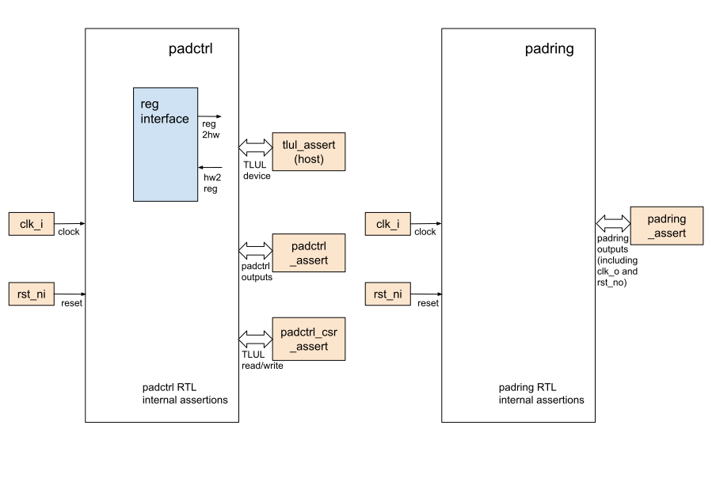

## Goals
* **DV**:
  * PADCTRL is decided to verify in FPV only

* **FPV**:
  * Verify all the PADCTRL outputs by writing assumptions and assertions with a FPV based testbench
  * Verify TileLink device protocol compliance with a FPV based testbench

## Current status
* [Design & verification stage]()
  * [HW development stages]()
* FPV dashboard (link TBD)

## Design features
For detailed information on PADCTRL design features, please see the
[PADCTRL design specification]().

## Testbench architecture
PADCTRL FPV testbench has been constructed based on the [formal architecture]().
The PADCTRL testbench consists of two RTL modules: padctrl and padring.

### Block diagram

#### TLUL assertions
* The `../fpv/tb/padctrl_bind.sv` binds the `tlul_assert` [assertions]() with padctrl to ensure TileLink interface protocol compliance
* TODO: Plan to implement csr assertions under `../fpv/vip/` to assert the TileLink writes and reads correct CSRs

#### PADCTRL assertions
* The `../fpv/tb/padctrl_bind_fpv.sv` binds module `padctrl_assert_fpv` with the padctrl RTL.
The assertion file ensures padctrl's outputs (`mio_attr_o` and `dio_attr_o`) under the generic or Xilinx implementation are verified.
* The `../fpv/tb/padctrl_bind_fpv.sv` also binds module `padring_assert_fpv` with the padring RTL.
The assertion file ensures all the padring's outputs are verified.

##### Symbolic variables
Due to there are large number of muxed and dedicated IOs, the symbolic variable is used to reduce the number of repeated assertions code.
In padctrl_assert_fpv and padring_assert_fpv, we declared two symbolic variables `mio_sel` and `dio_sel` to represent the index for muxed IO and dedicated IO.
Detailed explanation is listed in the [Symbolic Variables]() section.

## DV plan


