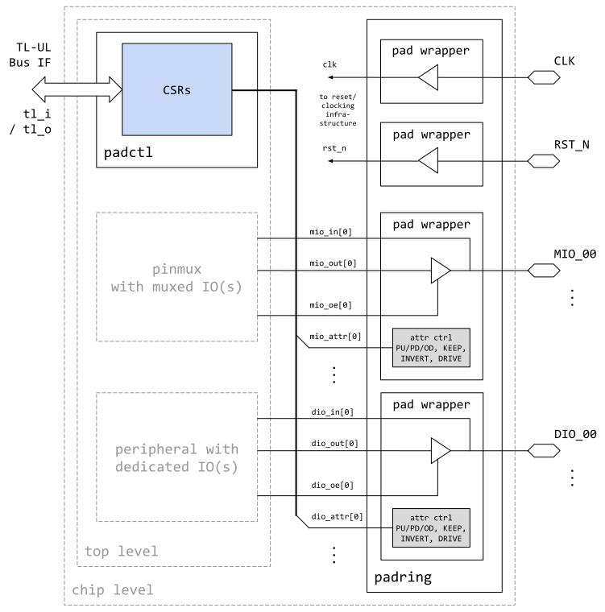
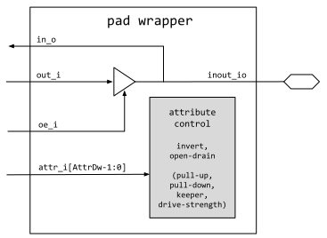

{{% lowrisc-doc-hdr Padctrl Technical Specification }}
{{% regfile padctrl.hjson }}

{{% section1 Overview }}

This document specifies the functionality of the pad control block.
This module is a peripheral on the chip interconnect bus, and thus follows the
[OpenTitan guideline for peripheral device functionality.](../../../../doc/rm/comportability_specification.md).
See that document for integration overview within the broader OpenTitan top level system.

{{% toc 4 }}

{{% section2 Features }}

- Programmable control of chip pin input/output inversion

- Programmable control of chip pin output locking enable

- Programmable control of chip pin output drive strength, pull up, pull down, open drain

{{% section2 Description }}

The `padctrl` module instantiates all chip pads and provides a software accessible register file to control pad attributes such as pull-up, pull-down, open-drain, drive-strength, keeper and input/output inversion.
The `padctrl` module supports a comprehensive set of pin attributes, but it is permissible that some of them may not be supported by the underlying pad implementation.
For example, certain ASIC libraries may not provide open-drain outputs, and FPGAs typically do not allow all of these attributes to be programmed dynamically at runtime.

Note that static pin attributes for FPGAs are currently not covered in this specification.

{{% section1 Theory of Operations }}

{{% section2 Block Diagram }}

Even though the pad control IP is referred to as one IP, it is logically split into two modules that are instantiated on the top-level and the chip-level respectively, as shown in the block diagram below.
The top-level module `padctrl` contains the CSRs that are accessible via the TL-UL interface, while the chip-level module `padring` instantiates the bidirectional pads and connects the physical pin attributes.

The chip level `padctrl` module provides two sets of parametric IO arrays prefixed with `mio*` and `dio*`.
Both sets are functionally equivalent, but are meant to be used with either multiplexed or dedicated IOs as the naming suggests.
I.e., the `mio*` pads can be connected to the `pinmux` module ([see spec](../../pinmux/doc/pinmux.md)) in order to provide as much IO flexibility as possible to the software running on the device.
The `dio*` pads on the other hand are to be connected to peripherals that require dedicated ownership of the pads.
Examples that fall into the latter category are a high-speed SPI peripherals or a UART device that should always be connected for debugging purposes.

The implementation of the pad wrapper can be technology dependent, but the interface must follow the specification detailed in this document (see following sections).
This ensures that the pad instance compatible with the target technology can be selected during the RTL build flow by just including the right pad wrapper IP, without having to regenerate parts of the `padctrl` code.

Note that the chip-level `padctrl` module also contains the pads for clock and reset, but these have no associated runtime configurable pad attributes.

{{% section2 Parameters }}

The following table lists the main parameters used throughout the `padctrl` design.
Note that the `padctrl` modules are generated based on the system configuration, and hence these parameters are placed into a package as "localparams".

Localparam     | Default (Max)         | Description
---------------|-----------------------|---------------
NMioPads       | 4 (-)                 | Number of muxed output pads.
NDioPads       | 16 (-)                | Number of dedicated output pads.
AttrDw         | 6 (-)                 | Width of the pad attribute vector.

{{% section2 Signals }}

The table below lists the `padctrl` signals.
The number of IOs is parametric, and hence the signals are stacked in packed arrays.

Signal                                 | Direction        | Type                | Description
---------------------------------------|------------------|---------------------|---------------
`tl_i`                                 | `input`          | `tl_h2d_t`          | TileLink-UL input for control register access.
`tl_o`                                 | `output`         | `tl_d2h_t`          | TileLink-UL output for control register access.
`mio_io[NMioPads-1:0]`                 | `inout`          | packed `wire logic` | Nidirectional IOs of the muxed IO pads.
`mio_out_i[NMioPads-1:0]`              | `input`          | packed `logic`      | Output data signal of muxed IOs.
`mio_oe_i[NMioPads-1:0]`               | `input`          | packed `logic`      | Output data enable of muxed IOs.
`mio_in_o[NMioPads-1:0]`               | `output`         | packed `logic`      | Input data signals of muxed IOs.
`mio_attr_i[NMioPads-1:0][AttrDw-1:0]` | `input`          | packed `logic`      | Packed array containing the pad attributes of all muxed IOs.
`dio_io[NDioPads-1:0]`                 | `inout`          | packed `wire logic` | Nidirectional IOs of the dedicated IO pads.
`dio_out_i[NDioPads-1:0]`              | `input`          | packed `logic`      | Output data signal of dedicated IOs.
`dio_oe_i[NDioPads-1:0]`               | `input`          | packed `logic`      | Output data enable of dedicated IOs.
`dio_in_o[NDioPads-1:0]`               | `output`         | packed `logic`      | Input data signals of dedicated IOs.
`dio_attr_i[NDioPads-1:0][AttrDw-1:0]` | `input`          | packed `logic`      | Packed array containing the pad attributes of all dedicated IOs.

{{% section2 Generic Pad Wrapper }}

The generic pad wrapper is intended to abstract away implementation differences between the target technologies by providing a generic interface that is compatible with the `padring` module.
It is the task of the RTL build flow to select the appropriate pad wrapper implementation.

A specific implementation of a pad wrapper may choose to instantiate a technology primitive (as it is common in ASIC flows), or it may choose to model the functionality behaviorally such that it can be inferred by the technology mapping tool (e.g., in the case of an FPGA target).
It is permissible to omit the implementation of all IO attributes except input/output inversion.

The generic pad wrapper must expose the following IOs and parameters, even if they are not connected internally.

Parameter      | Default (Max)         | Description
---------------|-----------------------|---------------
AttrDw         | 6 (-)                 | Width of the pad attribute vector.

Note that the pad wrapper may implement a "virtual" open drain termination, where standard bidirectional pads are employed, but instead of driving the output high for a logic 1 the pad is put into tristate mode.

Signal             | Direction  | Type  | Description                         | Mandatory
-------------------|------------|-------|-------------------------------------|--------------------
inout_io           | `inout`    | wire  | Bidirectional inout of the pad      | yes
in_o               | `output`   | logic | Input data signal                   | yes
out_i              | `input`    | logic | Output data signal                  | yes
oe_i               | `input`    | logic | Output data enable                  | yes
attr_i[0]          | `input`    | logic | Input/output inversion              | yes
attr_i[1]          | `input`    | logic | Open drain enable.                  | yes
attr_i[2]          | `input`    | logic | Pull-down enable.                   | no
attr_i[3]          | `input`    | logic | Pull-up enable.                     | no
attr_i[4]          | `input`    | logic | Keeper enable.                      | no
attr_i[5]          | `input`    | logic | Drive strengh (0: strong, 1: weak). | no
attr_i[AttrDw-1:6] | `input`    | logic | Additional (optional) attributes.   | no

{{% section2 Programmers Guide }}

Software should determine and program the `padctrl` pin attributes at startup, or reprogram it when the functionality requirements change at runtime.

This can be achieved by writing to the !!MIO_PADS and !!DIO_PADS registers.
Note that the IO attributes should be configured before enabling any driving modules such as the `pinmux` in order to avoid undesired electrical behavior and/or contention at the pads.

The padctrl configuration can be locked down by writing a 1 to register !!REGEN.
The configuration can then not be altered anymore unless the system is reset.

{{% section1 Register Table }}

{{% registers x }}

