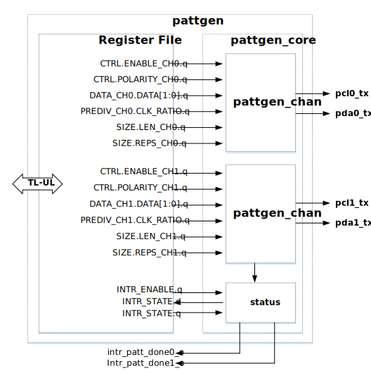

# Overview

This document specifies PATTGEN hardware IP (HWIP) functionality.
This module conforms to the [Comportable guideline for peripheral functionality.]()
See that document for integration overview within the broader top-level system.

## Features

- Generates time-dependent patterns on two (2) channels, each with its own clock.
   - In each channel, data is transmitted serially on a one-bit data (`pda`) output, which is synchronous to a corresponding parallel clock signal (`pcl`).
   - The channels can operate independently or synchronously with each other.
- Each output channel supports the following configuration settings:
    - Pattern data per output (up to 64 bits of data).
    - 32-bit pre-divider to derive pattern clock from I/O clock (minimum ratio: 2).
    - Each pattern can be repeated up to 1024 times.
    - The polarity of the clock signal is programmable.
- The block sends an interrupt on pattern completion.

## Description

The PATTGEN IP transmits short (maximum 64 bits) time-dependent data patterns on two clock-parallel channels.
Each channel consists of one clock (`pcl`) and one data (`pda`) line.
The output channels may be activated and operated independently, or they can be started at the same time to effectively create a 4-output pattern.

## Compatibility

This IP block does not have any direct hardware compatibility requirements.

# Theory of Operations

The pattern can be started (or halted) on either channel by setting the corresponding  bit to 1 (or 0) for the desired channel.
Once disabled, either channel can be configured independently.
The channel parameters (i.e. clock divider ratio, clock polarity, pattern length, pattern data, and repetition count) can all be programmed on a per-channel basis.
Enabling the pattern generator channel starts the pattern from the beginning.

Please note that writes to a channel's configuration registers have no effect while the channel is enabled.
For operational simplicity, the configuration registers are only transferred into the internal finite state machines while a channel is disabled.
Changes to the configuration registers only take effect once the channel has been disabled and re-enabled.

## Block Diagram

## Hardware Interfaces



## Design Details

The design consists of two identical and independent finite state machines, each an instance of module `pattgen_fsm`.
Each FSM is essentially three nested counters, with one counter to control the clock division, another to count out the sequence bits, and a third to keep count of the number of repetitions.

Each FSM consists of
- Inputs:
    - `clk_io`, `reset`, `enable`, `clk_pre_divide`, `pattern`, `pattern_size`, `polarity`,  and `n_repeats`
- Outputs:
    - `pda` and `pcl`
- a single state variable with three states `IDLE`, `ACTIVE`, and `END`,
- a clock-divide counter, `clk_div`,
- a single clock-divide flop, `clk_int`, and
- two additional internal counters `bit_ctr` and `repeat_ctr`.

Each FSM is disabled when `enable` is low.
Disabling the FSM is equivalent to an FSM reset, and both operations place the FSM in the `IDLE` state.
While in `IDLE`, the other state machine registers assume their default states:
The internal counters, the clock-divide, `bit_ctr` and `repeat_ctr` all reset to 0, as does `clk_int`.

Once the FSM is enabled, it transitions to the `ACTIVE` state.
The clock-divide counter `clk_div` increments every cycle, except when it overflows matching the value applied to the `clk_pre_divide` input.
Then `clk_div` resets to 0, toggling `clk_int` in the process.
Two overflow events result in a complete clock cycle, resulting in an internal clock frequency of:
$$f_{pclx}=\frac{f_\textrm{I/O clk}}{2(\textrm{CLK_RATIO}+1)}$$

The FSM clock output, `pcl`, is directly driven by `clk_int`, unless the `polarity` input is high, in which case `pcl` is inverted from `clk_int`.

The `bit_ctr` counter increments on every falling edge of `clk_int`, until it overflows at the pattern length based on the `pattern_size` input.

In the `ACTIVE` state, the FSM `pda` output is driven by a multiplexer, connected to the `pattern` input.
The value of `bit_ctr` selects the bit value from the appropriate sequence position, via this multiplexor.

Finally whevever `bit_ctr` overflows and reverts to zero, the `repeat_ctr` increments, and the pattern starts again.
Finally `repeat_ctr` overflows to zero as it reaches the input value `n_repeats`.
When this overflow occurs, the FSM transitions to the `END` state.
All counters halt, the `pda` data lines reset to zero, and an interupt event is sent out to signal completion.

The entire sequence can be restarted either by resetting or disabling and re-enabling the FSM.

### Interrupts

PATTGEN HWIP provides two interrupt pins, `done_ch0` and `done_ch1`, which indicate the completion of pattern generation on the output channels.
These interrupts can be enabled/disabled by setting/un-setting the corresponding bits of the  register.
To clear the interrupts, bit `1` must be written the corresponding bits of  register

# Programmers guide

To start pattern generation, the register interface of PATTGEN HWIP should be properly initialized and configured.

The guide that follows provides instuctions for configuring Channel 0.
To configure Channel 1, use the registers with the "CH1" suffix, instead of the "CH0" registers.

To configure a single channel:
1. Before configuration, disable the desired channel by clearing the enable bit, .
1. Set the polarity bit, , to determine the desired clock phase.
For either channel, a zero in the polarity bit indicates that the channel clock line (`pcl`) should start low, and the channel data line `pda` transitions on every falling edge of `pcl`.
A one in the polarity bit inverts the `pcl` clock so that it starts high and `pda` transitions on the rising edge.
The following waveform illustrates the effect of the `POLARITY` bit.
Here both channels are configured for simulatenous pattern generation, but the two channels are configured for opposite polarity.

{signal: [
  {name: 'CTRL.ENABLE_CH0', wave: 'lh......'},
  {name: 'CTRL.POLARITY_CH0 (default: low)', wave: '0.......'},
  {name: 'pcl0_tx', wave: '0.hlhlhl'},
  {name: 'pda0_tx', wave: 'x3.3.3.3', data: 'DATA[0] DATA[1] DATA[2]'},
  {name: 'CTRL.POLARITY_CH1 (high)', wave: '1.......'},
  {name: 'pcl1_tx', wave: '1.lhlhlh'},
  {name: 'pda1_tx', wave: 'x5.5.5.5', data: 'DATA[0] DATA[1] DATA[2]'},
],
  head: {text: 'Effect of the Polarity Registers',tick:0}}


1. Program the length of seed pattern using the length field, .
Note that since the allowed seed length ranges from 1-64, the value of this field should be one less than the pattern length.
For example, to generate an 16-bit pattern, a value of 15 should be written to the field .
1. Program the seed pattern (between 1 and 64 bits in length) using the multi-register  and .
The first 32 bits to be transmitted, are programmed in the lower half of the multi-register (i.e. ), and the latter 32 bits are programmed in the upper half of the multi-register (i.e. ).
1. Program the clock divider ratio using the register .
The resulting clock frequency will be slower than the input I/O clock by a ratio of 2&times;(CLK_RATIO+1):
$$f_{pclx}=\frac{f_\textrm{I/O clk}}{2(\textrm{CLK_RATIO}+1)}$$
1. Program the desired number of pattern repetitions using the repetition field .
Note that since the allowed number of pattern repetitions ranges from 1-1024, the value of this field should be one less than the desired repetition count.
For example, to repeat a pattern 30, a value of 29 should written to the field .
1. Finally to start the pattern, set the .
To start both channel patterns at the same time, configure both channels then simulataneously assert both the  and  bits in the same register access.

## Register Table


