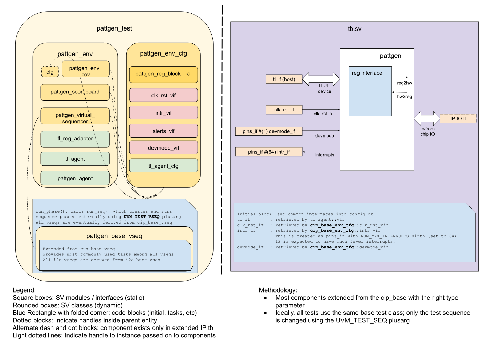

## Goals
* **DV**
  * Verify all PATTGEN IP features by running dynamic simulations with a SV/UVM based testbench
  * Develop and run all tests based on the [testplan](#testplan) below towards closing code and func  tional coverage on the IP and all of its sub-modules
* **FPV**
  * Verify TileLink device protocol compliance with an SVA based testbench
  * Build comprehensive coverage framework to measure coverage provided by existing tests

## Current status
* [Design & verification stage]()
  * [HW development stages]()
* [Simulation results](https://reports.opentitan.org/hw/ip/pattgen/dv/latest/results.html)

## Design features
* Two independent programmable channels generating serial data
* Channels are configured by register model output values
* The core of each channel is a state machine built on three independent counters
For detailed information on PATTGEN design features, please see the
[PATTGEN design specification]().

## Testbench architecture
PATTGEN testbench has been constructed based on the [CIP testbench architecture]().
* The coverage framework is bound to RTL for coverage collection

### Block diagram


### Top level testbench
Top level testbench is located at `hw/ip/pattgen/dv/tb/tb.sv`. It instantiates the PATTGEN DUT module `hw/ip/pattgen/rtl/pattgen.sv`.
In addition, it instantiates the following interfaces, connects them to the DUT and sets their handle into `uvm_config_db`:
* [Clock and reset interface]()
* [TileLink host interface]()
* PATTGEN IOs
* Interrupts ([`pins_if`]())

### Common DV utility components
The following utilities provide generic helper tasks and functions to perform activities that are common across the project:
* [common_ifs]()
* [dv_utils_pkg]()
* [csr_utils_pkg]()

### Global types & methods
All common types and methods defined at the package level can be found in `pattgen_env_pkg`. Some of them in use are:
```systemverilog
parameter uint NUM_PATTGEN_CHANNELS = 2;
```

### TL_agent
PATTGEN instantiates (already handled in CIP base env) [tl_agent]()
which provides the ability to drive and independently monitor random traffic via TL host interface into PATTGEN device.

### PATTGEN agent
PATTGEN agent is configured to work device mode.
The agent monitor captures patterns generated in channels then sends to the scoreboard for verification
Since the DUT does not require any response thus agent driver is fairly simple.

### UVM RAL Model
The PATTGEN RAL model is created with the [`ralgen`]() FuseSoC generator script automatically when the simulation is at the build stage.
It can be created manually by invoking [`regtool`]():

#### Test sequences
All test sequences reside in `hw/ip/pattgen/dv/env/seq_lib`.
The `pattgen_base_vseq` virtual sequence is extended from `cip_base_vseq` and serves as a starting point.
All test sequences are extended from `pattgen_base_vseq`.
It provides commonly used handles, variables, functions and tasks that the test sequences can simple use / call.
Some of the most commonly used tasks / functions are as follows:
* setup_pattgen_channel_0: test writing configuration values to CSR registers for channel 0
* setup_pattgen_channel_1: test writing configuration values to CSR registers for channel 1
* start_pattgen_channels: randomly activate data transfer in channels
* stop_pattgen_channels: terminate data transfer in channels and check for randomly injected errors
* control_channels: wait for bus availability and program CSR configuration values into channels

#### Functional coverage
* Covergroups are captured at the end of the testplan

### Self-checking strategy
#### Scoreboard
The `pattgen_scoreboard` is primarily used for end to end checking.

#### Assertions
* TLUL assertions: The `sva/pattgen_bind.sv` binds the `tlul_assert` [assertions]() to the IP to ensure TileLink interface protocol compliance.
* Unknown checks on DUT outputs: The RTL has assertions to ensure all outputs are initialized to known values after coming out of reset.

## Building and running tests
We are using our in-house developed [regression tool]() for building and running our tests and regressions.
Please take a look at the link for detailed information on the usage, capabilities, features and known issues.
Here's how to run a smoke test:
```console
$ $REPO_TOP/util/dvsim/dvsim.py $REPO_TOP/hw/ip/pattgen/dv/pattgen_sim_cfg.hjson -i pattgen_smoke
```

## Testplan

