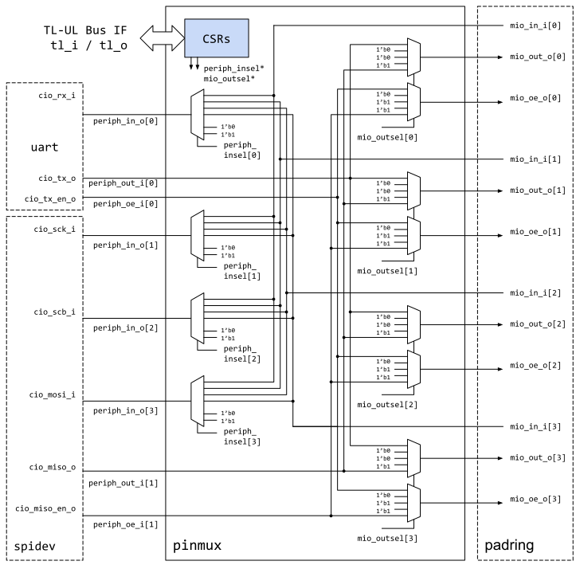

# Overview

This document specifies the functionality of the pin multiplexer (`pinmux`) peripheral.
This module conforms to the [OpenTitan guideline for peripheral device functionality.]().
See that document for integration overview within the broader OpenTitan top level system.
The module provides a mechanism to reconfigure the peripheral-to-pin mapping at runtime, which greatly enhances the system flexibility.
This IP is closely related to the `padctrl` instance which provides additional control of pad attributes (pull-up, pull-down, open drain, drive strength, keeper and inversion).
See  (**TODO**) for more information.

## Features

- Configurable number of chip bidirectional pins

- Configurable number of peripheral inputs and outputs

- Programmable mapping from peripheral outputs (and output enables) to top-level outputs (and output enables)

- Programmable mapping from top-level inputs to peripheral inputs

## Description

The pinmux peripheral is a programmable module designed to wire arbitrary peripheral inputs and outputs to arbitrary multiplexable chip bidirectional pins.
It gives much flexibility at the top level of the device, allowing most data pins to be flexibly wired and controlled by many peripherals.
It is assumed that all available pins that the pinmux connects to are bidirectional, controlled by logic within this module.
This document does not define how these are connected to pads at the toplevel, since that is governed by the `padctrl` IP (**TODO**).
However, some discussion is shared in a later section.

The number of available peripheral IOs and muxed IOs is configurable, in other words modifiable at design time.
This configurability is implemented by representing inputs / outputs as packed arrays, in combination with the SystemVerilog parameters `NPeriphIn`, `NPeriphOut` and `NMioPads`.
Note however that the register file is also affected by this configuration and needs to be regenerated for each design instance.

The assignment of which peripheral output goes to the output data signal of which chip pin is programmable, in other words, modifiable by software at run time.
Similarly the assignment of which peripheral input is driven by which chip input is programmable.
By default, all peripheral inputs are tied to zero or one (this default is design-time programmable via the `InputDefault` parameter).
Further, all output enables are set to zero, which essentially causes all pads to be in high-Z state after reset.

In addition to wiring programmability, each peripheral input can be set constantly to 0 or 1, and each chip output can be set constantly to 0, 1 or high-Z.
Additional features such as output keeper or inversion are not provided by the pinmux since they are implemented in the `padctrl` IP which operates at the chip-level.
This separation of physical pad attributes and logical wiring makes it possible to place the pads into an always-on domain without restricting possible power-down modes of the pinmux.
One could imagine this to be a useful feature if a deep sleep mode were implemented in future; chip outputs could hold their output values and not be affected by internal power loss.

# Theory of Operations

The pin multiplexor module intends to give maximum flexibility of peripheral and chip wiring to the software running on the device.
The assumption is that the wiring is done once at the initialization of the application based upon usage of the device within the broader system.
How this wiring is most effectively done is outside the scope of this document, but a section below briefly discusses use cases.

## Block Diagram

The diagram below shows connectivity between four arbitrary chip pins, named `MIO_00` .. `MIO_03`, and several peripheral inputs and outputs.
This shows the connectivity available in all directions, as well as the control registers described later in this document.
Two example peripherals (`uart` and `spidev`) are attached to the pinmux in this example, one with one input and one output, the other with three inputs and one output.
The diagram also shows the `padring` module (from the `padctrl` IP) which instantiates the bidirectional chip pads with output enable control.

Note that apart from selecting a specific input pad, the `periph_insel[*]` signals can also be used to tie the peripheral input to 0 or 1.
Likewise, the output select signals `mio_outsel[*]` can also be used to constantly drive an output pin to 0/1 or to put it into high-Z state (default).
The output enable and the associated data signal (i.e. `periph_to_mio` and `periph_to_mio_oe`) are indexed with the same select signal to allow the peripheral hardware to determine the pad direction instead of demoting that control to software.

Additional details about the signal names and parameters are given in the sections below.

## Hardware Interfaces



## Parameters

The following table lists the main parameters used throughout the `pinmux` design.
Note that the pinmux is generated based on the system configuration, and hence these parameters are placed into a package as "localparams".

Localparam     | Default (Max)  | Top Earlgrey | Description
---------------|----------------|--------------|---------------
`NPeriphOut`   | 16 (-)         | 32           | Number of peripheral outputs.
`NPeriphIn`    | 16 (-)         | 32           | Number of peripheral input.
`NMioPads`     | 8 (-)          | 32           | Number of muxed bidirectional pads (depending on padctrl setup).

## Additional IOs

The table below lists the `pinmux` signals. The number of IOs is parametric, and hence the signals are stacked in packed arrays.

Signal                               | Direction        | Type           | Description
-------------------------------------|------------------|----------------|---------------
`periph_to_mio_i[NPeriphOut-1:0]`    | `input`          | packed `logic` | Signals from `NPeriphOut` peripheral outputs coming into the pinmux.
`periph_to_mio_oe_i[NPeriphOut-1:0]` | `input`          | packed `logic` | Signals from `NPeriphOut` peripheral output enables coming into the pinmux.
`mio_to_periph_o[NPeriphIn-1:0]`     | `output`         | packed `logic` | Signals to `NPeriphIn` peripherals coming from the pinmux.
`mio_out_o[NMioPads-1:0]`            | `output`         | packed `logic` | Signals to `NMioPads` bidirectional pads as output data.
`mio_oe_o[NMioPads-1:0]`             | `output`         | packed `logic` | Signals to `NMioPads` bidirectional pads as output enables.
`mio_in_i[NMioPads-1:0]`             | `input`          | packed `logic` | Signals from `NMioPads` bidirectional pads as input data.

# Programmers Guide

Software should determine and program the pinmux mapping at startup, or reprogram it when the functionality requirements change at runtime.
This can be achieved by writing the following values to the  and  registers.
Note that the pinmux configuration should be sequenced after any IO attribute-specific configuration in the `padctrl` module to avoid any unwanted electric behavior and/or contention.

`periph_insel` Value  | Selected Input Signal
----------------------|-----------------------
0                     | Constant zero
1                     | Constant one
2 + k                 | Corresponding MIO input signal at index k

The global default at reset is `0`, but the default of individual signals can be overridden at design time, if needed.

`mio_outsel` Value    | Selected Output signal
----------------------|-----------------------
0                     | Constant zero
1                     | Constant one
2                     | High-Z
3 + k                 | Corresponding peripheral output signal at index k

The global default at reset is `2`, but the default of individual signals can be overridden at design time, if needed.

The pinmux configuration can be locked down by writing 0 to register .
The configuration can then not be altered anymore unless the system is reset.

## Register Table

The register description below matches the instance in the [Earl Grey top level
design]().

Similar register descriptions can be generated with different parameterizations.


