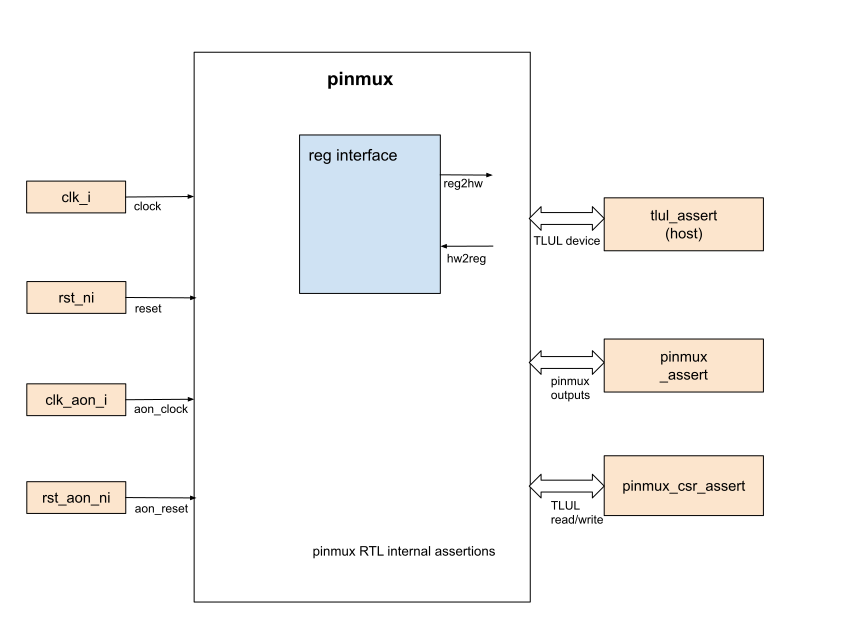

## Goals
* **DV**:
  * PINMUX is decided to verify in FPV only

* **FPV**:
  * Verify all the PINMUX outputs by writing assumptions and assertions with a FPV based testbench
  * Verify TileLink device protocol compliance with a FPV based testbench

## Current status
* [Design & verification stage]()
  * [HW development stages]()
* FPV dashboard (link TBD)

## Design features
For detailed information on PINMUX design features, please see the
[PINMUX design specification]().

## Testbench architecture
PINMUX FPV testbench has been constructed based on the [formal architecture]().

### Block diagram

#### TLUL assertions
* The `../fpv/tb/pinmux_bind.sv` binds the `tlul_assert` [assertions]() with pinmux to ensure TileLink interface protocol compliance
* The `../fpv/tb/pinmux_bind.sv` also binds the `pinmux_csr_assert_fpv` to assert the TileLink writes and reads correctly

#### PINMUX assertions
* The `../fpv/tb/pinmux_bind_fpv.sv` binds module `pinmux_assert_fpv` with the pinmux RTL.
The assertion file ensures pinmux's outputs (`mio_out_o`, `mio_oe_o`, and `mio_to_periph_o`) are verified.

##### Symbolic variables
Due to there are large number of peripheral and muxed inputs, the symbolic variable is used to reduce the number of repeated assertions code.
In the pinmux_assert_fpv module, we declared two symbolic variables `mio_sel_i` and `periph_sel_i` to represent the index for muxed and peripheral IO.
Detailed explanation is listed in the [Symbolic Variables]() section.

## DV plan

