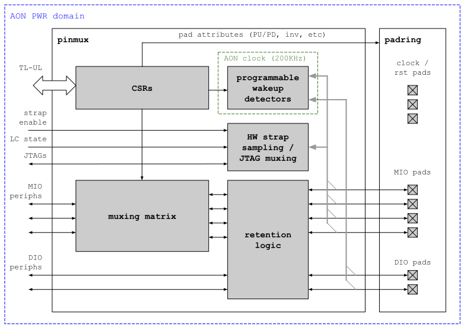
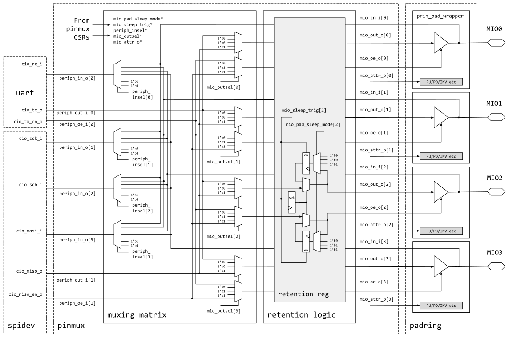
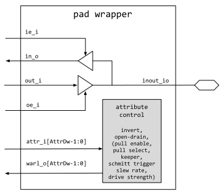

# Theory of Operation

## Block Diagram and Overview

The `pinmux` peripheral is a programmable module designed to wire arbitrary peripheral inputs and outputs to arbitrary multiplexable chip bidirectional pins.
It gives much flexibility at the top level of the device, allowing most data pins to be flexibly wired and controlled by many peripherals.
Even though the `pinmux` is referred to as one IP, it is logically split into two modules that are instantiated on the top-level and the chip-level, respectively, as can be seen in the block diagram below.
The top-level module `pinmux` contains the CSRs accessible via the TL-UL interface, the main muxing matrix, retention registers, a set of programmable wakeup detectors, and the HW strap sampling and TAP / JTAG muxing logic.
The chip-level module `padring` instantiates the bidirectional pads and connects the physical pad attributes.

### MIO and DIO Signal Categories

The `pinmux` supports two different IO signal categories:
Muxed IO (MIO) signals that are routed through the `pinmux` matrix, and dedicated IO (DIO) signals that bypass the `pinmux` matrix.
This distinction is useful for accommodating IO signals that are timing critical or that must have a fixed IO mapping for another reason.
Note that although DIO signals are not routed through the `pinmux` matrix, they are still connected to the retention logic and the wakeup detectors (see next section below).

The number of available peripheral IOs, pads, and their assignment to the MIO / DIO categories is done at design time as part of the top-level configuration.
This configurability is achieved by representing inputs / outputs as packed arrays, in combination with the SystemVerilog parameters `NPeriphIn`, `NPeriphOut`, `NMioPads` and `NDioPads`.
Note however that the register file is also affected by this configuration and needs to be regenerated for each design instance.

It is assumed that all available pins that the `pinmux` connects to are bidirectional, controlled by logic within this module.
By default, all muxed peripheral inputs are tied to zero.
Further, all output enables are set to zero, which essentially causes all pads to be in high-Z state after reset.
In addition to wiring programmability, each muxed peripheral input can be set constantly to 0 or 1, and each muxed chip output can be set constantly to 0, 1 or high-Z.

See the [muxing matrix](#muxing-matrix) section for more details about the mux implementation.

### Retention and Wakeup Features

The retention logic allows SW to specify a certain behavior during sleep for each muxed and dedicated output.
Legal behaviors are tie low, tie high, high-Z, keeping the previous state, or driving the current value (useful for peripherals that are always on).

The wakeup detectors can detect patterns such as rising / falling edges and pulses of a certain width up to 255 AON clock cycles.
Each wakeup detector can listen on any one of the MIO / DIO signals that are routed through the `pinmux`, and if a pattern is detected, the power manager is informed of that event via a wakeup request.

The `pinmux` module itself is in the always-on (AON) power domain, and as such does not loose configuration state when a sleep power cycle is performed.
However, only the wakeup detector logic will be actively clocked during sleep in order to save power.

See the [retention logic](#retention-logic) and [wakeup detectors](#wakeup-detectors) sections for more details about the mux implementation.

### USB Wakeup Detection Module

The USB device in the Earlgrey top-level is not in the AON power domain and hence the associated wakeup detection module is placed inside the pinmux IP in that top-level.
The USB wakeup module is not connected to any pinmux infrastructure or CSRs except for the `usb_wkup_req` signal going to the power manager.
See [USB device documentation](../../usbdev/README.md) for more information on the USB wakeup mechanism.

### Test and Debug Access

The hardware strap sampling and TAP isolation logic provides test and debug access to the chip during specific life cycle states.
This mechanism is explained in more detail in the [strap sampling and TAP isolation](#strap-sampling-and-tap-isolation) section.

### Pad Attributes

Additional pad-specific features such as inversion, pull-up, pull-down, virtual open-drain, drive-strength and input/output inversion etc. can be exercise via the pad attribute CSRs.
The `pinmux` module supports a comprehensive set of such pad attributes, but it is permissible that some of them may not be supported by the underlying pad implementation.
For example, certain ASIC libraries may not provide open-drain outputs, and FPGAs typically do not allow all of these attributes to be programmed dynamically at runtime.
See the [generic pad wrapper](#generic-pad-wrapper) section below for more details.
Note that static pad attributes for FPGAs are currently not covered in this specification.

## Hardware Interfaces

* [Interface Tables](../../../top_earlgrey/ip/pinmux/data/autogen/pinmux.hjson#interfaces)

### Parameters

The following table lists the main parameters used throughout the `pinmux` design.
Note that the `pinmux` is generated based on the system configuration, and hence these parameters are placed into a package.
The pinout and `pinmux` mappings are listed under [Pinout and Pinmux Mapping](#pinout-and-pinmux-mapping) for specific top-level configurations.

Parameter      | Description
---------------|---------------
`NPeriphOut`   | Number of peripheral outputs.
`NPeriphIn`    | Number of peripheral input.
`NMioPads`     | Number of muxed bidirectional pads.
`NDioPads`     | Number of dedicated pads.

### Primary IO Signals

The table below lists the primary `pinmux` IO signals to/from the pad ring.
The number of dedicated and muxed IOs is parametric, and hence the signals are stacked in packed arrays.

Signal                                 | Direction | Type                               | Description
---------------------------------------|-----------|------------------------------------|---------------
`periph_to_mio_i[NPeriphOut-1:0]`      | `input`   | packed `logic`                     | Signals from `NPeriphOut` muxed peripheral outputs coming into the `pinmux`.
`periph_to_mio_oe_i[NPeriphOut-1:0]`   | `input`   | packed `logic`                     | Signals from `NPeriphOut` muxed peripheral output enables coming into the `pinmux`.
`mio_to_periph_o[NPeriphIn-1:0]`       | `output`  | packed `logic`                     | Signals to `NPeriphIn` muxed peripherals coming from the `pinmux`.
`periph_to_dio_i[NDioPads-1:0]`        | `input`   | packed `logic`                     | Signals from `NDioPads` dedicated peripheral outputs coming into the `pinmux`.
`periph_to_dio_oe_i[NDioPads-1:0]`     | `input`   | packed `logic`                     | Signals from `NDioPads` dedicated peripheral output enables coming into the `pinmux`.
`dio_to_periph_o[NDioPads-1:0]`        | `output`  | packed `logic`                     | Signals to `NDioPads` dedicated peripherals coming from the `pinmux`.
`mio_attr_o[NMioPads-1:0]`             | `output`  | prim_pad_wrapper_pkg::pad_attr_t   | Packed array containing the pad attributes of all muxed IOs.
`mio_out_o[NMioPads-1:0]`              | `output`  | packed `logic`                     | Signals to `NMioPads` bidirectional muxed pads as output data.
`mio_oe_o[NMioPads-1:0]`               | `output`  | packed `logic`                     | Signals to `NMioPads` bidirectional muxed pads as output enables.
`mio_in_i[NMioPads-1:0]`               | `input`   | packed `logic`                     | Signals from `NMioPads` bidirectional muxed pads as input data.
`dio_attr_o[NDioPads-1:0]`             | `output`  | prim_pad_wrapper_pkg::pad_attr_t   | Packed array containing the pad attributes of all dedicated IOs.
`dio_out_o[NDioPads-1:0]`              | `output`  | packed `logic`                     | Signals to `NDioPads` bidirectional dedicated pads as output data.
`dio_oe_o[NDioPads-1:0]`               | `output`  | packed `logic`                     | Signals to `NDioPads` bidirectional dedicated pads as output enables.
`dio_in_i[NDioPads-1:0]`               | `input`   | packed `logic`                     | Signals from `NDioPads` bidirectional dedicated pads as input data.

## Muxing Matrix

The diagram below shows connectivity between four arbitrary chip pins, named `MIO0` .. `MIO3`, and several muxed peripheral inputs and outputs.
This shows the connectivity available in all directions, as well as the control registers described later in this document.
Two example peripherals (`uart` and `spidev`) are attached to the `pinmux` in this example, one with one input and one output, the other with three inputs and one output.
The diagram also shows the `padring` module which instantiates the bidirectional chip pads with output enable control.

Note that apart from selecting a specific input pad, the `periph_insel[*]` signals can also be used to tie the peripheral input to 0 or 1.
Likewise, the output select signals `mio_outsel[*]` can also be used to constantly drive an output pin to 0/1 or to put it into high-Z state (default).
The output enable and the associated data signal (i.e. `periph_to_mio` and `periph_to_mio_oe`) are indexed with the same select signal to allow the peripheral hardware to determine the pad direction instead of demoting that control to SW.

## Retention Logic

As illustrated in the picture above, all muxing matrix and DIO outputs are routed through the retention logic, which essentially consists of a set of multiplexors and two retention registers per output (one register is for the output data and one for the output enable).
This multiplexor can be configured to be automatically activated upon sleep entry in order to either drive the output low, high, high-Z or to the last seen value (keep).
If no sleep behavior is specified, the retention logic will continue to drive out the value coming from the peripheral side, which can be useful for peripherals that reside in the AON domain.

The sleep behavior of all outputs is activated in parallel via a trigger signal asserted by the power manager.
Once activated, it is the task of SW to disable the sleep behavior for each individual pin when waking up from sleep.
This ensures that the output values remain stable until the system and its peripherals have been re-initialized.

## Wakeup Detectors

The `pinmux` contains eight programmable wakeup detector modules that can listen on any of the MIO or DIO pins.
Each detector contains a debounce filter and an 8bit counter running on the AON clock domain.
The detectors can be programmed via the [`WKUP_DETECTOR_0`](../../../top_earlgrey/ip/pinmux/data/autogen/pinmux.hjson#wkup_detector_0) and [`WKUP_DETECTOR_CNT_TH_0`](../../../top_earlgrey/ip/pinmux/data/autogen/pinmux.hjson#wkup_detector_cnt_th_0) registers to detect the following patterns:

- rising edge
- falling edge
- rising or falling edge
- positive pulse up to 255 AON clock cycles in length
- negative pulse up to 255 AON clock cycles in length

Note that for all patterns listed above, the input signal is sampled with the AON clock.
This means that the input signal needs to remain stable for at least one AON clock cycle after a level change for the detector to recognize the event (depending on the debounce filter configuration, the signal needs to remain stable for multiple clock cycles).

If a pattern is detected, the wakeup detector will send a wakeup request to the power manager, and the cause bit corresponding to that detector will be set in the [`WKUP_CAUSE`](../../../top_earlgrey/ip/pinmux/data/autogen/pinmux.hjson#wkup_cause) register.

Note that the wkup detector should be disabled by setting [`WKUP_DETECTOR_EN_0`](../../../top_earlgrey/ip/pinmux/data/autogen/pinmux.hjson#wkup_detector_en_0) before changing the detection mode.
The reason for that is that the pulse width counter is NOT cleared upon a mode change while the detector is enabled.

## Strap Sampling and TAP Isolation

The `pinmux` contains a set of dedicated HW "straps", which are essentially signals that are multiplexed onto fixed MIO pad locations.
Depending on the life cycle state, these straps are either continuously sampled, or latched right after POR.

There are two groups of HW straps:
1. Three DFT straps that determine the DFT mode.
   These bits are output via the `dft_strap_test_o` signal such that they can be routed to the tool-inserted DFT controller.
2. Two TAP selection straps for determining which TAP should be multiplexed onto the JTAG IOs.

The conditions under which these two strap groups are sampled are listed in the tables below.
Note that the HW straps can be used just like regular GPIOs once they have been sampled.

Strap Group \ Life Cycle State  | TEST_UNLOCKED* | RMA          | DEV          | All Other States
--------------------------------|----------------|--------------|--------------|------------------
DFT straps                      | Once at boot   | Once at boot | -            | -
TAP strap 0                     | Continuously   | Continuously | Once at boot | Once at boot
TAP strap 1                     | Continuously   | Continuously | Once at boot | -

*Once at boot:* Sampled once after life cycle initialization (sampling event is initiated by pwrmgr).

*Continuously:* Sampled continuously after life cycle initialization.

The TAP muxing logic is further qualified by the life cycle state in order to isolate the TAPs in certain life cycle states.
The following table lists the TAP strap encoding and the life cycle states in which the associated TAPs can be selected and accessed.

TAP strap 1 | TAP strap 0  | Life Cycle State         | Selected TAP
------------|--------------|--------------------------|---------------
0           | 0            | All states               | -
0           | 1            | All states               | Life Cycle
1           | 0            | TEST_UNLOCKED*, RMA, DEV | RISC-V
1           | 1            | TEST_UNLOCKED*, RMA      | DFT

Note that the tool-inserted DFT controller may assert the `dft_hold_tap_sel_i` during a test (e.g. boundary scan) in which case the `pinmux` will temporarily pause sampling of the TAP selection straps.

Also, it should be noted that the pad attributes of all JTAG IOs will be gated to all-zero temporarily, while the JTAG is enabled (this does not affect the values in the CSRs).
This is to ensure that any functional attributes like inversion or pull-ups / pull-downs do not interfere with the JTAG while it is in use.

For more information about the life cycle states, see [Life Cycle Controller Specification](../../lc_ctrl/README.md) and the [Life Cycle Definition Table](../../../../doc/security/specs/device_life_cycle/README.md#manufacturing-states).

### Non-debug Module Reset

The only parts of the system that are not reset as part of a non-debug module (NDM) reset are in this strap sampling and TAP selection module, and in the `rv_dm`, power, reset and clock managers.
Hence, in order to keep a `rv_dm` JTAG debug session alive during an NDM reset, the `lc_hw_debug_en` state needs to be memorized.

To that end, the TAP isolation logic in the pinmux samples the `lc_hw_debug_en` state when the strap sampling pulse is asserted by the power manager.
This pulse is asserted once during boot (and not after an NDM reset).

Note that DFT TAP selection is not affected by this since the TAP selection logic always consumes the live value for `lc_dft_en`.
The TAP selection logic also invalidates the sampled `lc_hw_debug_en` whenever a life cycle transition is initiated or an escalation is triggered via `lc_escalate_en`.
This ensures that the sampled `lc_hw_debug_en` value does not survive a life cycle transition.

Finally, note that there is secondary gating on the `rv_dm` and DFT TAPs that is always consuming live `lc_hw_debug_en` and `lc_dft_en` signals for added protection.

See also [rv_dm documentation](../../rv_dm/README.md).

## Generic Pad Wrapper

The generic pad wrapper is intended to abstract away implementation differences between the target technologies by providing a generic interface that is compatible with the `padring` module.
It is the task of the RTL build flow to select the appropriate pad wrapper implementation.

A specific implementation of a pad wrapper may choose to instantiate a technology primitive (as it is common in ASIC flows), or it may choose to model the functionality behaviorally such that it can be inferred by the technology mapping tool (e.g., in the case of an FPGA target).
It is permissible to omit the implementation of all IO attributes except input/output inversion.

The generic pad wrapper must expose the following IOs and parameters, even if they are not connected internally.
In particular, the pad attribute struct `attr_i` must contain all fields listed below, even if not all attributes are supported (it is permissible to just leave them unconnected in the pad wrapper implementation).

Parameter      | Default    | Description
---------------|------------|-----------------------------------------------------
`PadType`      | `BidirStd` | Pad variant to be instantiated (technology-specific)
`ScanRole`     | `NoScan`   | Scan role, can be `NoScan`, `ScanIn` or `ScanOut`

Note that `PadType` is a technology-specific parameter.
The generic pad wrapper only implements variant `BidirStd`, but for other target technologies, this parameter can be used to select among a variety of different pad flavors.

The `ScanRole` parameter determines the behavior when scanmode is enabled.
Depending on whether a given pad acts as a scan input or output, certain pad attributes and functionalities need to be bypassed.
This parameter is typically only relevant for ASIC targets and therefore not modeled in the generic pad model.

Also note that the pad wrapper may implement a "virtual" open-drain termination, where standard bidirectional pads are employed, but instead of driving the output high for a logic 1 the pad is put into tristate mode.

Signal               | Direction  | Type        | Description
---------------------|------------|-------------|-----------------------------------------------
`clk_scan_i`         | `input`    | `logic`     | Scan clock of the pad
`scanmode_i`         | `input`    | `logic`     | Scan mode enable of the pad
`pok_i`              | `input`    | `pad_pok_t` | Technology-specific power sequencing signals
`inout_io`           | `inout`    | `wire`      | Bidirectional inout of the pad
`in_o`               | `output`   | `logic`     | Input data signal
`in_raw_o`           | `output`   | `logic`     | Un-inverted input data signal
`out_i`              | `input`    | `logic`     | Output data signal
`oe_i`               | `input`    | `logic`     | Output data enable
`attr_i[0]`          | `input`    | `logic`     | Input/output inversion
`attr_i[1]`          | `input`    | `logic`     | Virtual open-drain enable
`attr_i[2]`          | `input`    | `logic`     | Pull enable
`attr_i[3]`          | `input`    | `logic`     | Pull select (0: pull-down, 1: pull-up)
`attr_i[4]`          | `input`    | `logic`     | Keeper enable
`attr_i[5]`          | `input`    | `logic`     | Schmitt trigger enable
`attr_i[6]`          | `input`    | `logic`     | Open drain enable
`attr_i[8:7]`        | `input`    | `logic`     | Slew rate (0x0: slowest, 0x3: fastest)
`attr_i[12:9]`       | `input`    | `logic`     | Drive strength (0x0: weakest, 0xf: strongest)

Note that the corresponding pad attribute registers [`MIO_PAD_ATTR_0`](../../../top_earlgrey/ip/pinmux/data/autogen/pinmux.hjson#mio_pad_attr_0) and [`DIO_PAD_ATTR_0`](../../../top_earlgrey/ip/pinmux/data/autogen/pinmux.hjson#dio_pad_attr_0) have "writes-any-reads-legal" (WARL) behavior (see also [pad attributes](#pad-attributes)).
