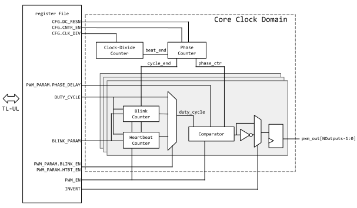

# Overview

This document specifies PWM hardware IP (HWIP) functionality.
This module conforms to the [Comportable guideline for peripheral functionality.]()
See that document for integration overview within the broader top-level system.

## Features

- Pulse-width modulated (PWM) with adjustable duty cycle
- Suitable for general-purpose use, but primarily designed for control of tri-color LEDs
- Parametrizable number of output channels
- Separate clock domains for TL-UL I/O vs. core operations
   - PWM operation can continue in low-power state.
- Independent control of duty cycle, phase, and polarity for all channels
- Programmable resolution (1 to 16 bits) in adjusting the output duty cycle and phase
- All output channels are driven at the same pulse frequency, which is selected by a 27-bit clock divider
- Hardware-controlled blink feature
   - Blinking channel toggles between two separably programmable duty cycles
   - Blink timing is independently programmable for each channel
- "Heartbeat" blink mode
   - Output duty cycle linearly increments and decrements between two programmable values
   - Step size and step frequency are independently programmable for each channel
- Channels can be configured to blink synchronously or independently
- All duty cycle settings are independently programmable

## Description

The PWM IP is primarily designed to drive a parametrizable number of pulse-width modulated outputs with periodic pulses each with a programmable frequency, phase, and duty cycle (i.e. the ratio between the pulse duration and the overall period between pulses.)

The phase and duty cycle of each output channel can then be controlled with programmable resolution, from 1-bit (half-cycle resolution) to 16-bit (in which case pulse width and timing can be controlled to one part in 216 relative to the pulse period)

By default the output pulses are active-high, however the polarity can also be inverted by firmware.

For operation in low-power modes, the PWM IP core runs from a second clock, independent of the TL-UL bus clock.

All outputs are pulsed at a common clock frequency, which can be controlled relative to the PWM core clock by a 27-bit clock divider.
The overall pulse frequency depends on this clock-divider and the phase-resolution.

The primary application is to control tri-color LEDs.
The intensity of each LED channel can be adjusted by varying the duty cycle of the PWM outputs.
The IP provides capabilities for driving a trio of RGB LEDs at any 24-bit RGB-color combination.
It principle, this requires a minimum of 8-bits of programmable duty cycle resolution for each output.
However, the proper mapping of LED duty-cycles to perceived colors will depend on many factors, such as non-linear response function of the chosen LED and the choice of current driver.
Thus the IP provides up to 16-bits of duty cycle resolution, to allow for fine-grain duty cycle control.
The resolution can be also reduced down as low as 1-bit, to allow for more frequent pulses when connected to a low-frequency, low-power bus.

This IP only controls the *timing* of the PWM drive signal.
The drive *current* must be managed by the system designer by including the appropriate off-chip circuitry.
For instance, in the LED-drive use-case, various off-chip solutions exist for controlling the current, such as selection of an appropriate series resistance, or the use of an external fixed-current LED drive IC.
Some limited possibilities for current control may also exist in a top-level ASIC design.
However, such configuration options are outside the scope of this document.

In order to support a variety of drive configurations, the polarity of each channel may be inverted.

The PWM IP is also suitable for driving other outputs, such as servo motors.
In some applications, the user may wish to stagger outputs to limit the overall magnitude of current spikes in the complete system.
Thus each output also has a phase control register, with up to 16-bit resolution.
In security applications it is the system-designer's responsibility to ensure that improper configuration of the phase control registers does not pose a security risk to the overall system (due to, for instance, a denial of service attack through the PWM configuration).

The PWM IP provides a hardware-controlled blink feature, which can periodically toggle the output between two states with separate duty cycles.
This feature can be used to significantly reduce the output duty cycle (blink-off), or, in the case of tri-color LEDs, toggle the apparent LED color between the two settings.
This feature is enabled on a per-channel basis, and for each blinking channel, the blink period and blink duty cycle are programmed in terms of the number of pulses generated in either state.

As a variant of the blink feature, the output duty cycle can also be programmed to linearly increase and decrease in time.
In this "heartbeat" mode, the duty cycle increments by a programmable amount after a programmable number of pulses, starting at some firmware-selected initial duty cycle.
Once the internal duty cycle reaches the target value, the internal duty cycle begins to decrement until it returns to the initial value, at which point the cycle repeats until heartbeat mode is disabled.

# Theory of Operations

## Block Diagram

## Hardware Interfaces



## Design Details

### Phase and Duty Cycle Representation

The PWM IP creates series of pulses with the desired on-off duty cycle.
The duty cycle, DC, is typically expressed a fraction of pulse duration, <i>d</i>, over the period between pulses, <i>T</i>:

$$DC\equiv d/T.$$

Since 0&lt;<i>d</i>&lt;<i>T</i>, the duty cycle ranges from 0 to 1.

The PWM IP can control the duty cycle in a number of ways:
- The PWM can be programmed to generate pulses at a firmware-defined duty cycle.
- The duty cycle can be programmed to toggle (or "blink") between two duty cycles at a programmable rate.
In the tri-color LED use-case, this would have the visual effect of making the LED blink between two colors.
- The duty cycle can linearly sweep in time, gradually shifting back-and-forth between two endpoints.

Thus the duty cycle can be controlled by firmware, or may change under hardware control.
The operation of each of these modes will be discussed later.

Each channel can also be assigned a different phase delay.
Like the duty cycle, this delay is expressed as a fraction of the pulse period, <i>T</i>.
The phase delay of each channel is always directly controlled by a firmware register value.

Since the phase and duty cycle are always a fraction less than or equal to one, the PWM IP represents them as 16-bit fixed point numbers, with an implicit 16-bit shift.
If the duty cycle is internally represented as a 16-bit value x, the output pulse train will have the duty cycle:

$$DC(x)=\frac{x}{2^{16}}.$$

Thus the allowed duty cycle in principle ranges from 0 to 99.998% (i.e. 1-(&frac12;)16).

However, the actual phase resolution may be smaller.
In order to support faster pulse rates, the phase resolution can be set to less than 16-bits, in which case the observed duty cycle will be rounded down to the next lowest multiple of 2-(+1).
In other words, the  register effectively limits the duty cycle resolution, such that only the +1 most significant bits are relevant:

$$DC(x; \textrm{DC_RESN})=\frac{\textrm{MSB}(x; \textrm{DC_RESN}+1)}{2^{\textrm{DC_RESN}+1}},$$

where here we use the notation MSB(<i>x</i>; <i>y</i>), to mean the <i>y</i> most significant bits of the binary value <i>x</i>.

### PWM Phase Counter

The IP maintains a single phase counter that is shared by all outputs.
As we discuss in the next section, each channel has a comparator which compares these values to the current duty cycle and phase value and generates the appropriate pulse.
Since all phase or duty cycle related quantities are represented as 16-bit fixed point fractions-regardless of whether they are calculated by the PWM IP or determined by firmware-the phase counter is also a 16-bit quantity.

Each PWM pulse cycle is divided into 2DC_RESN+1 beats.
During each beat, the 16-bit phase counter increments by 2(16-DC_RESN-1) (modulo 65536).
The beat period is defined by the  register:

$$f_\textrm{beat}=\frac{f_\textrm{core clk}}{\textrm{CLK_DIV}+1}$$

A PWM pulse cycle is completed each time the phase counter overflows to 0.
The PWM drive frequency is therefore:
$$f_\textrm{PWM}=f_\textrm{beat}\frac{2^{16-\textrm{DC_RESN}-1}}{2^{16}}=\frac{f_\textrm{core clk}}{2^{\textrm{DC_RESN}+1}(\textrm{CLK_DIV}+1)}$$

The PWM phase counter is reset whenever  is disabled.

The following figure illustrates the effect of the clock divider register.  Note that changes to  or  only take effect when  is disabled.

{signal: [
  {name: 'core_clk_i', wave: 'p..............|..........'},
  {name: 'sync(CFG.CNTR_EN)', wave: '0.1............|01........'},
  {name: 'sync(CFG.CLK_DIV)', wave: '2....4.........|..2.......', data: '2 4 4'},
  {name: 'clk_div_int', wave: 'x..2...........|..2.......', data: '2 4'},
  {name: 'sync(CFG.DC_RESN)', wave: '2..............|..........', data: '10d'},
  {name: 'dc_resn_int', wave: 'x..2...........|..........', data: '10d'},
  {name: 'phase_ctr', wave: '3..2..2..2..2..|3.2....2..', data: '0x00 0x00 0x20 0x40 0x80 0 0x00 0x20'},
  {name: 'clk_div_ctr', wave: '2...22222222222|2..2222222', data: '0 1 2 0 1 2 0 1 2 0 1 2 0 1 2 3 4 0 1 2'},
  {name: 'beat_end', wave: '0....10.10.10.1|0.....10..'}],
  config:{skin:'narrow'}
}


### PWM Comparators and Pulse Generation.

Whenever the phase counter loops back to zero, this marks the start of a new <i>pulse cycle</i>.
This section describes how the comparator creates pulses with the correct duty cycle and phase.

In the following sections, this document describes the various per-channel configuration options of this IP.
For concreteness, the text discusses the operation of channel 0, using registers and fields ending with "_0".
To operate other channels, simply choose the registers with the appropriate channel suffix.

Clearing  disables the channel, suppressing all output pulses.

The pulse phase delay is always programmed by firmware into the TL-UL register .
The duty cycle however comes from the blink control hardware (which is described in the next section).
The current duty cycle is stored in a channel-specific signal register, `duty_cycle`.

When operating at full resolution (i.e. `DC_RESN`==15), the channel output rises when the phase counter equals , and falls when the phase counter equals  + `duty_cycle` (mod 2(`DC_RESN`+1)).
In both cases, the transition occurs at the beginning of the beat.
When operating at lower resolution the same comparison applies, but using only the most significant (`DC_RESN`+1) bits.

If the combination of phase delay and duty cycle is larger than one pulse cycle, the pulse will start in one pulse cycle and end in the next.
In this case the comparator output will be high at the beginning of each cycle, as seen in the example waveform below.

By default the pulses are all active-high, meaning the output is low if a PWM channel is disabled.
However, to support various drive schemes, the polarity can be inverted on a channel-by-channel basis using the  register.

The following figure illustrates the effect of the  register and `duty_cycle`.
Note that this figure shows two channels, 0 and 1, where the second channel has a significant phase delay, such that the output pulse is high when `phase_ctr` overflows to zero.


{signal: [
  {name: 'core_clk_i', wave: 'p.....|....|......'},
  {name: 'CFG.CLK_DIV', wave: '2.....|....|......', data: '0'},
  {name: 'sync(CFG.CNTR_EN)', wave: '01....|....|......'},
  {name: 'CFG.DC_RESN', wave: '2.....|....|......', data: '3'},
  {name: 'INVERT.INVERT_0', wave: '0.....|....|......'},
  {name: 'phase_ctr[15:12]', wave: '3.2222|2222|222222', data: ['0', '0', '1', '2', '', '7', '8', '9', '10    ', '14', '15' ,'0', '1', '2', '3', '4']},
  {name: 'cycle_end', wave: '0.....|....|.10...'},
  {name: 'PHASE_DELAY_0[15:12]', wave: '2.....|....|......', data: '0'},
  {name: 'pulse_gen[0].duty_cycle[15:12]', wave: '2.....|....|......', data: '9'},
  {name: 'pwm_out_d[0]', wave: '0.1...|..0.|..1...'},
  {name: 'pwm_out_q[0]', wave: '0..1..|...0|...1..'},
  {name: 'PHASE_DELAY_1[15:12]', wave: '2.....|....|......', data: '15'},
  {name: 'pulse_gen[1].duty_cycle[15:12]', wave: '2.....|....|......', data: '3'},
  {name: 'pwm_out_d[1]', wave: '0.1.0.|....|.1..0.'},
  {name: 'pwm_out_q[1]', wave: '0..1.0|....|..1..0'}
  ],
 config:{skin:'narrow'}
}


Changes to  bit have no effect on the *timing* of the pulses, as the `phase_ctr` is common to all channels.
Enabling , or changing  is acceptable while the PWM channel is enabled.
Since these registers take effect immediately, the shape of the following pulse may be unpredictable if they are changed while  is active, though this glitch in a single pulse is likely not a problem for most applications.
Changes to the duty cycle register  may also be effective immediately, but only *when blinking is disabled*.

In the above waveform, the first beat (labeled "0") does not start for one clock after  is asserted.
This delay is typical, and reflects the fact that it takes exactly one clock cycle for the phase counter to start (as seen in the previous waveform).

There is a register `pwm_out` at the output pin, which adds an additional delay cycle before the output pin.
Thus, in addition to delay of the clock domain crossing, there is in total a minimum two clock delay between the assertion of  and the rising edge of the first output pulse.

### Hardware-Controlled Blink Features

By default, the duty cycle of each channel is directly controlled by firmware, by writing the desired PWM duty cycle to the  register.

There are two other modes which allow for programmably-timed duty cycle modulations, under hardware control.
- In the standard blink mode the duty cycle toggles between two values,  and .
- In heartbeat mode, the duty cycle linearly transitions from  to  and back, via a regularly-timed sequence of duty cycle increments or decrements.

In both modes the timing and control of the blinking or transition is controlled by the register fields  and .
However in either mode, the interpretation of these fields is different.

Note that changes to the  register or to the register field  only take effect when the  is deasserted.
Both of the blink modes make use of a 16-bit internal blink counter (one per channel).
This counter is reset whenever  is cleared.
In other words, changing the blink behavior requires first halting the blink pattern, and the pattern starts from the beginning whenever the blink enable bit is reasserted.

#### Standard Blink Mode

To enter standard blink mode, assert , while leaving  deasserted.

In standard blink mode, the duty cycle abruptly alternates between two values:  and .
The sequence starts with +1 pulses at , followed by +1 pulses at , after which the cycle repeats until blink mode is disabled.

Typically multiple channels need to be configured to blink synchronously, for example in the tri-color LED case.
This can be achieved by first disabling the desired PWM outputs using the  multi-register.
Once the blink parameters have been configured for these channels, they can be simultaneously re-enabled using a single write to .

#### Heartbeat Mode

To enter heartbeat mode, assert both  and .

In heartbeat mode the duty cycle gradually transitions from  to  and back in a series of small steps.

An example of this process is illustrated in the following waveform.

{signal: [
  {name: 'Pulse Cycle', wave: '2222222222222222222',
   data: [0, 1, 2, 3, 4, 5, 6, 7, 8, 9, 10, 11, 12, 13, 14, 15, 16, 17, 18]},
  {name: 'PWM_PARAM.BLINK_EN', wave: '01.................'},
  {name: 'PWM_PARAM.HTBT_EN', wave: '01.................'},
  {name: 'DUTY_CYCLE.A', wave: '2..................', data: '3'},
  {name: 'DUTY_CYCLE.B', wave: '2..................', data: '21'},
  {name: 'BLINK_PARAM.X', wave: '2..................', data: ['1']},
  {name: 'BLINK_PARAM.Y', wave: '2..................', data: ['4']},
  {name: 'duty_cycle', wave: '4.2.2.2.2.2.2.2.2.2', data: [3, 3, 8, 13, 18, 23, 18, 13, 8, 3]}
],
 config:{skin:'narrow'}
}


The sequence starts with +1 pulses at .
The duty cycle then increases by +1 units, and +1 more pulses are generated at the new duty cycle.
The cycle repeats until the `duty cycle`&ge; , at which point the cycle is reversed, decrementing with the same step-size and rate until the duty cycle once again returns to  and the whole process repeats.
(This all assumes that  &gt; .
If  &lt; , the cycle is similar but with all the signs reversed.
For instance, the duty cycle is repeatedly <i>decremented</i> until reaching .)

In the heartbeat process, the duty cycle always starts at , but it may slightly exceed  on the last step if the step-size does not evenly divide the difference between duty cycles.

The duty cycle is never allowed to overflow or underflow, even if  is very close to the minimum or maximum 16-bit value.
If needed, the most extreme value in the `duty_cycle` sequence is truncated to stay within the allowable 16-bit range.
All other points in the heartbeat sequence are unaffected by this truncation.

# Programmer's Guide

To set the PWM Frequency for the entire IP:
1. Clear 
2. Select 
3. Assert 

To configure the fixed PWM duty cycle and for a particular output channel (for example channel 0):

1. Disable blinking by clearing the  bit.
2. Set 
3. Optionally set  to adjust the pulse phase.
4. Optionally assert  to flip the polarity.
5. Set  to turn the channel on.

These changes will take place immediately, regardless of whether the `phase_ctr` is currently in the middle of a pulse cycle.

To activate simple blinking for channel 0:

1. Set  and  to establish the initial and target duty cycles.
2. Clear the  and  bits.
This step is necessary for changing the blink timing parameters
3. Set   and  to set the number of pulse cycles respectively spent at duty cycle A and duty cycle B.
4. Re-assert .

For synchronous blinking of a group of channels, first disable the desired channels using the  register.
Then after configuring the blink properties of the entire group, re-enable them with a single write to .

To activate heartbeat blinking for channel 0:
1. Set  and  to establish the initial and target duty cycles.
2. Clear the  bit.
This step is necessary for changing the blink timing parameters
3. Set  to the number of pulse cycles between duty cycle steps (i.e. increments or decrements).
4. Set  to set the size of each step.
5. In a single write, assert both  and 

## Register Table


