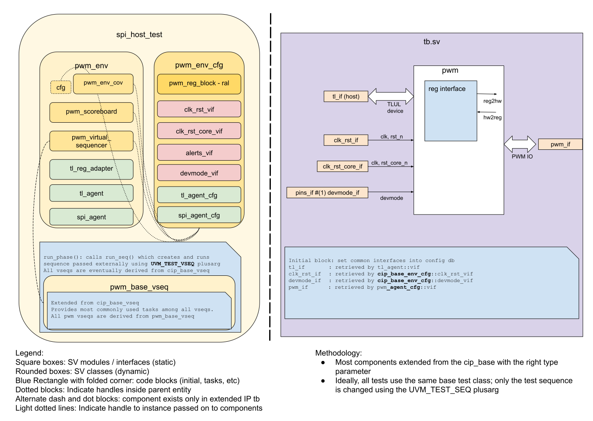

<!-- Copy this file to hw/ip/pwm/doc/dv/index.md and make changes as needed.
For convenience 'pwm' in the document can be searched and replaced easily with the
desired IP (with case sensitivity!). Also, use the testbench block diagram
located at OpenTitan team drive / 'design verification'
as a starting point and modify it to reflect your pwm testbench and save it
to hw/ip/pwm/doc/dv/tb.svg. It should get linked and rendered under the block
diagram section below. Please update / modify / remove sections below as
applicable. Once done, remove this comment before making a PR. -->

## Goals
* **DV**
  * Verify all PWM IP features by running dynamic simulations with a SV/UVM based testbench
  * Develop and run all tests based on the [DV plan](#dv-plan) below towards closing code and functional coverage on the IP and all of its sub-modules
* **FPV**
  * Verify TileLink device protocol compliance with an SVA based testbench

## Current status
* [Design & verification stage]()
  * [HW development stages]()
* [Simulation results](https://reports.opentitan.org/hw/ip/pwm/dv/latest/results.html)

## Design features
For detailed information on PWM design features, please see the 
[PWM HWIP technical specification]().

## Testbench architecture
PWM testbench has been constructed based on the 
[CIP testbench architecture]().

### Block diagram


### Top level testbench
Top level testbench is located at `hw/ip/pwm/dv/tb/tb.sv`. It instantiates the PWM DUT module `hw/ip/pwm/rtl/pwm.sv`.
In addition, it instantiates the following interfaces, connects them to the DUT and sets their handle into `uvm_config_db`:
* [Clock and reset interface]()
* [TileLink host interface]()
* PWM IOs
* Alerts ([`pins_if`]()
* Devmode ([`pins_if`]()

### Common DV utility components
The following utilities provide generic helper tasks and functions to perform activities 
that are common across the project:
* [common_ifs]()
* [dv_utils_pkg]()
* [csr_utils_pkg]()

### Global types & methods
All common types and methods defined at the package level can be found in
`pwm_env_pkg`. Some of them in use are:
```systemverilog
parameter uint NUM_PWM_CHANNELS = 6;
```
### TL_agent
PWM instantiates (already handled in CIP base env) [tl_agent]()
which provides the ability to drive and independently monitor random traffic via
TL host interface into PWM device.

### PWM agent
PWM agent is configured to work device mode. 
The agent monitor captures pulses generated in channels then sends to the scoreboard for verification  
Since the DUT does not require any response thus agent driver is fairly simple.

### UVM RAL Model
The PWM RAL model is created with the [`ralgen`]() 
FuseSoC generator script automatically when the simulation is at the build stage.

It can be created manually by invoking [`regtool`]():

### Stimulus strategy
#### Test sequences
All test sequences reside in `hw/ip/pwm/dv/env/seq_lib`.
The `pwm_base_vseq` virtual sequence is extended from `cip_base_vseq` and serves as a starting point.
All test sequences are extended from `pwm_base_vseq`.
It provides commonly used handles, variables, functions and tasks that the test sequences can simple use / call.
Some of the most commonly used tasks / functions are as follows:
* task 1:
* task 2:

#### Functional coverage
To ensure high quality constrained random stimulus, it is necessary to develop a functional coverage model.
The following covergroups have been developed to prove that the test intent has been adequately met:
* cg1:
* cg2:

### Self-checking strategy
#### Scoreboard
The `pwm_scoreboard` is primarily used for end to end checking.
It creates the following analysis ports to retrieve the data monitored by corresponding interface agents:
* analysis port1:
* analysis port2:
<!-- explain inputs monitored, flow of data and outputs checked -->

#### Assertions
* TLUL assertions: The `tb/pwm_bind.sv` binds the `tlul_assert` [assertions]() to the IP to ensure TileLink interface protocol compliance.
* Unknown checks on DUT outputs: The RTL has assertions to ensure all outputs are initialized to known values after coming out of reset.
* assert prop 1:
* assert prop 2:

## Building and running tests
We are using our in-house developed [regression tool]() for building and running our tests and regressions.
Please take a look at the link for detailed information on the usage, capabilities, features and known issues.
Here's how to run a smoke test:
```console
$ $REPO_TOP/util/dvsim/dvsim.py $REPO_TOP/hw/ip/pwm/dv/pwm_sim_cfg.hjson -i pwm_smoke
```

## DV plan

