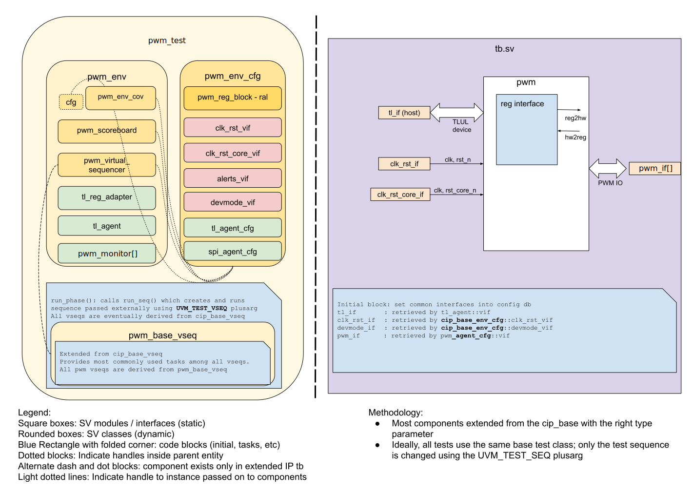

# PWM DV document

## Goals
* **DV**
  * Verify all PWM IP features by running dynamic simulations with a SV/UVM based testbench
  * Develop and run all tests based on the [testplan](#testplan) below towards closing code and functional coverage on the IP and all of its sub-modules
* **FPV**
  * Verify TileLink device protocol compliance with an SVA based testbench

## Current status
* [Design & verification stage](../../../README.md)
  * [HW development stages](../../../../doc/project_governance/development_stages.md)
* [Simulation results](https://reports.opentitan.org/hw/ip/pwm/dv/latest/report.html)

## Design features
For detailed information on PWM design features, please see the
[PWM HWIP technical specification](../README.md).

## Testbench architecture
PWM testbench has been constructed based on the
[CIP testbench architecture](../../../dv/sv/cip_lib/README.md).

### Block diagram


### Top level testbench
Top level testbench is located at `hw/ip/pwm/dv/tb/tb.sv`. It instantiates the PWM DUT module `hw/ip/pwm/rtl/pwm.sv`.
In addition, it instantiates the following interfaces, connects them to the DUT and sets their handle into `uvm_config_db`:
* [Clock and reset interface](../../../dv/sv/common_ifs/README.md)
* [TileLink host interface](../../../dv/sv/tl_agent/README.md)
* PWM IOs
* Alerts ([`pins_if`](../../../dv/sv/common_ifs/README.md))

### Common DV utility components
The following utilities provide generic helper tasks and functions to perform activities
that are common across the project:
* [common_ifs](../../../dv/sv/common_ifs/README.md)
* [dv_utils_pkg](../../../dv/sv/dv_utils/README.md)
* [csr_utils_pkg](../../../dv/sv/csr_utils/README.md)

### Global types & methods
All common types and methods defined at the package level can be found in
`pwm_env_pkg`. Some of them in use are:
```systemverilog
parameter uint NUM_PWM_CHANNELS = 6;

  typedef enum bit {
    Enable  = 1'b1,
    Disable = 1'b0
  } pwm_status_e;

  typedef struct packed {
    bit [26:0]   ClkDiv;
    bit [3:0]    DcResn;
    bit          CntrEn;
  } cfg_reg_t;

  typedef struct packed {
    bit          BlinkEn;
    bit          HtbtEn;
    bit [13:0]   RsvParam;
    bit [15:0]   PhaseDelay;
  } param_reg_t;

  typedef struct packed {
    bit [15:0]   B;
    bit [15:0]   A;
  } dc_blink_t;
```
### TL_agent
PWM instantiates (already handled in CIP base env) [tl_agent](../../../dv/sv/tl_agent/README.md)
which provides the ability to drive and independently monitor random traffic via
TL host interface into PWM device.

### PWM monitor
Because the DUT does not receive any input stimuli, a full agent is not needed.
Instead a PWM monitor has been developed.
It will capture all traffic on the PWM channel and each pulse in a pwm sequence item for later analysis in the scoreboard.
For each pulse a number of features are captured such as:
* pulse length in number of clock cycles.
* number of active cycles
* number of inactive cycles
* relative delay to be used for phase calculation

### UVM RAL Model
The PWM RAL model is created with the [`ralgen`](../../../dv/tools/ralgen/README.md)
FuseSoC generator script automatically when the simulation is at the build stage.

It can be created manually by invoking [`regtool`](../../../../util/reggen/doc/setup_and_use.md)

### Stimulus strategy
#### Test sequences
All test sequences reside in `hw/ip/pwm/dv/env/seq_lib`.
The `pwm_base_vseq` virtual sequence is extended from `cip_base_vseq` and serves as a starting point.
All test sequences are extended from `pwm_base_vseq`.
It provides commonly-used handles, variables, functions and tasks that the test sequences can simple use / call.

Some of the most commonly-used tasks / functions are as follows:
* set_reg_en(pwm_status_e state): enable registers for writing
* set_cfg_reg(cfg_reg_t cfg_reg): program global configuration  (ClkDiv/DcResn/CntrEn))
* set_ch_enables(bit [PWM_NUM_CHANNELS-1:0] enables): used to enable and disable the different channels
* set_duty_cycle(bit [$bits(PWM_NUM_CHANNELS)-1:0] channel, dc_blink_t value ,bit [3:0] resn) set the A and B values for channel
* set_blink(bit [$bits(PWM_NUM_CHANNELS)-1:0] channel, dc_blink_t value): set X and Y value for pulse and heart bit
* set_param(bit [$bits(PWM_NUM_CHANNELS)-1:0] channel, param_reg_t value): set channel configuration (blink/heartbeat/phase)
* shutdown_dut(): this will disable all channels as an indication for the scoreboard to verify all remaining items.

#### Functional coverage
To ensure high quality constrained random stimulus, it is necessary to develop a functional coverage model.
The functional coverage plan can be found here: [coverageplan](#testplan)

### Self-checking strategy
#### Scoreboard
The `pwm_scoreboard` is primarily used for transaction-by-transaction checking.
It creates the following analysis ports to retrieve the data monitored by corresponding interface agents:
* item_fifo[NUM_PWM_CHANNELS]: the FIFO w.r.t channels receives the dut items sent by the pwm_monitor
* exp_item                   : It is used to store the expected item constructed from tl address and data channels.

when a channel is configured to start sending pulses the first expected item is generated.
Because of the way the PWM IP is design the first and the last pulse might not match the configuration settings.
Therefore the scoreboard will wait until a channel is disabled before checking the output.
Once a channel is disabled it will first discard the first two items received from the monitor.
The is send because the channel was enabled and has no valid information.
The second is the one that cannot be expected to match configuration.
For pulse mode it will get the expected pulse item and match all incoming item to this one.
For blink and heart beat mode after an item is compared successfully the scoreboard will generate the next expected item based on the previous item and the settings of the blink parameters.
If an error is found the scoreboard will throw an error.

#### Assertions
* TLUL assertions: The `tb/pwm_bind.sv` binds the `tlul_assert` [assertions](../../tlul/doc/TlulProtocolChecker.md) to the IP to ensure TileLink interface protocol compliance.
* Unknown checks on DUT outputs: The RTL has assertions to ensure all outputs are initialized to known values after coming out of reset.


## Building and running tests
We are using our in-house developed [regression tool](../../../../util/dvsim/README.md) for building and running our tests and regressions.
Please take a look at the link for detailed information on the usage, capabilities, features and known issues.
Here's how to run a smoke test:
```console
$ $REPO_TOP/util/dvsim/dvsim.py $REPO_TOP/hw/ip/pwm/dv/pwm_sim_cfg.hjson -i pwm_smoke
```

## Testplan
[Testplan](../data/pwm_testplan.hjson)
