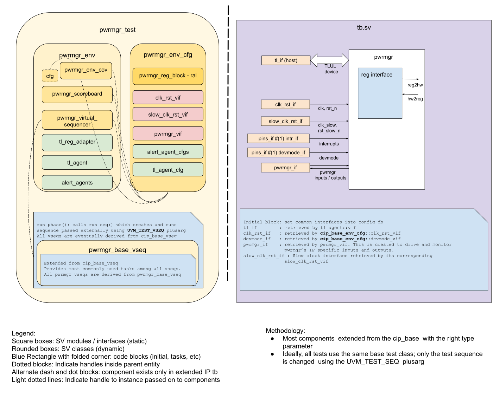

## Goals
* **DV**
  * Verify all PWRMGR IP features by running dynamic simulations with a SV/UVM based testbench.
  * Develop and run all tests based on the [testplan](#testplan) below towards closing code and functional coverage on the IP and all of its sub-modules.
* **FPV**
  * Verify TileLink device protocol compliance with an SVA based testbench.

## Current status
* [Design & verification stage]()
  * [HW development stages]()
* [Simulation results](https://reports.opentitan.org/hw/ip/pwrmgr/dv/latest/results.html)

## Design features
For detailed information on PWRMGR design features, please see the [PWRMGR HWIP technical specification]().

## Testbench architecture
PWRMGR testbench has been constructed based on the [CIP testbench architecture]().

### Block diagram


### Top level testbench
Top level testbench is located at `hw/ip/pwrmgr/dv/tb.sv`.
It instantiates the PWRMGR DUT module `hw/ip/pwrmgr/rtl/pwrmgr.sv`.
In addition, it instantiates the following interfaces, connects them to the DUT and sets their handle into `uvm_config_db`:
* [Clock and reset interface]()
* [TileLink host interface]()
* PWRMGR interface `hw/ip/pwrmgr/dv/env/pwrmgr_if.sv`.
* Interrupts ([`pins_if`]())
* Alerts ([`alert_esc_if`]())
* Devmode ([`pins_if`]())

### Common DV utility components
The following utilities provide generic helper tasks and functions to perform activities that are common across the project:
* [dv_utils_pkg]()
* [csr_utils_pkg]()

### Global types & methods
All common types and methods defined at the package level can be found in
`pwrmgr_env_pkg`.
Some of them in use are:
```systemverilog
[list a few parameters, types & methods; no need to mention all]
```
### TL_agent
PWRMGR testbench instantiates (already handled in CIP base env) [tl_agent]() which provides the ability to drive and independently monitor random traffic via TL host interface into PWRMGR device.

### UVM RAL Model
The PWRMGR RAL model is created with the [`ralgen`]() FuseSoC generator script automatically when the simulation is at the build stage.

It can be created manually by invoking [`regtool`]():

### Stimulus strategy
The sequences are closely related to the testplan's testpoints.
Testpoints and coverage are described in more detail in the [testplan](#testplan).
#### Test sequences
All test sequences reside in `hw/ip/pwrmgr/dv/env/seq_lib`, and extend `pwrmgr_base_vseq`.
The `pwrmgr_base_vseq` virtual sequence is extended from `cip_base_vseq` and serves as a starting point.
It provides commonly used handles, variables, functions and tasks that the test sequences can simple use / call.
Some of the most commonly used tasks / functions are as follows:
* task `start_slow_fsm`:
  Sets the AST main_pok input to 1 after some random slow clock cycles.
* task `wait_for_fast_fsm_active`:
  Waits for the `fetch_en_o` output to become 1, indicating the fast fsm is active and the cpu can fetch instructions.
  We wait for this before the tests can start, since any CSR accesses require the CPU to be running.
  Due to complexities in the UVM sequences this task is called in the virtual post_apply_reset task of dv_base_vseq.
* task `wait_for_csr_to_propagate_to_slow_domain`:
  Waits for `cfg_cdc_sync` CSR to be clear, indicating the CDC to the slow clock has completed.
* task `wait_for_reset_cause`:
  Waits for the `pwr_rst_req.reset_cause` output to match an expected cause.

In addition, the base sequence provides two tasks that provide expected inputs based on the pwrmgr outputs.
In the absence of these inputs the pwrmgr will be stuck waiting forever.
Being based on outputs means the inputs are in accordance to the implicit protocol.
The tasks in question are:
* task `slow_responder`:
  Handles required input changes for the slow state machine.
  For the various *clk_en outputs it changes the *clk_val as required.
* task `fast_responder`:
  Handles input changes for the fast state machine.
  * Completes the handshake with rstmgr for lc and sys resets: some random cycles after an output reset is requested the corresponding reset src input must go low.
  * Completes the handshake with clkmgr: the `clk_status` input needs to match the `ip_clk_en` output after some cycles.
  * Completes the handshake with lc and otp: both *_done input must match the corresponding *_init output after some cycles.

These tasks are started by the parent sequence's `pre_start` task, and terminated gracefully in the parent sequence's `post_start` task.

The test sequences besides the base are as follows:
* `pwrmgr_smoke_vseq` tests the pwrmgr through POR, entry and exit from software initiated low power and reset.
* `pwrmgr_wakeup_vseq` checks the transitions to low power and the wakeup settings.
  It randomizes wakeup inputs, wakeup enables, the wakeup info capture enable, and the interrupt enable.
* `pwrmgr_clks_en_vseq` checks that the peripheral clock enables match the settings of the `control` CSR during low power.
  It uses a subset of the wakeup sequence.
* `pwrmgr_aborted_lowpower_vseq` creates scenarios that lead to aborting a lowpower transition.
  The abort can be due to the processor waking up very soon, or otp, lc, or flash being busy.
* `pwrmgr_reset_vseq` checks the pwrmgr response to resets and reset enables.
* `pwrmgr_escalation_reset_vseq` checks the response to an escalation reset.
* `pwrmgr_reset_wakeup_vseq` aligns reset and wakeup from low power.
* `pwrmgr_lowpower_wakeup_race_vseq` aligns a wakeup event coming in proximity to low power entry.
  Notice the wakeup is not expected to impact low power entry, since it is not sampled at this time.

#### Functional coverage
To ensure high quality constrained random stimulus, it is necessary to develop a functional coverage model.
The following covergroups have been developed to prove that the test intent has been adequately met:
* `wakeup_ctrl_cg` covers wakeup and capture control.
* `wakeup_intr_cg` covers control of the interrupt due to a wakeup.
* `clock_enables_cg` covers clock controls.
* reset_cg
* reset_lowpower_distance_cg

More details about these sequences and covergroups can be found at `hw/ip/pwrmgr/data/pwrmgr_testplan.hjson`.

### Self-checking strategy
#### Scoreboard
The `pwrmgr_scoreboard` is primarily used for end to end checking.

It creates the following analysis ports to retrieve the data monitored by corresponding interface agents:
* analysis port1:
* analysis port2:

Many inputs must have specific transitions to prevent the pwrmgr fsms from wait forever.
When possible the transitions are triggered by pwrmgr output changes.
These are described according to the unit that originates or is the recepient ot the ports.
See also the test plan for specific ways these are driven to trigger different testpoints.

##### AST
- Output `slow_clk_en` is always on.
- Input `slow_clk_val` is unused.
- Outputs `core_clk_en`, `io_clk_en`, and `usb_clk_en` reset low, and go high prior to the slow fsm requesting the fast fsm to wakeup.
  Notice the usb clock can be programmed to stay low on wakeup via the `control` CSR.
  These clock enables are cleared on reset, and should match their corresponding enables in the `control` CSR on low power transitions.
  These clock enables are checked via SVAs in `hw/ip/pwrmgr/dv/sva/pwrmgr_clock_enables_sva_if.sv`.
  When slow fsm transitions to `SlowPwrStateReqPwrUp` the clock enables should be on (except usb should match `control.usb_clk_en_active`).
  When slow fsm transitions to `SlowPwrStatePwrClampOn` the clock enables should match their bits in the `control` CSR.
- Inputs `core_clk_val`, `io_clk_val`, and `usb_clk_val` track the corresponding enables.
  They are driven by `slow_responder`, which turn them off when their enables go off, and turn them back on a few random slow clock cycles after their enables go on.
  Slow fsm waits for them to go high prior to requesting fast fsm wakeup.
  Lack of a high transition when needed is detected via timeout.
  Such timeout would be due to the corresponding enables being set incorrectly.
  These inputs are checked via SVAs in `hw/ip/pwrmgr/dv/sva/pwrmgr_ast_sva_if.sv`.
- Output `main_pd_n` should go high when slow fsm transitions to `SlowPwrStateMainPowerOn`, and should match `control.main_pd_n` CSR when slow fsm transitions to `SlowPwrStateMainPowerOff`.
- Input `main_pok` should turn on for the slow fsm to start power up sequence.
  This is also driven by `slow_responder`, which turn this off in response to `main_pd_n` going low, and turn it back on after a few random slow clock cycles from `main_pd_n` going high.
  Lack of a high transition causes a timeout, and would point to `main_pd_n` being set incorrectly.
- Output transitions of `pwr_clamp_env` must always precede transitions of
  `pwr_clamp` output.
  Output transitions of `pwr_clamp` to active must always precede transitions
  of `main_pd_n` output to active.
  Output transitions of `pwr_clamp` to inactive must always follow transitions
  of `main_pd_n` output to inactive.

##### RSTMGR
- Output `rst_lc_req` resets to 1, also set on reset transition, and on low power transitions that turn off main clock.
  Cleared early on during the steps to fast fsm active.
- Input `rst_lc_src_n` go low in response to `rst_lc_req` high, go high when `rst_lc_req` clears (and lc is reset).
  Driven by `fast_responder` in response to `rst_lc_req`, waiting a few random cycles prior to transitions.
  Fast fsm waits for it to go low before deactivating, and for it to go high before activating.
  Checked implicitly by lack of timeout: a timeout would be due to `rst_lc_req` being set incorrectly.
- Output `rst_sys_req` resets to 1, also set to on reset, and on low power transitions that turn off main clock.
  Cleared right before the fast fsm goes active.
- Input `rst_sys_src_n` go low in response to `rst_sys_req` high.
  Transitions go high when `rst_sysd_req` clears (and lc is reset).
  Fast fsm waits for it to go low before deactivating.
  Also driver by `fast_responder`.
  Checked implicitly by lack of timeout.
- Output `rstreqs` correspond to the enabled pwrmgr rstreqs inputs plus escalation reset.
  Checked in scoreboard.
- Output `reset_cause` indicates a reset is due to low power entry or a reset request.
  Checked in scoreboard.

##### CLKMGR
- Output `ip_clk_en` resets low, is driven high by fast fsm when going active, and driven low when going inactive.
- Input `clk_status` is expected to track `ip_clk_en`.
  Fast fsm waits for it going high prior to going active, and for it to go low prior to deactivating.
  Driven by `fast_responder`, which turns it off when `ip_clk_en` goes low, and rurn it back on a few random cycles after `ip_clk_en` going high.
  Checked by lack of a timeout: such timeout would be due to `ip_clk_en` being set incorrectly.

##### OTP
- Output `otp_init` resets low, goes high when the fast fsm is going active, and low after the `otp_done` input goes high.
- Input `otp_done` is driven by `fast_responder`.
  It is initialized low, and goes high some random cycles after `otp_init` goes high.
  The sequencer will timeout if `otp_init` is not driven high.
- Input `otp_idle` will normally be set high, but will be set low by the `pwrmgr_aborted_lowpower_vseq` sequence.

###### LC
The pins connecting to LC behave pretty much the same way as those to OTP.

##### FLASH
- Input `flash_idle` is handled much like `lc_idle` and `otp_idle`.

##### CPU
- Input `core_sleeping` is driven by sequences.
  It is driven low to enable a transition to low power.
  After the transition is under way it is a don't care.
  The `pwrmgr_aborted_lowpower_vseq` sequence sets it carefully to abort a low power entry soon after the attempt because the processor wakes up.

##### Wakepus and Resets
There are a number of wakeup and reset requests.
They are driven by sequences as they need to.

#### Assertions
* TLUL assertions: The `hw/ip/pwrmgr/dv/sva/pwrmgr_bind.sv` module binds the `tlul_assert` [assertions]() to the IP to ensure TileLink interface protocol compliance.
* Unknown checks on DUT outputs: The RTL has assertions to ensure all outputs are initialized to known values after coming out of reset.
* Clock enables assertions:
  The `hw/ip/pwrmgr/dv/sva/pwrmgr_bind.sv` module binds `pwrmgr_clock_enables_if` to the ip.
  It contains assertions checking that the various clk_en outputs correspond to the settings in the `control` CSR.
* AST input/output handshake assertions:
  The `hw/ip/pwrmgr/dv/sva/pwrmgr_bind.sv` module binds `pwrmgr_ast_if` to the ip.
  It contains assertions checking that the inputs from the AST respond to the pwrmgr outputs.
* RSTMGR input/output handshake assertions:
  The `hw/ip/pwrmgr/dv/sva/pwrmgr_bind.sv` module binds `pwrmgr_rstmgr_if` to the ip.
  It contains assertions checking that the inputs from the RSTMGR respond to the pwrmgr outputs.

More assertions will be added according to the different unit's descriptions above.

## Building and running tests
We are using our in-house developed [regression tool]() for building and running our tests and regressions.
Please take a look at the link for detailed information on the usage, capabilities, features and known issues.
Here's how to run a smoke test:
```console
$ $REPO_TOP/util/dvsim/dvsim.py $REPO_TOP/hw/ip/pwrmgr/dv/pwrmgr_sim_cfg.hjson -i pwrmgr_smoke
```

## Testplan

