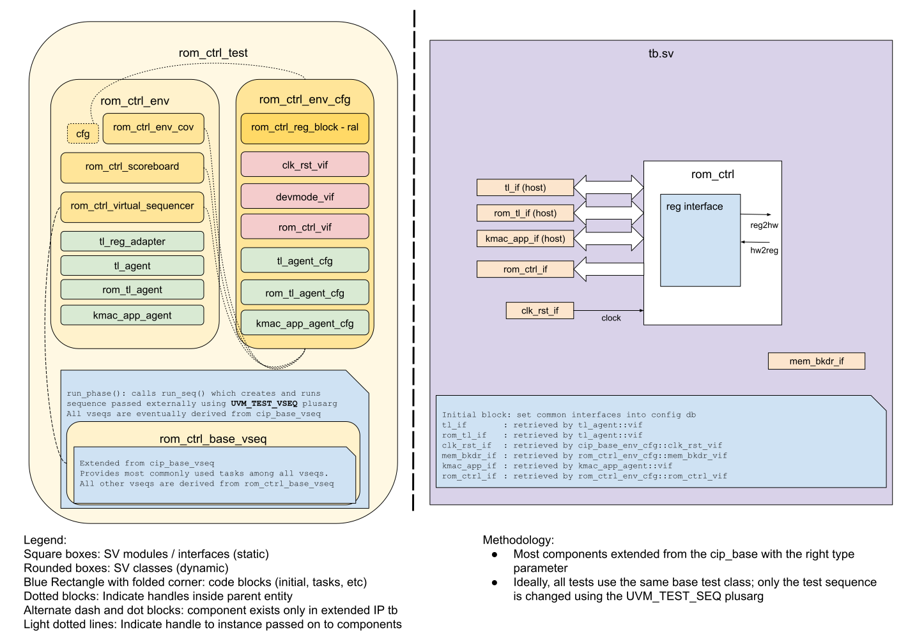

## Goals
* **DV**
  * Verify all `rom_ctrl` IP features by running dynamic simulations with a SV/UVM based testbench
  * Develop and run all tests based on the [testplan](#testplan) below towards closing code and functional coverage on the IP and all of its sub-modules
* **FPV**
  * Verify TileLink device protocol compliance with an SVA based testbench

## Current status
* [Design & verification stage]()
  * [HW development stages]()
* [Simulation results](https://reports.opentitan.org/hw/ip/rom_ctrl/dv/latest/results.html)

## Design features
For detailed information on `rom_ctrl` design features, please see the [ROM Controller HWIP technical specification]().

## Testbench architecture
The `rom_ctrl` testbench has been constructed based on the [CIP testbench architecture]().

### Block diagram


### Top level testbench
The top level testbench is located at `hw/ip/rom_ctrl/dv/tb/tb.sv`.
It instantiates the `rom_ctrl` DUT module `hw/ip/rom_ctrl/rtl/rom_ctrl.sv`.
In addition, it instantiates the following interfaces, connects them to the DUT and sets their handle into `uvm_config_db`:
* [Clock and reset interface]()
* [TileLink host interface]()
* [Memory backdoor utility]()
* `rom_ctrl` IOs
* Alerts ([`pins_if`]()

### Common DV utility components
The following utilities provide generic helper tasks and functions to perform activities that are common across the project:
* [dv_utils_pkg]()
* [csr_utils_pkg]()

### Compile-time configurations
There is only one compile-time configuration, where arbitrary values are chosen for compile-time constants.

### TL_agent
The `rom_ctrl` testbench instantiates (already handled in CIP base env) [tl_agent]().
This provides the ability to drive and independently monitor random traffic via both TL host interfaces into the DUT.

### UVM RAL Model
The `rom_ctrl` RAL model is created with the [`ralgen`]() FuseSoC generator script automatically when the simulation is at the build stage.

### Stimulus strategy
#### Test sequences
The test sequences reside in `hw/ip/rom_ctrl/dv/env/seq_lib`.
All test sequences are extended from `rom_ctrl_base_vseq`, which is extended from `cip_base_vseq` and serves as a starting point.
It provides commonly used handles, variables, functions and tasks that the test sequences can simple use / call.
Some of the most commonly used tasks / functions are as follows:
* `rom_ctrl_mem_init`: initialize the rom to random values
* `do_rand_ops`: drive random traffic into the rom TLUL interface

#### Functional coverage
To ensure high quality constrained random stimulus, it is necessary to develop a functional coverage model.
The following covergroups have been developed to prove that the test intent has been adequately met:
* TODO

### Self-checking strategy
#### Scoreboard
The `rom_ctrl_scoreboard` is primarily used for end to end checking.
It creates the following analysis ports to retrieve the data monitored by corresponding interface agents:
* `kmac_req_fifo`
* `kmac_resp_fifo`

The scoreboard monitors traffic sent to and from the KMAC interface.
Data sent to KMAC during rom checking are compared against expected values from the memory model.
The data received from the KMAC interface are used to update expected digest values and expected check pass/fail values.

Traffic from the ROM TLUL interface is monitored and compared against memory model to check for correctness.

#### Assertions
* TLUL assertions: The `tb/rom_ctrl_bind.sv` file binds the `tlul_assert` [assertions]() to the IP to ensure TileLink interface protocol compliance.
* Unknown checks on DUT outputs: The RTL has assertions to ensure all outputs are initialized to known values after coming out of reset.

## Building and running tests
We are using our in-house developed [regression tool]() for building and running our tests and regressions.
Please take a look at the link for detailed information on the usage, capabilities, features and known issues.
Here's how to run a smoke test:
```console
$ $REPO_TOP/util/dvsim/dvsim.py $REPO_TOP/hw/ip/rom_ctrl/dv/rom_ctrl_sim_cfg.hjson -i rom_ctrl_smoke
```

## Testplan

