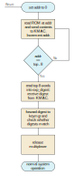

# Theory of Operation

## Block Diagram

The image below shows a high-level block diagram of the module.
Blue boxes are instantiations of generic primitives that are used elsewhere on the chip.
Green boxes are simple operations; the meat of the design is in the grey boxes.

The upper half of the diagram shows paths for ROM reads when the system is in normal operation.
The lower half of the diagram shows the ROM checker.
This is triggered by the power manager early in the chip boot sequence to check validity of the ROM image.
It runs exactly once, and releases the green multiplexer when it is done.


## ROM access when chip is in operation

Once the chip has booted, ROM accesses are requested over the system TL-UL bus.
These come in through the TL-UL SRAM adapter (top-left of block diagram).
In normal operation, the green multiplexer will give access to these TL reads.
The address is scrambled at the first substitution-permutation network (marked S&P in the diagram).

In parallel with the ROM access, a reduced `prim_prince` primitive (7 rounds with latency 1; equivalent to the cipher used for SRAM) computes a 39-bit truncated keystream for the block.
On the following cycle, the scrambled data from ROM goes through a substitution-permutation network and is then XOR'd with the keystream.
This scheme is the same as that used by the [SRAM controller](../../sram_ctrl/README.md), but is much simplified because the ROM doesn't have to deal with writes, byte accesses or key changes.

The output from the XOR is the unscrambled 32-bit data, plus seven ECC bits.
This data is passed straight through the TL-UL SRAM adapter; the ECC bits are used as a signal integrity check by the system bus.

The following diagram shows the timing of the different signals.
The time from the `req` output from the `tlul_adapter_sram` to the response that appears on its `rvalid` input is one cycle.
The "scrambling scheme" for addresses in the diagram is to reverse their digits.
The word stored at address 21 in the ROM is denoted `w21`.
The keystream value for address 12 is denoted `k12`.
The unscrambled ROM data for (logical) address 12 is denoted `d12`.

```wavejson
{signal: [
  {name: 'clk', wave: 'p....', period: 2},
  {name: 'req', wave: '0.1...0...'},
  {name: 'addr', wave: 'x.3.4.x...', data: ['12', '34']},
  {name: 'scrambled addr', wave: 'x.3.4.x...', data: ['21', '43']},
  {name: 'scrambled rdata + ecc', wave: 'x...3.4.x.', data: ['w21', 'w43']},
  {name: 'keystream', wave: 'x...3.4.x.', data: ['k12', 'k34']},
  {name: 'rdata + ecc', wave: 'x...3.4.x.', data: ['d12', 'd34']},
  {name: 'rvalid', wave: '0...1...0.'},
]}
```

The `prim_prince` primitive and the two substitution-permutation networks are all parameterised by "keys".
For `rom_ctrl`, these keys are global randomised netlist constants: they are assumed to be difficult to recover, but aren't considered secret data.

## The startup ROM check

The ROM checker runs immediately after reset.
Until it is done, it controls ROM address requests (through the green multiplexer).
The select signal for this multiplexer has a redundant encoding to protect it against fault injection attacks.
If the select signal has an invalid value, this will trigger a fatal alert.
Before starting to read data, it starts a cSHAKE operation on the [KMAC](../../kmac/README.md) module using one of its application interfaces.
We expect to use the `cSHAKE256` algorithm, with prefix "ROM_CTRL".
The [Application Interface](../../kmac/README.md#application-interface) section of the KMAC documentation details the parameters used.

The checker reads the ROM contents in address order, resulting in a scattered access pattern on the ROM itself because of the address scrambling.
Each read produces 39 bits of data, which are padded with zeros to 64 bits to match the interface expected by the KMAC block.
The checker FSM loops through almost all the words in ROM (from bottom to top), passing each to the KMAC block with the ready/valid interface and setting the `kmac_data_o.last` bit for the last word that is sent.
Once the last word has been sent, the FSM releases the multiplexer; this now switches over permanently to allow access through the TL-UL SRAM adapter.

The top eight words in ROM (by logical address) are interpreted as a 256-bit expected hash.
Unlike the rest of ROM, their data is not stored scrambled, so the expected hash can be read directly.
This is taken by the checker FSM (ignoring ECC bits) and will be compared with the digest that is read back from the KMAC block.

Once it comes back, the digest is forwarded directly to the [Key Manager](../../keymgr/README.md).
It is also compared with the hash that was read from the top eight words of ROM.
On a match, `pwrmgr_data_o.good` is signalled as `Mubi4True`.
In either case, `pwrmgr_data_o.done` goes high when the calculation is complete.

The diagram below shows the operation of the simple FSM.

<div align="center">



</div>

## What does the ROM check do?

One of the possible physical attacks on a system like OpenTitan is to subvert the ROM.
The regular structure of a ROM is useful because it makes metal fixes easy, but (for the same reasons) it makes the ROM quite an easy target for an attacker.
See \[SKO-05\][^SKO-05], section 2.1.1, for a description of ROMs and attacks on them.

[^SKO-05]: **SKO-05**: Skorobogatov, [*Semi-Invasive Attacks - A New Approach to Hardware Security Analysis*](https://www.cl.cam.ac.uk/techreports/UCAM-CL-TR-630.html), University of Cambridge Computer Laboratory Technical Report 630, 2005

Since the code in ROM is the first thing to execute, an attacker that modifies it undetected can completely subvert the chain of trust.
As such, OpenTitan needs some form of ROM integrity checking and the ROM checker is the module in charge of providing it.

After bringing the ROM controller module out of reset, the power manager must wait until `pwrgr_data_o.done` is asserted before starting the host processor.
The ROM controller also passes the `pwrmgr_data_o.good` signal.
The power manager can use this to decide whether to boot (taking into account life cycle state).
This provides an extra safety check, but the real security comes from key manager integration described below.

The simple KMAC interface assumes that KMAC is pre-configured to run the cSHAKE algorithm with a prefix specific to the ROM checker.
The ROM checker will not assert `kmac_data_o.valid` after finishing the one and only digest computation.
The KMAC module may choose to add a check for this, to detect reset glitches affecting the `rom_ctrl` block.

The integration with the key manager is based on forwarding the digest data in `kmac_data_i` as `keymgr_data_o.data`.
This 256-bit digest will be incorporated into the [`CreatorRootKey`](../../../../doc/security/specs/identities_and_root_keys/README.md#creator-root-key).
The key manager should only allow one transaction (of 256 bits / 32 bits = 8 beats) after reset to pass this information across.
On future messages, it should raise an alert, defeating an attacker that tries to trigger extra transactions before or after the real one.

`CreatorRootKey` forms the first key in the chain described in Identities and Root Keys.
An attacker who modifies the ROM will perturb `CreatorRootKey` (to avoid doing so would require a preimage attack on the ROM checksum calculation or the `KM_DERIVE` function).
The result is that, while the chip will function, it will have the "wrong" root key and the chain of trust used for attestation will be broken.

## Fault-injection hardening

The core integrity check, flowing from the ROM data to `CreatorRootKey`, should be infeasible to subvert.
However, `rom_ctrl` also controls bus access to ROM data and interacts with other blocks.
To avoid attacks propagating into the rest of the system, we take the following extra hardening steps:

- All internal FSMs are sparsely encoded, with a minimum Hamming distance of 3.
- The "good" signal passed to the power manager is multi-bit encoded (using `mubi4_t`).
- The switching signals for the mux are multi-bit encoded (using `mubi4_t`).
- We check to ensure the mux doesn't switch back to the checker after giving access to the bus.
- The main FSM has internal consistency checking to ensure that other blocks don't signal completion when the FSM is in a state that doesn't expect them to be running.

## Hardware Interfaces

* [Interface Tables](../data/rom_ctrl.hjson#interfaces)

### Parameters

Parameter                   | Default (Max)         | Top Earlgrey | Description
----------------------------|-----------------------|--------------|---------------
`RndCnstRomKey`             | (see RTL)             | (see RTL)    | Compile-time random default constant for scrambling key (used in `prim_prince` block).
`RndCnstRomNonce`           | (see RTL)             | (see RTL)    | Compile-time random default constant for scrambling nonce (used in `prim_prince` block and the S&P block).

### Signals

The table below lists other ROM controller inter-module signals.

<table>
  <tr>
    <th>Signal</th>
    <th>Type</th>
    <th>Destination</th>
    <th>Description</th>
  </tr>
  <tr>
    <td><code>pwrmgr_data_o</code></td>
    <td><code>rom_ctrl_pkg::pwrmgr_data_t</code></td>
    <td>pwrmgr</td>
    <td>
      <p>
        A structure with two fields.
        The first, <code>done</code>, becomes true when the ROM check is complete and remains true until reset.
      </p><p>
        The second, <code>good</code>, is only valid if <code>done</code> is true.
        This is true if the digest computation matched the expected value stored in the top words of ROM and false otherwise.
        This field stays constant when <code>done</code> is true.
      </p>
    </td>
  </tr>

  <tr>
    <td><code>keymgr_data_o</code></td>
    <td><code>rom_ctrl_pkg::keymgr_data_t</code></td>
    <td>keymgr</td>
    <td>
      A 256-bit digest, together with a <code>valid</code> signal.
      Once the ROM check is complete, <code>valid</code> will become true and will then remain true until reset.
      The digest in <code>data</code> is only valid when <code>valid</code> is true and is be constant until reset.
    </td>
  </tr>

  <tr>
    <td><code>kmac_data_o</code></td>
    <td>kmac_pkg::app_req_t</td>
    <td>kmac</td>
    <td>
      Outgoing data to KMAC.
      Data is sent in 64-bit words in the <code>data</code> field.
      When a word of data is available, the <code>valid</code> field is true.
      When this is the last word of data, the <code>last</code> field is also true.
      Since we never send partial words, the <code>strb</code> field is always zero.
    </td>
  </tr>
  <tr>
    <td><code>kmac_data_i</code></td>
    <td>kmac_pkg::app_rsp_t</td>
    <td>kmac</td>
    <td>
      Incoming data from KMAC interface.
      This contains a <code>ready</code> signal for passing ROM data and a <code>done</code> signal that shows a digest has been computed.
      When <code>done</code> is true, the digest is exposed in two shares (<code>digest_share0</code> and <code>digest_share1</code>).
      The <code>error</code> field is ignored.
    </td>
  </tr>
</table>
