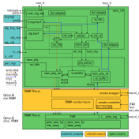

# RRAM Controller HWIP Technical Specification
<!-- BEGIN CMDGEN util/mdbook_regression_links.py --hjson hw/ip/rram_ctrl/data/rram_ctrl.hjson --top earlgrey -->
| Regression | Version | [Stages](https://opentitan.org/book/doc/project_governance/development_stages.html) | Results |
|-|-|-|-|
 [`rram_ctrl`](https://dashboard.reports.lowrisc.org/opentitan/earlgrey/dashboard.html) | 0.1.0 | D0, V0 |     |

<!-- END CMDGEN -->

# Overview

This document describes the RRAM Controller hardware IP functionality.
The RRAM Controller is a comportable IP that manages access to an integrated resistive RAM (RRAM) macro.
It must be used in conjunction with the RRAM macro and cannot be used standalone.

The controller is structurally similar to the [Flash Controller](../../top_earlgrey/ip_autogen/flash_ctrl/README.md) and offers comparable functionality: host-side read-only memory-mapped access, software-initiated read and write transactions via FIFOs, memory protection, hardware-accelerated scrambling, and secure hardware interfaces to the OTP controller, key manager and life cycle controller.

This module conforms to the [Comportable guideline for peripheral functionality](https://opentitan.org/book/doc/contributing/hw/comportability).
See that document for integration overview within the broader top-level system.

## RRAM Subsystem

The RRAM subsystem provides the non-volatile storage capabilities for OpenTitan.
It consists of a single RRAM macro together with a dedicated controller:



**`rram_ctrl` (Open Source)**

A controller maintaining functionality and security features closely aligned with the original `flash_ctrl`, with the additional capability of performing read-set-write operations on the RRAM to support OTP functionality.
It consists of two layers:

- *Protocol controller*: Operates on 32-bit bus words. Arbitrates between three sources: a software-controlled interface and two hardware interfaces (life cycle manager and OTP controller). All three sources share the `wr_fifo`, `ctrl_rd`, and `ctrl_wr` modules and pass through the memory protection module (`rram_ctrl_mp`). The hardware interfaces use fixed compile-time protection rules; the software interface uses a mix of software-configured and hardware-overridden rules.
- *Physical controller (`rram_phy`)*: Operates on 128-bit RRAM words. Arbitrates between the read-only host TL-UL interface and the muxed controller interface. All read requests go through `rram_phy_rd`, which fetches data from the RRAM macro and caches it in the read buffers. Write requests go through `rram_phy_wr`, which packs bus words into RRAM words, scrambles them, and issues write requests to the RRAM macro. Both data paths share a single scrambling module (`rram_scramble`) capable of both scrambling and descrambling.

**`rram_macro`**

This module exists in two forms:

- *Vendor implementation*: Closed-source, high-density RRAM with a vendor controller, reliability ECC encoding/decoding, and built-in self-test. Contains a register bank for device-specific configuration such as macro clock speed. This form is used in the physical ASIC.
- *Emulation model*: Open-source, behaviourally accurate model for simulation and FPGA prototyping. The RRAM data and info arrays are emulated with SRAMs. Test circuits are not connected; this feature exists only in the vendor implementation.

The full subsystem interacts with the power manager (`pwrmgr`), key manager (`keymgr`), OTP controller (`otp_ctrl`), and life cycle controller (`lc_ctrl`).


## Features

### RRAM Controller Features

The RRAM protocol controller sits between the software interface, other hardware IPs, and the RRAM physical controller.

- Two TL-UL interfaces:
  - `core_tl` — register access, FIFO access, and software-initiated transactions.
  - `host_tl` — read-only memory-mapped access to the data partition, for instruction fetch and direct data reads.
- Software-initiated read, write and rewrite operations via a FIFO-based protocol.
  - Write and read FIFOs with configurable depth (default 16 entries) and interrupt watermarks.
  - Burst writes must be a multiple of 4 bus words (16 bytes) and address-aligned to 16 bytes.
  - Maximum of 1024 bus words per transaction.
- Separate data and information partitions.
  - 8 configurable memory protection regions for the data partition.
  - Per-page protection for the information partition.
  - A default region configuration applies when no region rule matches.
- XEX scrambling using the PRINCE cipher (same construction as flash).
  - Scrambling is optional and independently configurable per page.
  - Scrambling keys are sideloaded from OTP; software cannot read them.
- Address-XOR integrity: each bus word is XOR'd with its bus address before storage, preventing silent relocation attacks.
  - Disabled for OTP-partition accesses, where data is already integrity-protected.
- ECC: per-page configurable error correction.
  - Correctable ECC errors assert the `corr_err` interrupt and increment an error counter.
- Emulated OTP functionality via a dedicated hardware plug (`rram_ctrl_otp`).
  - Implements OTP semantics (bits can only be set, never cleared) using a read-set-write algorithm on the reserved OTP partition.
  - Supports `OtpRead`, `OtpWrite`, `OtpReadRaw`, `OtpWriteRaw`, and `OtpZeroize` commands.
- Integrity protection for OTP read and write operations.
  - An 8-bit Hamming integrity value is stored per 64 bits of OTP data in a separate integrity page.
  - `OtpRead` recomputes and checks the integrity; `OtpWrite` updates both the data word and the integrity word atomically.
- Semi-automatic rewrite operation for correcting single-bit ECC errors.
  - When the `corr_err` interrupt fires, software can issue a `Rewrite` operation (`CONTROL.OP = Rewrite`) on the affected address to read and write back the corrected word, restoring full ECC headroom before a double or triple error becomes uncorrectable.
- Secure wipe upon RMA request from the life cycle controller.
  - The `rram_ctrl_lcmgr` FSM erases the creator seed, owner seed, and isolated info partition pages, and all data partition pages before asserting `rma_ack`.
  - RRAM access is permanently disabled after RMA completes until the next reset.
- Six interrupts: `wr_empty`, `wr_lvl`, `rd_full`, `rd_lvl`, `op_done`, `corr_err`.
- Five alerts: `recov_err`, `fatal_std_err`, `fatal_err`, `fatal_macro_err`, `recov_macro_err`.
- Software control of code execution from RRAM (`EXEC` register, guarded by a magic value).
- Idle indication to the power manager (`pwrmgr`).

**Physical controller (`rram_phy`) features**

The RRAM physical controller bridges the bus-width (32-bit) protocol controller and the wider (128-bit) RRAM macro word.

- Read buffer: 4 entries, each caching one full RRAM word (128 bits / 4 bus words).
  Acts as a miniature read-only cache to avoid re-fetching the same RRAM word for sub-word accesses.
  Buffer entries are invalidated on any write to the same RRAM word.
- Every RRAM read is issued twice (shadow read); if the two results differ, a fatal alert is raised.
- Up to 2 outstanding host read requests tracked through the read pipeline.
- XEX scrambling engine: shared between reads and writes; PRINCE-based.
- Address-XOR applied per bus word at the physical layer during write; inverted during read.

### Hardware Interfaces

#### RRAM Macro Interface

`rram_ctrl` is connected to `rram_macro` with the following generic interface, which maps to both the vendor ASIC implementation and the open-source emulation model:

```systemverilog
typedef struct packed {
  logic                 rd_req;
  logic                 wr_req;
  logic                 wr_last;
  logic [AddrW-1:0]     addr;
  logic [DataWidth-1:0] wr_data;
  rram_part_e           part;    // RramPartData or RramPartInfo
  logic                 ecc_en;
} rram_macro_req_t;

typedef struct packed {
  logic                 ack;
  logic                 done;
  logic                 err;
  logic                 ecc_err;
  logic [DataWidth-1:0] rd_data;
  logic                 init_done;
  logic                 fatal_err;
  logic                 recov_err;
} rram_macro_rsp_t;
```

#### System Interactions

In addition to the TileLink interfaces, `rram_ctrl` directly interacts with several other OpenTitan modules:

**`lc_ctrl`**
- Enables NVM backdoor access in specific test life cycle states to allow RRAM initialisation after manufacturing.
- Controls access to the owner, creator, and isolated info pages via life cycle signals (`lc_creator_seed_sw_rw_en`, `lc_owner_seed_sw_rw_en`, `lc_iso_part_sw_{rd,wr}_en`).
- Issues RMA requests that trigger a secure wipe of the RRAM.

**`otp_ctrl`**
- Issues `Init`, `Read`, `Write`, and `Zeroize` commands to `rram_ctrl_otp` instead of a dedicated OTP macro, using the OTP region of the RRAM as NVM backing storage.
- Provides the scrambling keys for `rram_ctrl` derived from seeds stored in the OTP region.

**`pwrmgr`**
- `rram_ctrl` asserts an idle signal to the power manager when it is safe to power down — specifically, when no write operation is in progress.
- The analog sensor top provides a signal to `rram_macro` indicating whether the power supply is stable enough for write operations; if this signal is low, write operations are rejected and an error is returned.

**`keymgr`**
- During initialisation, `rram_ctrl` reads the owner and creator seeds from predefined info pages and forwards them to the key manager.

`rram_ctrl` also connects to the alert handler and generates interrupts in the standard comportable manner; see [Interrupts](#interrupts) and [Alerts](#alerts).

### RRAM Memory Overview

The RRAM macro has two partitions: a **data partition** and an **info partition**.
The data partition contains a protected OTP region at the top of its address space, accessible only via the `rram_ctrl_otp` hardware interface.


| Region | Size | Accessible by |
|--------|------|---------------|
| Data partition | configurable (default 4091 pages × 32 words × 16 bytes) | Host TL-UL (read), SW via FIFOs (read/write), lcmgr |
| — OTP region | 5 pages × 32 words × 16 bytes | `rram_ctrl_otp` hardware interface only |
| Info partition | 8 pages × 32 words × 16 bytes | SW via FIFOs (subject to per-page protection), lcmgr |

The data partition holds general-purpose non-volatile storage.
Its top 5 pages form the OTP region, which is transparent to software and acts as NVM backing storage for the OTP controller.
The info partition holds design-specific data, including the two secret seed pages (creator/owner) and an isolated page for manufacturing authentication.

#### Information Partition Special Pages

| Page index | Purpose | Software access |
|-----------|---------|----------------|
| 5 (`CreatorInfoPage`) | Creator seed for key manager | Controlled by `lc_creator_seed_sw_rw_en` |
| 6 (`OwnerInfoPage`) | Owner seed for key manager | Controlled by `lc_owner_seed_sw_rw_en` |
| 7 (`IsolatedInfoPage`) | Manufacturing authentication | Write-only in TEST; read/write in PROD/RMA |

The seed pages are read under the following initialization conditions:
*  life cycle sets provision enable - `lc_seed_hw_rd_en` is set.

See [life cycle](../../ip/lc_ctrl/README.md#creator_seed_sw_rw_en-and-owner_seed_sw_rw_en) for more details on when this partition is allowed to be populated.

During TEST states, the isolated page is only programmable.
* `lc_iso_part_sw_wr_en` is set, but `lc_iso_part_sw_rd_en` is not.

During production and RMA states, the isolated page is also readable.
* Both `lc_iso_part_sw_wr_en` and `lc_iso_part_sw_rd_en` are set.

See [life cycle](../../ip/lc_ctrl/README.md#iso_part_sw_rd_en-and-iso_part_sw_wr_en) for more details

#### Address Map

The RRAM address space is byte-addressed.
Each RRAM word is 16 bytes (128 bits); each page contains 32 words (512 bytes).

Example for a 2 MiB data partition (4096 pages):

| Location | Byte address |
|----------|-------------|
| Data page 0, word 0 | `0x000000` |
| Data page 0, word 1 | `0x000010` |
| Data page 1, word 0 | `0x000200` |
| … | … |

When accessed by the host TL-UL interface, the system memory address for RRAM should be added to this offset.

### Security Countermeasures

| Countermeasure | Description |
|---|---|
| `REG.BUS.INTEGRITY` | TL-UL bus integrity on the core register interface. |
| `HOST.BUS.INTEGRITY` | TL-UL bus integrity on the host read interface. |
| `MEM.BUS.INTEGRITY` | End-to-end bus integrity through the RRAM read path. |
| `MEM.ADDR_INFECTION` | Address-XOR applied to every stored bus word; disabled for OTP pages. |
| `SCRAMBLE.KEY.SIDELOAD` | Scrambling keys are sideloaded from OTP and never visible to software. |
| `LC_CTRL.INTERSIG.MUBI` | Life cycle signals carried as multi-bit encoded values. |
| `CTRL.CONFIG.REGWEN` | Control register is locked while an operation is in progress. |
| `DATA_REGIONS.CONFIG.REGWEN` | Each data protection region has an independent lock register. |

## Registers

See [registers](doc/registers.md) for the full register description.

## Interrupts

| Interrupt | Type | Description |
|-----------|------|-------------|
| `wr_empty` | Status | Write FIFO is empty. Asserted by default. |
| `wr_lvl` | Status | Write FIFO drained to the configured watermark level. |
| `rd_full` | Status | Read FIFO is full. |
| `rd_lvl` | Status | Read FIFO filled to the configured watermark level. |
| `op_done` | Event | A read or write operation has completed. |
| `corr_err` | Event | A correctable ECC error was encountered. |

## Alerts

| Alert | Description |
|-------|-------------|
| `recov_err` | Recoverable error in the RRAM controller (e.g. software-triggered invalid operation). |
| `fatal_std_err` | Standard fatal error (e.g. register integrity failure). |
| `fatal_err` | Fatal error in the RRAM physical controller. Keeps firing until reset; firmware should classify this as fatal in the alert handler. |
| `fatal_macro_err` | Fatal error from the RRAM macro, including TL-UL integrity faults on the test interface. |
| `recov_macro_err` | Recoverable error from the RRAM macro. |
