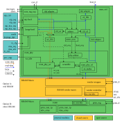

# RRAM Controller HWIP Technical Specification
<!-- BEGIN CMDGEN util/mdbook_regression_links.py --hjson hw/ip/rram_ctrl/data/rram_ctrl.hjson --top earlgrey -->
| Regression | Version | [Stages](https://opentitan.org/book/doc/project_governance/development_stages.html) | Results |
|-|-|-|-|
 [`rram_ctrl`](https://dashboard.reports.lowrisc.org/opentitan/earlgrey/dashboard.html) | 0.1.0 | D0, V0 |     |

<!-- END CMDGEN -->

# Overview

This document describes the RRAM Controller hardware IP functionality.
The RRAM Controller is a comportable IP that manages access to an integrated resistive RAM (RRAM) macro.
It must be used in conjunction with the RRAM macro and cannot be used standalone.

The controller is structurally similar to the Flash Controller and offers comparable functionality: host-side read-only memory-mapped access, software-initiated read and write transactions via FIFOs, memory protection, hardware-accelerated scrambling, and secure hardware interfaces to the OTP controller, key manager and life cycle controller.

This module conforms to the [Comportable guideline for peripheral functionality](https://opentitan.org/book/doc/contributing/hw/comportability).
See that document for integration overview within the broader top-level system.

## RRAM Subsystem

The RRAM subsystem provides the non-volatile storage capabilities for OpenTitan.
It consists of a single RRAM macro together with a dedicated controller:



### rram_ctrl (Open Source)

A controller maintaining functionality and security features closely aligned with the original `flash_ctrl`, with the additional capability of performing read-set-write operations on the RRAM to support emulated OTP functionality.
It operates on 32-bit bus words, and instantiates the RRAM phy (`rram_phy`) as a sub-entity to interface with the 128-bit-wide RRAM macro.

- **RRAM controller**: Arbitrates between three sources: a software-controlled interface and two hardware interfaces (life cycle manager and OTP hardware interface).
  All three sources share the `wr_fifo`, `ctrl_rd`, and `ctrl_wr` modules and pass through the memory protection module (`rram_ctrl_mp`).
  The hardware interfaces use fixed compile-time protection rules.
  The software interface uses a mix of software-configured and hardware-overridden rules.
- **RRAM phy**: Operates on 128-bit RRAM words.
  Arbitrates between the read-only host TL-UL interface and the muxed controller interface.
  All read requests go through `rram_phy_rd`, which fetches data from the RRAM macro and caches it in the read buffers.
  Write requests go through `rram_phy_wr`, which packs bus words into RRAM words, scrambles them, and issues write requests to the RRAM macro.
  Both data paths share a single scrambling module (`rram_scramble`) capable of both scrambling and descrambling.

### rram_macro

This module exists in two forms:

- **Vendor implementation**: Closed-source, high-density RRAM with a vendor controller, reliability ECC encoding/decoding, and built-in self-test.
  Contains a register bank for device-specific configuration such as macro clock speed.
  This form is used in the physical ASIC.
- **Emulation model**: Open-source, behavioural model for simulation and FPGA prototyping.
  The RRAM data and info arrays are emulated with SRAMs.
  Test circuits are not connected.

The full subsystem interacts with the power manager (`pwrmgr`), key manager (`keymgr_dpe`), OTP controller (`otp_ctrl`), and life cycle controller (`lc_ctrl`).


## Features

The RRAM Controller supports read and write commands to the RRAM macro.
It has two TL-UL interfaces. `core_tl` is used to access the register bank and the FIFOs, which can reach both the data and information partitions.
`host_tl` is a read-only interface limited to the data partition.
The RRAM Controller interacts with several other hardware IPs such as the life cycle controller, OTP controller, and key manager.

### RRAM Controller Features

The RRAM controller sits between the software interface, other hardware IPs, and the RRAM phy.

- Two TL-UL interfaces:
  - `core_tl`: register access, FIFO access, and software-initiated transactions.
  - `host_tl`: read-only memory-mapped access to the data partition, for instruction fetch and direct data reads.
- Software-initiated read, write and rewrite operations via a FIFO-based protocol.
  - Write and read FIFOs with configurable depth and interrupt watermarks.
  - Burst writes must be a multiple of 4 bus words (16 bytes) and address-aligned to 16 bytes.
  - Maximum of 1024 bus words per transaction.
- Separate data and information partitions.
  - 10 configurable memory protection (MP) regions for the data partition.
  - A default region configuration applies when no region rule matches.
  - Per-page protection for the information partition.
- XEX scrambling using the PRINCE cipher (similar construction to original flash_ctrl).
  - Scrambling is optional and independently configurable per region or info page.
  - Scrambling keys are sideloaded from emulated OTP through `otp_ctrl` and `rram_ctrl_otp`.
    Software cannot read them.
- Address-XOR integrity: each bus word is XORed with its bus-word address before storage, preventing silent relocation attacks.
  - Disabled for OTP-partition accesses, where data is already integrity-protected.
- ECC: leverages the RRAM macro's own error detection and correction logic, configurable per MP region or info page.
  - Correctable ECC errors assert the `corr_err` interrupt and increment an error counter.
- Emulated OTP functionality via a dedicated hardware plug (`rram_ctrl_otp`).
  - Implements OTP semantics (bits can only be set, never cleared) using a read-set-write algorithm on the reserved OTP partition.
  - Supports `OtpRead`, `OtpWrite`, `OtpReadRaw`, `OtpWriteRaw`, `OtpInit`, and `OtpZeroize` commands.
- Integrity protection for OTP read and write operations.
  - An 8-bit Hamming integrity value is stored per 64 bits of OTP data in a separate integrity page.
  - `OtpRead` recomputes and checks the integrity.
    `OtpWrite` updates both the data word and the integrity word atomically.
- Semi-automatic rewrite operation for correcting single-bit ECC errors.
  - When the `corr_err` interrupt fires, software can issue a `Rewrite` operation (`CONTROL.OP = Rewrite`) on the affected address to read and write back the corrected word, restoring full ECC headroom before a double or triple error becomes uncorrectable.
- Secure wipe upon RMA request from the life cycle controller.
  - The `rram_ctrl_lcmgr` FSM overwrites the creator seed, owner seed, and isolated info partition pages, and the non-OTP data partition pages, with pseudo-random data generated by a 64-bit LFSR before asserting `rma_ack`.
  - RRAM access is permanently disabled after RMA completes until the next reset.
- Six interrupts: `wr_empty`, `wr_lvl`, `rd_full`, `rd_lvl`, `op_done`, `corr_err`.
- Five alerts: `recov_err`, `fatal_std_err`, `fatal_err`, `fatal_macro_err`, `recov_macro_err`.
- Software control of code execution from RRAM (`EXEC` register, guarded by a magic value).
- Idle indication to the power manager (`pwrmgr`), to prevent power-down during a write or OTP operation.

### RRAM phy (`rram_phy`) features

`rram_phy` bridges the bus-width (32-bit) RRAM controller and the wider (128-bit) RRAM macro word.

- Read buffer: 4 entries, each caching one full RRAM word (128 bits / 4 bus words).
  Acts as a miniature read-only cache to avoid re-fetching the same RRAM word for sub-word accesses.
  Buffer entries are invalidated on any write to the same RRAM page.
- Every RRAM read is issued twice (shadow read).
  If the two results differ, a fatal alert is raised.
- Up to 2 outstanding host read requests tracked through the read pipeline.
- XEX scrambling engine, shared between reads and writes and based on PRINCE.
- Address-XOR applied per bus word at the physical layer during write, and inverted during read.

### RRAM Controller - Macro Interface

`rram_ctrl` is connected to `rram_macro` via the `rram_macro_o`/`rram_macro_i` ports, using the following generic interface, which maps to both the vendor ASIC implementation and the open-source emulation model:

```systemverilog
typedef struct packed {
  logic                 rd_req;
  logic                 wr_req;
  logic                 wr_last;
  logic [AddrW-1:0]     addr;
  logic [DataWidth-1:0] wr_data;
  rram_part_e           part;    // RramPartData or RramPartInfo
  logic                 ecc_en;
} rram_macro_req_t;

typedef struct packed {
  logic                 ack;
  logic                 done;
  logic                 err;
  logic                 ecc_err;
  logic [DataWidth-1:0] rd_data;
  logic                 init_done;
  logic                 fatal_err;
  logic                 recov_err;
} rram_macro_rsp_t;
```

### System Interactions

In addition to the TileLink interfaces, `rram_ctrl` directly interacts with several other OpenTitan modules.
The [block diagram](doc/theory_of_operation.md#block-diagram) labels the various life cycle signals collectively as `lc_cfg`, and the OTP interface as `otp_req`/`otp_rsp`.
See below for the individual signal and interface names.

**`lc_ctrl`**
- Enables NVM backdoor access in specific test life cycle states to allow RRAM initialisation after manufacturing.
- Controls access to the owner, creator, and isolated info pages via life cycle signals (`lc_creator_seed_sw_rw_en`, `lc_owner_seed_sw_rw_en`, `lc_iso_part_sw_{rd,wr}_en`).
- Issues RMA requests (`rma_req`/`rma_ack`) that trigger a secure wipe of the RRAM.

**`otp_ctrl`**
- Issues `OtpInit`, `OtpRead`, `OtpWrite`, and `OtpZeroize` commands to `rram_ctrl_otp` instead of a dedicated OTP macro, using the OTP region of the RRAM as NVM backing storage.
- Provides the scrambling keys for `rram_ctrl` derived from seeds stored in the OTP region.
- Commands are issued via the `otp_ctrl_macro_req_t`/`otp_ctrl_macro_rsp_t` interface (`otp_macro_i`/`otp_macro_o`), defined in [`otp_ctrl_macro_pkg`](../../top_earlgrey/ip_autogen/otp_ctrl/rtl/otp_ctrl_macro_pkg.sv), the same interface a standalone `otp_macro` would implement:

```systemverilog
typedef struct packed {
  logic            valid;
  cmd_e            cmd;
  otp_macro_size_t size;
  otp_macro_addr_t addr;
  otp_macro_data_t wdata;
} otp_ctrl_macro_req_t;

typedef struct packed {
  logic            ready;
  logic            rvalid;
  otp_macro_data_t rdata;
  err_e            err;
  logic            fatal_lc_fsm_err;
  logic            fatal_alert;
  logic            recov_alert;
} otp_ctrl_macro_rsp_t;
```

**`pwrmgr`**
- `rram_ctrl` asserts an idle signal to the power manager when it is safe to power down, i.e. when no write operation is in progress.
- The analog sensor top provides a signal to `rram_macro` indicating whether the power supply is stable enough for write operations.
  If this signal is low, write operations are rejected and an error is returned.

**`keymgr_dpe`**
- During initialisation, `rram_ctrl` reads the owner and creator seeds from predefined info pages and forwards them to the key manager.

`rram_ctrl` also connects to the alert handler and generates interrupts in the standard comportable manner.
See [Interrupts](#interrupts) and [Alerts](#alerts) for details.

### RRAM Memory Overview

The RRAM macro has two partitions: a **data partition** and an **info partition**.
The data partition contains a protected OTP region at the top of its address space, accessible only via the `rram_ctrl_otp` hardware interface.


The data partition holds general-purpose non-volatile storage.
Its top 5 pages form the OTP region, which is transparent to software and acts as NVM backing storage for the OTP controller.
The info partition holds design-specific data, including the two secret seed pages (creator/owner) and an isolated page for manufacturing authentication.

#### Address Map

The RRAM address space is byte-addressed.
Each RRAM word is 16 bytes (128 bits).
Each page contains 32 words (512 bytes).


The data and info partitions are separate, independently-addressed spaces.
Software selects between them via `CONTROL.PARTITION`, and each address range below starts again at `0x000000` within its own partition.

| Partition | Page | Word | Start address | Accessible by |
|-----------|------|------|-------------|---------------|
| Data | 0 | 0 | `0x000000` | Host, SW, lcmgr-hw-if |
| Data | 0 | 1 | `0x000010` | Host, SW, lcmgr-hw-if |
| Data | ... | ... | ... | ... |
| Data | 0 | 31 | `0x0001F0` | Host, SW, lcmgr-hw-if |
| Data | 1 | 0 | `0x000200` | Host, SW, lcmgr-hw-if |
| Data | ... | ... | ... | ... |
| Data | 4090 | 31 | `0x1FF5F0` | Host, SW, lcmgr-hw-if |
| Data (OTP integrity) | 4091 | 0 | `0x1FF600`<br>(`OtpIntgStartAddr`) | otp-hw-if |
| Data (OTP integrity) | ... | ... | ... | ... |
| Data (OTP integrity) | 4091 | 31 | `0x1FF7F0` | otp-hw-if |
| Data (OTP) | 4092 | 0 | `0x1FF800`<br>(`OtpStartAddr`) | otp-hw-if |
| Data (OTP) | ... | ... | ... | ... |
| Data (OTP) | 4095 (last page) | 31 (last word) | `0x1FFFF0` | otp-hw-if |
| Info | 0 | 0 | `0x000000` | SW, lcmgr-hw-if |
| Info | ... | ... | ... | ... |
| Info | 5 (`CreatorInfoPage`) | 0 | `0x000A00` | SW, lcmgr-hw-if |
| Info | 6 (`OwnerInfoPage`) | 0 | `0x000C00` | SW, lcmgr-hw-if |
| Info | 7 (`IsolatedInfoPage`, last page) | 0 | `0x000E00` | SW, lcmgr-hw-if |

When accessed by the host TL-UL interface, RRAM's base address in the system memory map (defined by the top-level address map) should be added to the byte addresses in the table above.

### Security Countermeasures

See [Security Countermeasures](doc/interfaces.md#security-countermeasures) in the interfaces documentation for the full list.

## Registers

See [registers](doc/registers.md) for the full register description.

## Interrupts

See [Interrupts](doc/interfaces.md#interrupts) in the interfaces documentation for the full list.

## Alerts

See [Security Alerts](doc/interfaces.md#security-alerts) in the interfaces documentation for the full list.
