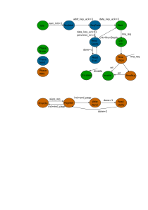
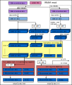
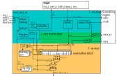
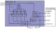

# Theory of Operation

## Block Diagram


## RRAM Controller Description

The RRAM controller is composed of two main sub-blocks: the **RRAM protocol controller** and the **RRAM physical controller** (`rram_phy`).
The protocol controller exposes the software register interface, manages FIFOs for read and write data, handles arbitration between the software and hardware interfaces, and enforces memory protection.
The physical controller sits below the protocol controller and manages the actual RRAM macro interface, including scrambling, ECC, and the read pipeline.

The RRAM controller consists of:

- **`rram_ctrl_core_reg_top`**: Auto-generated register block for all CSRs.
- **`rram_ctrl_arb`**: Arbitrates between software (FIFO path) and hardware (lcmgr / OTP) accesses to the protocol controller.
- **`rram_ctrl_mp`**: Memory protection engine; checks every controller-path access against the configured region/page rules.
- **`rram_ctrl_rd`**: Read engine; drives the controller read path and returns data to the software read FIFO.
- **`rram_ctrl_wr`**: Write engine; drains the software write FIFO and issues bursts to the physical controller.
- **`rram_ctrl_lcmgr`**: Life cycle manager FSM; handles initialization (key requests, seed reads) and RMA entry.
- **`rram_ctrl_otp`**: OTP hardware interface; forwards OTP read/write/zeroize commands directly to the physical controller, bypassing software protection.
- **`rram_phy`**: Physical controller; contains the read pipeline, write engine, read buffer, scrambler, and RRAM macro interface.


The RRAM physical controller (`rram_phy`) consists of:

- **`rram_phy_rd`**: Three-stage read pipeline; handles read-buffer lookup, RRAM reads, descrambling, and shadow-read verification.
- **`rram_phy_rd_buffer`**: Four-entry read buffer; caches descrambled RRAM words to avoid redundant RRAM accesses for sub-word reads.
- **`rram_phy_rd_buf_dep`**: Dependency tracker; maintains a per-entry reference count of queued responses that still depend on a given read-buffer entry, preventing that entry from being evicted while requests to it are still pending in the metadata FIFO.
- **`rram_phy_wr`**: Write engine FSM; assembles 32-bit bus words into 128-bit RRAM words and issues the RRAM write command.
- **`rram_scramble`**: XEX/PRINCE scrambling engine; shared between read and write paths via an internal arbiter.

## LCMGR Hardware Plug

`rram_ctrl_lcmgr` is a hardware FSM that handles all hardware-initiated RRAM transactions on behalf of the life cycle and key management subsystems. It owns two functions: initialization (key requests and seed reads) and RMA wipe. See [Initialization](#initialization) and [RMA Handling](#rma-handling) for detailed FSM descriptions.

The lcmgr hardware plug exposes three external interfaces:

- **OTP key interface**: Used to request address and data scrambling keys from the OTP controller during initialization.
- **Key manager interface**: Used to forward the creator and owner seed pages read from the info partition to the key manager.
- **Life cycle controller interface**: Used to receive RMA entry requests and to signal RMA completion (or failure) back to the life cycle controller.



## OTP Hardware Plug

`rram_ctrl_otp` is a dedicated hardware FSM that allows the OTP controller to issue commands to the reserved OTP region at the top of the RRAM data partition. This region is inaccessible to software; all accesses bypass scrambling and address-XOR.

| Command | Description |
|---|---|
| OtpRead | Read 64-bit OTP word and verify Hamming integrity |
| OtpWrite | Write 64-bit OTP word (RSW: bits can only be set) and update integrity word |
| OtpReadRaw | Read raw OTP data bypassing integrity check |
| OtpWriteRaw | Write raw OTP data bypassing integrity check |
| OtpZeroize | Zeroize the OTP partition |
| OtpInit | Initialize the OTP partition |

For `Read` and `Write` commands (not `ReadRaw`, `WriteRaw`, or `Zeroize`), `rram_ctrl_otp` maintains a separate integrity page within the OTP partition.
Every 64-bit data word has an associated Hamming ECC check value stored in this integrity page.
On a `Read`, `rram_ctrl_otp` first reads the stored integrity word (`StReadIntg`), then reads the data word (`StRead`), recomputes the expected integrity using a SECDED encoder, and compares the two in `StIntgCheck`.
If the stored and recomputed values differ, `MacroEccUncorrError` is returned to the OTP controller.
On a `Write`, after the data word is written back (`StWrite`), the integrity word in the integrity page is updated with the freshly computed ECC value (`StReqIntgWords` → `StIntgMod` → `StWriteIntg`).
`WriteRaw` and `ReadRaw` commands bypass this application-level integrity check entirely and operate directly on the raw RRAM contents.

The OTP interface operates across a clock domain boundary (`clk_otp_i` → `clk_i`); requests and responses are transferred via asynchronous FIFOs (`prim_fifo_async`).
Integrity violations detected on either side are routed back to the synchronous RRAM domain before being signalled as alerts.


## Memory Protection

Memory protection is enforced by the `rram_ctrl_mp` module.
Every access from the protocol controller is checked against protection rules before being forwarded to the physical controller.

**Requesters**

There are four possible requesters for controller-path accesses:

| Interface select | Requester |
|---|---|
| `SwSel` | Software (core TL-UL) |
| `HwOtpSel` | OTP hardware interface (`rram_ctrl_otp`) |
| `HwLcMgrSel` | Life cycle manager (`rram_ctrl_lcmgr`) |
| `HwLoopBack` | Internal loopback (always read+write) |

**Data partition**

Software accesses are matched against the 8 configurable MP regions (`MP_REGION_CFG_*`).
The region with the lowest index takes priority when regions overlap.
If no region matches, the access falls through to `DEFAULT_REGION`.

Hardware OTP and lcmgr accesses bypass the software-configured regions entirely; they are instead matched against compile-time fixed tables (`HwOtpDataCfg`, `HwLcMgrDataCfg`) that grant the minimum access required for each hardware phase.

**Information partition**

Each info page is independently protected by its `INFO_PAGE_CFG_*` register.
For lcmgr requests, per-page hardware configuration (`HwLcMgrInfoPageCfg`) is used instead.
Each hardware info-page rule also carries a `phase` field (e.g. `PhaseSeed`, `PhaseRma`), so access rights can differ between the seed-read phase and the RMA-wipe phase.

**Access attributes**

Each region or page carries the following access attributes:

| Attribute | Meaning |
|---|---|
| `en` | Region or page is active |
| `rd_en` | Reads permitted |
| `wr_en` | Writes permitted |
| `scramble_en` | Scrambling enabled |
| `ecc_en` | ECC enabled |
| `addr_xor_en` | Address-XOR enabled |

Any access that does not satisfy `rd_en` or `wr_en` for the requested operation is blocked; `ctrl_mp_err` is asserted and the transaction is rejected.

### Memory Protection for LCMGR Hardware Plug

While memory protection is largely under software control, certain behaviour is hardwired to support key manager secret partitions and life cycle functions.

Software can only control the accessibility of the creator secret seed page under the following conditions:
- Life cycle sets provision enable (`lc_seed_hw_rd_en` is asserted).
- OTP indicates the seeds are not locked.

Software can only control the accessibility of the owner secret seed page when:
- Life cycle sets provision enable.

During a life cycle RMA transition, software-configured memory protection for both data and information partitions is ignored.
Instead, the lcmgr FSM uses its own fixed-permission hardware rules that allow wiping the entire memory.

### Memory Protection for OTP Hardware Plug

The OTP hardware plug (`rram_ctrl_otp`) accesses only the OTP region — the top pages of the data partition address space.
It issues accesses under the `HwOtpSel` requester identity, which bypasses all software-configured MP regions and is instead matched against the compile-time fixed table `HwOtpDataCfg`.
This table grants `rd_en` and `wr_en` for the OTP region pages only; all other addresses are rejected.

All OTP region accesses use fixed protection attributes that are not software-configurable:

| Attribute | Value | Reason |
|---|---|---|
| `scramble_en` | `MuBi4False` | The scrambling keys are themselves stored in the OTP region; scrambling the region would require the keys to read the keys |
| `ecc_en` | `MuBi4True` | Vendor ECC is used to protect OTP region cells against single-bit errors |
| `addr_xor_en` | `MuBi4False` | After manufacturing the OTP region contains raw zeros; enabling address-XOR would cause reads to return non-zero values with incorrect bus integrity, producing spurious integrity faults before any write has occurred |

Software has no visibility into the OTP region and cannot modify these protection attributes.

### Accessing Information Partition

The information partition is not mapped into the host TL-UL window.
It can only be accessed via the controller path (software FIFO interface) or by the lcmgr hardware interface.

Software selects the information partition by setting the `CONTROL.PARTITION_SEL` field to `Info` before issuing a transaction.
The page index within the info partition is then specified as the address.

Accesses to the information partition are subject to per-page protection rules (`INFO_PAGE_CFG_*`).
Pages 5 and 6 (creator and owner seed pages) have life cycle-controlled overrides; see [Memory Protection for Key Manager and Life Cycle](#memory-protection-for-key-manager-and-life-cycle).

The OTP partition occupies the highest pages of the physical address space and is not accessible via either software interface.
It is accessible only via the dedicated `rram_ctrl_otp` hardware plug.
Accesses to the OTP partition always have `scramble_en = 0`, `ecc_en = 0`, and `addr_xor_en = 0`.

### Controller Write Resolution

The minimum write resolution is 128 bits (16 bytes) and every write operation must be aligned to 16 bytes.

It is possible to write less than the full RRAM word by reading the full RRAM word, modifying it, and writing it back (read-modify-write).
The controller does not perform this automatically; software is responsible for managing unaligned writes if required.

## RRAM Data Path

The `rram_phy` implements the write and read paths and interacts with the RRAM macro.
The write path is less security-critical than the read path, because a write can always be verified with a subsequent read-back.
The read path is critical because the Ibex core directly fetches instructions from the RRAM.

One important difference from the flash controller is the absence of space for additional metadata inside the RRAM cell array.
There is no room to store a separate per-word integrity value alongside the data.
To achieve equivalent security and to detect any bit flip during RRAM read operations, every read is performed twice; if the two results differ a fatal alert is raised.
See [RRAM Read Integrity](#rram-read-integrity) for details.

The following security measures are applied along both data paths:

| Measure | Description |
|---|---|
| ECC protection | Every RRAM word is extended with a SECDED ECC computed by the macro. Correctable errors are repaired transparently; uncorrectable errors trigger a fatal alert. |
| Scrambling | Data is scrambled before storage; plaintext is never written to the RRAM cells. |
| Integrity read (shadow read) | Every read is issued twice. The first result is returned to the requester; the second is compared in the background when the RRAM is idle. A mismatch raises a fatal alert. |
| Address infection (XOR) | Each 32-bit bus word is XOR'd with its bus byte address before packing into the 128-bit RRAM word. A word relocated by a fault attack produces an ECC mismatch and is detected. |
| Secure counters and FIFOs | `prim_count` (redundant) and `prim_fifo_sync` (with built-in integrity checking) are used throughout the data paths. |
| Periodic firmware checks | During long uptimes, firmware is expected to re-read and verify its own content to detect accumulated cell degradation. |
| Semi-automatic repair | When the ECC decoder corrects a single-bit error the `corr_err` interrupt fires, prompting software to rewrite the affected word and restore full ECC headroom before a triple error becomes uncorrectable. |
| ECC-protected read-buffer data | Each read-buffer entry stores four 32-bit bus words with their 7-bit bus integrity already appended (39 bits per word). The path from the read buffer to Ibex is end-to-end protected with no ECC recomputation along the way. |

### Write Data Path

RRAM write operations take multiple cycles, similar to flash erase operations.
Write throughput is not critical for OpenTitan, so the hardware optimises area over throughput.
The write data path is organised as follows:

1. Each of the four 32-bit bus words is XOR'd with its bus byte address (address infection).
2. The four infected words are packed into one 128-bit RRAM word.
3. The 128-bit word is scrambled by the shared scrambling module (`rram_scramble`).
4. The RRAM macro computes a SECDED ECC over the scrambled 128-bit word and appends it to the stored cell.
5. The full word (scrambled data + ECC) is written to the RRAM.


### Read Data Path

The RRAM read path is used by the Ibex processor and its prefetch buffer to fetch instructions, and also for software-initiated data reads.
Read latency directly impacts IPC, so the read path is optimised for performance while maintaining full data integrity.
The read data path is organised as follows:

1. The full RRAM word (scrambled data + ECC) is read from the macro.
2. The RRAM macro decodes the ECC; correctable single-bit errors are corrected in place.
3. The 128-bit scrambled word is descrambled by the shared scrambling module.
4. The descrambled 128-bit word is split into four 32-bit bus words.
5. The 7-bit bus integrity value is computed for each 32-bit word (over the address-infected, i.e. XOR'd, data — the address XOR is not yet removed at this stage).
6. The four `(32-bit XOR'd data || 7-bit bus integrity)` = 4 × 39-bit words are stored in the read buffer; the entry tag is set to `Valid`.

In parallel, an FSM selects a read-buffer entry with tag `Valid` and issues a second RRAM read (the shadow read) that repeats steps 1–5 and compares the result against the stored entry.
On a match the entry tag is advanced to `Verified`; on a mismatch the entry is invalidated and `rd_intg_err` is raised as a fatal alert.

Incoming read requests first perform a read-buffer lookup:

- **Hit**: The requested 39-bit slot (32-bit XOR'd data + 7-bit bus integrity) is returned directly from the read buffer. The address XOR is removed by `tlul_adapter_host` (host reads) or `rram_ctrl_rd` (controller reads) at the final output stage.
- **Miss**: A `Verified` or `Invalid` read-buffer entry is allocated for the new address and a new RRAM read is issued (steps 1–5 above). The data is forwarded to the requester and the entry is updated to `Valid` pending shadow-read verification.

If all read-buffer entries are in state `Alloc` or `Valid` (none `Verified` or `Invalid`), new read requests are stalled until the background shadow-read FSM promotes at least one entry to `Verified`.

The address XOR is removed as the final step at the output boundary — in `tlul_adapter_host` for host reads and in `rram_ctrl_rd` for software-initiated controller reads — so that the end-to-end bus integrity covers the address-infected data all the way to the point of consumption.



### Address-XOR (Address Infection)

Each 32-bit bus word is XOR'd with its full bus byte address before being packed into the 128-bit RRAM word for storage.
On read, the stored value is XOR'd with the same address to recover the original data.

The purpose is to bind each word to its location in memory.
If a fault injection attack physically relocates a word to a different address, the XOR inversion on readback will produce a corrupted value.
Because the corrupted value is fed into the SECDED ECC decoder, the relocation is detected as a data error rather than silently returning a wrong but plausible value.

The XOR is applied and removed at well-defined boundaries:

- **Write**: applied per bus word in the write data path before scrambling and packing.
- **Read**: the stored XOR'd value is carried through the read pipeline and read buffer intact; the XOR is removed only at the final output stage — in `tlul_adapter_host` for host reads and in `rram_ctrl_rd` for software-initiated controller reads — so that end-to-end bus integrity covers the address-infected data up to the point of consumption.

Address-XOR is disabled (`addr_xor_en = MuBi4False`) for the OTP region.
See [Memory Protection for OTP Hardware Plug](#memory-protection-for-otp-hardware-plug) for the rationale.

### RRAM Read Integrity

The physical read engine performs a shadow read: every read operation is issued twice to the macro, and the two results are compared.
If the two reads return different data, it indicates the data was manipulated during the read process (e.g. by a fault injection attack), and `rd_intg_err` is raised as a fatal alert.
The read buffer retains `addr`, `part`, `descramble_en`, `ecc_en`, and `addr_xor_en` specifically to allow the shadow read to replay the identical request.

### RRAM ECC Error Handling

Each RRAM word stored in the macro is protected by an ECC and is per-page configurable via the `ecc_en` attribute.

#### Single-Bit Error (Correctable)

Correctable single-bit errors are transparently corrected by the macro ECC decoder. The `corr_err` interrupt fires and the address of the corrected error is captured in [`CORR_ERR_LOC`](registers.md#corr_err_loc). The error counter is incremented in [`CORR_ERR_CNT`](registers.md#corr_err_cnt). A corrected error does not abort the in-progress operation; the corrected data is returned normally. Software should respond to `corr_err` by issuing a `Rewrite` operation on the affected address to restore full ECC headroom before a second or triple error becomes uncorrectable.

#### Multi-Bit Error (Uncorrectable)

Uncorrectable multi-bit errors trigger `ecc_fatal_err`, which results in a fatal fault. The macro marks the data as uncorrectable; the ECC decoder cannot recover the original data. A fatal alert is raised and RRAM access is disabled.

## Functionality

### Initialization

Initialization proceeds in two distinct stages before software can issue RRAM operations.

**Stage 1 — Physical controller ready (`phy_init_done`)**

After reset, the RRAM macro completes its own self-initialization and asserts `init_done` on the macro response interface.
The physical controller (`rram_phy`) latches this into `phy_init_done` and exposes it as `PHY_STATUS.init_done`.
The arbiter (`rram_ctrl_arb`) starts in `StReset` and transitions to `StIdle` only when `phy_init_done` is asserted.
Until this point, no accesses to the RRAM — including hardware interfaces — are possible.

**Stage 2 — lcmgr initialization (`ctrl_init_done`)**

After the physical controller is ready, software must write `1` to [`INIT.VAL`](../data/rram_ctrl.hjson#init) to start the lcmgr initialization sequence.
The lcmgr requests scrambling keys from OTP and, if provisioning is enabled, reads the creator and owner seed pages.
When complete, `lcmgr_init_done` and `lcmgr_keys_valid` are both asserted.
The arbiter gates all software-initiated operations on `ctrl_init_done = lcmgr_init_done & lcmgr_keys_valid`; no software read or write can proceed before this.

Software should poll [`STATUS.init_done`](../data/rram_ctrl.hjson#status) and wait until it reads 1 before issuing any RRAM operation.

The lcmgr initialization sequence proceeds as follows:

1. **StIdle**: The FSM waits here after reset.
   Initialization begins when software writes [`INIT.VAL`](../data/rram_ctrl.hjson#init).
   If an RMA request (`rma_req`) arrives while idle, the FSM skips initialization and goes directly to `StRmaWipe`.

2. **StReqAddrKey**: The FSM requests the address scrambling key from the OTP controller via a synchronous req/ack handshake.
   The req/ack is synchronized across the `clk_otp` boundary using `prim_sync_reqack`.
   If an RMA request arrives in this state, the FSM again skips to `StRmaWipe`.

3. **StReqDataKey**: The FSM requests the data scrambling key from OTP in the same way.
   After both keys are acknowledged, `keys_valid` is asserted.
   The FSM proceeds to `StReadSeeds` if the life cycle controller has set `lc_seed_hw_rd_en` (i.e. provisioning is enabled), or to `StWait` otherwise.

4. **StReadSeeds / StReadEval**: The FSM reads the creator-seed page and the owner-seed page from the info partition and forwards them to the key manager.
   Each seed (`SeedWidth = 256` bits, read as `SeedReads = 8` bus words) is read twice for validation.
   On the first pass, the raw seed words are stored in flip-flops.
   On the second pass (`validate_q` set), each incoming word is AND'd with the previously stored value; a discrepancy indicates a fault or media error and sets `seed_err`.
   `StReadEval` advances the seed counter after each page is fully verified.

5. **StWait**: Both keys are valid and any seed reads are complete.
   `init_done` is asserted.
   The FSM waits here until an RMA request arrives.

6. **StEntropyReseed → StRmaWipe**: On RMA entry the LFSR is reseeded from the entropy source before wiping begins.


### RMA Handling

When an RMA entry request is received from the life cycle manager, the RRAM controller waits for any pending RRAM transaction to complete, then switches priority to the hardware interface.
The RRAM controller then initiates the RMA entry process and notifies the life cycle controller when it is complete.
The RMA entry process wipes out all data, creator, owner and isolated partitions.

RMA wiping is carried out by a second FSM (`rma_state`) within `rram_ctrl_lcmgr`.
This inner FSM iterates over the entries in `RmaWipeEntries` — a compile-time table covering the creator, owner and isolated info pages followed by the full data partition.
For each entry the inner FSM:

1. **StRmaPageSel**: Selects the base and end page for the current wipe region.
2. **StRmaWrite / StRmaWriteWait**: Issues writes of LFSR-generated random data to every word of the page. The LFSR advances on every write beat.
3. **StRmaRdVerify / StRmaRdCheck**: Reads back each written word and checks it against the expected random value. A mismatch sets an error flag.

After all entries are wiped the outer FSM enters `StRmaRsp`, which asserts `rma_dis_access_o = On` to disable all further RRAM access and drives `rma_ack` with the error-free status.
If any wipe or verify step encountered an error, the FSM transitions to `StInvalid` instead, which continuously asserts `rma_dis_access_o = On` and keeps `rma_ack` deasserted.

After RMA completes, the RRAM controller is [disabled](#rram-escalation--disable).
When disabled the RRAM controller registers can still be accessed but the memory macro cannot be written or read anymore.
It is expected that after an RMA transition, the entire system will be rebooted.

### Host Read

A host read arrives on the `host_tl` TL-UL port and is translated to a bus address by the TL-UL adapter.
The memory-protection module (`rram_ctrl_mp`) checks whether the host is permitted to read the target address.
If permitted, the request is forwarded to the physical controller (`rram_phy`) with the appropriate `scramble_en` and `ecc_en` attributes.

Inside `rram_phy`, the `prim_arbiter_tree_dup` arbiter may delay the host request if a controller write is in progress.
Once granted, the request enters the three-stage `rram_phy_rd` read pipeline.
On a read-buffer hit the data is returned in one cycle; on a miss the pipeline waits for the macro, descrambles the 128-bit word, and returns the requested 32-bit bus word.

The response (with bus integrity bits) is driven back to the TL-UL host adapter and returned to the host.

### Controller Read

A controller read is initiated by software writing to `CONTROL` with `OP = Read` and asserting `START`.
The read engine (`rram_ctrl_rd`) issues a sequence of read requests to the physical controller via `rram_ctrl_mp`, one bus word at a time.
Returned data words are pushed into the software read FIFO, where software can drain them via the `RD_DATA` register.

The `rd_lvl` and `rd_full` interrupts notify software when the FIFO has accumulated enough data or is full.
The `op_done` interrupt fires when the entire requested transaction has completed.



### Controller Write

A controller write is initiated by software first filling the write FIFO via the `PROG_DATA` register, then writing to `CONTROL` with `OP = Program` and asserting `START`.
The write engine (`rram_ctrl_wr`) drains the write FIFO in bursts of up to `MaxWrWords = 32` bus words.

Each burst must be aligned to an RRAM word boundary (16 bytes).
The physical write engine in `rram_phy_wr` assembles the 32-bit bus words into 128-bit RRAM words before issuing the RRAM write command.

After each RRAM word is written, the write engine optionally performs a verification read (described in [RRAM Read Integrity](#rram-read-integrity)).
Write FIFO drain interrupts (`wr_empty`, `wr_lvl`) notify software when more data can be loaded.
The `op_done` interrupt fires when the full programmed transaction completes.


### RRAM Code Execution Handling

RRAM can be used to store both data and code.
To support separate access privileges between data and code, the RRAM controller provides the [`EXEC`](registers.md#exec) register for software control.

If software programs [`EXEC`](registers.md#exec) to `0xa26a38f7`, instruction fetches from RRAM via the host TL-UL interface are permitted.
If software programs [`EXEC`](registers.md#exec) to any other value, instruction fetches result in an error.

The RRAM controller distinguishes code and data transactions through the [instruction type attribute](../../../ip/lc_ctrl/README.md#usage-of-user-bits) of the TL-UL interface.

### Idle Indication to External Power Manager

The RRAM controller provides an idle indication to an external power manager (`pwrmgr`).
This idle indication does not mean the controller is doing nothing, but rather that it is not performing any stateful operation such as a write.

This distinction matters because an external power-manager event (for example shutting off power to the RRAM domain) during an in-progress write could corrupt the RRAM cell being written.

### RRAM Errors and Faults

The RRAM controller maintains three categories of observed errors and faults.

In general, **errors** are considered recoverable and are primarily associated with problems that could have been caused by software or that occurred during a software-initiated operation.
Errors can be found in [`ERR_CODE`](registers.md#err_code).

**Faults** represent error events that are unlikely to have been caused by software and represent a major malfunction.
Faults are further divided into two categories:

- **Standard faults**: errors in standard structures such as sparsely-encoded FSMs, duplicated counters, and the bus transmission-integrity scheme.
- **Custom faults**: errors generated by the life cycle management interface, the RRAM storage integrity interface, or the RRAM macro itself.

See [RRAM Escalation & Disable](#rram-escalation--disable) for further differentiation between standard and custom faults.

#### Transmission Integrity Faults

The RRAM controller has multiple interfaces for access; transmission integrity failures can manifest differently on each.

There are four interfaces:

- Host direct access to the RRAM controller register files.
- Host / software initiated access to RRAM macro (read / write via FIFOs).
- Life cycle management interface / hardware initiated access to RRAM macro.
- OTP hardware interface access to RRAM macro.

##### Host Direct Access to RRAM Controller Register Files

TL-UL transactions on the `core_tl` port carry bus integrity bits.
If the integrity check on a register access fails, `fatal_std_err` is asserted.
This is a standard fault and the alert is immediately triggered.

##### Host / Software Initiated Access to RRAM Macro

Read data returned from the RRAM macro carries bus integrity bits through the read pipeline.
If integrity checking on data returned to the host via `host_tl` fails, `fatal_err` is triggered.

Write data from the software FIFO also carries integrity bits; if a mismatch is detected during the write path, `wr_intg_err` is asserted and a fatal fault is raised.

##### Life Cycle Management Interface / Hardware Initiated Access to RRAM Macro

Seed data read from the info partition during initialization passes through the same integrity check in `rram_ctrl_lcmgr`.
`tlul_data_integ_dec` is instantiated to verify the integrity of each 32-bit seed word as it arrives.
If `data_err` is asserted for any seed word, `data_invalid` is latched and remains set until the next reset.
This prevents silently using a corrupt seed for key derivation.

##### OTP Hardware Interface Access to RRAM Macro

Read data returned from the RRAM read pipeline carries bus integrity bits.
`rram_ctrl_otp` instantiates `tlul_data_integ_dec` to check each bus word as it arrives.
If `data_err` fires, the `data_invalid` flag is latched (sticky until reset) and `intg_err_o` is asserted, causing a fatal fault.
When a bus-integrity error is detected on a word being accumulated into the RRAM word buffer, that word is poisoned to all-ones (`'1`) rather than being silently stored.

Write data is protected in the other direction as well: `rram_ctrl_otp` instantiates `tlul_data_integ_enc` (`u_bus_intg`) to add bus integrity bits to every word written to the RRAM, maintaining end-to-end integrity on the write path.

Each OTP word is protected with an additional integrity value, see [OTP Hardware Plug](#otp-hardware-plug) for the OTP integrity description.

#### Scrambling Consistency

The RRAM macro stores only raw data bits; it does not record whether a given location was written with scrambling enabled or disabled.
It is therefore the responsibility of software to ensure the `scramble_en` attribute for a page is consistent across all reads and writes to that page.
Writing a page with `scramble_en = true` and subsequently reading it with `scramble_en = false` (or vice versa) will produce garbage data without any error indication, because the physical layer has no way to detect the mismatch.

The read buffer holds descrambled data.
When a write invalidates a read-buffer entry (matched by page address and partition), the buffer entry is flushed.
This ensures that subsequent reads re-fetch and re-descramble from the updated macro contents, maintaining consistency between the scrambling engine state and the cached data.

### RRAM Escalation & Disable

RRAM has two sources of escalation — global and local.

**Global escalation** arrives via the alert handler's escalation interface.
On receipt of a global escalation, the RRAM controller disables all further RRAM accesses and asserts `rram_disable`.
The physical controller (`rram_phy`) observes the same `rram_disable` bus and suppresses all new host and controller requests.

**Local escalation** is triggered when the `rram_ctrl_lcmgr` FSM or any physical-controller sub-FSM detects an invalid or unreachable state (`state_err`).
This causes an immediate transition to the invalid terminal state, which continuously asserts `rram_dis_access_o` and raises `fatal_err`.

Once either source disables RRAM access, the only way to restore normal operation is a full reset.

When RRAM access is disabled (either via escalation, RMA completion, or explicit life cycle transition), the `rram_disable` bus is asserted.
The physical controller observes this with `prim_mubi4_sync` and suppresses all new read and write requests in `rram_phy`:

- Host requests are blocked at `host_req = host_req_i & ... & mubi4_test_false_strict(rram_disable[HostDisableIdx])`.
- Controller requests are blocked at `ctrl_req = ctrl_req_i & ... & mubi4_test_false_strict(rram_disable[CtrlDisableIdx])`.

The scrambling engine also uses a separate disable copy (`ScrambleKeyDisableIdx`) to swap out the real scrambling keys for random values when disabled, preventing the real keys from being observable or usable after disable.

RRAM controller registers remain accessible after disable to allow software to read status and error information.

## RRAM Default Configuration

On reset, all MP regions are disabled (`en = MuBi4False`).
The `DEFAULT_REGION` register provides the fallback attributes for any data-partition access that matches no active region.
By default, `DEFAULT_REGION` is configured with read and write enabled but scrambling and ECC disabled; software should reconfigure this to match the intended security policy for the design.

Info pages default to disabled; each page's `INFO_PAGE_CFG_*` register must be explicitly programmed by software or firmware before that page can be accessed.

The scrambling keys are populated by the lcmgr during initialization.
Until initialization completes, random placeholder keys are used.


## Design Details

### RRAM Read Pipeline

Two independent requesters can issue reads to the physical controller: the host TL-UL interface and the protocol controller.
Writes can only be issued by the protocol controller.

An arbiter arbitrates between host read requests and controller read/write requests.
The host is suppressed under any of the following conditions:

- A controller write is pending or a write operation is in progress (`ctrl_wr_pending || wr_busy`).
- The host interface has been disabled (`rram_disable[HostDisableIdx]`).
- Physical controller initialization is not yet complete (`!phy_init_done`).

The controller is similarly suppressed if a controller operation is already in flight or if it has been disabled.

After arbitration, a metadata FIFO (`u_meta_fifo`) records whether each accepted read request came from the host or the controller.
This allows the correct response signal (`host_rd_done_o` or `ctrl_rd_done_o`) to be asserted when the read pipeline completes the request.

The physical controller tracks one outstanding controller read and one outstanding controller write with `ctrl_rd_pending` and `ctrl_wr_pending` flags.
A new controller request cannot be issued until the in-flight one completes, providing a simple one-at-a-time ordering guarantee for the protocol controller.

Host reads are not subject to the single-outstanding-request restriction; up to `NumOutstandingRdReq` (2) host reads may be in flight simultaneously through the read pipeline.

The `rram_phy_rd` module implements a three-stage pipeline:

| Stage | Operation |
|---|---|
| 1 | Read-buffer lookup; if miss, issue RRAM read request and allocate read-buffer entry |
| 2 | Descramble the RRAM word (PRINCE) if `descramble_en`; apply address-XOR inversion |
| 3 | Update the read-buffer entry with the descrambled data; return the appropriate bus word to the requester |

On a read-buffer hit the latency is one cycle (the data is available immediately from the buffer in stage 1, bypassing the RRAM access and descrambling stages).

On a read-buffer miss the pipeline must wait for the macro to return the full 128-bit word, descramble it, and then return the appropriate 32-bit bus word.

A metadata FIFO (`meta_fifo`) and a result FIFO (`rd_fifo`) track in-flight read requests and their associated descrambled results through the pipeline.
A mask FIFO tracks the expected plaintext pattern used for the verification read.

#### RRAM Read Buffer

The read buffer (`rram_phy_rd_buffer`) holds `NumRdBuf = 4` entries.
Each entry caches one full descrambled RRAM word and the metadata needed to service subsequent hits and verify shadow-read results.

Each entry contains the following fields (`rd_buf_t`):

| Field | Width | Description |
|---|---|---|
| `data` | 4 × 39 bits | Four descrambled 32-bit bus words, each with 7 bits of TL-UL bus integrity appended (32 + 7 = 39 bits per word) |
| `addr` | `AddrW` bits | Physical RRAM word address (page index concatenated with word-within-page index) |
| `part` | 2 bits | Partition tag: Data / Info / OTP |
| `descramble_en` | 1 bit | Whether the cached data was descrambled when stored |
| `ecc_en` | 1 bit | Whether ECC was enabled for this entry |
| `addr_xor_en` | 1 bit | Whether address-XOR was applied |
| `attr` | 2 bits | Entry state: Invalid / Alloc / Valid / Verified |
| `err` | 1 bit | ECC error flag for the cached word |

An entry progresses through states: `Invalid` → `Alloc` (address reserved, data not yet arrived) → `Valid` (data stored after first RRAM read) → `Verified` (shadow read matched; entry is trusted for future hits).
If the shadow read does not match the `Valid` entry, the entry is invalidated and `rd_intg_err` is raised.
The fields `addr`, `part`, `descramble_en`, `ecc_en`, and `addr_xor_en` are retained in the entry specifically to replay the identical request for the shadow read - the second RRAM access must use the same address and the same pipeline configuration as the first.

When the write engine writes to the RRAM macro, it notifies the read module via `wr_req_i`, `wr_page_addr_i`, and `wr_part_i`.
Any read-buffer entry matching the written page is invalidated, so subsequent reads will re-fetch from the macro.

The read buffer is not accessible to software and has no software-visible configuration.

### RRAM Write Data Path

The write engine (`rram_ctrl_wr`) drains the software write FIFO in bursts of up to `MaxWrWords = 32` bus words. Each burst must be aligned to an RRAM word boundary (16 bytes). The physical write engine in `rram_phy_wr` assembles 32-bit bus words into 128-bit RRAM words before issuing the RRAM write command. Write FIFO drain interrupts (`wr_empty`, `wr_lvl`) notify software when more data can be loaded. The `op_done` interrupt fires when the full programmed transaction completes.



### RRAM Scrambling

RRAM scrambling uses an XEX (Xor-Encrypt-Xor) construction based on two interleaved 64-bit PRINCE cipher instances operating on the full 128-bit RRAM word.

The tweak is derived from the word address:

```
addr_tweak = GF_MULT(word_addr, addr_key)
```

Encryption on write:

```
ciphertext = PRINCE(addr_tweak XOR plaintext, data_key) XOR addr_tweak
```

Decryption on read:

```
plaintext = PRINCE(addr_tweak XOR ciphertext, data_key) XOR addr_tweak
```

The `rram_scramble` module is shared between the read and write paths using an internal arbiter.
Read and write descramble/scramble requests are queued and served in order; the scrambling operation for a 128-bit word takes multiple clock cycles.


**Key management within the scrambler**

The scrambler holds a latched copy of `addr_key` and `data_key`.
Before `keys_valid` is asserted (i.e. before initialization completes), random placeholder keys (`rand_addr_key`, `rand_data_key`) are used instead.
If RRAM access is disabled (`keys_disable = MuBi4True`), the scrambler switches back to the random placeholder keys, preventing the real sideloaded keys from being used or observed after disable.

Scrambling is per-page configurable via the `scramble_en` attribute in each protection region or info-page configuration.
Pages with `scramble_en = MuBi4False` are stored unscrambled.
