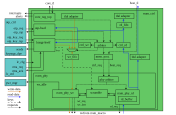
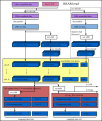
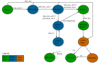
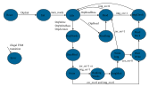
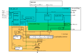
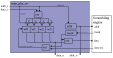

# Theory of Operation

## Block Diagram

The following block diagram shows the RRAM controller and the blocks it interacts with (`otp_ctrl`, `keymgr`, `lc_ctrl`, `pwr_mgr`).



## RRAM Controller Description

The RRAM controller (`rram_ctrl`) exposes the software register interface, manages FIFOs for read and write data, handles arbitration between the software and hardware interfaces, and enforces memory protection.
It instantiates the RRAM phy (`rram_phy`) as a sub-entity, which manages the actual RRAM macro interface, including scrambling and the read pipeline.

The RRAM controller consists of:

- **`rram_ctrl_core_reg_top`**: Auto-generated register block for all CSRs.
- **`rram_ctrl_arb`**: Arbitrates between software (FIFO path) and hardware (lcmgr / OTP) accesses to the shared read/write/memory-protection modules.
- **`rram_ctrl_mp`**: Memory protection engine that checks every controller-path access against the configured region/page rules.
- **`rram_ctrl_rd`**: Read engine that drives the controller read path and returns data to the software read FIFO.
- **`rram_ctrl_wr`**: Write engine that drains the software write FIFO and issues bursts to `rram_phy`.
- **`rram_ctrl_lcmgr`**: Life cycle manager FSM that handles initialization (key requests, seed reads) and RMA entry.
- **`rram_ctrl_otp`**: OTP hardware interface that forwards OTP read/write/zeroize commands directly to `rram_phy`, bypassing software-configured memory protection (MP).


The RRAM phy (**`rram_phy`**) consists of:

- **`rram_phy_rd`**: Read pipeline that handles read-buffer lookup, RRAM reads, descrambling, and shadow-read verification.
- **`rram_phy_rd_buffer`**: Four-entry read buffer that caches descrambled RRAM words to avoid redundant RRAM accesses for sub-word reads.
- **`rram_phy_rd_buf_dep`**: Dependency tracker that maintains a per-entry reference count of queued responses that still depend on a given read-buffer entry, preventing that entry from being evicted while requests to it are still pending in the metadata FIFO.
- **`rram_phy_wr`**: Write engine FSM that assembles 32-bit bus words into 128-bit RRAM words and issues the RRAM write command.
- **`rram_scramble`**: XEX/PRINCE scrambling engine, shared between read and write paths via an internal arbiter.

## RRAM Data Path

The `rram_phy` implements the write and read paths and interacts with the RRAM macro.
The write path is less security-critical than the read path, because a write can always be verified with a subsequent read-back.
The read path is critical because the processor core directly fetches instructions from the RRAM.

Host reads arrive on the `host_tl` TL-UL port and are converted into a memory address by dropping the system base address.
This address is then forwarded to `rram_phy`.
The response, with bus integrity bits, is driven back through the same adapter.
See [Memory Protection](#memory-protection) for the host-specific permission check, [RRAM Phy](#rram-phy) for the arbitration, and [RRAM Read Pipeline](#rram-read-pipeline) for the pipeline mechanics.

Unlike flash, RRAM does not support a per-word integrity check value (ICV) stored alongside the data.
Instead, it achieves equivalent security by performing every read twice and comparing the two results.
If they differ, a fatal alert is raised.
See [RRAM Read Integrity](#rram-read-integrity) for details.

The following security measures are applied along both data paths:

| Measure | Description |
|---|---|
| ECC protection | Every RRAM word is extended with an ECC computed by the macro. Correctable errors are repaired transparently. Uncorrectable errors trigger a fatal alert. |
| Scrambling | Data is scrambled before storage unless scrambling is disabled for the region or info page. |
| Integrity read (shadow read) | Every read is issued twice. The first result is returned to the requester. The second is compared in the background when the RRAM is idle. A mismatch raises a fatal alert. |
| Address infection (XOR) | Each 32-bit bus word is XORed with its bus-word address before packing into the 128-bit RRAM word. A word relocated by a fault attack produces an ECC mismatch and is detected. |
| Secure counters and FIFOs | `prim_count` (redundant) and `prim_fifo_sync` (with built-in integrity checking) are used throughout the data paths. |
| Semi-automatic repair | When the ECC decoder corrects a single-bit error the `corr_err` interrupt fires, prompting software to rewrite the affected word and restore full ECC headroom before a triple error becomes uncorrectable. |
| ECC-protected read-buffer data | Each read-buffer entry stores four 32-bit bus words with their 7-bit bus integrity already appended (39 bits per word). The path from the read buffer to Ibex is end-to-end protected with no ECC recomputation along the way. |

### Write Data Path

RRAM write operations take multiple cycles, similar to flash erase operations.
Write throughput is not critical for OpenTitan, so area was prioritised over throughput in the design.
Only full 128-bit RRAM words can be written.
The write data path is organised as follows:

1. Each of the four 32-bit bus words is checked for bus-transmission integrity, then XORed with its bus-word address (address infection).
   A failed integrity check zero-fills the word before the XOR, rather than aborting the write.
2. The four infected words are packed into one 128-bit RRAM word.
3. The 128-bit word is scrambled by the shared scrambling module (`rram_scramble`).
4. The RRAM macro computes an ECC over the scrambled 128-bit word.
5. The full word (scrambled data + ECC) is written to the RRAM.


### Read Data Path

The RRAM read path is used by the Ibex processor, its prefetch buffer, and its icache to fetch instructions, and also for software-initiated data reads.
Read latency directly impacts IPC (Instructions per cycle), so the read path is optimised for performance while maintaining full data integrity.

Every read first checks the read buffer.
If the requested data is already present, it is returned immediately.
Otherwise, a read to the RRAM is triggered, composed of the following steps:

1. The full RRAM word (scrambled data + ECC) is read from the macro.
2. The RRAM macro decodes the ECC.
   Correctable single-bit errors are corrected in place.
3. The 128-bit scrambled word is descrambled by the shared scrambling module.
4. The descrambled 128-bit word is split into four 32-bit bus words.
5. The 7-bit bus integrity value is computed for each 32-bit word.
   For this computation only, the previously inserted address XOR is temporarily removed.
   The stored/output word itself keeps the address XOR.
6. The four 39-bit words (data + integrity) are stored in the read buffer and the entry tag is set to `Valid`.

The data is then returned and the address XOR is removed as the final step at the output boundary (in `tlul_adapter_host` for host reads and in `rram_ctrl_rd` for software-initiated controller reads), so that the end-to-end bus integrity covers the address-infected data all the way to the point of consumption.

See [RRAM Read Pipeline](#rram-read-pipeline) for the read-buffer hit/miss handling, shadow-read verification, and buffer entry state machine.



### Address-XOR (Address Infection)

Each 32-bit bus word is XORed with its full bus-word address before being packed into the 128-bit RRAM word for storage.
On read, the stored value is XORed with the same address to recover the original data.

The purpose is to bind each word to its location in memory.
If a fault injection attack physically relocates a word to a different address, the XOR inversion on readback will produce a corrupted value.
Because the corrupted value is fed into the ECC decoder, the relocation is detected as a data error rather than silently returning a wrong but plausible value.

The XOR is applied and removed at well-defined boundaries:

- **Write**: applied per bus word in the write data path before scrambling and packing.
- **Read**: the stored XORed value remains intact through the read pipeline and read buffer.
  The XOR is removed only at the final output stage (in `tlul_adapter_host` for host reads and in `rram_ctrl_rd` for software-initiated controller reads), so that end-to-end bus integrity covers the address-infected data up to the point of consumption.

Address-XOR is disabled (`addr_xor_en = MuBi4False`) for the OTP region.
See [Memory Protection for OTP Hardware Plug](#memory-protection-for-otp-hardware-plug) for the rationale.

### RRAM Read Integrity

The physical read engine performs a shadow read: every read operation is issued twice to the macro, and the two results are compared.
If the two reads return different data, it indicates the data was manipulated during the read process (e.g. by a fault injection attack), and `rd_intg_err` is raised as a fatal alert.
The read buffer retains `addr`, `part`, `descramble_en`, `ecc_en`, and `addr_xor_en` specifically to allow the shadow read to replay an identical request.
The verify operation additionally switches which of the two interleaved PRINCE cipher instances descrambles the data, so the shadow read also catches faults specific to one cipher instance.
See [RRAM Scrambling](#rram-scrambling) for details.

### RRAM ECC Error Handling

Each RRAM word stored in the macro is protected by an ECC and is per-page configurable via the `ecc_en` attribute.

#### Single-Bit Error (Correctable)

When there is a single-bit error, the macro ECC decoder transparently corrects it, the `corr_err` interrupt fires, and the address of the corrected error is captured in [`CORR_ERR_LOC`](registers.md#corr_err_loc).
The error counter is incremented in [`CORR_ERR_CNT`](registers.md#corr_err_cnt).
`corr_err`/`CORR_ERR_LOC`/`CORR_ERR_CNT` are not yet wired up in `rram_phy` (tracked in [earlgrey-internal-tracker#388](https://github.com/lowRISC/earlgrey-internal-tracker/issues/388)).
A corrected error does not abort the in-progress operation.
The corrected data is returned normally.
Software should respond to `corr_err` by issuing a `Rewrite` operation on the affected address to restore full ECC headroom before a double or triple error becomes uncorrectable.

#### Multi-Bit Error (Uncorrectable)

Uncorrectable multi-bit errors trigger `ecc_fatal_err`, which results in a fatal alert.
The macro marks the data as uncorrectable, and the ECC decoder cannot recover the original data.
A fatal alert is always raised, but this fault (`FAULT_STATUS.phy_relbl_err`) only disables RRAM access once [`DIS.RELBL_ERR_FATAL`](registers.md#dis--relbl_err_fatal) has been set to any value other than `MuBi4False`, its reset default.
Since `DIS.RELBL_ERR_FATAL` is `rw1s`, once set it cannot be reverted by software.

## LCMGR Hardware Plug

`rram_ctrl_lcmgr` is a hardware FSM that handles all hardware-initiated RRAM transactions on behalf of the life cycle and key management subsystems.
Despite the similar name, `rram_ctrl_lcmgr` (referred to here as the life cycle manager) is a submodule of `rram_ctrl`, distinct from the life cycle controller (`lc_ctrl`), the external IP it interacts with.
It owns two functions: initialization (key requests and seed reads) and RMA wipe.

The lcmgr hardware plug exposes three external interfaces:

- **OTP key interface**: Used to request address and data scrambling keys from the OTP controller during initialization.
- **Key manager interface**: Used to forward the creator and owner seeds from the info partition to the key manager.
- **Life cycle controller interface**: Used to receive RMA entry requests and to signal RMA completion (or failure) back to the life cycle controller.

### Initialization

Initialization proceeds in two distinct stages before software can issue RRAM operations.

#### Stage 1 - RRAM phy ready (`phy_init_done`)

After reset, the RRAM macro self-initializes and asserts `init_done`, which `rram_phy` latches into `phy_init_done` (exposed as `PHY_STATUS.init_done`).
The arbiter (`rram_ctrl_arb`) moves from `StReset` to `StIdle` only once `phy_init_done` is asserted.
Until then, no RRAM accesses (including hardware interfaces) are possible.

#### Stage 2 - lcmgr initialization

Software writes `1` to `INIT.VAL` to start the lcmgr initialization sequence, which requests scrambling keys from OTP and, if the device is already provisioned, reads the creator and owner seeds.
The arbiter gates all software-initiated operations until both `lcmgr_init_done` and `lcmgr_keys_valid` are asserted, which happens once this completes.
`lcmgr_init_done` and `lcmgr_keys_valid` are observable in [`STATUS.init_done`](registers.md#status) and [`STATUS.keys_valid`](registers.md#status) respectively.
See [Controller initialization](programmers_guide.md#controller-initialization---trigger-controller-initialization) in the programmer's guide for the software-facing procedure.

Software should poll [`STATUS.init_done`](registers.md#status) and wait until it reads 1 before issuing any RRAM operation.

The lcmgr initialization sequence proceeds as follows.

1. **StIdle**: The FSM waits here after reset.
   Initialization begins when software writes [`INIT.VAL`](registers.md#init).
   If an RMA request (`rma_req`) arrives while idle, the FSM skips initialization and goes directly to `StRmaWipe`.

2. **StReqAddrKey**: The FSM requests the address scrambling key from the OTP controller via a synchronous req/ack handshake.
   The req/ack is synchronized across the `clk_otp` boundary using `prim_sync_reqack`.
   If an RMA request arrives in this state, the FSM skips to `StRmaWipe`.

3. **StReqDataKey**: The FSM requests the data scrambling key from OTP in the same way.
   After both keys are acknowledged, `keys_valid` is asserted, observable in [`STATUS.keys_valid`](registers.md#status).
   The FSM proceeds to `StReadSeeds` if the life cycle controller has set `lc_seed_hw_rd_en` (i.e. the device is already provisioned), or to `StWait` otherwise.
   If an RMA request arrives in this state, the FSM skips to `StRmaWipe`, the same as in the previous state.

4. **StReadSeeds / StReadEval**: The FSM reads the creator-seed page (`CreatorInfoPage`) and the owner-seed page (`OwnerInfoPage`) from the info partition and forwards them to the key manager.
   Each seed (`SeedWidth = 256` bits, read as `SeedReads = 8` bus words) is read twice for validation.
   On the first pass, the raw seed words are stored in flip-flops.
   On the second pass (`validate_q` set), each incoming word is AND'd with the previously stored value.
   A discrepancy indicates a fault or media error and sets `seed_err`.
   `StReadEval` advances the seed counter after each page is fully verified.
   See the partition's [life cycle](../../../ip/lc_ctrl/doc/theory_of_operation.md#creator_seed_sw_rw_en-and-owner_seed_sw_rw_en) for more details on when it is allowed to be populated.

5. **StWait**: Both keys are valid and any seed reads are complete.
   `init_done` is asserted.
   The FSM waits here until an RMA request arrives.

6. **StEntropyReseed -> StRmaWipe**: On RMA entry the LFSR is reseeded with the `rma_seed_i` value supplied by the life cycle controller before wiping begins.

All state transitions of the main FSM are depicted in the FSM diagram below.


If an RMA request is received, the main FSM triggers another FSM to wipe out predefined pages.
See [RMA Handling](#rma-handling) below for details.

### RMA Handling

When an RMA entry request is received from the life cycle controller, the RRAM controller waits for any pending RRAM transaction to complete, then switches priority to the hardware interface.
The RRAM controller then initiates the RMA entry process and notifies the life cycle controller when it is complete.
The RMA entry process wipes the creator, owner and isolated info pages, and the non-OTP portion of the data partition, by overwriting them with pseudo-random values generated by a 64-bit LFSR.

RMA wiping is carried out by a second FSM (`rma_state`) within `rram_ctrl_lcmgr`.
This inner FSM iterates over the entries in table `RmaWipeEntries`.
That table is supplied by a global parameter defined in `rram_ctrl_pkg` with the following contents:

| Partition | Pages | Description |
|---|---|---|
| Info | 5 | `CreatorInfoPage` |
| Info | 6 | `OwnerInfoPage` |
| Info | 7 | `IsolatedInfoPage` |
| Data | 0-4090 | All non-OTP data pages |

Info pages other than the creator/owner/isolated pages, and the OTP region (the top `OtpPages` data pages), are not wiped by this table.
See [Address Map](../README.md#address-map) for the full page layout.
For each entry, the inner FSM takes the following steps:

1. **StRmaPageSel**: Select the base and end page for the current wipe region.
2. **StRmaWrite / StRmaWriteWait**: Issue writes of LFSR-generated random data to every word of the page.
3. **StRmaRdVerify / StRmaRdCheck**: Read back each written word.
   While writing and reading, the FSM accumulates a running XOR digest of the written words and a separate running XOR digest of the words read back.
   Once the full page has been read, `StRmaRdCheck` compares the two digests once and sets an error flag on a mismatch.

All state transitions of the inner FSM are depicted below:


After all entries are wiped, the main FSM enters `StRmaRsp`, which asserts `rma_dis_access_o = On` to disable all further RRAM access and drives `rma_ack` with the error-free status.
If any wipe or verify step encounters an error, the FSM transitions to `StInvalid` instead, which continuously asserts `rma_dis_access_o = On` and keeps `rma_ack` deasserted.

After RMA completes, the RRAM controller is [disabled](#rram-escalation--disable).
When disabled, the RRAM controller registers can still be accessed but the memory macro cannot be written or read anymore.
It is expected that the entire system will be rebooted after an RMA transition.


## OTP Hardware Plug

`rram_ctrl_otp` is a dedicated hardware FSM that allows the OTP controller ([`otp_ctrl`](../../../top_earlgrey/ip_autogen/otp_ctrl/README.md)) to issue commands to the reserved OTP region at the top of the RRAM data partition, a region that is inaccessible to software and whose accesses all bypass scrambling and address-XOR.
OTP partitions that require scrambling (the secret partitions) are already scrambled and descrambled inside `otp_ctrl` itself before the data reaches `rram_ctrl_otp`, so this bypass does not weaken their protection.

RRAM supports `otp_ctrl` by implementing the functionality of [`otp_macro`](../../otp_macro/README.md).
`rram_ctrl_otp.sv` implements the `otp_ctrl_macro_pkg` interface `otp_ctrl` expects (the same interface a standalone `otp_macro` would implement), emulating OTP's read-set-write semantics on top of the RRAM array underneath.

| Command | Description |
|---|---|
| OtpRead | Read OTP word and verify Hamming integrity |
| OtpWrite | Write OTP word (RSW: bits can only be set) and update integrity word |
| OtpReadRaw | Read OTP data bypassing integrity check |
| OtpWriteRaw | Write OTP data bypassing integrity check |
| OtpZeroize | Zeroize OTP word and update integrity word |
| OtpInit | Initialize the OTP partition |

`OtpRead`, `OtpWrite`, `OtpReadRaw`, `OtpWriteRaw`, and `OtpZeroize` each operate on a single OTP word, 16, 32, or 64 bits wide.
`otp_ctrl` issues repeated commands to cover a full page or partition.

`OtpWrite` and `OtpWriteRaw` both enforce OTP's read-set-write semantics: a write can only set bits, never clear them.
If a write attempts to clear a bit that is already set, `MacroWriteBlankError` is returned to `otp_ctrl`.

See the [Address Map](../README.md#address-map) in the README for the OTP integrity/data page numbers and byte addresses.

### Integrity Scheme

For `OtpRead`, `OtpWrite`, and `OtpZeroize` commands, `rram_ctrl_otp` maintains a separate integrity page within the OTP partition.
Every OTP word gets two independent layers of protection.
The first is the RRAM macro's own ECC, the same protection applied to every other word in the array, for physical storage reliability.
The second, on top of that, is one 8-bit Hamming(72,64) syndrome per 64 bits of OTP data (`prim_secded_hamming_72_64_enc`), stored separately in the integrity page at the offset corresponding to that data's position.
A plain, non-inverting Hamming code is used here, rather than a generic SECDED/ECC code, because its parity is a linear function of the data bits alone: an all-zero data word encodes to an all-zero syndrome, and an all-ones data word encodes to an all-ones syndrome.
As a result, a freshly erased, unprogrammed RRAM word already carries a valid syndrome, without requiring the integrity page to be explicitly initialized before first use.

The state names below (`StReadIntg`, `StWrite`, `StIntgCheck`, etc.) are `rram_ctrl_otp`'s internal FSM states, distinct from the `OtpRead`/`OtpWrite`/`OtpReadRaw`/`OtpWriteRaw`/`OtpZeroize`/`OtpInit` command names in the table above.
See the FSM diagram at the end of this section for the full state machine and how each command steps through it.

On an `OtpRead`, `rram_ctrl_otp` first reads the stored integrity word (`StReadIntg`), then reads the data word (`StRead`), recomputes the expected integrity using a SECDED encoder, and compares the two in `StIntgCheck`.
If the stored and recomputed values differ, `MacroEccUncorrError` is returned to the OTP controller.
On an `OtpWrite` or `OtpZeroize`, after the data word is written back (`StWrite`), the integrity word in the integrity page is updated with the freshly computed ECC value (`StReqIntgWords` -> `StIntgMod` -> `StWriteIntg`).
After an `OtpWrite` (or an `OtpWriteRaw`, which skips the integrity-page update above), the just-written data word is read back and its recomputed ECC is compared against the ECC captured at write time (`StWaitWrite` -> `StReadBack` -> `StIntgCheck`).
A mismatch reports `MacroEccUncorrError`.
`OtpZeroize` also reads the just-written word back (`StWriteIntg` -> `StRead`) and returns it to `otp_ctrl`, which can then check that all bits are indeed set to 1.
`OtpWriteRaw` and `OtpReadRaw` commands bypass the integrity page handling and operate directly on the raw RRAM contents, matching real OTP hardware's raw access mode.
`OtpWriteRaw` still performs the readback verification against the RRAM macro's own ECC described above.
The RRAM macro's own ECC still applies underneath regardless, for both raw and non-raw commands.
Correctable single-bit errors are corrected transparently in the RRAM macro and never surface as an error.
Uncorrectable errors set `MacroError`, returned to `otp_ctrl`, and also set [`FAULT_STATUS.otp_rd_err`](registers.md#fault_status) or [`FAULT_STATUS.otp_wr_err`](registers.md#fault_status), triggering the RRAM controller's own `fatal_err` alert.

The OTP interface operates across a clock domain boundary (`clk_otp_i` -> `clk_i`).
Requests and responses are transferred via asynchronous FIFOs (`prim_fifo_async`).
Failing integrity checks on the side synchronous to `clk_i` result in an alert.



### OTP Support Tools

- `util/design/gen-rram-img.py`: Generates an OTP image with the integrity syndromes already appended (`--out-otp-vmem`).
  This image can be used to backdoor-load OTP content directly, on the FPGA or in simulation.
- `hw/ip/rram_ctrl/dv/bkdr/rram_ctrl_otp_bkdr_util.sv`: DV's own backdoor-load/inject-errors utility, which can also append the integrity syndromes itself, and cross-checks its computation against `gen-rram-img.py`'s in `load_mem_from_file()`.

## Memory Protection

Memory protection is enforced by the `rram_ctrl_mp` module.
Every access from the RRAM controller is checked against protection rules before being forwarded to `rram_phy`.
See [Configuring Memory Protection](programmers_guide.md#configuring-memory-protection) in the programmer's guide for how to configure regions and info pages.

### Requesters

There are four possible requesters for controller-path accesses:

| Interface select | Requester |
|---|---|
| `SwSel` | Software (core TL-UL) |
| `HwOtpSel` | OTP hardware interface (`rram_ctrl_otp`) |
| `HwLcMgrSel` | Life cycle manager (`rram_ctrl_lcmgr`) |
| `HwLoopBack` | Internal loopback. Used for the `Rewrite` operation |

Host `host_tl` reads are checked separately, through their own dedicated region-select instance within `rram_ctrl_mp` (`host_sel_cfg`/`host_mp_err`), independent of the four requesters above, but against the same software-configured MP regions and `DEFAULT_REGION`.

### Data partition

Software accesses are matched against the configurable MP regions, with the lowest-indexed matching region taking priority.
If no region matches, the access falls through to `DEFAULT_REGION`.
Hardware OTP and lcmgr accesses bypass the software-configured regions entirely, matched instead against fixed compile-time tables.
See [Memory Protection for OTP Hardware Plug](#memory-protection-for-otp-hardware-plug) and [Memory Protection for LCMGR Hardware Plug](#memory-protection-for-lcmgr-hardware-plug) for details.

### Information partition

Each info page is independently protected by its own configuration register.
For lcmgr requests, per-page hardware configuration is used instead, carrying a `phase` field (e.g. `PhaseSeed`, `PhaseRma`) so access rights can differ between the seed-read phase and the RMA-wipe phase.

### Access attributes

Each region or page carries the following access attributes:

| Attribute | Meaning |
|---|---|
| `en` | Region or page is active |
| `rd_en` | Reads permitted |
| `wr_en` | Writes permitted |
| `scramble_en` | Scrambling enabled |
| `ecc_en` | ECC enabled |

Any access that does not satisfy `rd_en` or `wr_en` for the requested operation is blocked.
`ctrl_mp_err` is asserted and the transaction is rejected.

Each region/page config also carries an `addr_xor_en` field, but unlike the attributes above it is not software-configurable.
It is hardwired to `MuBi4True` for software-configurable data regions and info pages, and to a fixed value per hardware-access table otherwise (e.g. `MuBi4False` for the OTP region, see [Memory Protection for OTP Hardware Plug](#memory-protection-for-otp-hardware-plug)).

### Memory Protection for LCMGR Hardware Plug

While memory protection is largely under software control, certain behaviour is hardwired to support key manager secret partitions and life cycle functions.

Software rd/wr access to the creator secret seed page is gated by the life cycle controller's `lc_creator_seed_sw_rw_en_i` signal.
Software access to the owner secret seed page is gated by the separate `lc_owner_seed_sw_rw_en_i` signal.
Each is AND'd with the page's own `rd_en`/`wr_en` register configuration.

The isolated page is writable when `lc_iso_part_sw_wr_en` is set, and readable when `lc_iso_part_sw_rd_en` is set.
See [life cycle](../../../ip/lc_ctrl/doc/theory_of_operation.md#iso_part_sw_rd_en-and-iso_part_sw_wr_en) for more details.

Depending on the state of the main FSM, different memory protection rules apply.
Each rule is tagged with a `phase`, and access is granted only when the FSM's current phase matches.
See the `rram_ctrl_lcmgr` FSM diagram above for which state carries which phase.

| Phase | Info Pages | Data Partition |
|---|---|---|
| `PhaseSeed` | Creator, Owner (read-only) | No access |
| `PhaseRma` | Creator, Owner, Isolated (read-write) | All non-OTP pages (read-write) |

The `PhaseRma` rules above are used to wipe the `RmaWipeEntries` regions.
See [RMA Handling](#rma-handling) for the exact scope.

### Memory Protection for OTP Hardware Plug

The OTP hardware plug (`rram_ctrl_otp`) accesses only the OTP region, the top pages of the data partition address space.
It issues accesses under the `HwOtpSel` requester identity, which bypasses all software-configured MP regions and is instead matched against the compile-time fixed table `HwOtpDataCfg`.
This table grants `rd_en` and `wr_en` for the OTP region pages only.
All other addresses are rejected.

All OTP region accesses use fixed protection attributes that are not software-configurable:

| Attribute | Value | Reason |
|---|---|---|
| `scramble_en` | `MuBi4False` | The scrambling keys are themselves stored in the OTP region. Scrambling the region would require the keys to read the keys |
| `ecc_en` | `MuBi4True` | Vendor ECC is used to protect OTP region cells against single-bit errors |
| `addr_xor_en` | `MuBi4False` | After manufacturing the OTP region contains raw zeros. Enabling address-XOR would cause reads to return non-zero values with incorrect bus integrity, producing spurious integrity faults before any write has occurred |

Software has no visibility into the OTP region and cannot modify these protection attributes.
This is enforced by a fixed, hardwired region (`SwInitDataCfg`) placed at the highest-priority position (region index 0) in the software-path region table, denying all read and write access to the OTP page range.
This region is not exposed via any register and cannot be reconfigured or overridden by software.

## RRAM Errors and Faults

The RRAM controller maintains three categories of observed errors and faults.

**Errors** are problems caused by a software-initiated operation.
They are found in [`ERR_CODE`](registers.md#err_code) (`op_err`, `mp_err`, `rd_err`, `wr_err`), and any of them also triggers the `recov_err` alert once the operation completes.
If `rd_err` or `wr_err` was caused by an integrity mismatch, the corresponding fault bit is also set in `STD_FAULT_STATUS`/`FAULT_STATUS` at the same time.
`op_err` and `mp_err`, by contrast, can never be caused by an integrity mismatch, and are always recoverable.

**Faults** represent error events that are caused by an external influence and represent a major malfunction.
Faults are further divided into two categories:

- **Standard faults**: errors in standard structures such as sparsely-encoded FSMs, duplicated counters, and the bus transmission-integrity scheme.
- **Custom faults**: errors generated by the life cycle management interface, the RRAM storage integrity interface, or the RRAM macro itself.

See [RRAM Escalation & Disable](#rram-escalation--disable) for further differentiation between standard and custom faults.

### Transmission Integrity Faults

The RRAM controller has multiple interfaces for access.
Transmission integrity failures can manifest differently on each:

1. **Host Direct Access to RRAM Controller Register Files**

   TL-UL transactions on the `core_tl` port carry bus integrity bits.
   If the integrity check on a register access fails, `fatal_std_err` is asserted.
   This is a standard fault and the alert is immediately triggered.

2. **Host / Software Initiated Access to RRAM Macro**

   Reads go through two separate checks: data returned from the RRAM macro into the read buffer is verified by the shadow-read mechanism (see [RRAM Read Buffer](#rram-read-buffer)), and a mismatch raises `fatal_err`, regardless of whether the read was initiated via `core_tl` or `host_tl`.
   Data leaving the read buffer toward the requester already carries bus integrity bits, computed once when the data was written into the buffer.

   Write data from the software FIFO also carries integrity bits.
   If a mismatch is detected during the write path, `wr_intg_err` is asserted and a fatal fault is raised.

3. **Life Cycle Management Interface / Hardware Initiated Access to RRAM Macro**

   Seed data read from the info partition during initialization passes through the same integrity check in `rram_ctrl_lcmgr`.
   `tlul_data_integ_dec` is instantiated to verify the integrity of each 32-bit seed word as it arrives.
   If `data_err` is asserted for any seed word, `data_invalid` is latched and remains set until the next reset.
   This prevents silently using a corrupt seed for key derivation.

4. **OTP Hardware Interface Access to RRAM Macro**

   Read data returned from the RRAM read pipeline carries bus integrity bits.
   `rram_ctrl_otp` instantiates `tlul_data_integ_dec` to check each bus word as it arrives.
   If `data_err` fires, the `data_invalid` flag is latched (sticky until reset) and `intg_err_o` is asserted, causing a fatal fault.
   When a bus-integrity error is detected on a word being accumulated into `rram_ctrl_otp`'s internal word-assembly register (`rram_word_q`), that word is poisoned to all-ones (`'1`) rather than being silently stored.
   Write data is protected in the other direction as well: `rram_ctrl_otp` instantiates `tlul_data_integ_enc` (`u_bus_intg`) to add bus integrity bits to every word written to the RRAM, maintaining end-to-end integrity on the write path.

   Each OTP word is also protected with an additional integrity value.
   See [OTP Hardware Plug](#otp-hardware-plug) for the OTP integrity description.

## RRAM Escalation & Disable

RRAM access can be disabled through escalation (global or local) or directly by software:

1. **Global escalation** arrives via the alert handler's escalation interface.
   On receipt of a global escalation, the RRAM controller disables all further RRAM accesses and asserts `rram_disable`.
   `rram_phy` observes the same `rram_disable` bus and suppresses all new host and controller requests.

2. **Local escalation** is triggered by `all_fatal_esc = fatal_std_err | (|fault_status_masked)`, which aggregates the entire `fault_status`/`std_fault_status` register vectors, not just FSM state errors.
   This includes FIFO integrity errors, counter-redundancy errors, read/write bus-integrity errors, seed errors, spurious-done and host-grant consistency checks, and invalid/unreachable FSM states (`state_err`) across `rram_ctrl_lcmgr` and `rram_phy`.
   Any of these conditions causes an immediate transition to the invalid terminal state, which continuously asserts `rram_dis_access_o` and raises `fatal_err`.

3. **Software disable** lets software kill RRAM directly, without going through escalation or fault detection: writing any value other than MuBi4False to [`DIS.SW_DIS`](registers.md#dis) asserts `rram_disable` immediately.
   Since this register is `rw1s`, this cannot be reverted by software.

Once any of these sources disables RRAM access, the only way to restore normal operation is a full system reset.

When RRAM access is disabled by any of the above, the `rram_disable` bus is asserted: all host and controller requests are blocked, and the scrambling engine swaps its key to a random key.

RRAM controller registers remain accessible after disable to allow software to read status and error information.

## Design Details

### RRAM Phy

Two independent requesters can issue reads to `rram_phy`: the host TL-UL interface and the controller.
Writes can only be issued by the controller.

An arbiter arbitrates between host read requests and controller read/write requests.
The host is suppressed under any of the following conditions:

- A controller write is pending or a write operation is in progress (`ctrl_wr_pending || wr_busy`).
- The host interface has been disabled (`rram_disable[HostDisableIdx]`).
- `rram_phy` initialization is not yet complete (`!phy_init_done`).

The controller is similarly suppressed:

- A controller read or write is already in flight (`ctrl_rd_pending || ctrl_wr_pending`).
- A write operation is in progress (`wr_busy`).
- The controller interface has been disabled (`rram_disable[CtrlDisableIdx]`).
- `rram_phy` initialization is not yet complete (`!phy_init_done`).

After arbitration, a metadata FIFO (`u_meta_fifo`) records whether each accepted read request came from the host or the controller.
This allows the correct response signal (`host_rd_done_o` or `ctrl_rd_done_o`) to be asserted when the read pipeline completes the request.
The host/controller origin is stored redundantly (both grant bits, `host_gnt`/`ctrl_gnt`) and checked for consistency on readout (`host_rsp`/`ctrl_rsp`).
A mismatch is flagged as a spurious-done fault.

`rram_phy` tracks one outstanding operation.
Host reads are not subject to the single-outstanding-request restriction.
Up to `NumOutstandingRdReq` (2) host reads may be in flight simultaneously through the read pipeline.

### RRAM Read Pipeline

All reads, whether from the host or the controller, go through the `rram_phy_rd` module, which implements a three-stage pipeline:

| Stage | Operation |
|---|---|
| 1 | Read-buffer lookup. If miss, issue RRAM read request and allocate read-buffer entry. If `descramble_en`, start the XEX mask computation in parallel with the RRAM access |
| 2 | Descramble the RRAM word (XEX) if `descramble_en`. Apply address-XOR inversion |
| 3 | Update the read-buffer entry with the descrambled data. Return the selected bus word |

On a read-buffer hit the latency is one cycle (the data is available immediately from the buffer in stage 1, bypassing the RRAM access and descrambling stages).

On a read-buffer miss the pipeline must wait for the macro to return the full 128-bit word, descramble it, and then return the appropriate 32-bit bus word.

Three FIFOs track a read's progress through the pipeline: the metadata FIFO (`meta_fifo`) tracks in-flight read requests, the `rd_fifo` stores read responses from the RRAM, and a mask FIFO stores the XEX mask computed by the scrambling engine during the RRAM access.
See [RRAM Scrambling](#rram-scrambling) for details.



#### RRAM Read Buffer

The read buffer (`rram_phy_rd_buffer`) reduces RRAM bandwidth by caching data, since each RRAM word contains four bus words and RRAM read accesses are costly compared to a buffer hit.
It holds `NumRdBuf = 4` entries.
Each entry caches one full descrambled RRAM word and the metadata needed to service subsequent hits and verify shadow-read results.

Each entry contains the following fields (`rd_buf_t`):

| Field | Width | Description |
|---|---|---|
| `data` | 4 x 39 bits | Four descrambled 32-bit bus words, each with 7 bits of TL-UL bus integrity appended (32 + 7 = 39 bits per word) |
| `addr` | `AddrW` bits | Physical RRAM word address |
| `part` | 1 bit | Partition tag (`rram_part_e`): Data / Info |
| `descramble_en` | 1 bit | Whether the cached data was descrambled when stored |
| `ecc_en` | 1 bit | Whether ECC was enabled for this entry |
| `addr_xor_en` | 1 bit | Whether address-XOR was applied |
| `attr` | 2 bits | Entry state: Invalid / Alloc / Valid / Verified |
| `err` | 1 bit | ECC error flag for the cached word |

An entry progresses through states: `Invalid` -> `Alloc` (address reserved, data not yet arrived) -> `Valid` (data stored after first RRAM read) -> `Verified` (shadow read matched, entry is trusted for future hits).
If the shadow read does not match the `Valid` entry, the entry is invalidated and `rd_intg_err` is raised.
The fields `addr`, `part`, `descramble_en`, `ecc_en`, and `addr_xor_en` are retained in the entry specifically to replay an identical request for the shadow read.
The verify pass still switches which PRINCE cipher instance descrambles the data.
See [RRAM Scrambling](#rram-scrambling) for details.
The second RRAM access must use the same address and the same pipeline configuration as the first.

If all read-buffer entries are in state `Alloc` or `Valid` (none `Verified` or `Invalid`), new read requests are stalled until the background shadow-read FSM promotes at least one entry to `Verified`.

When the write engine writes to the RRAM macro, it notifies the read module via `wr_req_i`, `wr_page_addr_i`, and `wr_part_i`.
Any read-buffer entry matching the written page is invalidated, so subsequent reads re-fetch and re-descramble from the updated macro contents, keeping the cached data consistent with the current scrambling engine state.

The read buffer is not accessible to software and has no software-visible configuration.

### RRAM Write Data Path

The write engine (`rram_ctrl_wr`) drains the software write FIFO for the software-specified transaction size, up to `CtrlMaxWords = 1024` bus words.
Each transaction must be aligned to an RRAM word boundary (16 bytes).
The physical write engine in `rram_phy_wr` infects each 32-bit bus word with its address, assembles four of them into a 128-bit RRAM word, scrambles it, and forwards it to the RRAM macro, where an ECC is appended.
Its internal word counter is bounded by `MaxWrWords = 32` RRAM words (one full page), so a multi-page transaction is issued to the macro as separate per-page writes.



### RRAM Scrambling

RRAM scrambling uses an XEX (Xor-Encrypt-Xor) construction based on two interleaved 64-bit PRINCE cipher instances operating on the full 128-bit RRAM word.

The tweak is derived from the word address:

```
addr_tweak = GF_MULT(word_addr, addr_key)
```

Encryption on write:

```
ciphertext = PRINCE(addr_tweak XOR plaintext, data_key) XOR addr_tweak
```

Decryption on read:

```
plaintext = PRINCE^-1(addr_tweak XOR ciphertext, data_key) XOR addr_tweak
```

The two PRINCE cipher instances are identical, interchangeable engines using the same key.
On the shadow-read verify pass, `cipher_switch` swaps which instance processes the even-indexed and odd-indexed data bits, so a hardware fault specific to one physical cipher instance produces a mismatch between the normal and verify results instead of going undetected.

The `rram_scramble` module is shared between the read and write paths using an internal arbiter.
Read and write descramble/scramble requests are queued and served in order.
The scrambling operation for a 128-bit word takes multiple clock cycles.


**Scrambling key management**

The scrambler holds a latched copy of `addr_key` and `data_key`.
On reset, before initialization completes, these registers hold fixed netlist-constant values (`RndCnstAddrKey`, `RndCnstDataKey`), not the real sideloaded keys.
Once `keys_valid` is asserted, the real sideloaded keys are latched in.
If RRAM access is later disabled (`keys_disable` is any value other than `MuBi4False`), the scrambler switches to a separate pair of random keys (`rand_addr_key`, `rand_data_key`), also supplied by `otp_ctrl` as part of the scrambling-key response, preventing the real sideloaded keys from being used or observed after disable.

Scrambling is per-page configurable via the `scramble_en` attribute in each protection region or info-page configuration.
Pages with `scramble_en = MuBi4False` are stored unscrambled.
