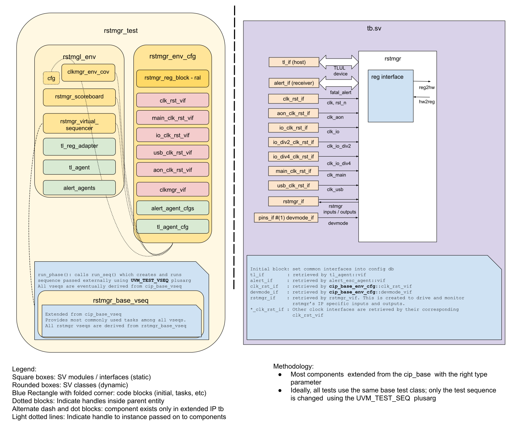

<!-- Copy this file to hw/ip/rstmgr/doc/dv/index.md and make changes as needed.
For convenience 'rstmgr' in the document can be searched and replaced easily with the
desired IP (with case sensitivity!). Also, use the testbench block diagram
located at OpenTitan team drive / 'design verification'
as a starting point and modify it to reflect your rstmgr testbench and save it
to hw/ip/rstmgr/doc/dv/tb.svg. It should get linked and rendered under the block
diagram section below. Please update / modify / remove sections below as
applicable. Once done, remove this comment before making a PR. -->

## Goals
* **DV**
  * Verify all RSTMGR IP features by running dynamic simulations with a SV/UVM based testbench
  * Develop and run all tests based on the [testplan](#testplan) below towards closing code and functional coverage on the IP and all of its sub-modules
* **FPV**
  * Verify TileLink device protocol compliance with an SVA based testbench

## Current status
* [Design & verification stage]()
  * [HW development stages]()
* [Simulation results](https://reports.opentitan.org/hw/ip/rstmgr/dv/latest/results.html)

## Design features
For detailed information on RSTMGR design features, please see the [RSTMGR HWIP technical specification]().

## Testbench architecture
RSTMGR testbench has been constructed based on the [CIP testbench architecture]().

### Block diagram


### Top level testbench
The top level testbench is located at `hw/ip/rstmgr/dv/tb.sv`.
It instantiates the RSTMGR DUT module `hw/top_earlgrey/ip/rstmgr/rtl/autogen/rstmgr.sv`.
In addition, it instantiates the following interfaces, connects them to the DUT and sets their handle into `uvm_config_db`:
* [Clock and reset interface]()
* [TileLink host interface]()
* RSTMGR interface `hw/ip/rstmgr/dv/env/rstmgr_if.sv`
* Alerts ([`alert_esc_if`]())
* Devmode ([`pins_if`]())

### Common DV utility components
The following utilities provide generic helper tasks and functions to perform activities that are common across the project:
* [dv_utils_pkg]()
* [csr_utils_pkg]()

### Global types & methods
All common types and methods defined at the package level can be found in
`rstmgr_env_pkg`. Some of them in use are:
```systemverilog
[list a few parameters, types & methods; no need to mention all]
```
### TL_agent
The RSTMGR testbench instantiates (already handled in CIP base env) [tl_agent]().
This provides the ability to drive and independently monitor random traffic via the TL host interface into the RSTMGR device.

### Alert_agents
RSTMGR testbench instantiates (already handled in CIP base env) [alert_agents]():
[list alert names].
The alert_agents provide the ability to drive and independently monitor alert handshakes via alert interfaces in RSTMGR device.

### UVM RAL Model
The RSTMGR RAL model is created with the [`ralgen`]() FuseSoC generator script automatically when the simulation is at the build stage.

It can be created manually by invoking [`regtool`]():

### Stimulus strategy
The following test sequences and covergroups are described in more detail in the testplan at `hw/ip/pwrmgr/data/rstmgr_testplan.hjson`, and also included [below](#testplan).

#### Test sequences
The test sequences reside in `hw/ip/rstmgr/dv/env/seq_lib`.
All test sequences are extended from `rstmgr_base_vseq`, which is extended from `cip_base_vseq` and serves as a starting point.
It provides commonly used handles, variables, functions and tasks that the test sequences can simple use / call.
Some of the most commonly used tasks / functions are as follows:
* task `wait_for_cpu_out_of_reset`:
  Waits for the `resets_o.rst_sys_n[1]` to go high, indicating the CPU is out of reset and CSRs can be accessed.
* task `check_cpu_dump_info`:
  Reads and compares each field in the `cpu_info` CSR against the given cpu dump.
* task `check_software_reset_csr_and_pins`:
  Reads and compares the `sw_rst_ctrl_n` CSR and the output reset ports against the given value.

The `rstmgr_smoke_vseq` sequence tests the rstmgr through software initiated low power, peripheral reset, ndm reset, and software initiated resets.

The `rstmgr_reset_stretcher_vseq` sequence tests the `resets_o.rst_por_aon_n[0]` output is asserted after 32 stable cycles of `ast_i.aon_pok`.

The `rstmgr_sw_rst_regen_clear_once_vseq` sequence tests that the `sw_rst_regen` CSR is such that a bit cannot be flipped back to 1.

The `rstmgr_sw_rst_vseq` sequence tests the functionality provided by the `sw_rst_regen` and `sw_rst_ctrl_n`.

The `rstmgr_reset_info_vseq` tests the `reset_info` CSR contents correspond to the different resets.

The `rstmgr_cpu_info_vseq`  tests the `cpu_info` CSR contents capture to the `cpu_dump_i` present at the time of a reset.

The `rstmgr_alert_info_vseq`  tests the `alert_info` CSR contents capture to the `alert_dump_i` present at the time of a reset.

#### Functional coverage
To ensure high quality constrained random stimulus, it is necessary to develop a functional coverage model.
The following covergroups have been developed to prove that the test intent has been adequately met:
* `reset_stretcher_cg`
* `alert_info_cg`
* `cpu_info_cg`
* `alert_info_capture_cg`
* `cpu_info_capture_cg`

More details about these sequences and covergroups can be found at `hw/ip/rstmgr/data/rstmgr_testplan.hjson`.

### Self-checking strategy
The partition between checks done in the scoreboard is not fixed.
#### Scoreboard
The `rstmgr_scoreboard` is primarily used for end to end checking.
The following checks are performed:
* Resets cascade hierarchically per [Reset Topology](:#reset-topology)
* The software controlled peripheral resets are asserted based on both `sw_rst_regen` and `sw_rst_ctrl_n` CSRs when not set by `rst_lc_reg`, `rst_sys_req`, or por.
* The `cpu_info` CSRs record the expected values based on the inputs on a system reset.
* The `alert_info` CSRs record the expected values based on the inputs on a system reset.
* The `reset_info` CSR records the expected reset cause.
* When `scan_rst_ni` and `scanmode_i` inputs are active all output resets become active.

#### Assertions
* TLUL assertions: The `tb/rstmgr_bind.sv` file binds the `tlul_assert` [assertions]() to the IP to ensure TileLink interface protocol compliance.
* Unknown checks on DUT outputs: The RTL has assertions to ensure all outputs are initialized to known values after coming out of reset.
* Response to pwrmgr's `rst_lc_req` and `rst_sys_req` inputs: these trigger transitions in `rst_lc_src_n` and `rst_sys_rst_n` outputs.
  Checked via SVAs.
* Response to `cpu_i.ndmreset_req` input: after it is asserted, rstmgr's `rst_sys_src_n` should go active.
  Checked via SVA.

## Building and running tests
We are using our in-house developed [regression tool]() for building and running our tests and regressions.
Please take a look at the link for detailed information on the usage, capabilities, features and known issues.
Here's how to run a smoke test:
```console
$ $REPO_TOP/util/dvsim/dvsim.py $REPO_TOP/hw/ip/rstmgr/dv/rstmgr_sim_cfg.hjson -i rstmgr_smoke
```

## Testplan

