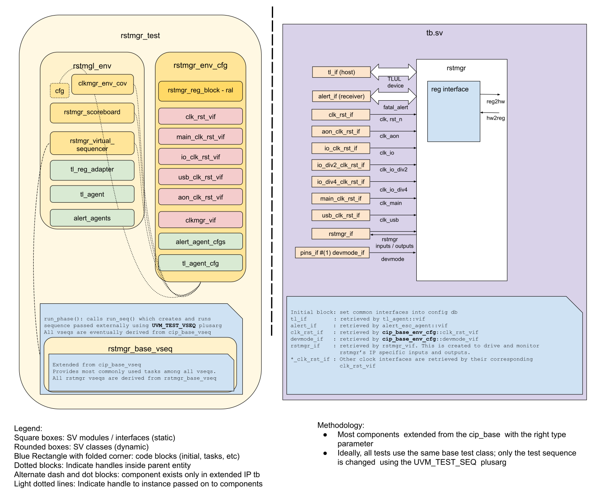

# RSTMGR DV document

## Goals
* **DV**
  * Verify all RSTMGR IP features by running dynamic simulations with a SV/UVM based testbench
  * Develop and run all tests based on the [testplan](#testplan) below towards closing code and functional coverage on the IP and all of its sub-modules
* **FPV**
  * Verify TileLink device protocol compliance with an SVA based testbench

## Current status
* [Design & verification stage](../../../README.md)
  * [HW development stages](../../../../doc/project_governance/development_stages.md)
* [Simulation results](https://reports.opentitan.org/hw/ip/rstmgr/dv/latest/report.html)

## Design features
For detailed information on RSTMGR design features, please see the [RSTMGR HWIP technical specification](../README.md).

## Testbench architecture
RSTMGR testbench has been constructed based on the [CIP testbench architecture](../../../dv/sv/cip_lib/README.md).

### Block diagram


### Top level testbench
The top level testbench is located at [`hw/ip/rstmgr/dv/tb.sv`](https://github.com/lowRISC/opentitan/blob/master/hw/ip/rstmgr/dv/tb.sv).
It instantiates the RSTMGR DUT module [`hw/top_earlgrey/ip/rstmgr/rtl/autogen/rstmgr.sv`](https://github.com/lowRISC/opentitan/blob/master/hw/top_earlgrey/ip/rstmgr/rtl/autogen/rstmgr.sv).
In addition, it instantiates the following interfaces, connects them to the DUT and sets their handle into `uvm_config_db`:
* [Clock and reset interface](../../../dv/sv/common_ifs/README.md)
* [TileLink host interface](../../../dv/sv/tl_agent/README.md)
* RSTMGR interface [`hw/ip/rstmgr/dv/env/rstmgr_if.sv`](https://github.com/lowRISC/opentitan/blob/master/hw/ip/rstmgr/dv/env/rstmgr_if.sv)
* Alerts ([`alert_esc_if`](../../../dv/sv/alert_esc_agent/README.md))
* Devmode ([`pins_if`](../../../dv/sv/common_ifs/README.md))

### Common DV utility components
The following utilities provide generic helper tasks and functions to perform activities that are common across the project:
* [dv_utils_pkg](../../../dv/sv/dv_utils/README.md)
* [csr_utils_pkg](../../../dv/sv/csr_utils/README.md)

### Global types & methods
All common types and methods defined at the package level can be found in
`rstmgr_env_pkg`. Some of them in use are:
```systemverilog
  typedef logic [NumSwResets-1:0] sw_rst_t;
  typedef logic [$bits(alert_pkg::alert_crashdump_t)-1:0] linearized_alert_dump_t;
  typedef virtual pwrmgr_rstmgr_sva_if #(.CHECK_RSTREQS(0)) parameterized_pwrmgr_rstmgr_sva_vif;
```
### TL_agent
The RSTMGR testbench instantiates (already handled in CIP base env) [tl_agent](../../../dv/sv/tl_agent/README.md).
This provides the ability to drive and independently monitor random traffic via the TL host interface into the RSTMGR device.

### Alert_agents
RSTMGR testbench instantiates (already handled in CIP base env) [alert_agents](../../../dv/sv/alert_esc_agent/README.md):
[list alert names].
The alert_agents provide the ability to drive and independently monitor alert handshakes via alert interfaces in RSTMGR device.

### UVM RAL Model
The RSTMGR RAL model is created with the [`ralgen`](../../../dv/tools/ralgen/README.md) FuseSoC generator script automatically when the simulation is at the build stage.

It can be created manually by invoking [`regtool`](../../../../util/reggen/doc/setup_and_use.md).

### Stimulus strategy
The following test sequences and covergroups are described in more detail in the testplan at `hw/top_earlgrey/ip_autogen/pwrmgr/data/rstmgr_testplan.hjson`, and also included [below](#testplan).

This IP is only reset via the `por_n_i` input, and by `scan_rst_ni` qualified by `scanmode_i` being active.
The regular `rst_ni` input is connected to its own `resets_o.rst_por_io_div4_n[0]` output, so the reset output from `clk_rst_if` is not connected.
Similarly, all reset outputs from other `clk_rst_if` instances are ignored, and only their clock output is used.
This is consistent with this IP being in charge of all derived resets in the chip.

Besides the POR resets above, the test sequences mostly assert various reset requests from pwrmgr and trigger resets vir RESET_REQ CSR.
Alert and CPU dump info is randomized and checked on resets.

#### Test sequences
The test sequences reside in [`hw/ip/rstmgr/dv/env/seq_lib`](https://github.com/lowRISC/opentitan/blob/master/hw/ip/rstmgr/dv/env/seq_lib).
All test sequences are extended from `rstmgr_base_vseq`, which is extended from `cip_base_vseq` and serves as a starting point.
It provides commonly used handles, variables, functions and tasks that the test sequences can simple use / call.
Some of the most commonly used tasks / functions are as follows:
* task `wait_for_cpu_out_of_reset`:
  Waits for the `resets_o.rst_sys_n[1]` output to go high, indicating the CPU is out of reset and CSRs can be accessed.
* task `check_cpu_dump_info`:
  Reads and compares each field in the `cpu_info` CSR against the given cpu dump.
* task `check_software_reset_csr_and_pins`:
  Reads and compares the `sw_rst_ctrl_n` CSR and the output reset ports against the given value.

Other sequences follow:
* `rstmgr_smoke_vseq` tests the rstmgr through software initiated low power, peripheral reset, ndm reset, and software initiated resets.
* `rstmgr_reset_stretcher_vseq` tests the `resets_o.rst_por_aon_n[0]` output is asserted after 32 stable cycles of `ast_i.aon_pok`.
* `rstmgr_sw_rst_vseq` tests the functionality provided by the `sw_rst_regwen` and `sw_rst_ctrl_n`.
* `rstmgr_reset_info_vseq` tests the `reset_info` CSR contents correspond to the different resets.
* `rstmgr_cpu_info_vseq` tests the `cpu_info` CSR contents capture to the `cpu_dump_i` present at the time of a reset.
* `rstmgr_alert_info_vseq` tests the `alert_info` CSR contents capture to the `alert_dump_i` present at the time of a reset.

#### Functional coverage
To ensure high quality constrained random stimulus, it is necessary to develop a functional coverage model.
The following covergroups have been developed to prove that the test intent has been adequately met:
* `reset_stretcher_cg`
* `alert_info_cg`
* `cpu_info_cg`
* `alert_info_capture_cg`
* `cpu_info_capture_cg`
* `sw_rst_cg`

### Self-checking strategy
Most self checking is done using SVA, and via explicit CSR reads.
The latter are described in the testplan.

#### Assertions
* TLUL assertions: The `tb/rstmgr_bind.sv` file binds the `tlul_assert` [assertions](../../tlul/doc/TlulProtocolChecker.md) to the IP to ensure TileLink interface protocol compliance.
* Unknown checks on DUT outputs: The RTL has assertions to ensure all outputs are initialized to known values after coming out of reset.
* Response to pwrmgr's `rst_lc_req` and `rst_sys_req` inputs: these trigger transitions in `rst_lc_src_n` and `rst_sys_rst_n` outputs.
  Checked via SVAs in [`hw/top_earlgrey/ip_autogen/pwrmgr/dv/sva/pwrmgr_rstmgr_sva_if.sv`](https://github.com/lowRISC/opentitan/blob/master/hw/top_earlgrey/ip_autogen/pwrmgr/dv/sva/pwrmgr_rstmgr_sva_if.sv).
* Response to `cpu_i.ndmreset_req` input: after it is asserted, rstmgr's `rst_sys_src_n` should go active.
  Checked via SVA in [`hw/top_earlgrey/ip_autogen/pwrmgr/dv/sva/pwrmgr_rstmgr_sva_if.sv`](https://github.com/lowRISC/opentitan/blob/master/hw/top_earlgrey/ip_autogen/pwrmgr/dv/sva/pwrmgr_rstmgr_sva_if.sv).
* Resets cascade hierarchically per [Reset Topology](../doc/theory_of_operation.md#reset-topology).
  Checked via SVA in [`hw/ip/rstmgr/dv/sva/rstmgr_cascading_sva_if.sv`](https://github.com/lowRISC/opentitan/blob/master/hw/ip/rstmgr/dv/sva/rstmgr_cascading_sva_if.sv).
* POR must be active for at least 32 consecutive cycles before going inactive before output resets go inactive.
  Checked via SVA in [`hw/ip/rstmgr/dv/sva/rstmgr_cascading_sva_if.sv`](https://github.com/lowRISC/opentitan/blob/master/hw/ip/rstmgr/dv/sva/rstmgr_cascading_sva_if.sv).
* The scan reset `scan_rst_ni` qualified by `scanmode_i` triggers all cascaded resets that `por_n_i` does.
  Checked via SVA in [`hw/ip/rstmgr/dv/sva/rstmgr_cascading_sva_if.sv`](https://github.com/lowRISC/opentitan/blob/master/hw/ip/rstmgr/dv/sva/rstmgr_cascading_sva_if.sv).
* Software resets to peripherals also cascade hierarchically.
  Checked via SVA in [`hw/ip/rstmgr/dv/sva/rstmgr_sw_rst_sva_if.sv`](https://github.com/lowRISC/opentitan/blob/master/hw/ip/rstmgr/dv/sva/rstmgr_sw_rst_sva_if.sv).
* The output `rst_en_o` for alert_handler tracks their corresponding resets.
  Checked via SVA in both [`hw/ip/rstmgr/dv/sva/rstmgr_cascading_sva_if.sv`](https://github.com/lowRISC/opentitan/blob/master/hw/ip/rstmgr/dv/sva/rstmgr_cascading_sva_if.sv) and [`hw/ip/rstmgr/dv/sva/rstmgr_sw_rst_sva_if.sv`](https://github.com/lowRISC/opentitan/blob/master/hw/ip/rstmgr/dv/sva/rstmgr_sw_rst_sva_if.sv).
* The `alert` and `cpu_info_attr` indicate the number of 32-bit words needed to capture their inputs.
  Checked via SVA in `hw/ip/rstmgr/dv/sva/rstmgr_attrs_sva_if.sv`.

## Testing V2S components
The rstmgr_cnsty_chk module is a D2S component.
It depends on very specific timing, and requires tampering stimulus to verify its functionality.
It has its own separate dv environment and tests at `hw/ip/rstmgr/dv/rstmgr_cnsty_chk`.
It is excluded from coverage for the rstmgr dv tests.

## Building and running tests
We are using our in-house developed [regression tool](../../../../util/dvsim/README.md) for building and running our tests and regressions.
Please take a look at the link for detailed information on the usage, capabilities, features and known issues.
Here's how to run a smoke test:
```console
$ $REPO_TOP/util/dvsim/dvsim.py $REPO_TOP/hw/ip/rstmgr/dv/rstmgr_sim_cfg.hjson -i rstmgr_smoke
```

## Testplan
[Testplan](../data/rstmgr_testplan.hjson)
