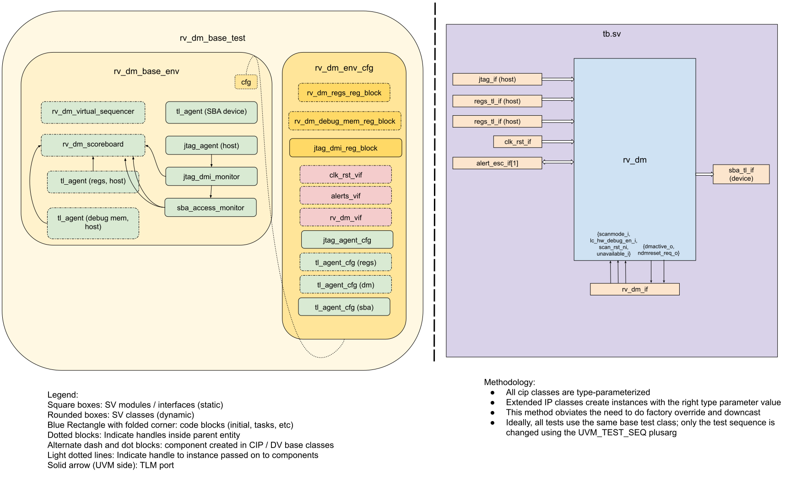

## Goals
* **DV**
  * Verify all RV_DM IP features by running dynamic simulations with a SV/UVM based testbench
  * Develop and run all tests based on the [testplan](#testplan) below towards closing code and functional coverage on the IP and all of its sub-modules
* **FPV**
  * Verify TileLink device protocol compliance with an SVA based testbench

## Current status
* [Design & verification stage]()
  * [HW development stages]()
* [Simulation results](https://reports.opentitan.org/hw/ip/rv_dm/dv/latest/results.html)

## Design features

For detailed information on RV_DM design features, please see the [RV_DM HWIP technical specification]().
The internal debug logic is vendored-in from the external [PULP RISC-V debug repository](https://github.com/pulp-platform/riscv-dbg).

## Testbench architecture

RV_DM has a standard UVM testbench, which is based on the [CIP testbench architecture]().

### Block diagram



The flow of data into the scoreboard is described [below](#scoreboard).

### Testbench

The top level testbench is located at `hw/ip/rv_dm/dv/tb.sv`.
It instantiates the RV_DM DUT module `hw/ip/rv_dm/rtl/rv_dm.sv`.
In addition, it instantiates the following interfaces, connects them to the DUT and sets their handle into `uvm_config_db`:
* [Clock and reset interface]()
* [TileLink host interface]() for the config space (which only contains the alert register).
* [TileLink host interface]() for the debug memory space (which only contains the alert register).
* [TileLink device interface]() for the SBA interface that is used by the JTAG debugger to access the whole chip.
* [JTAG interface]() to act as an external JTAG host.
* [Alert and escalation interface]() for the alert interface.
  * The instantiation and hookup of this interface is done using the standardized common macro `` `DV_ALERT_IF_CONNECT`` defined in `hw/dv/sv/dv_utils/dv_macros.svh`.
* RV_DM interface for driving / sampling the remaining DUT IOs
  * Inputs driven / sampled: `lc_hw_debug_en_i`, `scanmode_i`, `scan_rst_ni`, `unavailable_i`
  * Outputs sampled: `ndmreset_req_o`, `dmactive_o` & `debug_req_o`

### Common DV utility components

The following utilities provide generic helper tasks and functions to perform activities that are common across the project:
* [dv_utils_pkg]()
* [dv_lib_pkg]()
* [cip_lib_pkg]()
* dv_base_reg_pkg
* [csr_utils_pkg]()

### TL_agent

The RV_DM testbench instantiates (already handled in CIP base env) [tl_agent]().
This provides the ability to drive and independently monitor random traffic via the TL host interface into the RV_DM device.

### Alert_agent

RV_DM testbench instantiates an [alert_agent]().
This is already done in the CIP base environment.
It uses a string array of alert names to associate each instance of an alert signal. RV_DM exposes only a single alert signal, so this array is set to ["fatal_fault"].
This alert is wired from the bus integrity logic.

The alert_agents provide the ability to drive and independently monitor the alert handshakes via alert interfaces which are connected to the DUT.

### JTAG Agent

The RVDM testbench instantiates an instance of [jtag_agent]().

### JTAG DMI Agent

The RV_DM testbench instantiates the sub-components of [jtag_dmi_agent]() - the `jtag_dmi_monitor`, `sba_access_monitor` and the `jtag_dmi_reg_block`.

### UVM RAL Model

On OpenTitan, the DV RAL models are typically generated with the [`ralgen`]() FuseSoC generator script automatically when the simulations are run.
`ralgen` invokes the `reggen` tool underneath, which takes the design specification `hjson` file as input, which contains the register descriptions.
This generator is invoked by FuseSoC when it processes the RV_DM environment
core file located at `hw/ip/rv_dm/dv/env/rv_dm_env.core`.

RV_DM has 4 distinct register spaces that are accessed via different interfaces.
The RAL models associated with each of these are created using different methods. They are as follows:

* **RV_DM regs RAL model**:
  The registers in the space are defined in the design specification `hjson` file.
  They are accessed by software via its 'main' TL device interface, referred to in the design as TL `regs` interface.
  This RAL model is auto-generated by `ralgen` when running simulations.

* **RV_DM debug memory RAL model**:
  This region is the core debug memory which contains registers, a program buffer (SRAM) and a ROM section.
  It is accessed via the second TL device interface, which is referred to in the design as TL `rom` interface.
  The design associated with this space comes from the external [PULP RISC-V debug](https://github.com/pulp-platform/riscv-dbg) repository.
  There is hence, no `hjson` file associated with it.
  We manually create and maintain it at `hw/ip/rv_dm/data/rv_dm_debug_mem.hjson`, to serve our verification needs.
  This RAL model is also auto-generated by `ralgen`.

* **JTAG DTM RAL model**:
  This RAL model describes the JTAG data transport module (DTM) registers, and can be accessed only via JTAG.
  This RAL model is hand-written and checked into our repository in the [`jtag_agent`]() area.

* **JTAG DMI RAL model**:
  The RISC-V debug specification defines registers in the DMI space, which also can be accessed only via JTAG.
  These registers facilitate CPU debug.
  The PULP RISC-V debug implementation however only implements a subset of these registers.
  This RAL model is also checked into our repository in the [`jtag_agent`]() area.
  It is created in the RV_DM environment configuration object.

All four of these RAL models can be referenced (directly or indirectly) using the RV_DM environment configuration object.

### Stimulus strategy

#### Test sequences

The test sequences reside in `hw/ip/rv_dm/dv/env/seq_lib`.
All test sequences are extended from `rv_dm_base_vseq`, which is extended from `cip_base_vseq` and serves as a starting point.
It provides the following commonly used handles, variables, functions and tasks that the test sequences can simply use / call.
* sba_tl_device_seq_start(): This task enables the auto-responding device sequence that is run on the TLUL device agent sequencer that is attached to the SBA TL interface.
  This task is non-blocking - it spawns off a separate, perpetually running thread which runs the sequence independently.
  The task provides some arguments to "pattern" the kind of randomized responses that are sent.

* sba_tl_device_seq_stop(): This method stops the previously spawned SBA TL device sequence from executing further.
  If the invocation of this task coincides with a new SBA TL request from RV_DM then the new request is accepted.
  The task waits for all accepted requests to be serviced (i.e. responded to) before returning back to the caller.

All test sequences extend from `rv_dm_base_vseq`.

#### Functional coverage

Please scroll down to the [testplan](#testplan) section for a detailed list of covergroups implemented for RV_DM.

### Self-checking strategy

#### Scoreboard

All transactions made to or coming from the DUT flow into the scoreboard, which models the design closely to verify the DUT behavior.
* The `cfg` class provides a handle to the virtual interface `rv_dm_if` which enables sampling of the DUT IOs (spare pins).
  * The scoreboard can sample the changes to input and output pins of the DUT and perform the necessary checks at the right instants.
* The `cfg` class also provides handles to all four RAL models (two on the TL interfaces, and two on JTAG), which are used to maintain a mirror of what we predict the design would also reflect.
* The TL device agents monitor transactions on the TL interfaces and send accesses seen on the "main" CSR and debug memory spaces.
* The SBA TL host agent monitors transactions on the SBA TL host interface to compare against the SBA transactions predicted by the `sba_access_monitor`.
* The `jtag_dmi_monitor` sends raw JTAG transactions that were not made to the JTAG DTM DMI register over its `non_dmi_jtag_dtm_analysis_port`.
* Finally, the `sba_acccess_monitor` sends both, the DMI transactions that were not made to the SBA DMI registers over the `non_sba_jtag_dmi_analysis_port`, as well as predicted SBA transactions over its `analysis_port`.

#### Assertions

* TLUL assertions: The `tb/rv_dm_bind.sv` file binds the `tlul_assert` [assertions]() to the IP to ensure TileLink interface protocol compliance.
* Unknown checks on DUT outputs: The RTL has assertions to ensure all outputs are initialized to known values after coming out of reset.
* assert prop 1:
* assert prop 2:

## Building and running tests

We are using our in-house developed [regression tool]() for building and running our tests and regressions.
Please take a look at the link for detailed information on the usage, capabilities, features and known issues.
Here's how to run a smoke test:
```console
$ $REPO_TOP/util/dvsim/dvsim.py $REPO_TOP/hw/ip/rv_dm/dv/rv_dm_sim_cfg.hjson -i rv_dm_smoke
```

## Testplan

