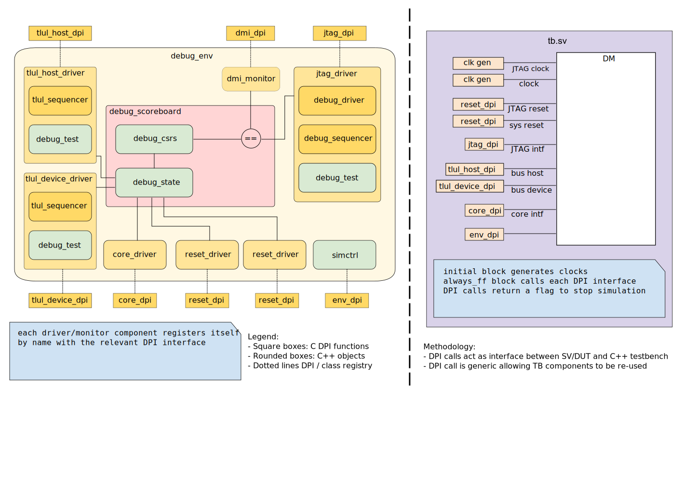

## Goals
* **Unit DV**
  * Verify all Debug Module features by running dynamic simulations with a C++/DPI based testbench
  * Develop and run all tests based on the [testplan](#testplan) below towards closing code and functional coverage on the IP and all of its sub-modules
* **Top DV**
  * Verify Debug functionality at top-level using Open OCD compliance suite (not covered in this doc)

## Current status
* [Design & verification stage]()
  * [HW development stages]()
* DV regression results dashboard (link TBD)

## Design features
For detailed information on Debug Module design features, please see the [Debug Module specification]().

## Testbench architecture
This testbench has been constructed using an experimental approach with C++ components.
By following this approach, open source tools can be used to verify the design (along with commercial tools).

### Block diagram


### Testbench top-level
The top level of the testbench is located at `hw/ip/rv_dm/dv_cpp/tb/tb.sv`.
It instantiates the DUT module and all relevant DPI calls into the C++ testbench.

### Common DV utility components
All driver components are generic, and could be re-used in other testbenches.

### Global parameters
All parameters are passed from the simulation Makefile.
They are as follows:
```systemverilog
parameter int          NrHarts = 1;
parameter logic [31:0] IdcodeValue = 32'd1;
```

### Testbench components
#### JTAG agent
The JTAG agent is a low-level driver for the JTAG interface signals.
This agent receives debug transactions and streams them into the DUT using a standard JTAG protocol.
The agent supports all available JTAG state machine states, and aims to randomly jump through them to excercise all parts of the design.

The debug agent supplies the JTAG agent with new debug transactions when requested.
The debug sequencer supplies the debug agent with randomized sequences of debug transactions.

#### TLUL host agent
The TLUL host agent generates randomized stimulus and responses to the debug module TLUL host port.

#### TLUL device agent
The TLUL device agent generates randomized stimulus and responses to the debug module TLUL device port.

#### Debug scoreboard
The debug scoreboard queues up in-flight transactions and performs all checking.
A model of the internal state of the debug module is maintained for checking along with a view of all debug CSRs.

### Stimulus strategy
#### Test sequences
Test configs are defined in .test files in the tests directory.
The configs defined in the test files are passed to all stimulus/sequence generators.

#### Functional coverage
To ensure high quality constrained random stimulus, it is necessary to develop a functional coverage model.
The following covergroups have been developed to prove that the test intent has been adequately met:

* tlul_host_cov:       Cover different TLUL transaction types / sizes for the TLUL host port
* tlul_device_cov:     Cover different TLUL transaction types / sizes for the TLUL device port

### Self-checking strategy
#### Scoreboard
The `debug_scoreboard` is used for end to end checking.

All transactions driven successfully into the JTAG interface are queued in the scoreboard.
DMI transactions are captured from the output of the DTM module and checked against the queue of JTAG transactions.

Successfully verified DMI transactions are passed on the CSR model to be checked against the internal reference.

The internal model is also used to check the correctness of all TLUL host/device transactions.

#### Assertions
* TLUL assertions: The `tb/debug_bind.sv` binds the `tlul_assert` [assertions]() to the IP to ensure TileLink interface protocol compliance.
* Unknown checks on DUT outputs: The RTL has assertions to ensure all outputs are initialized to known values after coming out of reset
* Other assertions are instantiated directly in the RTL

## Building and running tests
Here's how to build the testbench:
```console
$ cd hw/ip/rv_dm/dv
$ make build TOOL=verilator
```
Here's how to run a basic sanity test:
```console
$ make run TEST_NAME=debug_sanity
```

## Testplan

