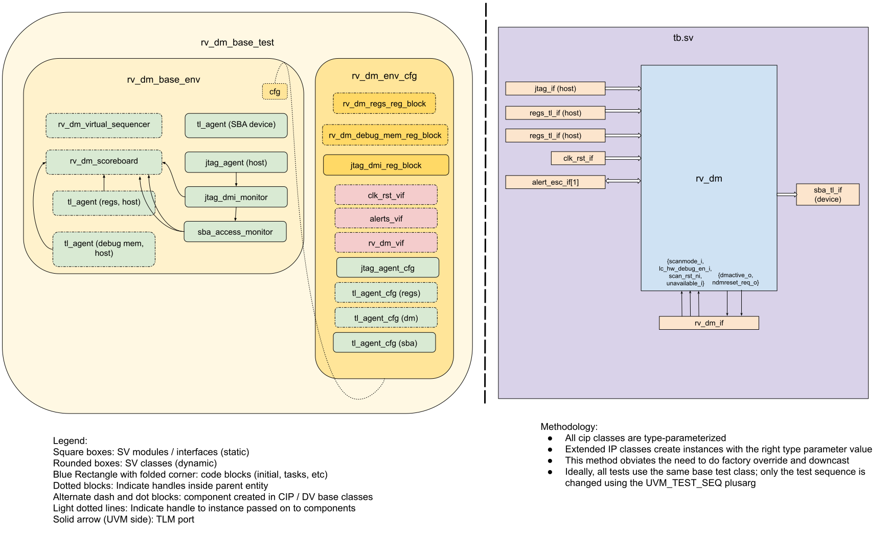

# RV_DM DV document

## Goals
* **DV**
  * Verify all RV_DM IP features by running dynamic simulations with a SV/UVM based testbench
  * Develop and run all tests based on the [testplan](#testplan) below towards closing code and functional coverage on the IP and all of its sub-modules
* **FPV**
  * Verify TileLink device protocol compliance with an SVA based testbench

## Current status
* [Design & verification stage](../../../README.md)
  * [HW development stages](../../../../doc/project_governance/development_stages.md)
* [Simulation results](https://reports.opentitan.org/hw/ip/rv_dm/dv/latest/report.html)

## Design features

For detailed information on RV_DM design features, please see the [RV_DM HWIP technical specification](../README.md).
The internal debug logic is vendored-in from the external [PULP RISC-V debug repository](https://github.com/pulp-platform/riscv-dbg).

## Testbench architecture

RV_DM has a standard UVM testbench, which is based on the [CIP testbench architecture](../../../dv/sv/cip_lib/README.md).

### Block diagram



The flow of data into the scoreboard is described [below](#scoreboard).

### Testbench

The top level testbench is located at `hw/ip/rv_dm/dv/tb.sv`.
It instantiates the RV_DM DUT module `hw/ip/rv_dm/rtl/rv_dm.sv`.
In addition, it instantiates the following interfaces, connects them to the DUT and sets their handle into `uvm_config_db`:
* [Clock and reset interface](../../../dv/sv/common_ifs/README.md)
* [TileLink host interface](../../../dv/sv/tl_agent/README.md) for the config space (which only contains the alert register).
* [TileLink host interface](../../../dv/sv/tl_agent/README.md) for the debug memory space (which only contains the alert register).
* [TileLink device interface](../../../dv/sv/tl_agent/README.md) for the SBA interface that is used by the JTAG debugger to access the whole chip.
* [JTAG interface](../../../dv/sv/jtag_agent/README.md) to act as an external JTAG host.
* [Alert and escalation interface](../../../dv/sv/alert_esc_agent/README.md) for the alert interface.
  * The instantiation and hookup of this interface is done using the standardized common macro `` `DV_ALERT_IF_CONNECT`` defined in `hw/dv/sv/dv_utils/dv_macros.svh`.
* RV_DM interface for driving / sampling the remaining DUT IOs
  * Inputs driven / sampled: `lc_hw_debug_en_i`, `scanmode_i`, `scan_rst_ni`, `unavailable_i`
  * Outputs sampled: `ndmreset_req_o`, `dmactive_o` & `debug_req_o`

### Common DV utility components

The following utilities provide generic helper tasks and functions to perform activities that are common across the project:
* [dv_utils_pkg](../../../dv/sv/dv_utils/README.md)
* [dv_lib_pkg](../../../dv/sv/dv_lib/README.md)
* [cip_lib_pkg](../../../dv/sv/cip_lib/README.md)
* dv_base_reg_pkg
* [csr_utils_pkg](../../../dv/sv/csr_utils/README.md)

### TL_agent

The RV_DM testbench instantiates (already handled in CIP base env) [tl_agent](../../../dv/sv/tl_agent/README.md).
This provides the ability to drive and independently monitor random traffic via the TL host interface into the RV_DM device.

### Alert_agent

RV_DM testbench instantiates an [alert_agent](../../../dv/sv/alert_esc_agent/README.md).
This is already done in the CIP base environment.
It uses a string array of alert names to associate each instance of an alert signal. RV_DM exposes only a single alert signal, so this array is set to ["fatal_fault"].
This alert is wired from the bus integrity logic.

The alert_agents provide the ability to drive and independently monitor the alert handshakes via alert interfaces which are connected to the DUT.

### JTAG Agent

The RV_DM testbench instantiates an instance of [jtag_agent](../../../dv/sv/jtag_agent/README.md).

### JTAG DMI Agent

The RV_DM testbench instantiates the sub-components of [jtag_dmi_agent](../../../dv/sv/jtag_dmi_agent/README.md) - the `jtag_dmi_monitor`, `sba_access_monitor` and the `jtag_dmi_reg_block`.

### UVM RAL Model

On OpenTitan, the DV RAL models are typically generated with the [`ralgen`](../../../dv/tools/ralgen/README.md) FuseSoC generator script automatically when the simulations are run.
`ralgen` invokes the `reggen` tool underneath, which takes the design specification `hjson` file as input, which contains the register descriptions.
This generator is invoked by FuseSoC when it processes the RV_DM environment
core file located at `hw/ip/rv_dm/dv/env/rv_dm_env.core`.

RV_DM has 4 distinct register spaces that are accessed via different interfaces.
The RAL models associated with each of these are created using different methods. They are as follows:

* **RV_DM regs RAL model**:
  The registers in the space are defined in the design specification `hjson` file.
  They are accessed by software via its 'main' TL device interface, referred to in the design as TL `regs` interface.
  This RAL model is auto-generated by `ralgen` when running simulations.

* **RV_DM debug memory RAL model**:
  This region is the core debug memory which contains registers, a program buffer (SRAM) and a ROM section.
  It is accessed via the second TL device interface, which is referred to in the design as TL `rom` interface.
  The design associated with this space comes from the external [PULP RISC-V debug](https://github.com/pulp-platform/riscv-dbg) repository.
  There is hence, no `hjson` file associated with it.
  We manually create and maintain it at `hw/ip/rv_dm/data/rv_dm_debug_mem.hjson`, to serve our verification needs.
  This RAL model is also auto-generated by `ralgen`.

* **JTAG DTM RAL model**:
  This RAL model describes the JTAG data transport module (DTM) registers, and can be accessed only via JTAG.
  This RAL model is hand-written and checked into our repository in the [`jtag_agent`](../../../dv/sv/jtag_agent/README.md) area.

* **JTAG DMI RAL model**:
  The RISC-V debug specification defines registers in the DMI space, which also can be accessed only via JTAG.
  These registers facilitate CPU debug.
  The PULP RISC-V debug implementation however only implements a subset of these registers.
  This RAL model is also checked into our repository in the [`jtag_agent`](../../../dv/sv/jtag_agent/README.md) area.
  It is created in the RV_DM environment configuration object.

All four of these RAL models can be referenced (directly or indirectly) using the RV_DM environment configuration object.

### Stimulus strategy

#### Test sequences

The test sequences reside in `hw/ip/rv_dm/dv/env/seq_lib`.
All test sequences are extended from `rv_dm_base_vseq`, which is extended from `cip_base_vseq` and serves as a starting point.

A fundamental aspect of interaction with rv_dm comes from the "debug enable" mode.
This is provided with one of the ports `lc_dft_en_i` and `lc_hw_debug_en_i`.
The rv_dm module decides which one of these ports to look at based on the "late debug enable" flag.
This, in turn, is set by a combination of the `otp_dis_rv_dm_late_debug_i` pin and the `late_debug_enable` register.

The `rv_dm_base_vseq` allows a subclass sequence to control these signals.
This can be done with the `lc_hw_debug_en` and `late_debug_enable` flag.
The "late debug enable" mode is then randomly controlled by either pin or register.
Most subclasses will configure these flags before `dut_init` runs, and the base class will apply them in that task.

The other major mode that controls interaction with rv_dm comes from the `pinmux_hw_debug_en_i` signal.
This can be controlled by the `pinmux_hw_debug_en` flag in the base vseq.
As with the debug enable flag, subclasses can configure the flag before `dut_init` runs and the base class will apply it in that task.

The base class also provides the following commonly used tasks that the test sequences can simply use / call.
* sba_tl_device_seq_start(): This task enables the auto-responding device sequence that is run on the TLUL device agent sequencer that is attached to the SBA TL interface.
  This task is non-blocking - it spawns off a separate, perpetually running thread which runs the sequence independently.
  The task provides some arguments to "pattern" the kind of randomized responses that are sent.

* sba_tl_device_seq_stop(): This method stops the previously spawned SBA TL device sequence from executing further.
  If the invocation of this task coincides with a new SBA TL request from RV_DM then the new request is accepted.
  The task waits for all accepted requests to be serviced (i.e. responded to) before returning back to the caller.

All test sequences extend from `rv_dm_base_vseq`.

#### Functional coverage

The DV environment for rv_dm doesn't currently contain any specialised covergroups.
This is a state that could be improved in the future, but signoff is currently mostly based on code coverage and functional coverage from generic agents that have been instantiated.

### Self-checking strategy

#### Scoreboard

The DV environment for rv_dm currently has a very minimal scoreboard.
In particular, there is not currently a functional model against which the design can be checked.
Instead, the testing that exists comes from randomised directed testing where vseqs run with expectations about how the design state will change based on what they do.

#### Assertions

Assertion checks for rv_dm currently come from four places.
* Assertions that are found in the design itself.
* Assertions about the behaviour of CSRs, implemented by `rv_dm_regs_csr_assert_fpv` and bound in by `tb/rv_dm_bind`.
* Assertions about TLUL behaviour for the register, memory and sba interfaces.
  These are implemented by `tlul_assert` and bound in by `tb/rv_dm_bind`.
* Assertions about the debug enable signals and what functionality they should control.
  These are implemented by `rv_dm_enable_checker` and bound in by `rv_dm_bind`.

## Building and running tests

We are using our in-house developed [regression tool](../../../../util/dvsim/README.md) for building and running our tests and regressions.
Please take a look at the link for detailed information on the usage, capabilities, features and known issues.
Here's how to run a smoke test:
```console
$ $REPO_TOP/util/dvsim/dvsim.py $REPO_TOP/hw/ip/rv_dm/dv/rv_dm_use_jtag_interface_sim_cfg.hjson -i rv_dm_smoke
```

If you want to run the RV DM with the TLUL-based DMI interface run the following configuration:
```console
$ $REPO_TOP/util/dvsim/dvsim.py $REPO_TOP/hw/ip/rv_dm/dv/rv_dm_use_dmi_interface_sim_cfg.hjson -i rv_dm_smoke
```

## Testplan
[Testplan](../data/rv_dm_testplan.hjson)
