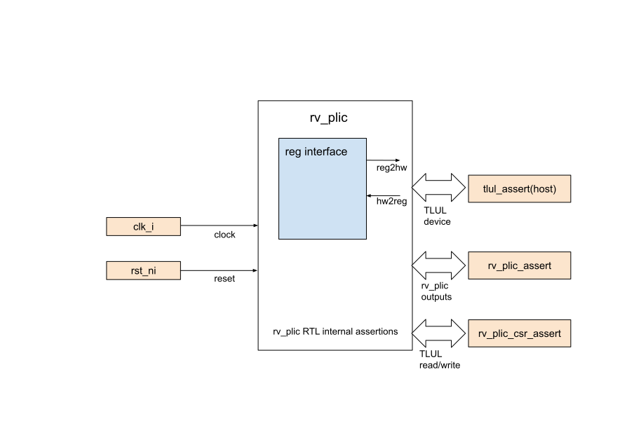

## Goals
* DV:
  * RV_PLIC is decided to verify in FPV only

* FPV:
  * Verify all the RV_PLIC outputs by writing assumptions and assertions with a
    FPV based testbench
  * Verify TileLink device protocol compliance with a FPV based testbench

## Current status
* [Design & verification stage]()
  * [HW development stages]()
* FPV dashboard (link TBD)

## Design features
For detailed information on RV_PLIC design features, please see the
[RV_PLIC design specification]().

## Testbench architecture
RV_PLIC FPV testbench has been constructed based on the [formal
architecture]().

### Block diagram

#### TLUL assertions
* The `hw/rv_plic/fpv/tb/rv_plic_bind.sv` binds the `tlul_assert` [assertions]()
  to rv_plic to ensure TileLink interface protocol compliance.
* The `hw/rv_plic/fpv/tb/rv_plic_bind.sv` also binds the `rv_plic_csr_assert_fpv`
  under `hw/rv_plic/fpv/vip/` to check if TileLink writes and reads correct
  CSRs.

#### RV_PLIC assertions
The `hw/rv_plic/fpv/tb/rv_plic_bind.sv` binds the `rv_plic_assert` under
`hw/rv_plic/fpv/vip/rv_plic_assert.sv`. The assertion file ensures RV_PLIC's outputs
(`irq_o` and `irq_id_o`) and important signals (`ip`) are being asserted.

##### Symbolic variables
Due to there are large number of input interrupt sources, the symbolic variable
is used to reduce the number of repeated assertions code. In RV_PLIC, we
declared two symbolic variables `src_sel` and `tgt_sel` to represent the index for
interrupt source and interrupt target.
Detailed explanation is listed in the
[Symbolic Variables]() section.

## DV plan

