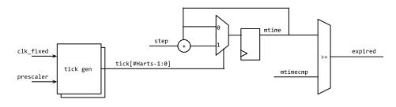

# Overview

This document specifies RISC-V Timer hardware IP functionality. This module
conforms to the
[Comportable guideline for peripheral functionality.]()
See that document for integration overview within the broader top level
system.


## Features

- 64-bit timer with 12-bit prescaler and 8-bit step register
- Compliant with RISC-V privileged specification v1.11
- Configurable number of timers per hart and number of harts

## Description

The timer module provides a configurable number of 64-bit counters where each
counter increments by a step value whenever the prescaler times out. Each timer
generates an interrupt if the counter reaches (or is above) a programmed
value. The timer is intended to be used by the processors to check the current
time relative to the reset or the system power-on.

In this version, the timer doesn't consider low-power modes and
assumes the clock is neither turned off nor changed during runtime.

## Compatibility

The timer IP provides memory-mapped registers `mtime` and `mtimecmp` which can
be used as the machine-mode timer registers defined in the RISC-V privileged
spec. Additional features such as prescaler, step, and a configurable number of
timers and harts have been added.

# Theory of Operations

## Block Diagram



The timer module is composed of tick generators, counters, and comparators.
A tick generator creates a tick every time its internal counter hits the
 value. The tick is used to increment `mtime` by the 
value. The 64-bit `mtime` value is compared with the 64-bit `mtimecmp`. If
`mtime` is greater than or equal to `mtimecmp`, the timer raises an interrupt.

## Hardware Interfaces



## Design Details

### Tick Generator

The tick module inside the timer IP is used to generate a fixed period of pulse
signal. This allows creation of a call-clock timer tick such as 1us or 10us
regardless of the system clock period. It is useful if the system has more than
one clock as a clock source. The firmware just needs to adjust the
 value and the actual timer interrupt handling routine does not
need a variable clock period to update `mtimecmp`.

For instance, if a system switches between 48MHz and 200MHz clocks, a prescaler
value of **47** for 48MHz and **199** for 200MHz will generate a 1us tick.
In this version, the timer only supports a single fixed clock, so the firmware
should change  appropriately.

### Configurable number of timers and harts

The timer IP supports more than one HART and/or more than one timer per hart.
Each hart has a set of tick generator and counter. It means the timer IP has the
same number of prescalers, steps, and `mtime` registers as the number of harts.

Each hart can have multiple sets of `mtimecmp`, comparater logic, and expire
interrupt signals. This version of the IP is fixed to have one Hart and one
Timer per Hart.

Below is an example configuration file for `N_TIMER` 2 and `N_HARTS` 2.
It has separate interrupts per timer and a set of interrupt enable and state
registers per Hart.

```hjson
{
  // ...
  interrupt_list: [
    { name: "timer_expired_0_0",
      desc: "raised if the timer 0_0 expired (mtimecmp >= mtime)"
    },
    { name: "timer_expired_0_1",
      desc: "raised if the timer 0_1 expired (mtimecmp >= mtime)"
    },
    { name: "timer_expired_1_0",
      desc: "raised if the timer 1_0 expired (mtimecmp >= mtime)"
    },
    { name: "timer_expired_1_1",
      desc: "raised if the timer 1_1 expired (mtimecmp >= mtime)"
    },
  ],
  //...
  registers: {
    // ...
    { skipto: "0x100" },
    { name: "CFG0",
      desc: "Configuration for Hart 0",
      swaccess: "rw",
      hwaccess: "hro",
      fields: [
        { bits: "11:0", name: "prescale", desc: "Prescaler to generate tick" },
        { bits: "23:16", name: "step", resval: "0x1", desc: "Incremental value for each tick" },
      ],
    },
    // ...
    { multireg: {
        name: "INTR_ENABLE0",
        desc: "Interrupt Enable",
        count: 2,
        cname: "TIMER",
        swaccess: "rw",
        hwaccess: "hro",
        fields: [
          { bits: "0", name: "IE", desc: "Interrupt Enable for timer" }
        ]
      }
    },
    { multireg: {
        name: "INTR_STATE0",
        desc: "Interrupt Status",
        count: 2,
        cname: "TIMER",
        swaccess: "ro",
        hwaccess: "hrw",
        fields: [
          { bits: "0", name: "IS", desc: "Interrupt status for timer" }
        ],
      }
    },
    // ...
    { skipto: "0x200" },
    { name: "CFG1",
      desc: "Configuration for Hart 1",
      swaccess: "rw",
      hwaccess: "hro",
      fields: [
        { bits: "11:0", name: "prescale", desc: "Prescaler to generate tick" },
        { bits: "23:16", name: "step", resval: "0x1", desc: "Incremental value for each tick" },
      ],
    },
    // ...
    { name: "TIMER_V_UPPER1",
      desc: "Timer value Upper",
      swaccess: "rw",
      hwaccess: "hrw",
      fields: [
        { bits: "31:0", name: "v", desc: "Timer value [63:32]" },
      ],
    },
    // ...
}
```


# Programmers Guide

## Initialization

Software is expected to configure `prescaler` and `step` before activating the
timer. These two fields need to be stable to correctly increment the timer
value. If software wants to change these fields, it should de-activate the
timer and then proceed.

## Register Access

The timer IP has 64-bit timer value registers and 64-bit compare registers. The
register interface, however, is set to 32-bit data width. The CPU cannot access
64-bit data in a single request. However, when split into two reads, it is
possible the timer value can increment between the two requests.

The IP doesn't have a latching or blocking mechanism to avoid this issue. It is
the programmer's responsibility to ensure the correct value is read. For
instance, if the CPU reads `0xFFFF_FFFF` from lower 32-bit timer value (`mtime`)
and `0x0000_0001` from upper 32-bit timer value (`mtimeh`), there is a chance
that rather than having the value `0x1_FFFF_FFFF` the timer value has changed
from `0x0_FFFF_FFFF` to `0x1_0000_0000` between the two reads. If there is the
possibility of an interrupt between the two reads then the counter could have
advanced even more.

This condition can be detected in a standard way using a third read. Figure 10.1
in the RISC-V unprivileged specification explains how to avoid this.

```asm
again:
    rdcycleh  x3
    rdcycle   x2
    rdcycleh  x4
    bne       x3, x4, again
```

Updating `mtimecmp` register also follows a similar approach to avoid a spurious
interrupt during the register update. Please refer to the `mtimecmp` section in
the RISC-V privileged specification.

```asm
# New comparand is in a1:a0.
li t0, -1
sw t0, mtimecmp   # No smaller than old value.
sw a1, mtimecmp+4 # No smaller than new value.
sw a0, mtimecmp   # New value.
```

## Timer behaviour close to 2^64

There are some peculiarities when `mtime` and `mtimecmp` get close to the end of
the 64-bit integer range. In particular, because an unsigned comparison is done
between `mtime` and `mtimecmp` care is needed. A couple of cases are:

1. `mtimecmp` close to 0xFFFF_FFFF_FFFF_FFFF. In this case the time-out event
   will be signaled when `mtime` passes the comparison value, the interrupt will
   be raised and the source indicated in the corresponding bit of the interrupt
   status register. However, if there is a delay in servicing the interrupt the
   `mtime` value could wrap to zero (and continue to increment) so the value
   read by the interrupt service routine will be less than the comparison value.

2. When the timer is setup to trigger a `timeout` some number of timer ticks
   into the future, the computation of the comparison value `mtime + timeout`
   may overflow. If this value is set in `mtimecmp` it would make `mtime`
   greater than `mtimecmp` and immediately signal an interrupt.
   A possible solution is to have an intermediate interrupt by setting the
   `mtimecmp` to 64-bit all-ones, `0xFFFF_FFFF_FFFF_FFFF`. Then the service
   routine for that interrupt will need to poll `mtime` until it wraps (which
   could take up to a timer clock tick) before scheduling the required interrupt
   using the originally computed `mtimecmp` value.

## Interrupt Handling

If `mtime` is greater than or equal to the value of `mtimecmp`, the interrupt is generated from the RV_TIMER module.
If the core enables the timer interrupt in `MIE` CSR, it jumps into the timer interupt service routine.
Clearing the interrupt can be done by writing 1 into the Interrupt Status register .
The RV_TIMER module also follows RISC-V Previliged spec that requires the interrupt to be cleared by updating `mtimecmp` memory-mapped CSRs.
In this case both  and  can clear the interrupt source.

## Device Interface Functions (DIFs)



## Register Table


