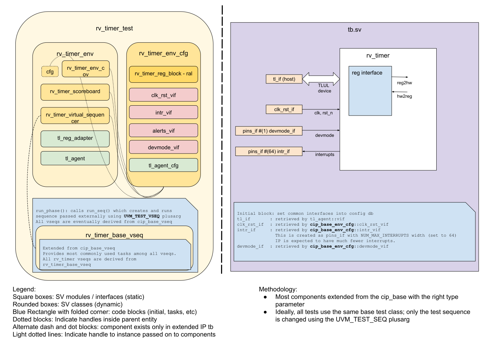

## Goals
* **DV**
  * Verify all RV_TIMER IP features by running dynamic simulations with a SV/UVM based testbench
  * Develop and run all tests based on the [DV plan](#dv-plan) below towards closing code and functional coverage on the IP and all of its sub-modules
* **FPV**
  * Verify TileLink device protocol compliance with an SVA based testbench

## Current status
* [Design & verification stage]()
  * [HW development stages]()
* [Simulation results](https://reports.opentitan.org/hw/ip/rv_timer/dv/latest/results.html)

## Design features
For detailed information on RV_TIMER design features, please see the [RV_TIMER design specification]().

## Testbench architecture
RV_TIMER testbench has been constructed based on the [CIP testbench architecture]().

### Block diagram


### Top level testbench
Top level testbench is located at `hw/ip/rv_timer/dv/tb/tb.sv`. It instantiates the RV_TIMER DUT module `hw/ip/rv_timer/rtl/rv_timer.sv`.
In addition, it instantiates the following interfaces, connects them to the DUT and sets their handle into `uvm_config_db`:
* [Clock and reset interface]()
* [TileLink host interface]()
* Interrupts ([`pins_if`]())

### Common DV utility components
The following utilities provide generic helper tasks and functions to perform activities that are common across the project:
* [dv_utils_pkg]()
* [csr_utils_pkg]()

### Global types & methods
All common types and methods defined at the package level can be found in `env/rv_timer_env_pkg`.
Some of them in use are:
```systemverilog
parameter uint NUM_HARTS = 1;
parameter uint NUM_TIMERS = 1;
```

### TL_agent
RV_TIMER testbench instantiates (already handled in CIP base env) [tl_agent]()
which provides the ability to drive and independently monitor random traffic via
TL host interface into RV_TIMER device.

### UVM RAL Model
The RV_TIMER RAL model is created with the [`ralgen`]() FuseSoC generator script automatically when the simulation is at the build stage.

It can be created manually by invoking [`regtool`]():

### Stimulus strategy
#### Test sequences
All test sequences reside in `hw/ip/rv_timer/dv/env/seq_lib`.
The `rv_timer_base_vseq` virtual sequence is extended from `cip_base_vseq` and serves as a starting point.
All test sequences are extended from `rv_timer_base_vseq`.
It provides commonly used handles, variables, functions and tasks that the test sequences can simple use / call.
Some of the most commonly used tasks / functions are as follows:
* `cfg_timer`            : set a particular timer active or inactive
* `cfg_hart`             : set timer step and prescale values
* `intr_state_spinwait`  : poll a intr_status randomly until it reads the expected value
* `status_read_for_clks` : read intr_status register randomly for num clks

#### Functional coverage
To ensure high quality constrained random stimulus, it is necessary to develop a functional coverage model.
The following covergroups have been developed to prove that the test intent has been adequately met:
* `timer_cfg_cg`    : cover group define bins for timer config parameters
* `timer_active_cg` : cover group define bin all timers active at same time

### Self-checking strategy
#### Scoreboard
The `rv_timer_scoreboard` is primarily used for end to end checking.
It creates the following analysis ports to retrieve the data monitored by corresponding interface agents:
* tl_a_chan_fifo: tl address channel
* tl_d_chan_fifo: tl data channel

rv_timer scoreboard monitors all CSR registers and interrupt pins.

For a write transaction, during the address channel, CSR values are updated in RAL and config values (timer enable, step, prescale, timer value, compare value) are updated in internal arrays.
When particular timer is enabled, rv_timer scoreboard calculate timeout clocks and start a thread to wait for timeout, then if any of timer configuration updated on active timer, rv_timer scoreboard recalculate and update the timeout clocks in ther running timeout thread.
If multiple timers are enabled, multipe threads will be initiated. On timeout scoreboard calculate the expected interrupt status and update RAL registers.

For a read transaction, during the address channel for interrupt status CSR rv_timer will predict its value according to the timer timeout threads.
During the data channel, rv_timer scoreboard will compare the read data with expected data in RAL.

Interrupt pins are checked against expected at every read/write data channel.

#### Assertions
* TLUL assertions: The `tb/rv_timer_bind.sv` binds the `tlul_assert` [assertions]() to the IP to ensure TileLink interface protocol compliance
* Unknown checks on DUT outputs: The RTL has assertions to ensure all outputs are initialized to known values after coming out of reset

## Building and running tests
We are using our in-house developed [regression tool]() for building and running our tests and regressions.
Please take a look at the link for detailed information on the usage, capabilities, features and known issues.
Here's how to run a smoke test:
```console
$ $REPO_TOP/util/dvsim/dvsim.py $REPO_TOP/hw/ip/rv_timer/dv/rv_timer_sim_cfg.hjson -i rv_timer_smoke
```

## DV plan

