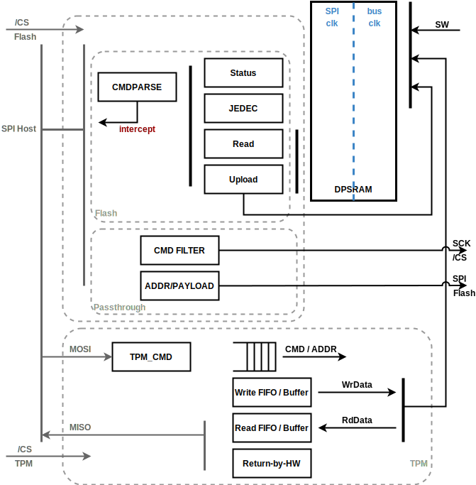
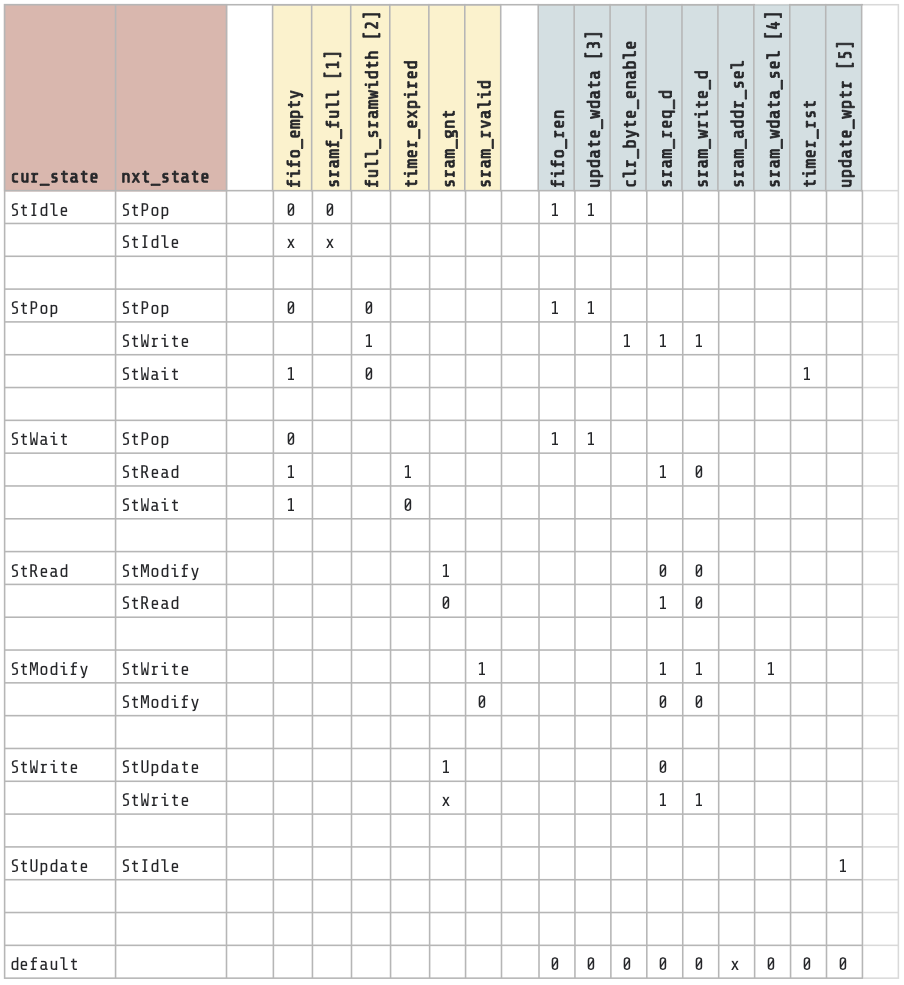
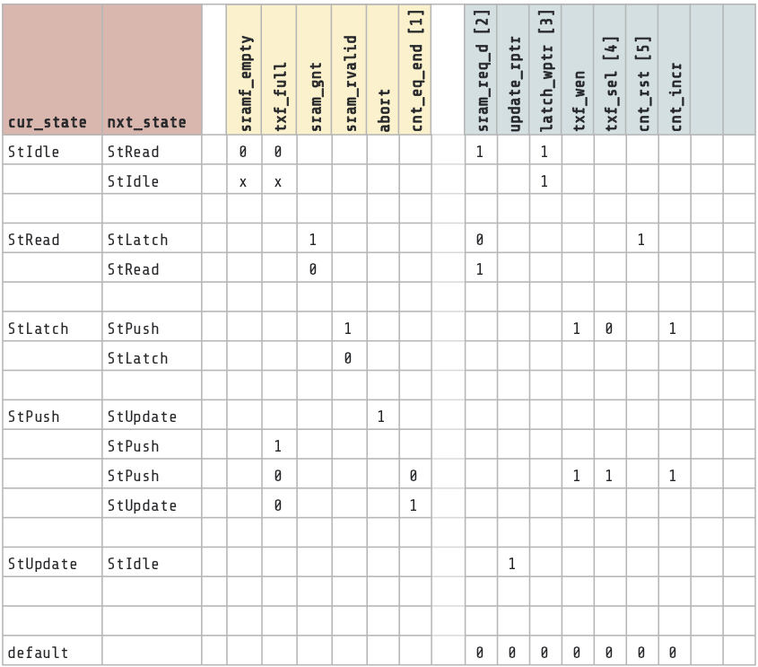

# Overview

## Features

- Single-bit wide SPI device interface implementing a raw data transfer protocol
  termed "Firmware Operation Mode"
  - No address bits, data is sent and received from peripheral pins to/from an
    internal buffer
  - Intended to be used to bulk-load data into and out of the chip
  - Not intended to support EEPROM or other addressing modes (functionality to
    come in later versions)
- Supports clock polarity and reverse bit order configurations
- Flexible RX/TX Buffer size within an SRAM range
- Interrupts for RX/TX SRAM FIFO conditions (empty, full, designated level for
  RX, TX)

## Description

The SPI device module is a serial-to-parallel receive (RX) and
parallel-to-serial transmit (TX) full duplex design (single line mode) used to communicate
with an outside host. This first version of the module supports operations
controlled by firmware to dump incoming single-line RX data (SDI) to an
internal RX buffer, and send data from a transmit buffer to single-line TX
output (SDO). The clock for the peripheral data transfer uses the SPI
peripheral pin SCK. In this design the SCK is directly used to drive the
interface logic as its primary clock, which has performance benefits, but incurs
design complications described later.

## Compatibility

The SPI device doesn't support emulating an EEPROM as of this initial version.

# Theory of Operations

## Block Diagram

The block diagram above shows how the SPI Device IP converts incoming
bit-serialized SDI data into a valid byte, where the data bit is valid when the
chip select signal (CSB) is 0 (active low) and SCK is at positive or negative
edge (configurable, henceforth called the "active edge"). The bit order within
the byte is determined by  configuration register field. After a
byte is gathered, the interface module writes the byte data into a small FIFO
("RXFIFO") using SCK. It is read out of the FIFO and written into to the
buffer SRAM ("DP_SRAM") using the system bus clock. If RXFIFO is full, this is
an error condition and the interface module discards the byte.

The interface module also serializes data from the small transmit FIFO
("TXFIFO") and shifts it out on the SDO pin when CSB is 0 and SCK is at the
active edge. The bit order within the byte can be configured with configuration
register field . It is expected that software has prepared TX data
based on the description in the "Defining
Firmware Operation Mode" section below. Since SCK is not under the control of
software or the device (it is driven by the external SPI host), it is possible
that there is no data ready in the TXFIFO when chip select becomes active and
the interface needs to send data on the SDO pin. Either software has not
prepared TX data or software does not care about the contents of the TX data -
then the hardware will send whatever lingering data is in the empty TXFIFO. If
this is a functional issue, then software should at least soft-reset the contents
of the TXFIFO using the  register. The soft-reset signal
is not synchronized to the SCK clock, so software should drive the reset
signal when the SPI interface is idle.

## Hardware Interfaces



## General Data Transfer on Pins

Data transfers with the SPI device module involve four peripheral SPI pins: SCK,
CSB, SDI, SDO. SCK is the SPI clock driven by an external SPI host. CSB (chip
select bar) is an active low enable signal that frames a transfer, driven by the
external host. Transfers with active SCK edges but inactive (high) CSB are
ignored. Data is driven into the SPI device on the SDI pin ("Serial Data
In", though we're otherwise using host/device terminology) and driven out on
SDO. Any transfer length is legal, though higher level protocols typically
assume word width boundaries. See details on protocols and transfers that
follow. The diagram below shows a typical transfer, here for 8 bytes (64 cycles,
showing the beginning and end of the transfer). Configurability for active
edges, polarities, and bit orders are described later.


{ signal: [
  { name: 'CSB',  wave: '10.........|....1.'},
  { name: 'SCK',  wave: '0.p........|....l.'},
  { name: 'SDI',  wave: 'z.=..=.=.=.=.=.=.=.=.=|=.=.=.=.z....',
    data:['R07','R06','R05','R04','R03','R02','R01','R00','R17',
          '','R73','R72','R71','R70'], period:0.5, },
  { name: 'SDO',  wave: 'z.=..=.=.=.=.=.=.=.=.=|=.=.=.=.z....',
    data:['T07','T06','T05','T04','T03','T02','T01','T00','T17',
          '','T73','T72','T71','T70'], period:0.5}],
  head:{
    text: 'Data Transfer',
    tick: ['-2 -1 0 1 2 3 4 5 6 7 8 9 60 61 62 63     ']
  }
}


## Defining "Firmware Operation Mode"

Firmware operation mode, as implemented by this SPI device, is used to bulk copy data in
and out of the chip using the pins as shown above. In general, it is used to
load firmware into the chip, but can be used for any data transfer into or out
of the chip. The transfers are "generic" in the sense that there is no
addressing or overarching protocol involved. Data transferred into the chip goes into a SPI Device
circular buffer implemented in an SRAM, and firmware decides what to do with the
data. Data transferred out of the chip comes out of a circular buffer in an
SRAM. Software can build any number of higher level protocols on top of this
basic mechanism. All transfers are by definition full duplex: whenever an active
SCK edge is received, a bit of RX data is latched into the peripheral, and a bit
of TX data is sent out of the peripheral. If transfers only require
unidirectional movement of data, the other direction can be ignored but will
still be active. For instance, if only receive data is needed in the transfer,
the device will still be transmitting data out on the TX ("SDO") pin.

## SPI Generic Protocol

The primary protocol considered is one used by an external SPI host to send
chunks of firmware data into the device in the receive direction, confirming the
contents with an echo back of a hash of the received data in the transmit
direction. This is generally termed the 'SPI Generic' protocol, since SPI is used to
send firmware into device memory, brokered by software confirming integrity
of the received firmware data. This special case will be described first, and
then a generic understanding of how firmware mode operates will follow.

The following diagram shows the expected data transfer in SPI Generic mode.

In this diagram, bursts of data transfer are shown as "pages" of firmware
content being driven into the device. The size of the page is not relevant,
though it must be less than the size of the internal SPI Device SRAM. Typically
the SRAM is divided in half for RX and TX buffers, but the boundary is
configurable. The total size of RX and TX buffer must fit in the SPI device
SRAM. Since the external SPI Host is in charge of the clock (SCK), it controls
all aspects of the transfer, including the size of the page. But it is done in
coordination with software running on the device that manages the higher level
protocol.

The protocol assumes that for each page written into the device, a response will
be prepared for the next page. But since the SPI Device is always transmitting
during every received page, the first transmitted page can be ignored. After the
first page is received, software will get alerted as to its completion (via an
RX interrupt), and will execute whatever integrity check is required on that
data. It can then prepare its response to page zero by writing into the SPI
Device TX buffer. What it writes into the TX buffer the concern of the
higher level protocol. It could be a "good" indication, a full echo of the RX
data, or a hash of the received contents. The decision is not in scope for this
specification.

Clearly there is a potential race condition here as a new page could begin to be
received before software has prepared the transmit response to page zero
(including the time to read data out of the SRAM), but that is a condition that
the higher level protocol must prepare for. That protocol is not in scope for
this document, but some hints to its implementation are given in the
programmers guide section below.

The transfer continues until all received data is taken in, and responded back.
In this protocol the last "received" page of data is a "don't care" as long
as the response is transmitted successfully.

### Firmware Operation Mode

Taking this example as a guide, we can see the general method of the SPI
Firmware Operation Mode. On every active SCK clock edge, data is received from the SDI
pin into the SPI device, and data is transmitted on the SDO pin. Received data
is gathered into bytes and written into the RX circular buffer in the SPI Device
SRAM as it is accumulated. Whatever data exists in the TX circular buffer is
serialized and transmitted. Transfers are framed using the active low chip
select pin SCB. What happens when data arrives and the RX circular buffer is
full, or when the transmitter encounters an empty TX circular buffer are
error conditions discussed in the Design Details section that follows.

### RXFIFO, TXFIFO, and DP_SRAM

The relationship between the Dual Port SRAM (DP_SRAM) and the RX and TXFIFOs
should be explained. The SRAM is divided into a section for the transmit
direction, named TXF, and a section for the receive direction, named RXF. Each
section has its own read and write pointer. The SRAM may be read and written by
software at any time, but for correct normal operation it will only write the
empty area of the TXF (between the write pointer and read pointer) and only read
the full area of the RXF (between the read pointer and write pointer) with the
other areas used by the hardware. It is first worth noting that the hardware
implications of the asynchronous nature of SCK and the fact it may not be free
running, complicate some of the logic. The full feature set of that interface
logic (clocked by SCK) includes the serial to parallel converter for RX data,
the parallel-to-serial converter for TX data, and the interfaces to RXFIFO and
TXFIFO. Before the first bit transfer and after the last SCK is stopped,
there is no clock for any of this logic.  So for instance there is no guarantee
of the two-clock-edges normally required for asynchronous handshaking protocols.
The RXFIFO and TXFIFO exist to facilitate this situation.

In the receive direction, data gathered from the SDI pin is written into the
RXFIFO (see details below) at appropriate size boundaries. This data is
handshake-received on the core clock side, gathered into byte or word quantity,
and written into the RX circular buffer of the dual-port SRAM. On each write,
the RXF write pointer () is incremented by hardware, wrapping at
the size of the circular buffer. Software can watch (via polling or interrupts)
the incrementing of this write pointer to determine how much valid data has been
received, and determine when and what data to act upon. Once it has acted upon
data, the software should update the RXF read pointer to indicate that space in
the SRAM is available for future writes by the hardware. If incrementing the
write pointer would result in it becoming equal to the read pointer then the RXF
is full and any subsequently received data will be discarded. Thus in normal
operation, the RXF write pointer is updated automatically by hardware and the RXF
read pointer is managed by software. As an optimization the hardware will
normally only write to the 32-bit wide SRAM when an entire word can be written.
Since the end of the received data may not be aligned, there is a timer that
forces sub-word writes if data has been staged for too long. The timer value
() represents the number of core clock cycles. For instance, if
timer value is configured in 0xFF, the RXF control logic will write gathered
sub-word data in 255 cycles if no further bit stream from SPI is received.

In the transmit direction, things are a little more tricky. Since the pin
interface logic begins transmitting data on its very first SCK edge, there are
no previous clock edges in the interface side of the fifo to allow an empty flag
to be updated. The interface  must *blindly* take whatever data is at the
read pointer of the TXFIFO (in a typical asynchronous FIFO with free-running
clocks the pointers can always be sent across the asynchronous boundary to
determine if the FIFO is truly empty or not). Hence the need to potentially send
out garbage data if software has not prepared the TXFIFO in time.

The software writes data that it wants to transmit into the TXF circular buffer
of the DP_SRAM buffer. It then passes the data to the hardware by moving the TXF
write pointer to point to the next location after the data (this is the location
it will use to start the data for the next transmission). Hardware that manages
the TXFIFO detects the change in TXF write pointer and begins reading from the
SRAM and prefilling the TXFIFO until it is full or until all valid TXF data has
been read. This prepares the TXFIFO with the desired data for when the next SCK
data arrives. As the SCK domain logic pulls data out of the TXFIFO to transmit
on the SDO pin, that TXFIFO read is detected (after synchronization to the core
clock domain) and potentially another word of data is read from the SRAM and
written into the TXFIFO. Each time the SRAM is read the hardware increments the
TXF read pointer making the space available to software. Like above, though
conversely, in normal operation the TXF write pointer is managed completely by
software and the TXF read pointer is incremented by hardware.

All reads and writes to/from the SRAM for RXF and TXF activity are managed by
direct reads and writes through the TLUL bus interface, managed by the
auto-generated register file control logic.

# Design Details

## Clock and Phase

The SPI device module has two programmable register bits to control the SPI
clock,  and . CPOL controls clock polarity and CPHA controls the clock
phase. For further details, please refer to this diagram from Wikipedia:
[File:SPI_timing_diagram2.svg](https://en.wikipedia.org/wiki/Serial_Peripheral_Interface#/media/File:SPI_timing_diagram2.svg)

## SPI Device Firmware Operation Mode

As described in the Theory of Operations above, in this mode, the SPI device
writes incoming data directly into the SRAM (through RXFIFO) and updates the SPI
device SRAM write pointer (). It does not parse a command byte nor
address bytes, analyzing incoming data relies on firmware implementation of a
higher level protocol. Data is sent from the TXF SRAM contents via TXFIFO.

It is important that the data path inside the block should meet the timing that
is a half cycle of SCK. As SCK clock is shut off right after the last bit of the
last byte is received, the hardware module cannot register the SDI signal. The
module registers bits [7:1] and combines them with the SDI signal directly to
form the input to RXFIFO. This is detailed in the waveform below.


{ signal: [
  { name: 'CSB', wave: '10.||...|..1'},
  { name: 'SCK', wave: '0.p||...|..l', node:'......b' },
  { name: 'SDI', wave: '0.=..=|=|=.=.=.=|=.=.z..', data:['7','6','5','1','0','7','6','1','0'], period:0.5, },
  { name: 'BitCount', wave: '=...=.=|=|=.=.=.=|=.=...', data:['7','6','5','1','0','7','6','1','0','7'], period:0.5},
  { name: 'RX_WEN', wave: '0....|....1.0.|...1.0...' , period:0.5},
  { name: 'RXFIFO_D', wave:'x.=.=================.x.', node: '...........a',period:0.5},
  ],
  head:{
    text: 'Read Data to FIFO',
    tick: ['-2 -1 0 1 . 30 31 32 33 n-1 n n+1 n+2 '],
  },
}


As shown above, the RXFIFO write request signal (`RX_WEN`) is asserted when
BitCount reaches 0h. Bitcount is reset by CSB asynchronously, returning to 7h
for the next round. RXFIFO input data changes on the half clock cycle. RXFIFO
latches WEN at the positive edge of SCK. When BitCount is 0h, bit 0 of FIFO data
shows the bit 1 value for the first half clock cycle then shows correct value
once the incoming SDI value is updated.

TXFIFO is similar. TX_REN is asserted when Tx BitCount reaches 1, and the
current entry of TXFIFO is popped at the negative edge of SCK. It results in a
change of SDO value at the negative edge of SCK. SDO_OE is controlled by the
CSB signal. If CSB goes to high, SDO is returned to High-Z state.


{ signal: [
  { name: 'CSB',      wave:'10.||...|..1'},
  { name: 'SCK',      wave:'0...p.|.|...|l' , node:'.............a', period:0.5},
  { name: 'SDO',     wave:'x.=..=|=|=.=.=.=|=.=.x..', data:['7','6','5','1','0','7','6','1','0'], period:0.5, },
  { name: 'SDO_OE',  wave:'0.1...................0.', period:0.5},
  { name: 'BitCount', wave:'=....=.=|=|=.=.=.=|=.=..', data:['7','6','5','1','0','7','6','1','0','7'], period:0.5},
  { name: 'TX_REN',   wave:'0.....|..1.0...|.1.0....' , node:'..........c',period:0.5},
  { name: 'TX_DATA_i',wave:'=.....|....=.......=....',data:['D0','Dn','Dn+1'], node:'...........b', period:0.5},
  ],
  edge: ['a~b', 'c~b t1'],
  head:{
    text: 'Write Data from FIFO',
    tick: ['-2 -1 0 1 . 30 31 32 33 n-1 n n+1 n+2 '],
  },
}


Note that in the SPI mode 3 configuration (=1, =1), the
logic isn't able to pop the entry from the TX async FIFO after the last bit
in the last byte of a transaction. In mode 3, no further SCK edge is given
after sending the last bit before the CSB de-assertion. The design is chosen to
pop the entry at the 7th bit position. This introduces unavoidable behavior of
dropping the last byte if CSB is de-asserted before a byte transfer is
completed. If CSB is de-asserted in bit 1 to 6 position, the FIFO entry isn't
popped. TX logic will re-send the byte in next transaction. If CSB is
de-asserted in the 7th or 8th bit position, the data is dropped and will
re-commence with the next byte in the next transaction.

### RXFIFO control

The RXFIFO Control module controls data flow from RXFIFO to SRAM. It connects
two FIFOs having different data widths. RXFIFO is byte width, SRAM storing
incoming data to serve FW is TL-UL interface width.

To reduce traffic to SRAM, the control logic gathers FIFO entries up to full
SRAM data width, then does a full-word SRAM write. A programmable timer exists
in the case when partial bytes are received at the end of a transfer. If the
timer expires while bytes are still in the RXFIFO, the logic writes partial
words to SRAM. A read-modify-write operation is triggered to perform the partial
update.

### TXFIFO control

The TXFIFO control module reads data from SRAM then pushes to TXFIFO whenever
there is space in TXFIFO and when the TXF wptr and rptr indicate there is data
to transmit. Data is written into the TXF SRAM by software which also controls
the TXF write pointer.

The TXFIFO control module latches the write pointer then uses it internally.
This prevents HW from using incorrect data from SRAM if the write pointer
and read pointer are pointing at the same location. It is
recommended for the software to update the write pointer at the SRAM data width
granularity if it has more than 1 DWord data to send out. If software updates
write pointer every byte, HW tries to fetch data from SRAM every time it hits
the write pointer leading to inefficiency of SRAM access.

If TXFIFO is empty, HW module repeatedly sends current entry of TXFIFO output as
explained in "Theory of Operations" section. It cannot use an empty signal from
TXFIFO due to asynchronous timing constraints.

So, if software wants to send specific dummy data, it should prepare the amount
of data with that value. As shown in the Theory Of Operations figure, for
example, internal software could prepare FFh values for first page.

## Data Storage Sizes

SPI Device IP uses a 2kB internal Dual-Port SRAM. Firmware can resize RX / TX
circular buffers within the SRAM size. For example, the firmware is able to set
RX circular buffer to be 1.5kB and 512B for TX circular buffer.

To increase SRAM size, the `SramAw` local parameter in `spi_device.sv`
should be changed. It cannot exceed 13 (32kB) due to the read and write
pointers' widths.

# Programmers Guide

## Initialization

By default, RX SRAM FIFO base and limit address (via  register) are
set to 0x0 and 0x1FC, 512 bytes. And TX SRAM FIFO base and limit addresses (in
the  register)  are 0x200 and 0x3FC. If FW wants bigger spaces, it can
change the values of the above registers  and .

Software can configure the timer value  to change the delay between
partial DATA received from SPI interface being written into the SRAM. The value
of the field is the number of the core clock cycles that the logic waits for.

## Pointers

RX / TX SRAM FIFO has read and write pointers,  and  . Those
pointers are used to manage circular FIFOs inside the SRAM. The pointer width in
the register description is 16 bit but the number of valid bits in the pointers
depends on the size of the SRAM.

The current SRAM size is 2kB and the pointer width is 12 bits, 11bits
representing a byte offset and 1 most-significant bit for indicating phase of
the FIFO. Since they represent bytes, the low 2 bits indicate the offset within
the 32-bit wide SRAM word. The pointers indicate the offset into the area
described by the base and limit values, so the lower bits (11 bits in this case)
of a pointer should not exceed the size in bytes (4 * (limit address - base
address)) reserved for the region (RXF or TXF) that the pointer is in. For
instance, if FW sets RXFIFO depth to 128 (default value), it should not update
the read pointer outside the range 0x000 -  0x1FF (128*4 = 512Bytes ignoring
the phase bit, bit 11).

## Device Interface Functions (DIFs)



## Register Table


