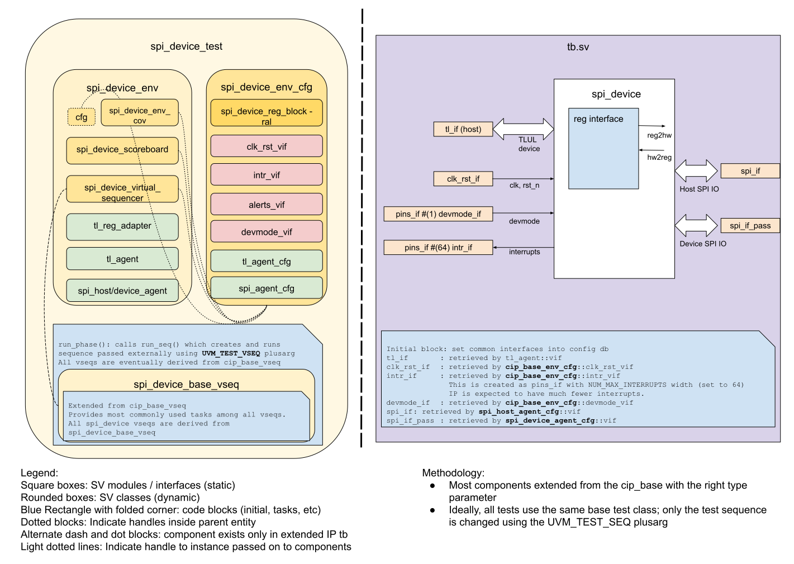

## Goals
* **DV**
  * Verify all SPI Device IP features by running dynamic simulations with a SV/UVM based testbench
  * Develop and run all tests based on the [DV plan](#dv-plan) below towards closing code and functional coverage on the IP and all of its sub-modules
* **FPV**
  * Verify TileLink device protocol compliance with an SVA based testbench

## Current status
* [Design & verification stage]()
  * [HW development stages]()
* [Simulation results](https://reports.opentitan.org/hw/ip/spi_device/dv/latest/results.html)

## Design features
For detailed information on SPI Device design features, please see the [SPI_device design specification]().

## Testbench architecture
SPI Device testbench has been constructed based on the
[CIP testbench architecture]().

### Block diagram


### Top level testbench
Top level testbench is located at `hw/ip/spi_device/dv/tb/tb.sv`. It instantiates the SPI Device DUT module `hw/ip/spi_device/rtl/spi_device.sv`.
In addition, it instantiates the following interfaces, connects them to the DUT and sets their handle into `uvm_config_db`:
* [Clock and reset interface]()
* [TileLink host interface]()
* [SPI interface]()
* Interrupts ([`pins_if`]())

### Common DV utility components
The following utilities provide generic helper tasks and functions to perform activities that are common across the project:
* [common_ifs]()
* [dv_utils_pkg]()
* [csr_utils_pkg]()

### Global types & methods
All common types and methods defined at the package level can be found in
`spi_device_env_pkg`. Some of them in use are:
```systemverilog
parameter uint SRAM_OFFSET = 'h800;
parameter uint SRAM_SIZE   = 2048;
```

### TL_agent
SPI Device instantiates (already handled in CIP base env) [tl_agent]()
which provides the ability to drive and independently monitor random traffic via
TL host interface into SPI Device.

### SPI Device agent
[spi agent]() is used to drive and monitor SPI items.
Following special behavior is supported in spi_host_driver
* Toggle clock when SPI is in idle state (csb=1)
* During data transfer, there may be very long delay between each bit or byte of data

### UVM RAL Model
The SPI Device RAL model is created with the [`ralgen`]() FuseSoC generator script automatically when the simulation is at the build stage.

It can be created manually by invoking [`regtool`]():

### Stimulus strategy
#### Test sequences
All test sequences reside in `hw/ip/spi_device/dv/env/seq_lib`.
The `spi_device_base_vseq` virtual sequence is extended from `cip_base_vseq` and serves as a starting point.
All test sequences are extended from `spi_device_base_vseq`.
It provides commonly used handles, variables, functions and tasks that the test sequences can simple use / call.
Some of the most commonly used tasks / functions are as follows:
* spi_device_init:            Fully randomize SPI Device control following CSRs and configure TX/RX SRAM FIFO size as following
  * clock polarity/phase(CPOL, CPHA), bit direction(tx/rx_order), mode, fifo interrupt level(txlvl, rxlvl)
  * TX/RX SRAM FIFO size: from 100 to 1900 and higher distribute for TX size / RX size = 1, 1/2 or 2/1
* spi_host_xfer_bytes:        Send bytes of data to DUT (SPI Device) through spi_host_driver
* write_device_words_to_send: Write words of data to DUT CSR and update SRAM write pointer, which enables DUT to send data to SPI host.
* read_tx/rx_avail_bytes:     Read CSRs to get how many bytes of available space/data in SRAM memory

#### Functional coverage
To ensure high quality constrained random stimulus, it is necessary to develop a functional coverage model.
The following covergroups have been developed to prove that the test intent has been adequately met:
* common covergroup for interrupts `hw/dv/sv/cip_lib/cip_base_env_cov.sv`: Cover interrupt value, interrupt enable, intr_test, interrupt pin
* TODO, add more

### Self-checking strategy
#### Scoreboard
The `spi_device_scoreboard` is primarily used for end to end checking.
It creates the following analysis fifos to retrieve the data monitored by corresponding interface agents:
* tl_a_chan_fifo, tl_d_chan_fifo:           These 2 fifos provide transaction items at the end of address channel and data channel respectively
* host_spi_data_fifo, device_spi_data_fifo: These 2 fifos provides TX/RX words of data from spi_monitor

#### Assertions
* TLUL assertions: The `tb/spi_device_bind.sv` binds the `tlul_assert` [assertions]() to the IP to ensure TileLink interface protocol compliance.
* Unknown checks on DUT outputs: The RTL has assertions to ensure all outputs are initialized to known values after coming out of reset.

## Building and running tests
We are using our in-house developed [regression tool]() for building and running our tests and regressions.
Please take a look at the link for detailed information on the usage, capabilities, features and known issues.
Here's how to run a smoke test:
```console
$ $REPO_TOP/util/dvsim/dvsim.py $REPO_TOP/hw/ip/spi_device/dv/spi_device_sim_cfg.hjson -i spi_device_smoke
```

## DV plan

