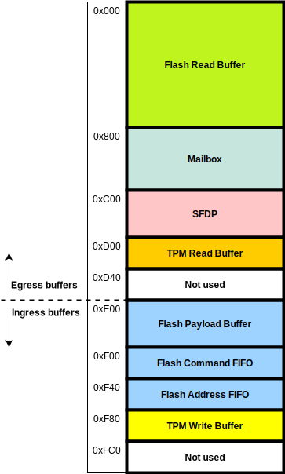

# Programmer's Guide

## Initialization

By default, RX SRAM FIFO base and limit address (via [`RXF_ADDR`](registers.md#rxf_addr) register) are
set to 0x0 and 0x1FC, 512 bytes. And TX SRAM FIFO base and limit addresses (in
the [`TXF_ADDR`](registers.md#txf_addr) register)  are 0x200 and 0x3FC. If FW wants bigger spaces, it can
change the values of the above registers [`RXF_ADDR`](registers.md#rxf_addr) and [`TXF_ADDR`](registers.md#txf_addr).

Software can configure the timer value [`CFG.timer_v`](registers.md#cfg) to change the delay between
partial DATA received from SPI interface being written into the SRAM. The value
of the field is the number of the core clock cycles that the logic waits for.

## Pointers

RX / TX SRAM FIFO has read and write pointers, [`RXF_PTR`](registers.md#rxf_ptr) and [`TXF_PTR`](registers.md#txf_ptr) . Those
pointers are used to manage circular FIFOs inside the SRAM. The pointer width in
the register description is 16 bit but the number of valid bits in the pointers
depends on the size of the SRAM.

The current SRAM size is 2kB and the pointer width is 12 bits, 11bits
representing a byte offset and 1 most-significant bit for indicating phase of
the FIFO. Since they represent bytes, the low 2 bits indicate the offset within
the 32-bit wide SRAM word. The pointers indicate the offset into the area
described by the base and limit values, so the lower bits (11 bits in this case)
of a pointer should not exceed the size in bytes (4 * (limit address - base
address)) reserved for the region (RXF or TXF) that the pointer is in. For
instance, if FW sets RXFIFO depth to 128 (default value), it should not update
the read pointer outside the range 0x000 -  0x1FF (128*4 = 512Bytes ignoring
the phase bit, bit 11).

## Dual-port SRAM Layout

The figure below shows the SRAM layout in the Flash and Passthrough modes.
In generic mode, the whole DPSRAM is used as RX/TX buffers as described in the generic mode section.
The SRAM begins at `0x1000`, which in the figure is `0x000`.



The regions starting from `0xF00` to `0xFFF` are assigned to TPM Read/Write FIFOs.
They are not used in this version of IP.

## SPI Mode Changes

The clock for port B of the dual-port SRAM comes from different sources, depending on which SPI mode is selected.
For the generic mode, the peripheral clock is used, while for flash and passthrough mode, the SPI clock is used.
Since the SPI clock is not active when the SPI interface is idle, the design cannot make use of a glitch-free clock mux that would require a continuously running clock.
Therefore, software has to use the [`CONTROL.sram_clk_en`](registers.md#control) register to gate the clock while switching between modes with different dual-port SRAM clock sources.

For any mode change that involves switching to a different clock source, the following programming sequence must be followed:

1. Software should ensure that the SPI clock is inactive, e.g. by holding the upstream SPI host in reset or signal it to hold off.
2. Clear [`CONTROL.sram_clk_en`](registers.md#control) to 0.
3. Change to the new SPI mode
4. Set [`CONTROL.sram_clk_en`](registers.md#control) to 1.

**Note: This is a limitation of the current `spi_device` that is planned to be removed in a future revision.**

## TPM over SPI

### Initialization

The SW should enable the TPM submodule by writing 1 to the TPM_CFG.en CSR field.
Other SPI_DEVICE features (Generic, Flash, Passthrough) CSRs do not affect the TPM feature.

Update TPM_ACCESS_0, TPM_ACCESS_1 CSRs.
The TPM submodule uses TPM_ACCESS_x.activeLocality to determine if the TPM_STS is returned to the host system.
The SW may configure TPM_CFG.hw_reg_dis and/or TPM_CFG.invalid_locality to fully control the TPM transactions.

### TPM mode: FIFO and CRB

The TPM protocol supports two protocol interfaces: FIFO and CRB (Command Response Buffer).
In terms of hardware design, these two interfaces differ in how return-by-HW registers are handled.

In FIFO mode, when [`TPM_CFG.tpm_mode`](registers.md#tpm_cfg) is set to 0, HW registers reads must be returned after a maximum of 1 wait state.
In CRB mode, when [`TPM_CFG.tpm_mode`](registers.md#tpm_cfg) is set to 1, there are no such restrictions.
The logic always uploads both the command and address to the SW and waits for the return data in CRB mode.

### Return-by-HW register update

The SW manages the return-by-HW registers.
The contents are placed inside the SPI_DEVICE CSRs.
The SW must maintain the other TPM registers outside of the SPI_DEVICE HWIP and use write/read FIFOs to receive the content from/ send the register value to the host system.

When the SW updates the return-by-HW registers, the SW is recommended to read back the register to confirm the value is written.
Due to the CDC issue, the SW is only permitted to update the registers when the TPM CS# is de-asserted.

### TPM Read

1. The host system sends the TPM read command with the address.
1. The SW reads a word from TPM_CMD_ADDR CSR (optional cmdaddr_notempty interrupt).
  1. If the address falls into the return-by-HW registers and TPM_CFG.hw_reg_dis is not set, the HW does not push the command and address bytes into the TPM_CMD_ADDR CSR.
1. The SW prepares the register value and writes the value into the read FIFO.
1. The TPM submodule sends `WAIT` until the read FIFO is available.
   When available, the TPM submodule sends `START` followed by the register value.

### TPM Write

1. The host system sends the TPM write command with the address.
1. The TPM submodule pushes the command and the address to the TPM_CMD_ADDR CSR.
1. The TPM submodule checks the write FIFO status.
1. If not empty, the TPM submodule sends `WAIT` to the host system.
1. When the FIFO is empty, the TPM sends `START` to the host system, receives the payload, and stores the data into the write FIFO.
1. The SW, in the meantime, reads TPM_CMD_ADDR then reads the write FIFO data when the FIFO is available.

### TPM_CMDADDR_NOTEMPTY Interrupt

`TPM_CMDADDR_NOTEMPTY` interrupt remains high even SW clears the interrupt unless the cause is disappeared.
SW should mask the interrupt if SW wants to process the event in a deferred way.

```c
void spi_tpm_isr() {
  uint32_t irq_deferred = 0;
  uint32_t irq_status = spi_tpm_get_irq_status();
  if (irq_status & kSpiTpmFifoIrq) {
    irq_deferred |= kSpiTpmFifoIrq;
    schedule_deferred_work(spi_tpm_deferred_work);
  }
  // ...
  spi_tpm_mask_irq(irq_deferred);
}

void spi_tpm_deferred_work() {
  uint32_t irq_handled = 0;
  uint32_t irq_status = spi_tpm_get_irq_status();
  if (irq_status & kSpiTpmFifoIrq) {
    spi_tpm_handle_fifo_irq();
    irq_handled |= kSpiTpmFifoIrq;
  }
  // ...
  // Now that we think the FIFO has been emptied, clear the latched status.
  spi_tpm_clear_irq_status(irq_handled);
  spi_tpm_unmask_irq(irq_handled);
  // If the FIFO received more data after handling, the interrupt would assert
  // again here.
}
```


### TPM Interrupt

The TPM submodule does not process the TPM over SPI interrupt.
The SW must check TPM_INT_ENABLE, TPM_INT_STATUS and control the GPIO pin that is designated to the TPM over SPI interrupt.

## Device Interface Functions (DIFs)

- [Device Interface Functions](../../../../sw/device/lib/dif/dif_spi_device.h)

## Register Table

* [Register Table](registers.md#registers)
