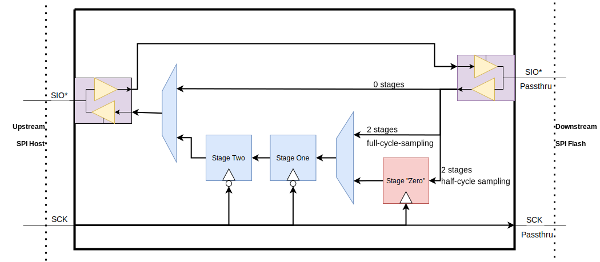

# Theory of Operation

## Block Diagram


When Flash mode is selected, the command parser accepts the first byte of the SPI MOSI line then activates the flash submodules, such as Status, JEDEC, Read command, and Upload function.
The Status logic processes the three Read Status commands.
The SW may configure three bytes of the Flash Status CSR then the Status submodule returns the CSR data into the SPI MISO line.
The SW may configure the Read Status commands' opcodes.

The JEDEC submodule returns the JEDEC Manufacturer ID followed by the additional information.
The Manufacturer ID may vary depending on the company.
For example, lowRISC JEDEC ID `EFh` follows twelve bytes of 7Fh Continuous Codes, requiring a total thirteen bytes for the manufacturer ID.
The SW may configure how many Continuous Codes is needed and the actual manufacturer ID.

The Read submodule processes the Read SFDP (Serial Flash Discoverable Parameters) command, and up to six different types of the read commands.
The read submodule receives address information from the SPI transaction, fetches the data from the read buffer in the DPSRAM, and returns the data on SPI lines (single, dual, quad lines).
If the received address falls into the SW programmable mailbox address space, the logic fetches data not from the read buffer but from the mailbox buffer in the DPSRAM.

SW may configure command information slots to upload the command into the FIFOs and the payload buffer in the DPSRAM.
SW may additionally let HW to set the BUSY bit in the Status register when the HW uploads the command.

In Passthrough mode, the logic filters the incoming transaction if the transaction is not permitted.
The SW may configure the logic to change a portion of the address or first 4 bytes of the payload.

## SPI Flash and Passthrough Modes

### Command Information List

The SW may configure the map from the received opcode to the command process module by programming *cmd_info* list.
Current SPI_DEVICE provides 24 command information entries.
Each entry represents a command.
Details of the fields are explained in the [`CMD_INFO_0`](registers.md#cmd_info)

First 11 commands are assigned to specific submodules.

Index  | Assigned Submodule
-------|--------------------
[2:0]  | Read Status
[3]    | Read JEDEC ID
[4]    | Read SFDP
[10:5] | Read commands

If the IP is in flash mode or in passthrough mode with [`INTERCEPT_EN`](registers.md#intercept_en) set, other than *opcode* and *valid* fields in the command information entries are ignored for Read Status and Read JEDEC ID commands.
The submodules directly return data on the MISO line (SD[1]).
In Passthrough mode, if Read Status and Read JEDEC ID commands are intercepted by the internal HW, the other fields in the command information entries are ignored also.

The main use of the fields other than *opcode* and *valid* is to control the output enable in the passthrough logic.
See [Output Enable Control](#output-enable-control) section for more.

*upload* and *busy* fields are used in the SPI Flash/ Passthrough modes.
See [Command Upload](#command-upload) section for details.

### Command Parser


Command parser (*cmdparse*) processes the first byte of the SPI and activates the processing submodules depending on the received opcode and the *cmd_info* list described in the previous section.

The cmdparse compares the received opcode with the *cmd_info.opcode* data structure.
If any entry matches to the received opcode, the cmdparse hands over the matched command information entry with the index to the corresponding submodule.
As explained in the [previous section](#command-information-list), the command parser checks the index to activate Read Status / Read JEDEC ID/ Read Command / Address 4B modules.
Other than the first 11 slots and last two slots (the last two slots are not visible to SW), the cmdparse checks the *upload* field and activates the upload module if the field is set.

SW can configure whether a submodule should process the command while in the passthrough mode by setting the [`INTERCEPT_EN`](registers.md#intercept_en) CSR.

### Status Control

If the received command is one of the three read status commands, STATUS control module takes over the SPI interface after the opcode.
The 3 bytes status register is not reset by CSb.
Except BUSY bit and WEL bit, other bits are controlled by SW.

BUSY bit is set by HW when it receives any commands that are uploaded to the FIFOs and their `busy` fields are 1 in the command information entry.
SW may clear BUSY bit when it completes the received commands (e.g Erase/ Program).

If BUSY is set, SPI_DEVICE IP blocks the passthrough interface in Passthrough mode.
The blocking of the interface occurs in SPI transaction idle state (CSb == 1).
When SW clears the BUSY bit, it is applied to the STATUS register in the SPI clock domain when SPI clock toggles.
It means the update happens when the next SPI transaction is received.
The BUSY bit in the CSR is the synchronized value of the STATUS BUSY bit in the SPI clock domain.
Due to the CDC latency, SW may see the updated value (BUSY clear) with long delay.

The WEL bit can get updates from both HW and SW.
HW updates WEL bit when it receives WREN(06h) or WRDI(04h) commands.
The opcode can be configured via [`CMD_INFO_WREN`](registers.md#cmd_info_wren) and [`CMD_INFO_WRDI`](registers.md#cmd_info_wrdi).
Meanwhile, SW may clear the WEL bit when it completes the received commands.
Note that SW may only clear the WEL bit.

The SW update of the STATUS register via [`FLASH_STATUS`](registers.md#flash_status) is not instantaneous.
The IP stores the SW request into the asynchronous FIFO then the request is processed in the SPI clock domain.
The request updates the temporal status register, which is called as staged registers in the design.
The staged registers are latched into the committed registers when CSb is released.
SW sees the committed registers when reading the [`FLASH_STATUS`](registers.md#flash_status) CSR.

The attached host system also reads back the committed registers via Read Status commands.
This scheme is to guarantee the atomicity of the STATUS register.
On every 8th SPI clock cycle, the SPI domain commits the latest resolved value to the committed registers.
Each byte beat of the Read Status commands will return the latest committed value of the targeted register.
A Read Status commands can thus repeatedly poll the BUSY bit and see updates in the same transaction.

Again, note that the passthrough gate only updates after CSB makes a 0->1 transition, and it derives its value from the committed BUSY bit.
After the BUSY bit is set, there must be at least one command before the gate will open again.
Typically, a Read Status command follows any command that would set the BUSY bit, to check that the BUSY bit has cleared.
This activity is sufficient to unblock passthrough for the next command.

If the host sends the Write Status commands, the commands are not processed in this module.
SW must configure the remaining command information entries to upload the Write Status commands to the FIFOs.

### JEDEC ID Control

JEDEC module returns JEDEC Device ID and Manufacturer ID following the Continuation Code (CC).
SW may configure [`JEDEC_CC`](registers.md#jedec_cc) CSR for HW to return proper CC.
The *cc* field in [`JEDEC_CC`](registers.md#jedec_cc) defines the return value, which is `0x7F` by default.
*num_cc* defines how many times the HW to send CC byte before sending the JEDEC ID.

The actual JEDEC ID consists of one byte manufacturer ID and two bytes device ID.
The HW sends the manufacturer ID first, then `[7:0]` of the device ID then `[15:8]` byte.

### Serial Flash Discoverable Parameters (SFDP) Control

HW parses SFDP command then fetch the data from SFDP space in the DPSRAM.
HW provides 256B SFDP space.
HW uses lower 8bit of the received 24 bit address to access the DPSRAM.
Upper 16 bits are ignored (aliased).
SW should prepare proper SFDP contents before the host system issues SFDP commands.

HW fetches from the DPSRAM in 4B and returns the data to the SPI line.
HW repeats the operation until CSb is de-asserted.

### Read Command Processor

The read command block has multiple sub-blocks to process normal Read, Fast Read, Fast Read Dual/ Quad from the internal DPSRAM.
The DPSRAM has a 2kB region for the read command access.
The read command region has two 1kB buffers.
If HW receives the read access to the other half of the space first time, then the HW reports to the SW to refill the current 1kB region with new content.

The double buffering scheme aids the SW to prepare the next chunk of data.
SW copies a portion of data (1kB) from the internal flash memory into SPI_DEVICE DPSRAM.
From the host system, the emulated SPI Device is seen more than 2kB storage device with the double buffering scheme.
The assumption is that the host system reads mostly sequentially.

#### Address Handling

For read commands such as Normal Read, Fast Read {Single/ Dual/ Quad} Output commands, the address comes through ID0 only.
The state machine in this block shifts the address one-by-one and decrements the address counter register by 1.

When it reaches the 4B address (`addr[2]`), the module triggers the DPSRAM state machine to fetch data from the DPSRAM.
When the module receives `addr[0]`, at the positive edge of SCK, the module moves to appropriate command state based on the given CMD_INFO data.

If the received address falls into mailbox address range and mailbox feature is enabled, the module turns on the mailbox selection bit.
Then all out-going requests to the DPSRAM are forwarded to the mailbox section, not the read buffer section.

#### Dummy Cycle

The SW may configure the dummy cycle field for each individual read commands.
The default dummy cycle for those commands are 7 (0-based).
The value is the number of cycles.
For example, if SW programs the dummy cycle for Fast Read Quad to `3h`, the module waits 4 cycles then returns data.

#### Pipelined Reads



For commands with dummy cycles, the SPI Device IP can be configured to insert a 2-stage pipeline into the return path to enable higher clock rates.
The high-speed read pipeline is of particular interest to Passthrough mode, as it moves the delay from the SPI Device IP to the Host to another cycle, relaxing the timing requirement.
To use the high-speed read pipeline for Passthrough operation, the SPI Device IP would need to be configured to intercept SFDP reads and advertise 2 additional dummy cycles beyond that specified by the downstream SPI flash.
The ['CMD_INFO'](registers.md#cmd_info) table should have its dummy cycle field programmed for the same number of dummy cycles as the downstream SPI flash.

The high-speed read pipeline can be configured for either full-cycle or half-cycle sampling.
With full-cycle sampling, the first stage samples the read data from the downstream SPI flash a full cycle after it shifts data out (with launching and sampling edges being the same direction).
With half-cycle sampling, a "zeroth" stage samples the read data from the downstream SPI flash half a cycle after it shifts data out (with launching and sampling edges being opposite).
Full-cycle sampling is available to provide the longest period possible for the longer read path of Host -> SPI Device -> SPI Flash -> SPI Device.
However, half-cycle sampling is available if hold time requirements cannot be met for full-cycle sampling.

From a compatibility perspective, the high-speed read pipeline is expected to have broad compatibility for Quad Output Read commands, so long as the Host has some flexibility for the number of dummy cycles.
The 2-stage pipeline also ensures that the transaction ends on full byte boundaries for Quad Output Read.
By contrast, Fast Read and Dual Output Read conventionally require 8 dummy cycles, though Dual Output Read can also advertise a different number in the SFDP.

Note that the pipeline does function for intercepted reads in Passthrough mode.
For example, reads addressed to the mailbox will appear with the same number of dummy cycles as reads that were passed through.

See the ['CMD_INFO'](registers.md#cmd_info) descriptions for the specific programming values.

#### Buffer Management


The SPI Device IP uses the first half of the DPSRAM as a read buffer when the SPI mode is flash or passthrough mode.
The IP returns data from the read buffer based on the given address in the received read command.
In the current version, the read buffer size is 2kB.
The IP only uses lower 11 bits of the received read command address (`addr[10:0]`) to issue the read requests to the DPSRAM.

The read buffer feature is intended for an upstream device's initial firmware load, which manifests as a contiguous block read (typically a single SPI flash read command).
SW is responsible for updating the read buffer contents.
The HW notifies the SW to update the buffer contents when needed.
The HW provides a SW configurable read watermark CSR and read-only [`LAST_READ_ADDR`](registers.md#last_read_addr) CSR.
The **LAST_READ_ADDR** shows the last read address of the recent read command.
For instance, if the host system issues `0xABCD_E000` and reads 128 (or 0x80) bytes, the **LAST_READ_ADDR** after the transaction will show `0xABCD_E07F`.
It does not show the commands falling into the mailbox region or Read SFDP command's address.

The read watermark address width is 1 bit smaller than the read buffer address.
In the current version, the register has 10-bit width.
The HW assumes the SW maintains the read buffer as a double buffer scheme.
When the host system accesses one buffer (1kB), the SW prepares another 1kB by copying data from the internal non-volatile memory.
If the received read address crosses the SW configured watermark address, the HW informs the SW.
SW may configure the watermark CSR low enough so that the SW has enough time to copy over the data.

If a new read command crosses the current buffer boundary, the SW flips the internal buffer index bit and clears the cross event for the HW to detect the address cross event again.

### 4B Address Management (EN4B/ EX4B)

SW may configure the HW to receive EN4B and EX4B commands and change the read command address size between 3 bytes and 4 bytes.
For the IP to recognize EN4B/ EX4B commands, SW should configure [`CMD_INFO_EN4B`](registers.md#cmd_info_en4b) and [`CMD_INFO_EX4B`](registers.md#cmd_info_ex4b).

The two CSRs omit unnecessary fields from the **CMD_INFO** data structure.
The HW logic creates the default **CMD_INFO** structures for the two commands.
The command parser module uses the generated structures to process and trigger the 4B management module.

When the HW receives one of the commands, the HW changes the broadcast signal *cfg_addr_4b_en*.
Also the HW updates [`ADDR_MODE.addr_4b_en`](registers.md#addr_mode) after passing through CDC.
It takes at most three SYS_CLK cycles to update the value in the *ADDR_MODE* register after the completion of the SPI transaction (CSb de-assertion).

_Note: The HW changes the broadcasting signal and the CSR even though the SPI host system sends more than 8 beats of the SPI S[0].
After the logic matches the received command byte with EN4B/ EX4B, the logic ignores the rest of the SPI data._

The broadcasted `cfg_addr_4b_en` signal affects the read commands for which `addr_mode` is *AddrCfg* in their command information entries.

SW may also configure the initial address mode by writing to [`ADDR_MODE.addr_4b_en`](registers.md#addr_mode).
SW must not write to this CSR unless it knows the upstream host is inactive and expects initial values for the next transaction.
After initialization (from the upstream SPI host's perspective), it is a protocol violation for the address mode to change outside the host's explicit commands.
A SW request will set the [`ADDR_MODE.pending`](registers.md#addr_mode) bit, which will remain set until HW consumes the update.
SW will see the intended mode in [`ADDR_MODE.addr_4b_en`](registers.md#addr_mode) until HW completes the request.
However, SW may overwrite the requested value, so long as the SPI host is held inactive.
The request does not complete until the SPI host completes the opcode phase of the transaction, and it will take effect for that same transaction's address phase (if any).

### Command Upload

If the received command meets following conditions, the HW stores the command into the command/ address FIFOs and the payload buffer:

- The command does not match to the first 11 command information entries nor EN4B/ EX4B.
- The command matches to any of the rest command information entries.
- The matched entry has the `upload` field set.

The upload module checks the command information entry to determine whether the address/ payload fields to be uploaded or not.
The `addr_mode` is used to determine the address size in the command.

If `busy` field in the command information entry is set, the upload module also sets *BUSY* bit in the *STATUS* register.
SW may clear the *BUSY* bit after processing the command.

In addition, the HW stores some metadata alongside the opcode in the [`CMD FIFO`](registers.md#upload_cmdfifo).
Included are the state of the address mode, the BUSY status bit, and the WEL status bit at the time the command was uploaded.
With these, SW can determine what size the address should be and whether the uploaded command should be rejected.

The upload module provides [`UPLOAD_STATUS`](registers.md#upload_status) and [`UPLOAD_STATUS2`](registers.md#upload_status2) CSRs for SW to parse the command, address, and payload.
If a received command has payload, SW may read the payload from the Payload buffer starting from `payload_start_idx` address.
In the normal case, `payload_start_idx` in [`UPLOAD_STATUS2`](registers.md#upload_status2) shows **0**.
In the error case of the host sending more than the maximum allowed payload size (256B in the current version), the `payload_start_idx` may not be 0.
It is expected that the `payload_depth` is maximum payload size, 256B if `payload_start_idx` is non-zero.
In this scenario, SW should read from `payload_start_idx` to the end of the payload buffer then do a second read from the beginning of the buffer to the remained bytes.

If the error case above happens, the IP reports the event through the `payload_overflow` interrupt.

### Passthrough

The passthrough module controls the data between a host system and the attached downstream SPI flash device.
It snoops the SPI transactions and intervenes if the transaction is not permitted.
The module also manipulates the data if needed.

#### Command Filtering

Filtering the incoming command is the key role of the Passthrough module.


```wavejson
{ signal: [
  { name: 'CSb_in',  wave: '10.........|....1.'},
  { name: 'SCK_in',  wave: '0.p........|....l.'},
  { name: 'IO[0]_i',  wave: 'z.=..=.=.=.=.=.=.=.=|=.=.=.=.z......',
   data:["C[7]", "C[6]", "C[5]", "C[4]", "C[3]", "C[2]", "C[1]", "C[0]"],
    period:0.5, },
  { name: 'filter',  wave: '0................10.................',
    period:0.5},
  { name: 'filtered', wave: '0.................1.................',
    period:0.5},
  { name: 'SCK_out', wave: '0.p......0........'},
  { name: 'CSb_out', wave: '10................1.................', period:0.5}
  ],
  head:{
    text: 'Command Filtering',
    tick: ['-2 -1 0 n-1 n+' ]
  }
}
```

The passthrough logic filters the command based on the 256 bit of [`CMD_FILTER_0`](registers.md#cmd_filter_0) CSR.
Each bit corresponds to each opcode.
For example, if bit 5 of [`CMD_FILTER_0`](registers.md#cmd_filter_0) is set, the passthrough drops **CSb** when it receives `05h` SPI command.

The SW does not know whether a SPI transaction is filtered or not.
If the SW wants to check, it needs to set the _upload_ field with the opcode in the command information list.
Then, the HW uploads the command into the command/ address FIFOs and the payload buffer.

#### Address Manipulation

SW may configure the passthrough logic to swap certain address bits to desired values by configuring [`ADDR_SWAP_MASK`](registers.md#addr_swap_mask) and [`ADDR_SWAP_DATA`](registers.md#addr_swap_data) CSRs.
The address translation takes in effect only when the received command is in the command information list and *addr_swap_en* field in the entry is set.

For instance, the passthrough logic sets bit 20 of the address to 1 if [`ADDR_SWAP_MASK`](registers.md#addr_swap_mask) is `0x0010_0000` and [`ADDR_SWAP_DATA`](registers.md#addr_swap_data) is `0x0010_0000`.

#### Write Status Data Manipulation

The passthrough logic also provides a way to change the first 4 bytes of the payload to the downstream SPI flash device on-the-fly as same as the address.
The main use of this feature is to protect the Status register.

SW may configure the [`PAYLOAD_SWAP_MASK`](registers.md#payload_swap_mask) and [`PAYLOAD_SWAP_DATA`](registers.md#payload_swap_data) CSRs to change the specific bit of the first 4 byte of the write payload.
For example, [`PAYLOAD_SWAP_MASK`](registers.md#payload_swap_mask) as `32'h 0000_0023` and [`PAYLOAD_SWAP_DATA`](registers.md#payload_swap_data) as `32'h 0000_0022` change bit 0 to 0, bit 1 to 1, bit 5 to 1 in the first byte payload.

The CSRs are Little Endian (LE)s.
The passthrough module consumes the lower byte first as SPI flash writes byte 0 first followed by byte 1.
For example, bit `[7:0]` is processed then `[15:8]`, `[23:16]`, and `[31:24]` at last.

The CSRs affect the commands that have *payload_swap_en* as 1 in their command list entries.
SW may use additional command information slots for the passthrough (index 11 to 23).
SW must configure *payload_dir* to **PayloadIn** and *payload_en* to `4'b 0001` in order for the payload translation feature to work correctly.

#### Output Enable Control

Passthrough module controls the output enable signals on both host and downstream sides.
Controlling the output enable ports is critical to not overdrive the PAD directions.
The information of the pad enable and direction is given by SW.
SW configures the address size, payload lanes, dummy size in **CMD_INFO** slots.

If passthrough logic does not find valid command information entry based on the received opcode, it assumes the command is **PayloadIn** Single IO command.
SW is recommended to set the filter bit for Passthrough to not deliver the unmatched command to the downstream flash device.

#### Internally processed Commands

As described in [SPI Device Modes](../README.md#spi-device-modes-and-active-submodules), SPI_DEVICE may return the data from the IP even if the passthrough mode is set.
The HW can process Read Status, Read JEDEC ID, Read SFDP, Read commands accessing the mailbox region, and EN4B/EX4B.

SW configures [`INTERCEPT_EN`](registers.md#intercept_en) CSR to enable the feature.
SW may selectively enable/disable commands.
For example, HW returns only Read Status data internally if [`INTERCEPT_EN`](registers.md#intercept_en) is `{status: 1'b 1, default: 1'b 0}`.

Other than Read command accessing mailbox space, it is recommended to filter the intercepted commands.

## TPM over SPI


The TPM over SPI submodule processes the low level data only, and it is not compliant with the SPI TPM command timing specifications.
The TPM submodule parses the incoming SPI MOSI line and stacks the stream up to the SW accessible registers, such as TPM_CMD_ADDR and the write FIFO buffer.
The SW must decode the command and the address.
Then the SW reads the data from the write FIFO or pushes data into the read FIFO depending on the command.

The TPM submodule returns appropriate data for read commands depending on the current read FIFO status, the received address, and the Locality.
The module sends bytes from the return-by-HW registers to the parallel-to-serial logic right after the address phase when the received address falls into the HW managed registers.

The TPM specification mandates the TPM module to return the data right after the address phase or send the WAIT at the last bit of the address phase.
The address of the return-by-HW registers has a 4B boundary.
The TPM submodule has enough time to determine if the incoming address falls into the return-by-HW registers or not.
As the logic decides if the HW returns data or waits for the SW response at the address[2] bit phase, the logic always sends `WAIT(0x00)` at the last byte of the incoming address phase.
The module sends `START(0x01)` at the next byte followed by the actual return-by-HW value if the received address falls into the list of the return-by-HW registers.

The module, by default, returns `WAIT` when the address does not fall into the return-by-HW register address.
In the wait state, the TPM submodule watches the read FIFO status.
The module stays in the wait state until the read FIFO has the data >= requested transfer size.
The module sends `START` at the next byte when the read FIFO has enough data.
Then the module pops data from the read FIFO and sends the data over SPI.

The TPM submodule accepts the payload for the TPM write command without the `WAIT` state if the write and command FIFOs are empty.
In other case, the TPM submodule sends `WAIT` until the write and command FIFOs become available (empty).

### Configuring Return-by-HW registers

The return-by-HW register values come from the SW read-writable CSRs.
The module latches the CSRs from the SYS_CLK domain into the SPI SCK domain when CSb is asserted.
The SW is allowed to modify the return-by-HW registers when CSb is not active.

The [TCG PC Client Platform TPM Profile][TPM PCCP] spec describes in the section 6 that the TPM device returns registers values based on the received locality (address[15:12]) and the `TPM_ACCESS_x.activeLocality`.
The HW uses `TPM_ACCESS_x.activeLocaltiy` and the address bit 15:12 to determine what value the logic should return.
If `invalid_locality` configuration is set, the logic returns `INVALID` value to the host system, when the host system sends a read request to the Locality greater than 4.
If the request is in the supported locality (0-4), the logic checks `TPM_ACCESS_x.activeLocality` then returns data based on the table 39 in the spec for Return-by-HW registers.
Other registers in the table should be processed by SW.

Note that firmware is in the loop to process write commands to these registers.
Consequently, the TPM over SPI submodule cannot meet timing requirements for updated data to be available within one wait state.
Once firmware writes the CSRs, the submodule can return the data as specified, however.

## Detecting Reliability Errors

This version of the SPI_DEVICE IP implements the parity to detect bit flip errors on the internal SRAM.
The HW checks the parity error when the SW reads data from the SRAM.
The error is reported to the SW via TL D channel error signal.
SW is recommended to discard the current context if any transaction is ongoing then to reset the IP.

# Design Details

## Clock and Phase

The SPI device module only internally supports mode 0, where data is shifted out on the falling edge and sampled on the rising edge, and SPI clock returns to low at the end of the transaction.
For further details, please refer to this diagram from Wikipedia:
[File:SPI_timing_diagram2.svg](https://en.wikipedia.org/wiki/Serial_Peripheral_Interface#/media/File:SPI_timing_diagram2.svg)
