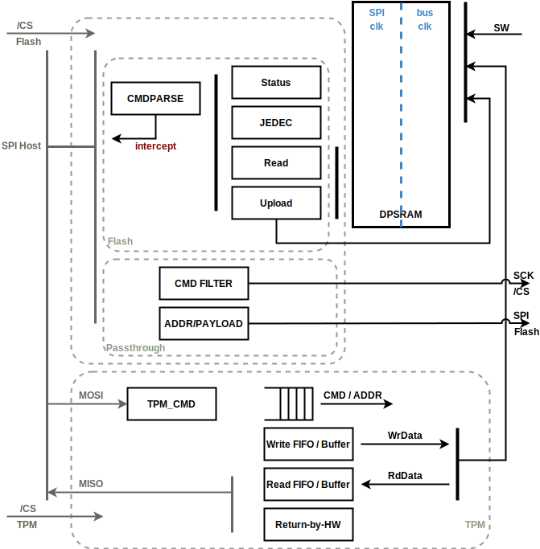

# Theory of Operation

## Block Diagram



In Generic mode, the incoming data is stored byte-based into an asynchronous FIFO.
The logic inside the generic mode then updates the DPSRAM RX space.
The logic also reads data from the DPSRAM then pushes out to the SPI MISO line.

The Generic mode uses the entire DPSRAM space exclusively.
The TX/RX size in the DPSRAM can be changed by compile-time parameters.

When Flash mode is selected, the command parser accepts the first byte of the SPI MOSI line then activates the flash submodules, such as Status, JEDEC, Read command, and Upload function.
The Status logic processes the three Read Status commands.
The SW may configure three bytes of the Flash Status CSR then the Status submodule returns the CSR data into the SPI MISO line.
The SW may configure the Read Status commands' opcodes.

The JEDEC submodule returns the JEDEC Manufacturer ID followed by the additional information.
The Manufacturer ID may vary depending on the company.
For example, lowRISC JEDEC ID `EFh` follows twelve bytes of 7Fh Continuous Codes, requiring a total thirteen bytes for the manufacturer ID.
The SW may configure how many Continuous Codes is needed and the actual manufacturer ID.

The Read submodule processes the Read SFDP (Serial Flash Discoverable Parameters) command, and up to six different types of the read commands.
The read submodule receives address information from the SPI transaction, fetches the data from the read buffer in the DPSRAM, and returns the data on SPI lines (single, dual, quad lines).
If the received address falls into the SW programmable mailbox address space, the logic fetches data not from the read buffer but from the mailbox buffer in the DPSRAM.

SW may configure command information slots to upload the command into the FIFOs and the payload buffer in the DPSRAM.
SW may additionally let HW to set the BUSY bit in the Status register when the HW uploads the command.

In Passthrough mode, the logic filters the incoming transaction if the transaction is not permitted.
The SW may configure the logic to change a portion of the address or first 4 bytes of the payload.

## SPI Device Generic mode


The block diagram above shows how the SPI Device generic mode converts incoming
bit-serialized SDI data into a valid byte, where the data bit is valid when the
chip select signal (CSB) is 0 (active low) and SCK is at positive or negative
edge (configurable, henceforth called the "active edge"). The bit order within
the byte is determined by [`CFG.rx_order`](registers.md#cfg) configuration register field. After a
byte is gathered, the interface module writes the byte data into a small FIFO
("RXFIFO") using SCK. It is read out of the FIFO and written into to the
buffer SRAM ("DP_SRAM") using the system bus clock. If RXFIFO is full, this is
an error condition and the interface module discards the byte.

The interface module also serializes data from the small transmit FIFO
("TXFIFO") and shifts it out on the SDO pin when CSB is 0 and SCK is at the
active edge. The bit order within the byte can be configured with configuration
register field [`CFG.tx_order`](registers.md#cfg). It is expected that software has prepared TX data
based on the description in the "Defining
Firmware Operation Mode" section below. Since SCK is not under the control of
software or the device (it is driven by the external SPI host), it is possible
that there is no data ready in the TXFIFO when chip select becomes active and
the interface needs to send data on the SDO pin. Either software has not
prepared TX data or software does not care about the contents of the TX data -
then the hardware will send whatever lingering data is in the empty TXFIFO. If
this is a functional issue, then software should at least soft-reset the contents
of the TXFIFO using the [`CONTROL.rst_txfifo`](registers.md#control) register. The soft-reset signal
is not synchronized to the SCK clock, so software should drive the reset
signal when the SPI interface is idle.

### General Data Transfer on Pins

Data transfers with the SPI device module involve four peripheral SPI pins: SCK,
CSB, SDI, SDO. SCK is the SPI clock driven by an external SPI host. CSB (chip
select bar) is an active low enable signal that frames a transfer, driven by the
external host. Transfers with active SCK edges but inactive (high) CSB are
ignored. Data is driven into the SPI device on the SDI pin ("Serial Data
In", though we're otherwise using host/device terminology) and driven out on
SDO. Any transfer length is legal, though higher level protocols typically
assume word width boundaries. See details on protocols and transfers that
follow. The diagram below shows a typical transfer, here for 8 bytes (64 cycles,
showing the beginning and end of the transfer). Configurability for active
edges, polarities, and bit orders are described later.

```wavejson
{ signal: [
  { name: 'CSB',  wave: '10.........|....1.'},
  { name: 'SCK',  wave: '0.p........|....l.'},
  { name: 'SDI',  wave: 'z.=..=.=.=.=.=.=.=.=.=|=.=.=.=.z....',
    data:['R07','R06','R05','R04','R03','R02','R01','R00','R17',
          '','R73','R72','R71','R70'], period:0.5, },
  { name: 'SDO',  wave: 'z.=..=.=.=.=.=.=.=.=.=|=.=.=.=.z....',
    data:['T07','T06','T05','T04','T03','T02','T01','T00','T17',
          '','T73','T72','T71','T70'], period:0.5}],
  head:{
    text: 'Data Transfer',
    tick: ['-2 -1 0 1 2 3 4 5 6 7 8 9 60 61 62 63     ']
  }
}
```


### Defining "Firmware Operation Mode"

Firmware operation mode, as implemented by this SPI device, is used to bulk copy data in
and out of the chip using the pins as shown above. In general, it is used to
load firmware into the chip, but can be used for any data transfer into or out
of the chip. The transfers are "generic" in the sense that there is no
addressing or overarching protocol involved. Data transferred into the chip goes into a SPI Device
circular buffer implemented in an SRAM, and firmware decides what to do with the
data. Data transferred out of the chip comes out of a circular buffer in an
SRAM. Software can build any number of higher level protocols on top of this
basic mechanism. All transfers are by definition full duplex: whenever an active
SCK edge is received, a bit of RX data is latched into the peripheral, and a bit
of TX data is sent out of the peripheral. If transfers only require
unidirectional movement of data, the other direction can be ignored but will
still be active. For instance, if only receive data is needed in the transfer,
the device will still be transmitting data out on the TX ("SDO") pin.

### SPI Generic Protocol

The primary protocol considered is one used by an external SPI host to send
chunks of firmware data into the device in the receive direction, confirming the
contents with an echo back of a hash of the received data in the transmit
direction. This is generally termed the 'SPI Generic' protocol, since SPI is used to
send firmware into device memory, brokered by software confirming integrity
of the received firmware data. This special case will be described first, and
then a generic understanding of how firmware mode operates will follow.

The following diagram shows the expected data transfer in SPI Generic mode.


In this diagram, bursts of data transfer are shown as "pages" of firmware
content being driven into the device. The size of the page is not relevant,
though it must be less than the size of the internal SPI Device SRAM. Typically
the SRAM is divided in half for RX and TX buffers, but the boundary is
configurable. The total size of RX and TX buffer must fit in the SPI device
SRAM. Since the external SPI Host is in charge of the clock (SCK), it controls
all aspects of the transfer, including the size of the page. But it is done in
coordination with software running on the device that manages the higher level
protocol.

The protocol assumes that for each page written into the device, a response will
be prepared for the next page. But since the SPI Device is always transmitting
during every received page, the first transmitted page can be ignored. After the
first page is received, software will get alerted as to its completion (via an
RX interrupt), and will execute whatever integrity check is required on that
data. It can then prepare its response to page zero by writing into the SPI
Device TX buffer. What it writes into the TX buffer the concern of the
higher level protocol. It could be a "good" indication, a full echo of the RX
data, or a hash of the received contents. The decision is not in scope for this
specification.

Clearly there is a potential race condition here as a new page could begin to be
received before software has prepared the transmit response to page zero
(including the time to read data out of the SRAM), but that is a condition that
the higher level protocol must prepare for. That protocol is not in scope for
this document, but some hints to its implementation are given in the
programmers guide section below.

The transfer continues until all received data is taken in, and responded back.
In this protocol the last "received" page of data is a "don't care" as long
as the response is transmitted successfully.

### Firmware Operation Mode

Taking this example as a guide, we can see the general method of the SPI
Firmware Operation Mode. On every active SCK clock edge, data is received from the SDI
pin into the SPI device, and data is transmitted on the SDO pin. Received data
is gathered into bytes and written into the RX circular buffer in the SPI Device
SRAM as it is accumulated. Whatever data exists in the TX circular buffer is
serialized and transmitted. Transfers are framed using the active low chip
select pin SCB. What happens when data arrives and the RX circular buffer is
full, or when the transmitter encounters an empty TX circular buffer are
error conditions discussed in the Design Details section that follows.

### RXFIFO, TXFIFO, and DP_SRAM

The relationship between the Dual Port SRAM (DP_SRAM) and the RX and TXFIFOs
should be explained. The SRAM is divided into a section for the transmit
direction, named TXF, and a section for the receive direction, named RXF. Each
section has its own read and write pointer. The SRAM may be read and written by
software at any time, but for correct normal operation it will only write the
empty area of the TXF (between the write pointer and read pointer) and only read
the full area of the RXF (between the read pointer and write pointer) with the
other areas used by the hardware. It is first worth noting that the hardware
implications of the asynchronous nature of SCK and the fact it may not be free
running, complicate some of the logic. The full feature set of that interface
logic (clocked by SCK) includes the serial to parallel converter for RX data,
the parallel-to-serial converter for TX data, and the interfaces to RXFIFO and
TXFIFO. Before the first bit transfer and after the last SCK is stopped,
there is no clock for any of this logic.  So for instance there is no guarantee
of the two-clock-edges normally required for asynchronous handshaking protocols.
The RXFIFO and TXFIFO exist to facilitate this situation.

In the receive direction, data gathered from the SDI pin is written into the
RXFIFO (see details below) at appropriate size boundaries. This data is
handshake-received on the core clock side, gathered into byte or word quantity,
and written into the RX circular buffer of the dual-port SRAM. On each write,
the RXF write pointer ([`RXF_PTR.wptr`](registers.md#rxf_ptr)) is incremented by hardware, wrapping at
the size of the circular buffer. Software can watch (via polling or interrupts)
the incrementing of this write pointer to determine how much valid data has been
received, and determine when and what data to act upon. Once it has acted upon
data, the software should update the RXF read pointer to indicate that space in
the SRAM is available for future writes by the hardware. If incrementing the
write pointer would result in it becoming equal to the read pointer then the RXF
is full and any subsequently received data will be discarded. Thus in normal
operation, the RXF write pointer is updated automatically by hardware and the RXF
read pointer is managed by software. As an optimization the hardware will
normally only write to the 32-bit wide SRAM when an entire word can be written.
Since the end of the received data may not be aligned, there is a timer that
forces sub-word writes if data has been staged for too long. The timer value
([`CFG.timer_v`](registers.md#cfg)) represents the number of core clock cycles. For instance, if
timer value is configured in 0xFF, the RXF control logic will write gathered
sub-word data in 255 cycles if no further bit stream from SPI is received.

In the transmit direction, things are a little more tricky. Since the pin
interface logic begins transmitting data on its very first SCK edge, there are
no previous clock edges in the interface side of the fifo to allow an empty flag
to be updated. The interface  must *blindly* take whatever data is at the
read pointer of the TXFIFO (in a typical asynchronous FIFO with free-running
clocks the pointers can always be sent across the asynchronous boundary to
determine if the FIFO is truly empty or not). Hence the need to potentially send
out garbage data if software has not prepared the TXFIFO in time.

The software writes data that it wants to transmit into the TXF circular buffer
of the DP_SRAM buffer. It then passes the data to the hardware by moving the TXF
write pointer to point to the next location after the data (this is the location
it will use to start the data for the next transmission). Hardware that manages
the TXFIFO detects the change in TXF write pointer and begins reading from the
SRAM and prefilling the TXFIFO until it is full or until all valid TXF data has
been read. This prepares the TXFIFO with the desired data for when the next SCK
data arrives. As the SCK domain logic pulls data out of the TXFIFO to transmit
on the SDO pin, that TXFIFO read is detected (after synchronization to the core
clock domain) and potentially another word of data is read from the SRAM and
written into the TXFIFO. Each time the SRAM is read the hardware increments the
TXF read pointer making the space available to software. Like above, though
conversely, in normal operation the TXF write pointer is managed completely by
software and the TXF read pointer is incremented by hardware.

All reads and writes to/from the SRAM for RXF and TXF activity are managed by
direct reads and writes through the TLUL bus interface, managed by the
auto-generated register file control logic.

## SPI Flash and Passthrough Modes

### Command Information List

The SW may configure the map from the received opcode to the command process module by programming *cmd_info* list.
Current SPI_DEVICE provides 24 command information entries.
Each entry represents a command.
Details of the fields are explained in the [`CMD_INFO_0`](registers.md#cmd_info)

First 11 commands are assigned to specific submodules.

Index  | Assigned Submodule
-------|--------------------
[2:0]  | Read Status
[3]    | Read JEDEC ID
[4]    | Read SFDP
[10:5] | Read commands

If the IP is in flash mode or in passthrough mode with [`INTERCEPT_EN`](registers.md#intercept_en) set, other than *opcode* and *valid* fields in the command information entries are ignored for Read Status and Read JEDEC ID commands.
The submodules directly return data on the MISO line (SD[1]).
In Passthrough mode, if Read Status and Read JEDEC ID commands are intercepted by the internal HW, the other fields in the command information entries are ignored also.

The main use of the fields other than *opcode* and *valid* is to control the output enable in the passthrough logic.
See [Output Enable Control](#output-enable-control) section for more.

*upload* and *busy* fields are used in the SPI Flash/ Passthrough modes.
See [Command Upload](#command-upload) section for details.

### Command Parser


Command parser (*cmdparse*) processes the first byte of the SPI and activates the processing submodules depending on the received opcode and the *cmd_info* list described in the previous section.

The cmdparse compares the received opcode with the *cmd_info.opcode* data structure.
If any entry matches to the received opcode, the cmdparse hands over the matched command information entry with the index to the corresponding submodule.
As explained in the [previous section](#command-information-list), the command parser checks the index to activate Read Status / Read JEDEC ID/ Read Command / Address 4B modules.
Other than the first 11 slots and last two slots (the last two slots are not visible to SW), the cmdparse checks the *upload* field and activates the upload module if the field is set.

SW can configure whether a submodule should process the command while in the passthrough mode by setting the [`INTERCEPT_EN`](registers.md#intercept_en) CSR.

### Status Control

If the received command is one of the three read status commands, STATUS control module takes over the SPI interface after the opcode.
The 3 bytes status register is not reset by CSb.
Except BUSY bit and WEL bit, other bits are controlled by SW.

BUSY bit is set by HW when it receives any commands that are uploaded to the FIFOs and their `busy` fields are 1 in the command information entry.
SW may clear BUSY bit when it completes the received commands (e.g Erase/ Program).

If BUSY is set, SPI_DEVICE IP blocks the passthrough interface in Passthrough mode.
The blocking of the interface occurs in SPI transaction idle state (CSb == 1).
When SW clears the BUSY bit, it is applied to the STATUS register in the SPI clock domain when SPI clock toggles.
It means the update happens when the next SPI transaction is received.
The BUSY bit in the CSR is the synchronized value of the STATUS BUSY bit in the SPI clock domain.
Due to the CDC latency, SW may see the updated value (BUSY clear) with long delay.

WEL bit can be controlled by SW and also by HW.
HW updates WEL bit when it receives WREN(06h) or WRDI(04h) commands.
The opcode can be configured via [`CMD_INFO_WREN`](registers.md#cmd_info_wren) and [`CMD_INFO_WRDI`](registers.md#cmd_info_wrdi).

The SW update of the STATUS register via [`FLASH_STATUS`](registers.md#flash_status) is not instantaneous.
The IP stores the SW request into the asynchronous FIFO then the request is processed in the SPI clock domain.
The request updates the temporal status register, which is called as staged registers in the design.
The staged registers are latched into the committed registers when CSb is released.
SW sees the committed registers when reading the [`FLASH_STATUS`](registers.md#flash_status) CSR.

The attached host system also reads back the committed registers via Read Status commands.
This scheme is to guarantee the atomicity of the STATUS register.

If the host sends the Write Status commands, the commands are not processed in this module.
SW must configure the remaining command information entries to upload the Write Status commands to the FIFOs.

### JEDEC ID Control

JEDEC module returns JEDEC Device ID and Manufacturer ID following the Continuation Code (CC).
SW may configure [`JEDEC_CC`](registers.md#jedec_cc) CSR for HW to return proper CC.
The *cc* field in [`JEDEC_CC`](registers.md#jedec_cc) defines the return value, which is `0x7F` by default.
*num_cc* defines how many times the HW to send CC byte before sending the JEDEC ID.

The actual JEDEC ID consists of one byte manufacturer ID and two bytes device ID.
The HW sends the manufacturer ID first, then `[7:0]` of the device ID then `[15:8]` byte.

### Serial Flash Discoverable Parameters (SFDP) Control

HW parses SFDP command then fetch the data from SFDP space in the DPSRAM.
HW provides 256B SFDP space.
HW uses lower 8bit of the received 24 bit address to access the DPSRAM.
Upper 16 bits are ignored (aliased).
SW should prepare proper SFDP contents before the host system issues SFDP commands.

HW fetches from the DPSRAM in 4B and returns the data to the SPI line.
HW repeats the operation until CSb is de-asserted.

### Read Command Processor

The read command block has multiple sub-blocks to process normal Read, Fast Read, Fast Read Dual/ Quad from the internal DPSRAM.
The DPSRAM has a 2kB region for the read command access.
The read command region has two 1kB buffers.
If HW receives the read access to the other half of the space first time, then the HW reports to the SW to refill the current 1kB region with new content.

The double buffering scheme aids the SW to prepare the next chunk of data.
SW copies a portion of data (1kB) from the internal flash memory into SPI_DEVICE DPSRAM.
From the host system, the emulated SPI Device is seen more than 2kB storage device with the double buffering scheme.
The assumption is that the host system reads mostly sequentially.

#### Address Handling

For read commands such as Normal Read, Fast Read {Single/ Dual/ Quad} Output commands, the address comes through ID0 only.
The state machine in this block shifts the address one-by-one and decrements the address counter register by 1.

When it reaches the 4B address (`addr[2]`), the module triggers the DPSRAM state machine to fetch data from the DPSRAM.
When the module receives `addr[0]`, at the positive edge of SCK, the module moves to appropriate command state based on the given CMD_INFO data.

If the received address falls into mailbox address range and mailbox feature is enabled, the module turns on the mailbox selection bit.
Then all out-going requests to the DPSRAM are forwarded to the mailbox section, not the read buffer section.

#### Dummy Cycle

The SW may configure the dummy cycle field for each individual read commands.
The default dummy cycle for those commands are 7 (0-based).
The value is the number of cycles.
For example, if SW programs the dummy cycle for Fast Read Quad to `3h`, the module waits 4 cycles then returns data.

#### Buffer Management


The SPI Device IP uses the first half of the DPSRAM as a read buffer when the SPI mode is flash or passthrough mode.
The IP returns data from the read buffer based on the given address in the received read command.
In the current version, the read buffer size is 2kB.
The IP only uses lower 11 bits of the received read command address (`addr[10:0]`) to issue the read requests to the DPSRAM.

SW is responsible for updating the read buffer contents.
The HW notifies the SW to update the buffer contents when needed.
The HW provides a SW configurable read watermark CSR and read-only [`LAST_READ_ADDR`](registers.md#last_read_addr) CSR.
The **LAST_READ_ADDR** shows the last read address of the recent read command.
For instance, if the host system issues `0xABCD_E000` and reads 128 (or 0x80) bytes, the **LAST_READ_ADDR** after the transaction will show `0xABCD_E07F`.
It does not show the commands falling into the mailbox region or Read SFDP command's address.

The read watermark address width is 1 bit smaller than the read buffer address.
In the current version, the register has 10-bit width.
The HW assumes the SW maintains the read buffer as a double buffer scheme.
When the host system accesses one buffer (1kB), the SW prepares another 1kB by copying data from the internal non-volatile memory.
If the received read address crosses the SW configured watermark address, the HW informs the SW.
SW may configure the watermark CSR low enough so that the SW has enough time to copy over the data.

If a new read command crosses the current buffer boundary, the SW flips the internal buffer index bit and clears the cross event for the HW to detect the address cross event again.

### 4B Address Management (EN4B/ EX4B)

SW may configure the HW to receive EN4B and EX4B commands and change the read command address size between 3 bytes and 4 bytes.
For the IP to recognize EN4B/ EX4B commands, SW should configure [`CMD_INFO_EN4B`](registers.md#cmd_info_en4b) and [`CMD_INFO_EX4B`](registers.md#cmd_info_ex4b).

The two CSRs omit unnecessary fields from the **CMD_INFO** data structure.
The HW logic creates the default **CMD_INFO** structures for the two commands.
The command parser module uses the generated structures to process and trigger the 4B management module.

When the HW receives one of the commands, the HW changes the broadcast signal *cfg_addr_4b_en*.
Also the HW updates [`CFG.addr_4b_en`](registers.md#cfg) after passing through CDC.
It takes at most three SYS_CLK cycles to update the value in the *CFG* register after the completion of the SPI transaction (CSb de-assertion).

_Note: The HW changes the broadcasting signal and the CSR even though the SPI host system sends more than 8 beats of the SPI S[0].
After the logic matches the received command byte with EN4B/ EX4B, the logic ignores the rest of the SPI data._

The broadcasted `cfg_addr_4b_en` signal affects the read commands which `addr_mode` is *AddrCfg* in their command information entries.

### Command Upload

If the received command meets following conditions, the HW stores the command into the command/ address FIFOs and the payload buffer:

- The command does not match to the first 11 command information entries nor EN4B/ EX4B.
- The command matches to any of the rest command information entries.
- The matched entry has the `upload` field set.

The upload module checks the command information entry to determine whether the address/ payload fields to be uploaded or not.
The `addr_mode` is used to determine the address size in the command.

If `busy` field in the command information entry is set, the upload module also sets *BUSY* bit in the *STATUS* register.
SW may clear the *BUSY* bit after processing the command.

The upload module provides [`UPLOAD_STATUS`](registers.md#upload_status) and [`UPLOAD_STATUS2`](registers.md#upload_status2) CSRs for SW to parse the command, address, and payload.
If a received command has payload, SW may read the payload from the Payload buffer starting from `payload_start_idx` address.
In normal case, `payload_start_idx` in [`UPLOAD_STATUS2`](registers.md#upload_status2) shows **0**.
In error case of the host sending more than the maximum allowed payload size (256B in the current version), the `payload_start_idx` may not be 0.
It is expected that the `payload_depth` is maximum payload size, 256B if `payload_start_idx` is non-zero.
In this scenario, SW should read from `payload_start_idx` to the end of the payload buffer then do a second read from the beginning of the buffer to the remained bytes.

If the error case above happens, the IP reports the event through the `payload_overflow` interrupt.

### Passthrough

The passthrough module controls the data between a host system and the attached downstream SPI flash device.
It snoops the SPI transactions and intervenes if the transaction is not permitted.
The module also manipulates the data if needed.

#### Command Filtering

Filtering the incoming command is the key role of the Passthrough module.


```wavejson
{ signal: [
  { name: 'CSb_in',  wave: '10.........|....1.'},
  { name: 'SCK_in',  wave: '0.p........|....l.'},
  { name: 'IO[0]_i',  wave: 'z.=..=.=.=.=.=.=.=.=|=.=.=.=.z......',
   data:["C[7]", "C[6]", "C[5]", "C[4]", "C[3]", "C[2]", "C[1]", "C[0]"],
    period:0.5, },
  { name: 'filter',  wave: '0................10.................',
    period:0.5},
  { name: 'filtered', wave: '0.................1.................',
    period:0.5},
  { name: 'SCK_out', wave: '0.p......0........'},
  { name: 'CSb_out', wave: '10................1.................', period:0.5}
  ],
  head:{
    text: 'Command Filtering',
    tick: ['-2 -1 0 n-1 n+' ]
  }
}
```

The passthrough logic filters the command based on the 256 bit of [`CMD_FILTER_0`](registers.md#cmd_filter_0) CSR.
Each bit corresponds to each opcode.
For example, if bit 5 of [`CMD_FILTER_0`](registers.md#cmd_filter_0) is set, the passthrough drops **CSb** when it receives `05h` SPI command.

The SW does not know whether a SPI transaction is filtered or not.
If the SW wants to check, it needs to set the _upload_ field with the opcode in the command information list.
Then, the HW uploads the command into the command/ address FIFOs and the payload buffer.

#### Address Manipulation

SW may configure the passthrough logic to swap certain address bits to desired values by configuring [`ADDR_SWAP_MASK`](registers.md#addr_swap_mask) and [`ADDR_SWAP_DATA`](registers.md#addr_swap_data) CSRs.
The address translation takes in effect only when the received command is in the command information list and *addr_swap_en* field in the entry is set.

For instance, the passthrough logic sets bit 20 of the address to 1 if [`ADDR_SWAP_MASK`](registers.md#addr_swap_mask) is `0x0010_0000` and [`ADDR_SWAP_DATA`](registers.md#addr_swap_data) is `0x0010_0000`.

#### Write Status Data Manipulation

The passthrough logic also provides a way to change the first 4 bytes of the payload to the downstream SPI flash device on-the-fly as same as the address.
The main use of this feature is to protect the Status register.

SW may configure the [`PAYLOAD_SWAP_MASK`](registers.md#payload_swap_mask) and [`PAYLOAD_SWAP_DATA`](registers.md#payload_swap_data) CSRs to change the specific bit of the first 4 byte of the write payload.
For example, [`PAYLOAD_SWAP_MASK`](registers.md#payload_swap_mask) as `32'h 0000_0023` and [`PAYLOAD_SWAP_DATA`](registers.md#payload_swap_data) as `32'h 0000_0022` change bit 0 to 0, bit 1 to 1, bit 5 to 1 in the first byte payload.

The CSRs are Little Endian (LE)s.
The passthrough module consumes the lower byte first as SPI flash writes byte 0 first followed by byte 1.
For example, bit `[7:0]` is processed then `[15:8]`, `[23:16]`, and `[31:24]` at last.

The CSRs affect the commands that have *payload_swap_en* as 1 in their command list entries.
SW may use additional command information slots for the passthrough (index 11 to 23).
SW must configure *payload_dir* to **PayloadIn** and *payload_en* to `4'b 0001` in order for the payload translation feature to work correctly.

#### Output Enable Control

Passthrough module controls the output enable signals on both host and downstream sides.
Controlling the output enable ports is critical to not overdrive the PAD directions.
The information of the pad enable and direction is given by SW.
SW configures the address size, payload lanes, dummy size in **CMD_INFO** slots.

If passthrough logic does not find valid command information entry based on the received opcode, it assumes the command is **PayloadIn** Single IO command.
SW is recommended to set the filter bit for Passthrough to not deliver the unmatched command to the downstream flash device.

#### Internally processed Commands

As described in [SPI Device Modes](../README.md#spi-device-modes-and-active-submodules), SPI_DEVICE may return the data from the IP even if the passthrough mode is set.
The HW can process Read Status, Read JEDEC ID, Read SFDP, Read commands accessing the mailbox region, and EN4B/EX4B.

SW configures [`INTERCEPT_EN`](registers.md#intercept_en) CSR to enable the feature.
SW may selectively enable/disable commands.
For example, HW returns only Read Status data internally if [`INTERCEPT_EN`](registers.md#intercept_en) is `{status: 1'b 1, default: 1'b 0}`.

Other than Read command accessing mailbox space, it is recommended to filter the intercepted commands.

## TPM over SPI


The TPM over SPI submodule processes the low level data only.
The TPM submodule parses the incoming SPI MOSI line and stacks the stream up to the SW accessible registers, such as TPM_CMD_ADDR, and TPM_WRITE_FIFO.
The SW must decode the command and the address.
Then the SW reads the data from the write FIFO or pushes data into the read FIFO depending on the command.

The TPM submodule returns appropriate data for read commands depending on the current read FIFO status, the received address, and the Locality.
The module sends bytes from the return-by-HW registers to the parallel-to-serial logic right after the address phase when the received address falls into the HW managed registers.

The TPM specification mandates the TPM module to return the data right after the address phase or send the WAIT at the last bit of the address phase.
The address of the return-by-HW registers has a 4B boundary.
The TPM submodule has enough time to determine if the incoming address falls into the return-by-HW registers or not.
As the logic decides if the HW returns data or waits for the SW response at the address[2] bit phase, the logic always sends `WAIT(0x00)` at the last byte of the incoming address phase.
The module sends `START(0x01)` at the next byte followed by the actual return-by-HW value if the received address falls into the list of the return-by-HW registers.

The module, by default, returns `WAIT` when the address does not fall into the return-by-HW register address.
In the wait state, the TPM submodule watches the read FIFO status.
The module stays in the wait state until the read FIFO has the data >= requested transfer size.
The module sends `START` at the next byte when the read FIFO has enough data.
Then the module pops data from the read FIFO and sends the data over SPI.

The TPM submodule accepts the payload for the TPM write command without the `WAIT` state if the write FIFO is empty.
In other case, the TPM submodule sends `WAIT` until the write FIFO becomes available (empty).

### Configuring Return-by-HW registers

The return-by-HW register values come from the SW read-writable CSRs.
The module latches the CSRs from the SYS_CLK domain into the SPI SCK domain when CSb is asserted.
The SW is allowed to modify the return-by-HW registers when CSb is not active.

The [TCG PC Client Platform TPM Profile][TPM PCCP] spec describes in the section 6 that the TPM device returns registers values based on the received locality (address[15:12]) and the `TPM_ACCESS_x.activeLocality`.
The HW uses `TPM_ACCESS_x.activeLocaltiy` and the address bit 15:12 to determine what value the logic should return.
If `invalid_locality` configuration is set, the logic returns `INVALID` value to the host system, when the host system sends a read request to the Locality greater than 4.
If the request is in the supported locality (0-4), the logic checks `TPM_ACCESS_x.activeLocality` then returns data based on the table 39 in the spec for Return-by-HW registers.
Other registers in the table should be processed by SW.

## Detecting Reliability Errors

This version of the SPI_DEVICE IP implements the parity to detect bit flip errors on the internal SRAM.
The HW checks the parity error when the SW reads data from the SRAM.
The error is reported to the SW via TL D channel error signal.
SW is recommended to discard the current context if any transaction is ongoing then to reset the IP.

# Design Details

## Clock and Phase

The SPI device module has two programmable register bits to control the SPI clock, [`CFG.CPOL`](registers.md#cfg) and [`CFG.CPHA`](registers.md#cfg).
CPOL controls clock polarity and CPHA controls the clock phase.
For further details, please refer to this diagram from Wikipedia:
[File:SPI_timing_diagram2.svg](https://en.wikipedia.org/wiki/Serial_Peripheral_Interface#/media/File:SPI_timing_diagram2.svg)

This version of SPI_DEVICE HWIP supports mode 0 (CPHA and CPOL as 0) for Generic, Flash, and Passthrough modes. Mode 3 (CPHA and CPOL as 1) is not supported in the current version.
SW should configure the SPI_DEVICE to mode 0 to enable TPM mode along with other modes.

## SPI Device Firmware Operation Mode

As described in the Theory of Operations above, in this mode, the SPI device
writes incoming data directly into the SRAM (through RXFIFO) and updates the SPI
device SRAM write pointer ([`RXF_PTR.wptr`](registers.md#rxf_ptr)). It does not parse a command byte nor
address bytes, analyzing incoming data relies on firmware implementation of a
higher level protocol. Data is sent from the TXF SRAM contents via TXFIFO.

It is important that the data path inside the block should meet the timing that
is a half cycle of SCK. As SCK clock is shut off right after the last bit of the
last byte is received, the hardware module cannot register the SDI signal. The
module registers bits [7:1] and combines them with the SDI signal directly to
form the input to RXFIFO. This is detailed in the waveform below.

```wavejson
{ signal: [
  { name: 'CSB', wave: '10.||...|..1'},
  { name: 'SCK', wave: '0.p||...|..l', node:'......b' },
  { name: 'SDI', wave: '0.=..=|=|=.=.=.=|=.=.z..', data:['7','6','5','1','0','7','6','1','0'], period:0.5, },
  { name: 'BitCount', wave: '=...=.=|=|=.=.=.=|=.=...', data:['7','6','5','1','0','7','6','1','0','7'], period:0.5},
  { name: 'RX_WEN', wave: '0....|....1.0.|...1.0...' , period:0.5},
  { name: 'RXFIFO_D', wave:'x.=.=================.x.', node: '...........a',period:0.5},
  ],
  head:{
    text: 'Read Data to FIFO',
    tick: ['-2 -1 0 1 . 30 31 32 33 n-1 n n+1 n+2 '],
  },
}
```

As shown above, the RXFIFO write request signal (`RX_WEN`) is asserted when
BitCount reaches 0h. Bitcount is reset by CSB asynchronously, returning to 7h
for the next round. RXFIFO input data changes on the half clock cycle. RXFIFO
latches WEN at the positive edge of SCK. When BitCount is 0h, bit 0 of FIFO data
shows the bit 1 value for the first half clock cycle then shows correct value
once the incoming SDI value is updated.

TXFIFO is similar. TX_REN is asserted when Tx BitCount reaches 1, and the
current entry of TXFIFO is popped at the negative edge of SCK. It results in a
change of SDO value at the negative edge of SCK. SDO_OE is controlled by the
CSB signal. If CSB goes to high, SDO is returned to High-Z state.

```wavejson
{ signal: [
  { name: 'CSB',      wave:'10.||...|..1'},
  { name: 'SCK',      wave:'0...p.|.|...|l' , node:'.............a', period:0.5},
  { name: 'SDO',     wave:'x.=..=|=|=.=.=.=|=.=.x..', data:['7','6','5','1','0','7','6','1','0'], period:0.5, },
  { name: 'SDO_OE',  wave:'0.1...................0.', period:0.5},
  { name: 'BitCount', wave:'=....=.=|=|=.=.=.=|=.=..', data:['7','6','5','1','0','7','6','1','0','7'], period:0.5},
  { name: 'TX_REN',   wave:'0.....|..1.0...|.1.0....' , node:'..........c',period:0.5},
  { name: 'TX_DATA_i',wave:'=.....|....=.......=....',data:['D0','Dn','Dn+1'], node:'...........b', period:0.5},
  ],
  edge: ['a~b', 'c~b t1'],
  head:{
    text: 'Write Data from FIFO',
    tick: ['-2 -1 0 1 . 30 31 32 33 n-1 n n+1 n+2 '],
  },
}
```

Note that in the SPI mode 3 configuration ([`CFG.CPOL`](registers.md#cfg)=1, [`CFG.CPHA`](registers.md#cfg)=1), the
logic isn't able to pop the entry from the TX async FIFO after the last bit
in the last byte of a transaction. In mode 3, no further SCK edge is given
after sending the last bit before the CSB de-assertion. The design is chosen to
pop the entry at the 7th bit position. This introduces unavoidable behavior of
dropping the last byte if CSB is de-asserted before a byte transfer is
completed. If CSB is de-asserted in bit 1 to 6 position, the FIFO entry isn't
popped. TX logic will re-send the byte in next transaction. If CSB is
de-asserted in the 7th or 8th bit position, the data is dropped and will
re-commence with the next byte in the next transaction.

### RXFIFO control


The RXFIFO Control module controls data flow from RXFIFO to SRAM. It connects
two FIFOs having different data widths. RXFIFO is byte width, SRAM storing
incoming data to serve FW is TL-UL interface width.

To reduce traffic to SRAM, the control logic gathers FIFO entries up to full
SRAM data width, then does a full-word SRAM write. A programmable timer exists
in the case when partial bytes are received at the end of a transfer. If the
timer expires while bytes are still in the RXFIFO, the logic writes partial
words to SRAM. A read-modify-write operation is triggered to perform the partial
update.


### TXFIFO control

The TXFIFO control module reads data from SRAM then pushes to TXFIFO whenever
there is space in TXFIFO and when the TXF wptr and rptr indicate there is data
to transmit. Data is written into the TXF SRAM by software which also controls
the TXF write pointer.


The TXFIFO control module latches the write pointer then uses it internally.
This prevents HW from using incorrect data from SRAM if the write pointer
and read pointer are pointing at the same location. It is
recommended for the software to update the write pointer at the SRAM data width
granularity if it has more than 1 DWord data to send out. If software updates
write pointer every byte, HW tries to fetch data from SRAM every time it hits
the write pointer leading to inefficiency of SRAM access.

If TXFIFO is empty, HW module repeatedly sends current entry of TXFIFO output as
explained in "Theory of Operations" section. It cannot use an empty signal from
TXFIFO due to asynchronous timing constraints.

So, if software wants to send specific dummy data, it should prepare the amount
of data with that value. As shown in the Theory Of Operations figure, for
example, internal software could prepare FFh values for first page.


## Data Storage Sizes

SPI Device IP uses a 2kB internal Dual-Port SRAM. Firmware can resize RX / TX
circular buffers within the SRAM size. For example, the firmware is able to set
RX circular buffer to be 1.5kB and 512B for TX circular buffer.

To increase SRAM size, the `SramAw` local parameter in `spi_device.sv`
should be changed. It cannot exceed 13 (32kB) due to the read and write
pointers' widths.
