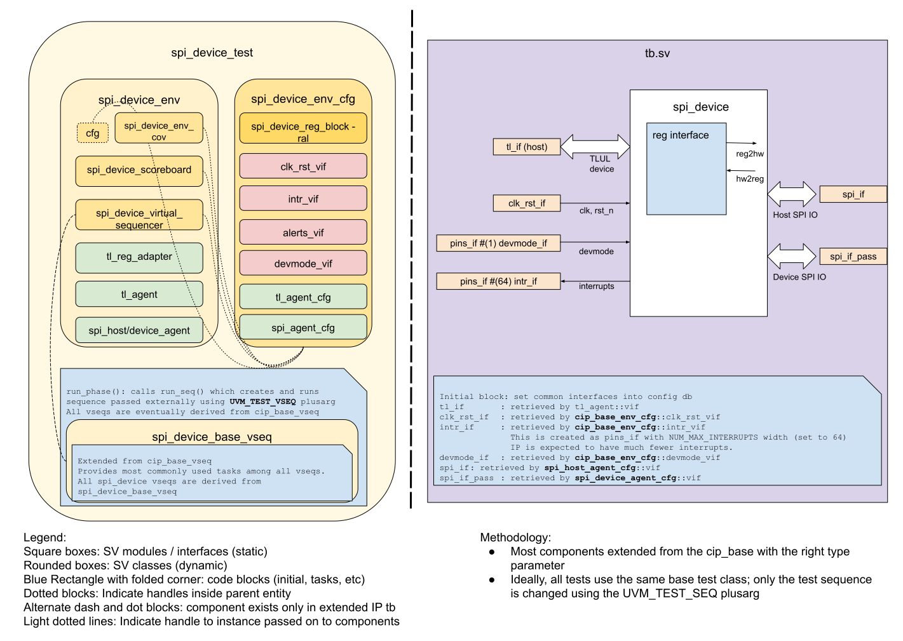

# SPI Device DV document


## Goals
* **DV**
  * Verify all SPI Device IP features by running dynamic simulations with a SV/UVM based testbench
  * Develop and run all tests based on the [testplan](#testplan) below towards closing code and functional coverage on the IP and all of its sub-modules
* **FPV**
  * Verify TileLink device protocol compliance with an SVA based testbench

## Current status
* [Design & verification stage](../../../README.md)
  * [HW development stages](../../../../doc/project_governance/development_stages.md)
* [Simulation results](https://reports.opentitan.org/hw/ip/spi_device/dv/latest/report.html)

## Design features
For detailed information on SPI Device design features, please see the [SPI_device design specification](../README.md).

## Testbench architecture
SPI Device testbench has been constructed based on the
[CIP testbench architecture](../../../dv/sv/cip_lib/README.md).

### Block diagram


### Top level testbench
Top level testbench is located at `hw/ip/spi_device/dv/tb/tb.sv`. It instantiates the SPI Device DUT module `hw/ip/spi_device/rtl/spi_device.sv`.
In addition, it instantiates the following interfaces, connects them to the DUT and sets their handle into `uvm_config_db`:
* [Clock and reset interface](../../../dv/sv/common_ifs/README.md)
* [TileLink host interface](../../../dv/sv/tl_agent/README.md)
* [SPI interface](../../../dv/sv/spi_agent/README.md)
* Interrupts ([`pins_if`](../../../dv/sv/common_ifs/README.md))

### Common DV utility components
The following utilities provide generic helper tasks and functions to perform activities that are common across the project:
* [common_ifs](../../../dv/sv/common_ifs/README.md)
* [dv_utils_pkg](../../../dv/sv/dv_utils/README.md)
* [csr_utils_pkg](../../../dv/sv/csr_utils/README.md)

### Global types & methods
All common types and methods defined at the package level can be found in
`spi_device_env_pkg`. Some of them in use are:
```systemverilog
parameter uint SRAM_OFFSET = 'h800;
parameter uint SRAM_SIZE   = 2048;
```

### TL_agent
SPI Device instantiates (already handled in CIP base env) [tl_agent](../../../dv/sv/tl_agent/README.md)
which provides the ability to drive and independently monitor random traffic via
TL host interface into SPI Device.

### SPI Device agent
[spi agent](../../../dv/sv/spi_agent/README.md) is used to drive and monitor SPI items.
There are 2 spi_agents in the testbench to serve as a SPI host and a SPI device.
* The host agent is connected to the upstream port to drive stimulus for TPM mode and flash mode.
* The device agent is connected to the passthrough port.
When host sends a flash transaction with passthrough enabled, the device agent receives it and provides the return data when it's a read command.

### UVM RAL Model
The SPI Device RAL model is created with the [`ralgen`](../../../dv/tools/ralgen/README.md) FuseSoC generator script automatically when the simulation is at the build stage.

It can be created manually by invoking [`regtool`](../../../../util/reggen/doc/setup_and_use.md):

### Stimulus strategy
#### Test sequences
All test sequences reside in `hw/ip/spi_device/dv/env/seq_lib`.
The `spi_device_base_vseq` virtual sequence is extended from `cip_base_vseq` and serves as a starting point.
All test sequences are extended from `spi_device_base_vseq`.
It provides commonly used handles, variables, functions and tasks that the test sequences can simple use / call.
Some of the most commonly used tasks / functions are as follows:
* spi_host_xfer_bytes:        Send bytes of data to DUT (SPI Device) through spi_host_driver

#### Functional coverage
To ensure high quality constrained random stimulus, it is necessary to develop a functional coverage model.
The following covergroups have been developed to prove that the test intent has been adequately met:
* common covergroup for interrupts `hw/dv/sv/cip_lib/cip_base_env_cov.sv`: Cover interrupt value, interrupt enable, intr_test, interrupt pin
* Other spi_device covergroups are defined the `spi_device_env_cov` class, which thoroughly covers all design features.
Refer to the testplan covergroups sections for the detail descriptions.

### Self-checking strategy
#### Scoreboard
The `spi_device_scoreboard` is primarily used for end to end checking.
It creates the following analysis fifos to retrieve the data monitored by corresponding interface agents:
* tl_a_chan_fifo, tl_d_chan_fifo:           These 2 fifos provide transaction items at the end of address channel and data channel respectively
* upstream_spi_host_fifo, upstream_spi_device_fifo: These 2 fifos provides TX/RX words of data from spi_monitor

#### Assertions
* TLUL assertions: The `tb/spi_device_bind.sv` binds the `tlul_assert` [assertions](../../tlul/doc/TlulProtocolChecker.md) to the IP to ensure TileLink interface protocol compliance.
* Unknown checks on DUT outputs: The RTL has assertions to ensure all outputs are initialized to known values after coming out of reset.

## Building and running tests
We are using our in-house developed [regression tool](../../../../util/dvsim/README.md) for building and running our tests and regressions.
Please take a look at the link for detailed information on the usage, capabilities, features and known issues.
Here's how to run a smoke test:
```console
$ $REPO_TOP/util/dvsim/dvsim.py $REPO_TOP/hw/ip/spi_device/dv/spi_device_1r1w_sim_cfg.hjson -i spi_device_smoke
```

## Testplan
[Testplan](../data/spi_device_testplan.hjson)
