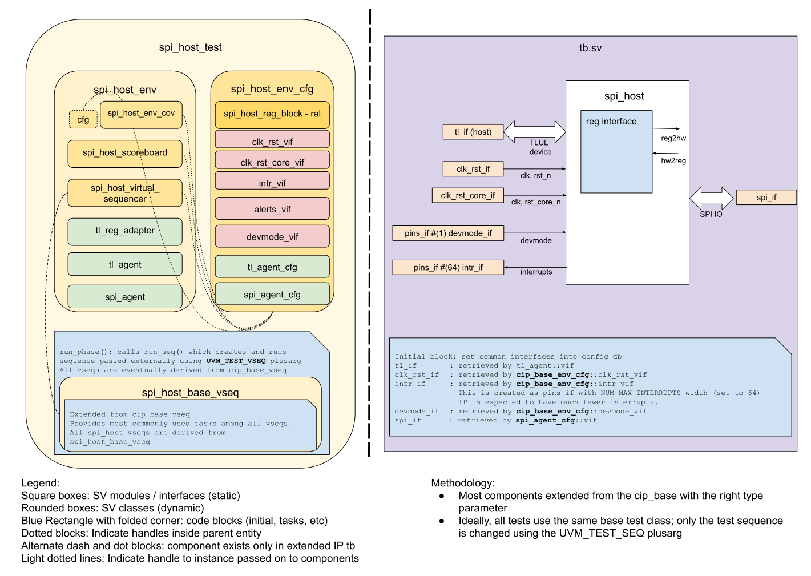

## Goals
* **DV**
  * Verify all SPI_HOST IP features by running dynamic simulations with a SV/UVM based testbench
  * Develop and run tests that exercise all testpoints in the [testplan](#testplan) below towards closing code and functional coverage on the IP and all of its sub-modules
* **FPV**
  * Verify TileLink device protocol compliance with an SVA based testbench

## Current status
* [Design & verification stage]()
  * [HW development stages]()
* [Simulation results](https://reports.opentitan.org/hw/ip/spi_host/dv/latest/results.html)

## Design features
For detailed information on SPI_HOST design features, please see the
[SPI_HOST HWIP technical specification]().

## Testbench architecture
SPI_HOST testbench has been constructed based on the
[CIP testbench architecture]().

### Block diagram


### Top level testbench
Top level testbench is located at `hw/ip/spi_host/dv/tb/tb.sv`. It instantiates the SPI_HOST DUT module `hw/ip/spi_host/rtl/spi_host.sv`.
In addition, it instantiates the following interfaces, connects them to the DUT and sets their handle into `uvm_config_db`:
* [Clock and reset interface]()
* [TileLink host interface]()
* SPI_HOST IOs
* Interrupts ([`pins_if`]())
* Alerts ([`pins_if`]())
* Devmode ([`pins_if`]())

### Common DV utility components
The following utilities provide generic helper tasks and functions to perform activities that are common across the project:
* [common_ifs]()
* [dv_utils_pkg]()
* [csr_utils_pkg]()

### Compile-time configurations
[list compile time configurations, if any and what are they used for]
```systemverilog
  // sets the number of spi devices
  parameter int NumCS = 1;
```
Currently there verification only covers NumCS = 1 since this is the configuration that will be used in tapeout.
Endianness implemented and verified is only Little Endian with ByteOrder set to 1

### Global types & methods
All common types and methods defined at the package level can be found in
`spi_host_env_pkg`. Some of them in use are:
```systemverilog
  // types
  typedef enum int {
    SpiHostError     = 0,
    SpiHostEvent     = 1,
    NumSpiHostIntr   = 2
  } spi_host_intr_e;

  typedef enum int {
    TxFifo   = 0,
    RxFifo   = 1,
    AllFifos = 2
  } spi_host_fifo_e;

  typedef enum {
    Command,
    Address,
    Dummy,
    Data
  } spi_segment_type_e;

  // spi config
  typedef struct {
    // configopts register fields
    rand bit        cpol[SPI_HOST_NUM_CS];
    rand bit        cpha[SPI_HOST_NUM_CS];
    rand bit        fullcyc[SPI_HOST_NUM_CS];
    rand bit [3:0]  csnlead[SPI_HOST_NUM_CS];
    rand bit [3:0]  csntrail[SPI_HOST_NUM_CS];
    rand bit [3:0]  csnidle[SPI_HOST_NUM_CS];
    rand bit [15:0] clkdiv[SPI_HOST_NUM_CS];
  } spi_host_configopts_t;

  typedef struct {
    // csid register
    rand bit [31:0] csid;
    // control register fields
    rand bit [8:0]  tx_watermark;
    rand bit [6:0]  rx_watermark;
  } spi_host_ctrl_t;

  // spi direction
  typedef enum bit [1:0] {
    None     = 2'b00,
    RxOnly   = 2'b01,
    TxOnly   = 2'b10,
    Bidir    = 2'b11
  } spi_dir_e;

  typedef struct {
    // command register fields
    rand spi_mode_e mode;
    rand spi_dir_e  direction;
    rand bit        csaat;
    rand bit [8:0]  len;
  } spi_host_command_t;

  typedef struct packed {
    bit          status;
    bit          active;
    bit          txfull;
    bit          txempty;
    bit          txstall;
    bit          tx_wm;
    bit          rxfull;
    bit          rxempty;
    bit          rxstall;
    bit          byteorder;
    bit          rsv_0;
    bit          rx_wm;
    bit [19:16]  rsv_1;
    bit [15:8]   rx_qd;
    bit [7:0]    tx_qd;
  } spi_host_status_t;

  typedef struct packed{
    bit csidinval;
    bit cmdinval;
    bit underflow;
    bit overflow;
    bit cmdbusy;
  } spi_host_error_enable_t;

  typedef struct packed{
    bit accessinval;
    bit csidinval;
    bit cmdinval;
    bit underflow;
    bit overflow;
    bit cmdbusy;
  } spi_host_error_status_t;

  typedef struct packed{
    bit idle;
    bit ready;
    bit txwm;
    bit rxwm;
    bit txempty;
    bit rxfull;
  } spi_host_event_enable_t;

  typedef struct{
    bit spi_event;
    bit error;
  } spi_host_intr_state_t;

  typedef struct{
    bit spi_event;
    bit error;
  } spi_host_intr_enable_t;

  typedef struct{
    bit spi_event;
    bit error;
  } spi_host_intr_test_t;
```

### TL_agent
SPI_HOST testbench instantiates (already handled in CIP base env)
[tl_agent]()
which provides the ability to drive and independently monitor random traffic via TL host interface into SPI_HOST device.
Transactions will be sampled by the monitor and passed on to the predictor in the scoreboard.

###  SPI Agent
SPI agent is configured to work in device mode.
The Agent will decode the SPI transactions send by the DUT and respond with random data to any read command received.
Write data is discarded.
The agent sequence could potentially be upgraded to work as a BFM that could store writes for later read back.
In the current state the agent recognises 6 commands:
* ReadStd:    8'b11001100
* WriteStd:   8'b11111100
* ReadDual:   8'b00000011
* WriteDual:  8'b00001100
* ReadQuad:   8'b00001111
* WriteQuad:  8'b11110000
* CmdOnly:    8'b10000001

for V1 only ReadStd, WriteStd and CmdOnly has been implemented.

The agent monitor will capture both the outgoing host transactions where it creates an item for the device sequence and for the scoreboard to check against the configuration.
and the incoming device transactions where it will capture the response items and forward them to another tlm_analysis_port in the host scoreboard.


### UVM RAL Model
The SPI_HOST RAL model is created with the [`ralgen`]() FuseSoC generator script automatically when the simulation is at the build stage.

It can be created manually by invoking [`regtool`]():

### Stimulus strategy
#### Test sequences
All test sequences reside in `hw/ip/spi_host/dv/env/seq_lib`.
The `spi_host_base_vseq` virtual sequence is extended from `cip_base_vseq` and serves as a starting point.
On top of `spi_host_base_vseq` is `spi_host_tx_rx_vseq` which form more complex task from the basic tasks in the base vseq.
All test sequences are extended from `spi_host_tx_rx_vseq`.
It provides commonly used handles, variables, functions and tasks that the test sequences can simple use / call.
Some of the most commonly used tasks / functions are as follows:
* generate_transaction()

  Generates a SPI transaction of n segments with command, address, dummy and data segments

* read_rx_fifo()

  Read available data in the RX fifo

* send_trans_(spi_transaction_item trans)

  Will handle the sequence of writing potential data to the tx fifo and then configuring the DUT to transmit it
  in correct order.

#### Functional coverage
To ensure high quality constrained random stimulus, it is necessary to develop a functional coverage model.
The list of functional coverpoints can be found under covergroups in the [testplan](#testplan)


### Self-checking strategy
#### Scoreboard
The `spi_host_scoreboard` is primarily used for end to end checking.
It creates the following analysis ports to retrieve the data monitored by corresponding interface agents:

**TL_UL AGENT**

* tl_a_chan_fifo: tl address channel
* tl_d_chan_fifo: tl data channel

**SPI_AGENT**

* host_data_fifo: outgoing SPI item from the DUT captured by the monitor
* device_data_fifo: incoming SPI item for the DUT captured by the monitor

When a host programs the DUT to transmit a SPI message.
The tl-ul agent monitor will capture these in tl items and forward these to the `tl_a_chan_fifo`.
A predictor will use the tl-ul transactions to generate the expected SPI items.
The SPI agent monitor will capture the actual transmitted SPI segments into SPI items and forward them to the `host_data_fifo`.
And the scoreboard will compare the items from the fifo to the expected items created by the predictor to validate the transaction.

The SPI device will generate responses to the SPI commands from the DUT.
The SPI agent monitor will capture these into SPI items which are forwarded to the `device_data_fifo`
A predictor will take these and generate the expected tl data response.
The host will then read these from the DUT rx fifo.
The read transaction is captured and forwarded to the `tl_d_chan_fifo`
When the scoreboard receives an item on the `tl_d_chan_fifo` it will match the data to the predicted data to validate the transaction.
This way both outgoing and incoming transactions are validated independently of each other.


#### Assertions
* TLUL assertions: The `tb/spi_host_bind.sv` binds the `tlul_assert` [assertions]() to the IP to ensure TileLink interface protocol compliance.
* Unknown checks on DUT outputs: The RTL has assertions to ensure all outputs are initialized to known values after coming out of reset.


## Building and running tests
We are using our in-house developed [regression tool]() for building and running our tests and regressions.
Please take a look at the link for detailed information on the usage, capabilities, features and known issues.
Here's how to run a smoke test:
```console
$ $REPO_TOP/util/dvsim/dvsim.py $REPO_TOP/hw/ip/spi_host/dv/spi_host_sim_cfg.hjson -i spi_host_smoke
```

## Testplan

