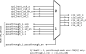

# Theory of Operation

- [SPI Protocol Basics](#spi-protocol-basics)
- [API Details](#api-details): *Interface information, such as models for conceptual interactions, CSRs and interrupts.*
    - [Command Interface](#command-interface) *Primary interface for constructing SPI commands.*
- [Design Details](#design-details): *Further info about the implementation.*
    - [Block Diagrams](#block-diagrams)
- [Appendices](#appendices)

# SPI Protocol Basics

SPI is a source-synchronous serial interface, consisting of data lines (`SD[x]`), a clock (`SCK`), and an active-low chip select (`CS#`) per target device.
The host is responsible for generating the serial clock, and typically each side asserts outgoing data on one edge of the clock (e.g. on the rising edge) and samples data in the next edge (e.g. on the falling edge).
The SPI bus can be connected to many target devices, but each device on the bus must get its own chip select, and so this signal designates a particular device for each command.
In this IP we refer to the chip select as `CSB`.

Bus traffic is composed of 'commands', each of which is initiated by the host and targets a single device.
The assertion and deassertion of the target device's chip-select mark the beginning and end of each command.
No device will accept any command input until `CSB` has been asserted for that device, and most devices (if not all) do not accept a second command unless `CSB` has been deasserted to mark the end of the previous command.
Some simple devices, particularly those that support SPI daisy-chaining, do not process command input at all until *after* the `CSB` line has been deasserted.
In the case of NOR flash devices, read and write commands are indeterminate in length, and the data transfer ends only when the `CSB` line is deasserted.
So, although the exact details of the operation may vary from device to device, the edges of the `CSB` signal always serve as important markers for delineating the boundaries of each transaction.

Typical SPI commands are categorized as Standard, Dual, or Quad depending on the number of serial data lines (`SD[x]`) they utilize.
This is often referred to as the 'Speed-Mode' or just 'Speed', although as the clock frequency remains constant this is a slight misnomor, so it may be better thought-of as a 'Throughput-Mode' or just a data width.
A command may be composed of a number of phases or segments, where different numbers of data lines are used in different directions.
The OpenTitan SPI_HOST IP uses the term '[segment](#command-interface)' to describe this smaller unit of traffic, and each segment can have it's own data direction and speed-mode.
For example, in a Standard SPI command a number of instruction-, address- or data-bytes are transmitted on `SD[0]`, and response bytes are received on `SD[1]`.
Therefore, for Standard-mode commands `SD[0]` is always configured as an output and `SD[1]` is always an input.
In this mode, the bus can be effectively used as a full-duplex communication channel.
Not all devices exploit this capability however, and often will opt instead to have clear input and output phases for each command.
This half-duplex signaling behavior is especially common in devices with also support Dual- and Quad-mode commands, which are always half-duplex.
The SPI_HOST IP optionally supports both full-duplex and half-duplex commands in Standard-mode.

When it comes to devices there is no universal convention on clock polarity (CPOL) or clock phase (CPHA).
Some devices expect the clock line to be low when the host is idle, thus the clock should come as a sequence of positive pulses (`CPOL = 0`).
On the other hand, some devices expect `CPOL = 1`, meaning that the clock line is inverted: *high* when idle with sequences of *negative* pulses.
Devices also differ in their expectations of clock *phase* (CPHA) relative to the data.
Devices with `CPHA = 0` expect that both the host and device will be sampling data on the *leading* edge, and asserting data on the *trailing* edge.
(Because of the option for either polarity, the terms "leading" and "trailing" are preferred to "rising" or "falling").
When `CPHA = 0` the first output bit is asserted with the falling edge of `CSB`.
Conversely, if `CPHA = 1` data is always asserted on the leading edge of `SCK` and sampled on the trailing edge of `SCK`.

As well as supporting any combination of CPOL/CPHA, this IP also offers an additional [Full-Cycle sampling](#full-cycle-sampling) option via the ([`CONFIGOPTS.FULLCYC`](registers.md#configopts--fullcyc)) field, which can ease timing pressure for devices which require setup times exceeding half a cycle.
For even faster transfer rates, some flash chips support double transfer rate (DTR) variations to the SPI protocol wherein the device receives and transmits fresh data on *both* the leading and trailing edge.
This IP only supports single transfer rate (STR), *not* DTR.
A preliminary investigation of DTR transfer mode suggests that proper support for setup and hold times in this mode may require a level of sub-cycle timing control which is not currently planned for this IP.

# API Details

Broadly speaking, the SPI_HOST IP accepts commands from the TL-UL interface, and based on these commands, serially transmits and receives data on the external SPI interface pins.
The timing and data-line formatting of the command sequence depend on the external peripheral device and the nature of the specific command issued.

## Command Interface

The SPI_HOST command interface defines a **segment** as a compounding bus operation where the IP performs a simpler, repetitive action over a fixed number of bytes.
This allows software to specify any number of command *segments* to build larger, more complex transactions.

The definition of a segment may be better explained with an example.
For instance, Dual or Quad-mode commands can be decomposed into four command *segments*, in which the host:
1. Transmits instructions or data at single-line rate,
2. Transmits instructions address or data on 2 or 4 data lines,
3. Holds the bus in a high-impedance state for some number of "dummy" clock cycles (neither side transmits), or
4. Receives information from the target device.

Each of these segments may have a different directionality and speed.
As indicated in the example figure below, input data need only be sampled during the last segment.
Likewise, software-provided data is only transmitted in the first two segments.

```wavejson
{signal: [
  {name: "clk_i",        wave: "p................................"},
  {name: "SCK (CPOL=0)", wave: "0.101010101010101010101010101010."},
  {name: "CSB", wave: "10..............................1"},
  {name: "SD[0]", wave: "22.2.2.2.2.2.2.2.2.2.z.....2.2.x.", data: ["","cmd7", "cmd6", "cmd5", "cmd4", "cmd3", "cmd2", "cmd1", "cmd0",
                                                             "out4", "out0", "in4", "in0" ]},
  {name: "SD[1]", wave: "z................2.2.z.....2.2.x.", data: ["out5", "out1", "in5", "in1"]},
  {name: "SD[2]", wave: "z................2.2.z.....2.2.x.", data: ["out6", "out2", "in6", "in2"]},
  {name: "SD[3]", wave: "z................2.2.z.....2.2.x.", data: ["out7", "out3", "in7", "in3"]},
  {name: "Segment number", wave: "x2...............3...4.....5...x.", data: ['1', '2', '3','4'] },
  {name: "Segment speed", wave: "x2...............3...4.....5...x.", data: ['Standard', 'Quad', 'X', 'Quad'] },
  {name: "Segment direction", wave: "x2...............3...4.....5...x.", data: ['TX', 'TX', 'None', 'RX'] },
  {name: "Sampling event (FULLCYC=0)", wave: "1...........................H.H.."},
  {name: "Sampling event (FULLCYC=1)", wave: "1............................H.H."},
],
  head: {
  text: "Example Quad SPI transaction: 1 byte TX (Single), 1 byte (Quad), 3 dummy cycles and 1 RX byte with CPHA=0"
  },
}
```

A SPI transaction always consists of at least one segment, and the Command Interface will begin to enact a new segment as soon as the previous segment has completed.
(There is a small [Command FIFO](#back-to-back-segments) to allow software to enqueue multiple segments at once.)
The IP will automatically control the chip-select for each segment, by asserting it at the start of a segment and desasserting it at the end.
By setting [`COMMAND.CSAAT`](registers.md#command--csaat), the `CSB` will **not** be deasserted at the end of a segment, allowing multiple segments to be composed into a longer continuous command.
Each segment may have a different speed, direction and length, and there is no restriction on the configuration of a segment relative to any other.

For example, a Quad-IO (1-4-4) SPI Read could be constructed from the following 4 segments:

| Dir | Width | Len | Desc                                                       | CSAAT |
|-----|-------|-----|------------------------------------------------------------|-------|
| Tx  | Std   | 1   | A single byte instruction                                  | 1     |
| Tx  | Quad  | 3/4 | A three or four byte address                               | 1     |
| Dum | None  | x   | A number of dummy cycles (no data transmitted or received) | 1     |
| Rx  | Quad  | N   | The desired data received from the target device           | 0     |

### Creating a SPI Command from multiple segments

More generally, the process of issuing a SPI command consists of the following steps:

1. Configure the IP to be compatible with each attached peripheral.
The [`CONFIGOPTS`](registers.md#configopts) multi-register holds separate sets of configuration settings, one for each `CSB` line.
In principle, the configuration of these device-specific options only needs to be done/performed once at initialization.
2. Load the TX FIFO with the instructions and data to be transmitted to the remote device by writing to the [`TXDATA`](registers.md#txdata) memory window.
3. Specify which device should receive the next command using the [`CSID`](registers.md#csid) register.
4. Wait for [`STATUS.READY`](registers.md#status) before continuing.
5. Issue speed, direction, and length details for the next command segment using the [`COMMAND`](registers.md#command) register.
If a command consists of multiple segments, [`COMMAND.CSAAT`](registers.md#command--csaat) (**C**hip-**S**elect **A**ctive **A**fter **T**ransaction) should be set to one for all segments except the final one.
Setting [`COMMAND.CSAAT`](registers.md#command--csaat) to zero indicates the end of a transaction, prompting the IP to raise `CSB` at the end of the segment.
6. Repeat steps 4 and 5 until all segments have been described.
7. Read any peripheral response data from the RX FIFO by reading from the [`RXDATA`](registers.md#rxdata) memory window.

### About Command Segments

Each **segment** is defined by writing the following fields in the [`COMMAND`](registers.md#command) register.

| name                                         | size | values                                |
|----------------------------------------------|------|---------------------------------------|
| [DIRECTION](registers.md#command--direction) | 2    | {Bidir, Tx_Only, Rx_Only, None/Dummy} |
| [SPEED](registers.md#command--speed)         | 2    | {Std, Dual, Quad}                     |
| [CSAAT](registers.md#command--csaat)         | 1    | {1, 0}                                |
| [LEN](registers.md#command--len)             | 8    | [0:255]                               |

The 'Direction' field allows each segment to configure how data should be transmitted/received from the RX and TX Data FIFOs.
This allows software to automatically discard data that is irrelevant or invalid before it is captured.
By adeptly composing a command of multiple segments with different 'Direction' and 'Speed' fields, the ergonomics of the accompanying software driver can be greatly improved.

For a device using "Standard" SPI commands, each command is very consistent in structure: the host transmits data on `SD[0]`, and always receives data on `SD[1]`.
For such devices, all segments could in principle be treated as bidirectional, as both the host and device are always transmitting on their respective lines.
For bidirectional segments, the SPI_HOST IP will store one byte in the RX FIFO for each byte transmitted from the TX FIFO.
However, even for these Standard SPI commands, software may be uninterested in some or all of the device's response data.
For example, Standard SPI Write commands to flash devices contain no useful data in the device response, even though the device may be actively asserting signals to `SD[1]` throughout the transaction.
Therefore, for such commands software may choose to specify the entire segment as "TX Only", in which case data placed in the TX FIFO will be transmitted throughout the write command, but signals received from the device will be ignored and will not fill the RX FIFO.

For other flash commands such as Standard-mode Read, the device only transmits useful information during some portions of the transaction.
In the case of a basic read (with a 3-byte address), the instruction starts with a 1-byte instruction code (`0x3`) followed by the three address bytes, during which time the flash device outputs may be high impedance (depending on the device).
The device then immediately responds with the requested data in the next `SCK` cycle, and continues to output data bytes until the `CSB` line is deasserted.
Though such a command could also be treated as entirely bidirectional, the device response can be safely ignored during the instruction and address phase, especially if the `SD[1]` line is high impedance during this time.
Likewise it is not necessary for software to specify any data to transmit while the device is responding.
Therefore such a command can be thought of as consisting of two separate segments, the first segment being TX Only and the second segment being RX only, as shown in the following figure.
Breaking the command up this way can simplify the job of writing software that is generic over different types of commands.

```wavejson
{signal: [
  {name: "clk_i",             wave: "p....................|.............."},
  {name: "SCK (CPOL=0)",      wave: "0.1010101010101010101|01010101010101"},
  {name: "CSB",               wave: "10...................|.............."},
  {name: "SD[0]",             wave: "00.0.0.0.0.0.1.1.2.2.|2.2.x.........",  data: ["a[23]", "a[22]", "a[1]", "a[0]"]},
  {name: "SD[1]",             wave: "z....................|....2.2.2.2.2.",  data: ["d[7]", "d[6]", "d[5]", "d[4]", "..."]},
  {name: "Segment number",    wave: "x2...................|....2.........",  data: ['1', '2', '3','4'] },
  {name: "Segment speed",     wave: "x2...................|....2.........",  data: ['Standard', 'Standard'] },
  {name: "Segment direction", wave: "x2...................|....2.........",  data: ['TX', 'RX', 'None', 'RX'] },
  ],
 foot: {text: "Standard SPI example: Flash Read command with 24-bit address, consisting of one TX and one RX segment"}
}
```

In addition to the TX, RX or Bidirectional modes, some SPI commands require periods where neither the host or device are transmitting data.
For instance, many flash devices define a Fast Read command in which the host must insert a number of "dummy clocks" between the last address byte and the first data byte from the device.
These extra cycles are required for operation at higher clock frequencies, to give the device time to decode the address and fetch the corresponding data.
A Standard-mode Fast Read (with 3 byte addressing) command then requires *three* SPI_HOST command segments:
- 4 bytes TX Only: one for the instruction code (i.e., 0xb for Fast Read), and three for the address.
- 8 dummy clocks
- N bytes RX Only for read data response

```wavejson
{signal: [
  {name: "clk_i",          wave: "p....................|.............................."},
  {name: "SCK (CPOL=0)",   wave: "0.1010101010101010101|010101010101010101010101010101"},
  {name: "CSB",            wave: "10...................|.............................."},
  {name: "SD[0]",          wave: "00.0.0.0.1.0.1.1.2.2.|2.2.x.........................", data: ["a[23]", "a[22]", "a[1]", "a[0]"]},
  {name: "SD[1]",          wave: "z....................|....z.z.z.z.z.z.z.z.2.2.2.2.2.", data: ["d[7]", "d[6]", "d[5]", "d[4]", "..."]},
  {name: "Segment number", wave: "x3...................|....4...............5.........", data: ['1', '2', '3'] },
  {name: "Segment speed",  wave: "x3...................|....4...............5.........", data: ['Standard', 'X', 'Standard'] },
  {name: "Segment direction", wave: "x3...................|....4...............5.........", data: ['TX', 'Dummy', 'RX'] },
  ],
 foot: {text: "Standard SPI example: Fast read command (instruction code 0xb) with 24-bit address, consisting of three segments, one TX, 8 dummy clocks and one RX segment"}
}
```

For Standard-mode commands, segments simplify the IO process by identifying which bus cycles have useful RX or TX data.
In such cases it is not strictly necessary to the manage the impedance of the `SD[0]` and `SD[1]` lines.
For Dual- and Quad-mode commands however, impedance control is necessary, as the impedance of all data lines (`SD[3:0]`) must switch between TX and RX segments.
(Bidirectional data transfers are not applicable for Dual- or Quad-mode segments).

In addition, the speed-mode changes how data is distributed across the four data lines, and many commands require that some segments are transmitted in Standard-mode (only on `SD[0]`), while the bulk of the data is transmitted in Dual- or Quad-mode.
For this reason the speed-mode is also adjustable on a segment-by-segment basis.

### CSID Register

The [`CSID`](registers.md#csid) register is used to identify the target device for the next command segment.
Whenever a command segment descriptor is written to [`COMMAND`](registers.md#command), [`CSID`](registers.md#csid) is passed into the FSM along with the command segment descriptor and the corresponding configurations options (taken from the CSID'th element of the `CONFIGOPTS` multi-register).

This register still exists when instantiated with only one `CSB` line (i.e. when NumCS=1).
However in this case the [`CSID`](registers.md#csid) value is ignored.

Changes in [`CSID`](registers.md#csid) also affect the `CSB` lines, because a change in CSID can also implicitly end a command, overriding [`COMMAND.CSAAT`](registers.md#command).
If a change is detected in [`CSID`](registers.md#csid), but the previous segment was submitted with the `CSAAT` bit asserted, the FSM terminates the previous command before moving on to the next segment.
The previous `CSB` line is held low for *at least* `CSNTRAIL` cycles (as defined by the previous value of [`CONFIGOPTS.CSNTRAIL`](registers.md#configopts)) and then brought high.
All `CSB` lines are held high for `CSNIDLE` cycles (using the new value of [`CONFIGOPTS.CSNIDLE`](registers.md#configopts)).
The new `CSB` line is asserted low, and `SCK` begins toggling after the usual `CSNLEAD` cycle delay.

### Configuration Options

Before starting a command, some common configuration for the target device must be setup.
Each target device attached to a chip-select can have an independent set of configuration parameters to match it's specific needs.
When starting a command, the value of [`CSID`](registers.md#csid) is used to select the correct set of configuration parameters.
The [`CONFIGOPTS`](registers.md#configopts) multi-register contains seperate configuration entries for each chip select.
Each entry holds clock configuration and timing settings which are specific to each peripheral.
Once the [`CONFIGOPTS`](registers.md#configopts) multi-register has been programmed for each SPI peripheral device, the values can be left unchanged.

The following sections give details on how the SPI_HOST IP can be used to control a specific peripheral.
For simplicity, this section describes how to interact one device, attached to `CSB[0]`, and as such references are made to the multi-registers [`CONFIGOPTS`](registers.md#configopts) and [`COMMAND`](registers.md#command).
To configure timing and send commands to devices on other `CSB` lines, instead use the `CONFIGOPTS` multi-register corresponding to desired `CSB` line.

#### Clock rate selection

The SPI clock rate for each peripheral is set by two factors:
- The SPI_HOST input clock
- A 16-bit clock divider ([`CONFIGOPTS.CLKDIV`](#configopts--clkdiv))

The SPI protocol usually requires activity (either sampling or asserting data) on either edge of the `SCK` clock.
For this reason the maximum `SCK` frequency is at most one half the SPI_HOST core frequency.

Since some peripheral devices attached to the same SPI_HOST IP may require different clock frequencies, there is also the option to divide the core clock by an additional factor when dealing with slower peripherals.
This is configured per-peripheral by setting the field [`CONFIGOPTS.CLKDIV`](#configopts--clkdiv).

$$T_{\textrm{SCK},0}=\frac{1}{2}\frac{T_\textrm{clk}}{\textrm{CONFIGOPTS.CLKDIV}+1}$$

#### Chip-select Timing Control

Typically the `CSB` line is automatically deasserted after the last edge of `SCK`.
However, by asserting [`COMMAND.CSAAT`](registers.md#command) when issuing a particular command, one can instruct the core to hold `CSB` low indefinitely after the last clock edge.
This is useful for merging two adjacent command segments together, to create more complex commands, such as flash Quad read commands which require a mix of segments with different speeds and directions.
The `CSB` line can then be deasserted by either issuing another command without the [`COMMAND.CSAAT`](registers.md#command) field, issuing a command to a different device (after changing the [`CSID`](registers.md#csid) register), or simply resetting the core FSM via the [`CONTROL.SW_RST`](registers.md#control) register.

To avoid spurious clock signals, changes to the [`CONFIGOPTS`](registers.md#configopts) parameters take effect only at the end of a command segment and only when all `CSB` lines are deasserted.
There are two cases to consider:
1. Configuration changes detected and `CSAAT=0` for the previous segment:
This is when configuration changes are typically expected, and in this case, the SPI_HOST IP waits for the previous segment to complete before moving changing the configuration.
The SPI_HOST ensures that all `CSB` lines are held idle long enough to satisfy the configuration requirements both *before* and *after* the change.
2. CSAAT = 1 for the previous segment:
Configuration changes are not typically expected after CSAAT segments, and require special treatment as the IP does not usually return the `CSB` lines to the idle/inactive state at this time.
In such cases, the SPI_HOST IP closes out the ongoing transaction, ignoring CSAAT, and the configuration is then applied once the SPI_HOST has returned to the idle state.
The next segment can then proceed, even though the remote device will likely see the next segment as the start of a new transaction (as opposed to a continuation of the previous transaction), because of the brief intervening idle pulse.

Most devices require at least one-half `SCK` clock-cycle between either edge of `CSB` and the nearest `SCK` edge.
However, some devices may require more timing margin and so the SPI_HOST core offers some configuration registers for controlling the timing of the `CSB` edges when operating under automatic control.
The relevant parameters are as follows:
- T<sub>IDLE</sub>: The minimum time between each rising edge of `CSB` and the following falling edge.
This time delay is a half `SCK` cycle by default but can be extended to as long as eight `SCK` cycles by setting the [`CONFIGOPTS.CSNIDLE`](registers.md#configopts) register.
- T<sub>LEAD</sub>: The minimum time between each falling edge of `CSB` and the first leading edge of `SCK`.
This time delay is a half `SCK` cycle by default but can be extended to as long as eight `SCK` cycles by setting the [`CONFIGOPTS.CSNLEAD`](registers.md#configopts) register.
- T<sub>TRAIL</sub>: The minimum time between the last trailing edge of `SCK` and the following rising edge of `CSB`.
This time delay is a half `SCK` cycle by default but can be extended to as long as eight `SCK` cycles by setting the [`CONFIGOPTS.CSNTRAIL`](registers.md#configopts) register.

```wavejson
{signal: [
  {name: "SCK",  wave: "l....1010|10........"},
  {name: "CSB", wave: "10.......|.....1...0", node: ".A...B.....C...D...E"}
],
 edge: ["A<->B minimum (CSNLEAD+1)", "C<->D minimum (CSNTRAIL+1)", "D<->E minimum (CSNIDLE+1)"],
  head: {
    text: "Impact of CSNLEAD, CSNTRAIL and CSNIDLE CONFIGOPTS register settings",
    tick: 1
  },
  foot: {
    text: ["tspan", "All ticks are in units of &#xbd;T",
           ["tspan", {'baseline-shift':'sub'}, "SCK"],
          "=&#xbd;T",
           ["tspan", {'baseline-shift':'sub'}, "clk"],
          "&#xd7;(CLKDIV+1)"]
  }
}
```

These settings are all minimum bounds, and delays in the FSM implementation may create more margin in each of these timing constraints.

#### Clock Phase and Polarity

The most common differences between target devices are the requirements for a specific SPI clock polarity and phase, CPOL and CPHA, which were described in the previous section [SPI Protocol Basics](#spi-protocol-basics).
These clock parameters can be set via the [`CONFIGOPTS.CPOL`](registers.md#configopts) or [`CONFIGOPTS.CPHA`](registers.md#configopts) register fields.

#### Full-Cycle Sampling

When operating at the fastest-rated clock speeds, some flash devices (i.e. both the Winbond and Micron devices noted on the summary page) require setup times which exceed half a clock-cycle.
In order to support these fastest data rates, the SPI_HOST IP offers a modified "Full-cycle" ([`CONFIGOPTS.FULLCYC`](registers.md#configopts--fullcyc)) timing mode where data can be sampled a *full* cycle after the target device asserts data on the SD bus.
This full cycle mode has no effect on any of the signals transmitted, only on the timing of the sampling of the incoming signals.

```wavejson
{signal: [
  {name: "clk_i", wave: "p.................."},
  {name: "SCK (CPOL=0)", wave: "0.1010101010101010."},
  {name: "SCK (CPOL=1)", wave: "1.0101010101010101."},
  {name: "CSB", wave: "10................1"},
  ["CPHA = 0",
    {name: "SD[0] (output)", wave: "22.2.2.2.2.2.2.2...", data: ["","out7", "out6", "out5", "out4", "out3", "out2", "out1", "out0" ]},
    {name: "SD[1] (input)", wave: "22.2.2.2.2.2.2.2.2.", data: ["","in7", "in6", "in5", "in4", "in3", "in2", "in1", "in0",""]},
    {name: "Sampling event (FULLCYC=0)", wave: "1.H.H.H.H.H.H.H.H.."},
    {name: "Sampling event (FULLCYC=1)", wave: "1..H.H.H.H.H.H.H.H."},
  ],
  ["CPHA = 1",
    {name: "SD[0] (output)", wave: "2.2.2.2.2.2.2.2.2..", data: ["","out7", "out6", "out5", "out4", "out3", "out2", "out1", "out0" ]},
    {name: "SD[1] (input)", wave: "2.2.2.2.2.2.2.2.2.2", data: ["","in7", "in6", "in5", "in4", "in3", "in2", "in1", "in0",""]},
    {name: "Sampling event (FULLCYC=0)", wave: "1..H.H.H.H.H.H.H.H."},
    {name: "Sampling event (FULLCYC=1)", wave: "1...H.H.H.H.H.H.H.H"},
  ],
],
  head: {
    text: "Standard SPI transaction (1 byte), illustrating of the impact of the CPOL, CPHA, and FULLCYC settings"
  },
  foot: {
  }
}
```

### Idle Time Delays When Changing Configurations

It is important that the configuration changes are applied while `CSB` is high to avoid sending spurious `SCK` events to any devices.
For example, if two devices have different requirements for `CPOL`, the clock polarity should not toggle except when `CSB` is high (inactive) for all devices.

Furthermore, `CSB` should be remain high for the minimum idle time both before and after the configuration update.
For example, consider a SPI_HOST attached to two devices each with different requirements for the clock divider, clock polarity, and idle time.
Consider a configuration where total idle time (as determined by the [`CONFIGOPTS.CLKDIV`](registers.md#configopts) and [`CONFIGOPTS.CSNIDLE`](registers.md#configopts) multi-registers) works out to 9 idle clocks for the first device, and 4 clocks for the second device.
In this scenario then, when swapping from the first device to the second, the SPI_HOST IP will only swap the clock polarity once the first `CSB` line, `CSB[0]`, has been high for at least 9 clocks, and will continue to hold the second `csb` line, `csb[1]`, high for 4 additional clocks before starting the next transaction.

```wavejson
{signal: [
  {name: 'clk', wave: 'p..............'},
  ["Requested Config",
   {name: 'Configuration ID',  wave: '3.4............', data: ["CSID=0", "CSID=1"]},
   {name: 'CPOL',              wave: '2.2............', data: ["0", "1"]},
   {name: 'CLKDIV',            wave: '2.2............', data: ["2", "1"]},
   {name: 'CSNIDLE',           wave: '2.2............', data: ["2", "1"]},
   {name: 'Min. Idle cycles', wave: '2.2............', data: ["9", "4"]},
  ],
  ["Active Config",
   {name: 'Configuration ID',  wave: '3.........4....', data: ["CSID=0", "CSID=1"]},
   {name: 'CPOL',              wave: '2.........2....', data: ["0", "1"]},
   {name: 'CLKDIV',            wave: '2.........2....', data: ["2", "1"]},
   {name: 'CSNIDLE',           wave: '2.........2....', data: ["2", "1"]},
   {name: 'Min. Idle cycles', wave: '2.........2....', data: ["9", "4"]},
  ],
   {name: 'csb[0]',                     wave: '01.............',
                                        node: '.A........B....'},
   {name: 'csb[1]',                     wave: '1.............0',
                                        node: '..........C...D'},
   {name: 'configuration update event', wave: '1.........H....'}
],
  edge: ["A<->B min. 9 cycles", "C<->D min. 4 cycles"],
  head: {text: "Extended Idle Time During Configuration Changes", tock: 1}
}
```

This additional idle time applies not only when switching between devices but when making any changes to the configuration for most recently used device.
For instance, even in a SPI_HOST configured for one device, changes to [`CONFIGOPTS`](registers.md#configopts), will trigger this extended idle time behavior to ensure that the change in configuration only occurs in the middle of a long idle period.


### Special Command Fields

The [`COMMAND`](registers.md#command) register must be written once for each command segment.
Whenever a command segment is written to [`COMMAND`](registers.md#command), the contents of the [`CONFIGOPTS`](registers.md#configopts), [`CSID`](registers.md#csid), and [`COMMAND`](registers.md#command) registers are passed through the Config/Command FIFO to the SPI_HOST core FSM.
Once the command is issued, the core will immediately deassert [`STATUS.READY`](registers.md#status), and once the command has started [`STATUS.ACTIVE`](registers.md#status) will go high.
The command is complete when [`STATUS.ACTIVE`](registers.md#status) goes low.
A `spi_event` interrupt can also be triggered to go off on completion by setting [`EVENT_ENABLE.IDLE`](registers.md#event_enable).

### Chip Select Masks

Each instance of the SPI_HOST IP supports a parametrizable number of chip select lines (`CSB[NumCS-1:0]`).
Each `CSB` line can be routed either to a single peripheral or to a daisy-chain of peripherals.
Whenever a segment description is written to the [`COMMAND`](registers.md#command) register, the  [`CSID`](registers.md#csid) is sent along with [`COMMAND`](registers.md#command) and the `CONFIGOPTS` multi-register corresponding to [`CSID`](registers.md#csid)  to indicate which device is meant to receive the command.
The SPI_HOST core typically then manages the details of asserting and deasserting the proper `CSB` line, subject to the timing parameters expressed in [`CONFIGOPTS.CSNLEAD`](registers.md#configopts), [`CONFIGOPTS.CSNTRAIL`](registers.md#configopts), and [`CONFIGOPTS.CSNIDLE`](registers.md#configopts).

If [Pass-through mode](#pass-through-mode) is enabled then the `CSB` lines are controlled by *neither* the SPI_HOST hardware nor the firmware register.
In Pass-though mode, control of the `CSB` lines passes directly to the inter-module port, `passthrough_i.csb`.

### Back-to-back Segments

The command interface can allows for any number of segments in a given command.

Since most SPI Flash transactions typically consist of 3 or 4 segments, there is a small command FIFO for submitting segments to the SPI_HOST IP, so that firmware can issue the entire transaction at one time.

Writing a segment description to [`COMMAND`](registers.md#command) when [`STATUS.READY`](registers.md#status) is low will trigger an error condition, which must be acknowledged by software.
When submitting multiple segments to the command queue, firmware can also check the [`STATUS.CMDQD`](registers.md#status) register to determine how many unprocessed segments are in the FIFO.

## Data Formatting

### Input and Output Byte Ordering

The SPI transactions must be issued with correct bit ordering to properly communicate with a remote device.
Based on the requirements for our chosen flash devices, this IP follows these conventions:
- The relative significance of lines on the SD bus: `SD[0] `is always the least significant, followed by `SD[1]` though `SD[3]` with increasing significance.
- The relative significance of a sequence of bits on the same SD bus: more significant bits are always transmitted before (or at the same time as) less significant bits.
    - For instance, when transferring a single byte in Quad-mode, all four bits of the upper nibble (bits 7 through 3) are transferred in the first clock cycle and the entire lower nibble (bits 3 through 0) is transferred in the second cycle.

The programming model for the IP should meanwhile make it easy to quickly program the peripheral device, with a minimum amount of byte shuffling.
It should be intuitive to program the specific flash devices we are targeting, while following the conventions above:
- When transferring data in from the [`RXDATA`](registers.md#rxdata) memory window or out to the [`TXDATA`](registers.md#txdata) window, the IP should fully utilize the TL-UL bus, using 32-bit I/O instructions.
- The SPI_HOST IP should make it easy to arrange transaction data in processor memory, meaning that bytes should be sequentially transmitted in order of ascending memory address.
  - When using 32-bit I/O instructions, this requires some knowledge of the processor byte-order.

Based on these requirements, data read from [`RXDATA`](registers.md#rxdata) or placed in [`TXDATA`](registers.md#txdata) are handled as follows:
- 32-bit words placed in [`TXDATA`](registers.md#txdata) are transmitted in first-in-first-out order.
Likewise, words received from the SPI data lines are made available for reading from [`RXDATA`](registers.md#rxdata) in first-in-first-out order.
- Within a 32-bit word, the `ByteOrder` parameter controls the order in which bytes are transmitted, and also the manner in which received bytes are eventually arranged in the 32-bit [`RXDATA`](registers.md#rxdata) register.
By default (`ByteOrder = 1`, for Little-Endian processors), the LSB of [`TXDATA`](registers.md#txdata) (i.e bits 7 though 0) is transmitted first, and the other bytes follow in order of increasing significance.
Similarly, the first byte received is packed into the LSB of [`RXDATA`](registers.md#rxdata), and the subsequent bytes of each [`RXDATA`](registers.md#rxdata) word are packed in order of increasing significance.

On the other hand, if `ByteOrder` is set to 0 (for Big-Endian processors), the MSB is transmitted first from [`TXDATA`](registers.md#txdata), and received data is loaded first into the MSB of [`RXDATA`](registers.md#rxdata).
   - The default choice of Little-Endian reflects native byte-order of the Ibex processor.
- Finally *within a given byte*, the most significant bits are transmitted and received first.
For Dual and Quad transactions the least significant bit in any instantaneous pair or nibble is transmitted or received on `SD[0]`, and the remaining SD bits (1 though 3) are populated in order of increasing significance.

The following figure shows how data appears on the serial data bus when the hardware reads it from [`TXDATA`](registers.md#txdata) or writes it to [`RXDATA`](registers.md#rxdata).

```wavejson
 {signal: [
  ["ByteOrder=0",
  {name: "SD[0] (host output)", wave: "x22222222222|2222|222|22x", data: ["t[31]", "t[30]", "t[29]", "t[28]", "t[27]", "t[26]", "t[25]", "t[24]", "t[23]","t[22]",
                                                                          "t[21]","t[17]","t[16]","t[15]","t[14]","t[8]", "t[7]", "t[6]", "t[1]", "t[0]"]},
  {name: "SD[1] (host input)", wave: "x22222222222|2222|222|22x", data: ["r[31]", "r[30]", "r[29]", "r[28]", "r[27]", "r[26]", "r[25]", "r[24]", "r[23]","r[22]",
                                                                         "r[21]","r[17]","r[16]","r[15]","r[14]","r[8]", "r[7]", "r[6]", "r[1]", "r[0]"]},
  {name: "Which byte?", wave: "x4.......4..|..4.|.4.|..x", data: ["DATA MSB", "","", "          LSB"]}
],
  ["ByteOrder=1",
  {name: "SD[0] (host output)", wave: "x22222222222|2222|222|22x", data: ["t[7]", "t[6]", "t[5]", "t[4]", "t[3]", "t[2]", "t[1]", "t[0]", "t[15]","t[14]",
                                                                          "t[13]","t[9]","t[8]","t[23]","t[22]","t[16]", "t[31]", "t[30]", "t[25]", "t[24]"]},
  {name: "SD[1] (host input)", wave: "x22222222222|2222|222|22x", data: ["r[7]", "r[6]", "r[5]", "r[4]", "r[3]", "r[2]", "r[1]", "r[0]", "r[15]","r[14]",
                                                                         "r[13]","r[9]","r[8]","r[23]","r[22]","r[16]", "r[31]", "r[30]", "r[25]", "r[24]"]},
  {name: "Which byte?", wave: "x5.......5..|..5.|.5.|..x", data: ["DATA LSB", "","", "          MSB"]}
],
  ],
  head: {
   text: "Serial bit ordering for 32-bit data words written to DATA (t[31:0]) or read from DATA (r[31:0]) as a Function of the Parameter 'ByteOrder'",
  },
  foot: {
  text: "Standard SPI, bidirectional segment.  Bits are numbered as they appear in the DATA memory window"
  }
}
```


As shown in the following figure, a similar time-ordering scheme applies for Dual- and Quad-mode transfers.
However many bits of similar significance are packed into multiple parallel SD data lines, with the least significant going to SD[0].

```wavejson
{signal: [
  ["ByteOrder=0",
  {name: "SD[0]", wave: "x...22334455x...", data: ["d[28]", "d[24]", "d[20]", "d[16]", "d[12]", "d[8]", "d[4]", "d[0]"]},
  {name: "SD[1]", wave: "x...22334455x...", data: ["d[29]", "d[25]", "d[21]", "d[17]", "d[13]", "d[9]", "d[5]", "d[1]"]},
  {name: "SD[2]", wave: "x...22334455x...", data: ["d[30]", "d[26]", "d[22]", "d[18]", "d[14]", "d[10]", "d[6]", "d[2]"]},
  {name: "SD[3]", wave: "x...22334455x...", data: ["d[31]", "d[27]", "d[23]", "d[19]", "d[15]", "d[11]", "d[7]", "d[3]"]},
],
   ["ByteOrder=1",
  {name: "SD[0]", wave: "x...55443322x...", data: ["d[4]", "d[0]", "d[12]", "d[8]", "d[20]", "d[16]", "d[28]", "d[24]"]},
  {name: "SD[1]", wave: "x...55443322x...", data: ["d[5]", "d[1]", "d[13]", "d[9]", "d[21]", "d[17]", "d[29]", "d[25]"]},
  {name: "SD[2]", wave: "x...55443322x...", data: ["d[6]", "d[2]", "d[14]", "d[10]", "d[22]", "d[18]", "d[30]", "d[26]"]},
  {name: "SD[3]", wave: "x...55443322x...", data: ["d[7]", "d[3]", "d[15]", "d[11]", "d[23]", "d[19]", "d[31]", "d[27]"]},
  ],
  ],
  head: {
   text: "Serial bit ordering for 32-bit data word (d[31:0]), Quad SPI as a Function of the Parameter 'ByteOrder'",
  },
  foot: {
  text: "(Bits are numbered as they appear when loaded into DATA memory window)"
  }
}
```

### Command Length and Alignment in DATA

Even though the [`TXDATA`](registers.md#txdata) memory window typically accepts 32-bit words, command segments do not need to use all the bytes from every word.

For TX (or Bidirectional) segments, unused bytes from the latest TX FIFO word are simply ignored at the end of a segment.
For RX (or Bidirectional) segments, if the last few bytes received do not fill an entire DATA word, the partial word will be zero-padded and inserted into the RX FIFO once the segment is completed.
If ByteOrder=1 (the default, Little-Endian case), this padding will fill the unused most-significant bytes of the final RX DATA word, otherwise the padding will fill the unused least-significant bytes.

The following waveform illustrates an example SPI transaction, where neither the data transmitted nor the data received in each segment fit into an even number of 32-bit words.
In this example, the values `I[31:0]`, `A[31:0]` and `B[31:0]`, have been previously written into [`TXDATA`](registers.md#txdata) via firmware, and afterwards one word, `X[31:0]`, is available for reading from [`RXDATA`](registers.md#rxdata).
All data in the waveform is transferred using 32-bit instructions.

```wavejson
{signal: [
  {name: "Segment number", wave: "x2.......2.........2.2.x", data: "1 2 3 4"},
  {name: "Speed", wave: "x2.......2.........2.2.x", data: "Standard Quad X Quad"},
  {name: "Direction", wave: "x2.......2.........2.2.x", data: "TX TX Dummy RX"},
  {name: "Length", wave: "x2.......2.........2.2.x", data: "1 5 2 1"},
  ["ByteOrder=0",
  {name: "SD[0]", wave: "x222222222233445522z.22x", data: ["I[31]", "I[30]", "I[29]", "I[28]", "I[27]", "I[26]", "I[25]", "I[24]",
                                                           "A[28]", "A[24]", "A[20]", "A[16]", "A[12]", "A[8]",  "A[4]", "A[0]", "B[28]", "B[24]", "X[28]", "X[24]"]},
  {name: "SD[1]", wave: "xz.......2233445522z.22x", data: ["A[29]", "A[25]", "A[21]", "A[17]", "A[13]", "A[9]",  "A[5]", "B[1]", "B[29]", "B[25]", "X[29]", "X[25]"]},
  {name: "SD[2]", wave: "xz.......2233445522z.22x", data: ["A[30]", "A[26]", "A[22]", "A[18]", "A[14]", "A[10]", "A[6]", "B[2]", "B[30]", "B[26]", "X[30]", "X[26]"]},
  {name: "SD[3]", wave: "xz.......2233445522z.22x", data: ["A[31]", "A[27]", "A[23]", "A[19]", "A[15]", "A[11]", "A[7]", "B[3]", "B[31]", "B[27]", "X[31]", "X[27]"]},
],
   {name:""},
   ["ByteOrder=1",
  {name: "SD[0]", wave: "x555555555544332255z.55x", data: ["I[7]", "I[6]", "I[5]", "I[4]", "I[3]", "I[2]", "I[1]", "I[0]",
                                                           "A[4]", "A[0]", "A[8]",  "A[12]", "A[20]", "A[16]", "A[24]", "A[28]", "B[4]", "B[0]", "X[4]", "X[0]"]},
  {name: "SD[1]", wave: "xz.......5544332255z.55x", data: ["A[5]", "A[1]", "A[9]",  "A[13]", "A[21]", "A[17]", "A[25]", "A[29]", "B[5]", "B[1]", "X[5]", "X[1]"]},
  {name: "SD[2]", wave: "xz.......5544332255z.55x", data: ["A[6]", "A[2]", "A[10]", "A[14]", "A[22]", "A[18]", "A[26]", "A[30]", "B[6]", "B[2]", "X[6]", "X[2]"]},
  {name: "SD[3]", wave: "xz.......5544332255z.55x", data: ["A[7]", "A[3]", "A[11]", "A[15]", "A[23]", "A[19]", "A[27]", "A[31]", "B[7]", "B[3]", "X[7]", "X[3]"]},
  ],
  ],
  head: {
    text: "Serial bit ordering for 6 bytes transmitted from FIFO words 'I[31:0], A[31:0]' and 'B[31:0]', and 1 byte received into word 'X[31:0]'",
  },
  foot: {
    text: "Command consists of 4 segments, all TX data is written to DATA using 32-bit memory instructions (all bytes enabled)"
  }
}
```

When packing data into the TX FIFO, there are also no restrictions on the alignment of the data written to the [`TXDATA`](registers.md#txdata) memory window, as it supports byte-enable signals.
This means that when copying bytes into [`TXDATA`](registers.md#txdata) from unaligned firmware memory addresses, it is possible to use byte or half-word instructions.
Full-word instructions should however be used whenever possible, because each write consumes a full word of data in the TX FIFO regardless of the instruction size.
Smaller writes will thus make inefficient use of the TX FIFO.

Filtering out disabled bytes consumes clock cycles in the data pipeline, and can create bubbles in the transmission of SPI_DATA.
In the worst case, such bubbles can also be interpreted as transient underflow conditions in the TX FIFO, and could trigger spurious interrupts.
The longest delays occur whenever a word is loaded into the TX FIFO with only one byte enabled.

When writing to the [`TXDATA`](registers.md#txdata) window, only three types of data are expected: individual bytes, half-words, and full-words.
Other types of write transactions (i.e., non-contiguous, zero-byte and three-byte writes) are not supported by most processors.
Therefore it is assumed that if such transactions do appear, it is likely a sign of a system integrity error, and so these other classes of writes are not supported.

If such transactions ever occur, they trigger an "Invalid Access" error event, which suspends the processing of future commands until the error has been cleared by setting the [`ERROR_STATUS.ACCESSINVAL`](registers.md#error_status) bit.

The RX FIFO has no special provisions for packing received data in any unaligned fashion.
Depending on the `ByteOrder` parameter, the first byte received is always packed into either the most- or least-significant byte read from the [`RXDATA`](registers.md#rxdata) memory window.


## Pass-through Mode

The SPI_HOST IP also supports a special "Pass-through" mode, which allows for the direct control of the serial interface by another block (namely SPI_DEVICE).
This feature is entirely controlled by intermodule signals `passthrough_i` and `passthrough_o`, which control a set of multiplexers.
If `passthrough_i.passthrough_en` is asserted the SPI_HOST peripheral bus signals reflect the corresponding signals in the `passthrough_i` structure.
Otherwise, the peripheral signals are controlled by the SPI_HOST FSM and the internal shift register.

## Interrupt Aggregation

In order to reduce the total number of interrupts in the system, the SPI_HOST has only two interrupt lines: `error` and `spi_event`.
Within these two interrupt classes, there are a number of conditions which can trigger them.

Each interrupt class has a secondary status and mask register, to control which sub-classes of SPI events will cause an interrupt.

### SPI Events and Event Interrupts

The SPI_HOST IP supports interrupts for the following SPI events:

- `IDLE`: The SPI_HOST is idle.
- `READY`: The SPI_HOST is ready to accept a new command.
- `RXFULL`: The SPI_HOST has run out of room in the RXFIFO.
- `RXWM`: The number of 32-bit words in the RXFIFO currently exceeds the value set in [`CONTROL.RX_WATERMARK`](registers.md#control).
- `TXEMPTY`: The SPI_HOST has transmitted all the data in the TX FIFO.
- `TXWM`: The number of 32-bit words in the TX FIFO currently is currently less than the value set in [`CONTROL.TX_WATERMARK`](registers.md#control)

Most SPI events signal a particular condition that persists until it is fixed, and these conditions can be detected by polling the corresponding field in the [`STATUS`](registers.md#status) register.

In addition to these events, there are also two additional diagnostic fields in the [`STATUS`](registers.md#status) register:
- `RXSTALL`: The RX FIFO is full, and the SPI_HOST is stalled and waiting for firmware to remove some data.
- `TXSTALL`: The TX FIFO is not only empty, but the SPI_HOST is stalled and waiting for firmware to add more data.

These bits can provide diagnostic data for tuning the throughput of the device, but do not themselves generate event interrupts.

By default none of these SPI events trigger an interrupt.
They need to be enabled by writing to the corresponding field in [`EVENT_ENABLE`](registers.md#event_enable).

The SPI event interrupt is signaled only when the IP enters the corresponding state.
For example if an interrupt is requested when the TX FIFO is empty, the IP will only generate one interrupt when the last data word is transmitted from the TX FIFO.
In this case, no new interrupts will be created until more data has been added to the FIFO, and all of it has been transmitted.

#### Stall Conditions

The SPI_HOST IP will temporarily suspend operations if it detects a potential overflow of the RX FIFO or an attempted underflow of the TX FIFO.
During a stall event, `CSB` remains active, and there are no `SCK` clock ticks until there is more data to transmit or there is some space to receive more data.
The `RXSTALL` and `TXSTALL` status bits are meant to inform firmware of such halts.
Due to implementation details the SPI_HOST IP will also pause, and signal a stall condition, if there are delays related to packing or unpacking the SPI_DATA into 32-bit words.
The exact conditions for these *transient* stall conditions are implementation dependent, and described in detail in [the Design Details section](#bubbles-in-the-data-pipeline).

### Error Interrupt Conditions

There are six types of error events which each represent a violation of the SPI_HOST IP programming model:
- If [`COMMAND`](registers.md#command) is written when [`STATUS.READY`](registers.md#status) is zero, the IP will assert [`ERROR_STATUS.CMDERR`](registers.md#error_status).
- The IP asserts [`ERROR_STATUS.OVERFLOW`](registers.md#error_status) if it receives a write to [`TXDATA`](registers.md#txdata) when the TX FIFO is full.
- The IP asserts [`ERROR_STATUS.UNDERFLOW`](registers.md#error_status) if it software attempts to read [`RXDATA`](registers.md#rxdata) when the RX FIFO is empty.
- Specifying a command segment with an invalid width (speed), or making a request for a Bidirectional Dual- or Quad-width segment will trigger a [`ERROR_STATUS.CMDINVAL`](registers.md#error_status) error event.
- Submitting a command segment to an invalid CSID (one larger or equal to `NumCS`) will trigger a [`ERROR_STATUS.CSIDINVAL`](registers.md#error_status) event.
- [`ERROR_STATUS.ACCESSINVAL`](registers.md#error_status) is asserted if the IP receives a write event to the [`TXDATA`](registers.md#txdata) window that does not correspond to any known processor data type (byte, half- or full-word).

All of these programming violations will create an error event when they occur.
They will also halt the IP until the corresponding bit is cleared in the [`ERROR_STATUS`](registers.md#error_status) register.
Whenever an error event occurs, the error must be acknowledged by clearing (write 1 to clear) the corresponding bit in [`ERROR_STATUS`](registers.md#error_status).

By default all error events will trigger an `error` interrupt.
Clearing the bit corresponding bit in the [`ERROR_ENABLE`](registers.md#error_enable) register in the suppresses interrupts for that class of error event and allows the IP to proceed even if one of these errors has occurred.
The [`ERROR_STATUS`](registers.md#error_status) register will continue to report all violations even if a particular class of error event has been disabled.

Of the six error event classes, `ACCESSINVAL` error events are the only ones which cannot be disabled.
This is because `ACCESSINVAL` events are caused by anomalous TLUL byte-enable masks that do not correspond to any known software instructions, and can only occur through a fault in the hardware integration.

When handling SPI_HOST `error` interrupts, the [`ERROR_STATUS`](registers.md#error_status) bit should be cleared *before* clearing the error interrupt in the [`INTR_STATE`](registers.md#intr_state) register.
Failure do to so may result in a repeated interrupt.

## Status Indicators

The [`STATUS`](registers.md#status) register contains a number of fields that should be queried for successful operation or troubleshooting.

The register [`STATUS.ACTIVE`](registers.md#status) indicates whether a command segment is currently being processed by the FSM.
Even if [`STATUS.ACTIVE`](registers.md#status) is high it is often still possible to insert another command segment into the command FIFO.
The register [`STATUS.READY`](registers.md#status) indicates that there is room in the command FIFO.

The [`STATUS.BYTEORDER`](registers.md#status) field indicates the fixed value of the `ByteOrder` parameter, which is presented to software to confirm the byte ordering used in the [`RXDATA`](registers.md#rxdata) and [`TXDATA`](registers.md#txdata) windows.

The 8-bit fields [`STATUS.RXQD`](registers.md#status) and [`STATUS.TXQD`](registers.md#status) respectively indicate the number of words currently stored in the RX and TX FIFOs.

The remaining fields in the [`STATUS`](registers.md#status) register are all flags related to the management of the TX and RX FIFOs, which are described in the [section on SPI Events](#spi-events-and-event-interrupts).

## Other Registers

### SPI_HOST Enable

The SPI_HOST IP state machine is disabled on reset.
Before any commands are processed, the block must be enabled by writing one to the [`CONTROL.SPIEN`](registers.md#control) register.
Writing a zero to this register temporarily suspends any previously submitted transactions.
If the block is re-enabled by writing a one to [`CONTROL.SPIEN`](registers.md#control), any previously executing commands will continue from wherever they left off.

An unacknowledged error event suspends the core state machine.

### SPI_HOST Output Enable

In addition to enabling the SPI_HOST FSM, the SPI_HOST outputs must also be enabled for successful operation.
This can be achieved by also setting the [`CONTROL.OUTPUT_EN`](registers.md#control) field when enabling the SPI_HOST FSM.

### Component reset

In addition to the global hardware reset, there is a software reset option which completely resets the SPI_HOST IP.
To use this reset, assert [`CONTROL.SW_RST`](registers.md#control), and then wait for the device to reset ([`STATUS.ACTIVE`](registers.md#status), [`STATUS.TXQD`](registers.md#status) and [`STATUS.RXQD`](registers.md#status) to all go to zero), before releasing [`CONTROL.SW_RST`](registers.md#control).

# Design Details

## Block Diagrams




## Component Overview

The SPI_HOST FSM parses the software command segments and orchestrates the proper transmission of data through its control of the [shift register](#shift-register).
The FSM directly drives the `cio_sck` and `cio_csb` signals at the commanded speed.
The shift register is responsible for driving and receiving data on the `cio_sd` lines.
By controlling the shift register, the FSM dictates the correct timing for sending out each beat of data, loading tx_bytes from the [Byte Select block](#byte-select), and sending rx_bytes onto the [Byte Merge block](#byte-merge).

Transaction data words flow through the SPI_HOST IP in a path which starts with the TX FIFOs, shown in the block diagram above.
At the output of the TX FIFO, each data word is separated into individual bytes by the Byte Select block, which is also responsible for parsing the byte-enable mask and discarding unwanted bytes.
Selected bytes are then passed into the shift register, where they are driven out at Standard, Dual, or Quad speed.
For receive segments, bytes captured by the shift register are passed into the Byte Merge block to be packed into 32-bit words.
The repacked words are then inserted into the RX FIFO to be read by firmware.

All of the blocks in the data path use ready-valid handshakes for flow control.
In addition, the Byte Select block receives a `flush` pulse from the shift register to signify when no further data is needed for the current segment.
This allows the Byte Select `prim_packer_fifo` to discard any remaining data in the currently held word.
Similarly, the Byte Merge block receives a `last` signal from the shift register to identify the end of a command segment.
This triggers any remaining partial words to be passed into the RX FIFO (regardless of whether the last byte forms a complete 32-bit word).

## RX and TX FIFOs

The RX and TX FIFOs store the transmitted and received data, which are stored in synchronous FIFOs.
The RX FIFO is 32 bits wide, matching the width of the TLUL register bus.
The TX FIFO on the other hand is 36 bits wide, with 32 bits of SPI data (again to match the TLUL bus width) plus 4 byte-enable bits, which are passed into the core to allow the processing of unaligned writes.

The depth of these FIFOs is controlled by two independent compile-time parameters for the RX and TX queues, `.RxDepth()` and `.TxDepth()`.

Note that the [`Byte Select`](#byte-select) module greedily pops data from the TX FIFO, so the fifo is observed as having an effective depth of N+1 where N is the parameterized depth.
This extra word of data is incorporated into the TX FIFO status signals, and is also reset/cleared in tandem with the fifo.
Therefore, this extra storage is transparent to software.

## Byte Select

The Byte Select unit is responsible for loading words from the TX FIFO and feeding individual bytes into the shift register.
This unit takes two data inputs: a data word `word_i[31:0]` and a byte enable signal `word_be_i[3:0]`.
There is a single output `byte_o[7:0]` which feeds the following shift register.
This block is built on the `prim_packer_fifo` primative to create the interface between the word-width and byte-width datapaths.

There are ready/valid signals for managing flow control on both the word-input and the byte-output.
The shift register asserts ready to request new bytes based on control inputs from the SPI_HOST FSM.

When the SPI_HOST FSM indicates the final byte for a segment, the shift register asserts the `flush_i` signal with `byte_ready_i` as it requests the last byte from the Byte Select.
This instructs the Byte Select block to send one more byte from current word, and then discard any remaining unused bytes, before immediately loading the next available word from the TX FIFO.

It is assumed that the input data-words and byte enables have already been byte-swapped at the IP top level, as needed.
The bytes are transmitted to the shift register in decreasing significance, starting with `word_i[31:24]`, followed by `word_i[23:16]`, `word_i[15:8]`, and finally `word_i[7:0]`.

Some bytes from the input word may be dropped however if the corresponding value of `word_be_i[3:0]` is zero.
For example if `word_be_i[3:0]` equals `4'b0011`, then the first two input bytes will be skipped, and only `word_i[15:8]` and `word_i[7:0]` will be forwarded in that order to the shift register.

The following waveform illustrates the operation of the Byte Select module, highlighting the effect of the `flush_i` signal (in the first input word), as well as the effect of the byte enable signal (shown in the second word).

```wavejson
{signal: [
  {name: "clk_i", wave:           "p............."},
  {name: "word_i[31:0]", wave:    "x2..x2...x....", data: ["32'hBEADCAFE", "32'hDAD5F00D"]},
  {name: "word_be_i[31:0]", wave: "x2..x2...x....", data: ["4'b1111", "4'b0011"]},
  {name: "word_valid_i", wave:    "0..101...0...."},
  {name: "word_ready_o",wave:     "1...0...10...."},
  {name: "byte_o[7:0]", wave:     "x...2222.2222x", data: ["BE", "AD", "CA", "0", "DA", "D5", "F0", "0D"]},
  {name: "byte_valid_o", wave:    "0...1..0...1.0"},
  {name: "byte_ready_i", wave:    "1............."},
  {name: "byte_flush_i", wave:    "0.....10......"},
  ],
  head: {
  text: "Byte Select Operation"
  }
}
```

## Byte Merge

The Byte Merge block is responsible for accumulating received bytes from the shift register and packing them into words.
Like the Byte Select block, it is based on the `prim_packer_fifo` primitive.

The Byte Merge block has a data byte input and a data word output, which are both flow-controlled by their corresponding ready/valid signals.
An additional input `byte_last_i` is used to indicate the final byte in a word.
When `byte_last_i` is asserted alongside an input byte, the new byte will be added to the output word, and any remaining bytes will be set to zero before the word is immediately loaded into the RX FIFO.
There are no byte-enable outputs for the byte merge, as it is assumed that software can infer which bytes in the RXFIFO are valid.
The first byte for each read segment is always word-aligned in the RXFIFO, so the [`COMMAND.LEN`](registers.md#command) byte-count from the segment can be used to determine the effective byte-enables for the final word.

Input bytes are packed into the output word in decreasing significance.
The first byte in each segment is loaded into `word_o[31:24]`.
The following bytes are packed into `word_o[23:16]`, `word_o[15:8]`, and then `word_o[7:0]`.
For partially filled words, the zero padding goes into the least significant byte positions.

Any ByteOrder swapping is performed at the other end of the RX FIFO.


```wavejson
{signal: [
  {name: "clk_i",        wave: "p.............."},
  {name: "byte_i[7:0]",  wave: "x22222.2....22x", data: ["01", "02", "03", "04", "05", "06", "07", "08"]},
  {name: "byte_valid_i", wave: "01............."},
  {name: "byte_last_i",  wave: "0....1.0......."},
  {name: "byte_ready_o", wave: "1....010...1..."},
  {name: "word_o[31:0]", wave: "2.2222222222222", data: ["0", "01","0102","010203", "01020304", "0", "05", "0500", "05000", "050000", "0", "06", "0607", "060708"]},
  {name: "word_valid_o", wave: "0....10...10..."},
  {name: "word_ready_i", wave: "1.............."}
  ],
 config: {hscale:2},
  head: {
  text: "Byte Merge Operation"
  }
}
```

## Shift Register

The SPI_HOST shift register serially transmits and receives all bytes to the `sd_o[3:0]` and `sd_i[3:0]` signals, based on the following timing-control signals from the FSM:
- `speed_i`: Controls the speed of the current data segment, ranging from `Standard` or `Dual` to `Quad`
- `wr_en_i`: Writes a new byte from the Byte Select into the 8-bit shift register
This is usually the first signal issued to the shift register in command segments with data to transmit (i.e., TX only, or bidirectional segments)
   - There is also a `wr_ready_o` output to tell the FSM that there is no data currently available.
     If `wr_ready_o` is deasserted when the FSM asserts `wr_en_i`, the FSM will stall.
- `last_write_i`: When asserted at the same time as `wr_en_i`, this indicates that the current byte is the last of its command segment, and thus the `tx_flush_o` signal should be asserted when requesting this byte from the Byte Select block.
- `shift_en_i`: Advances the shift register by 1, 2, or 4 bits, depending on the value of `speed_i`
- `full_cyc_i`: Indicates full-cycle operation (i.e., input data are sampled from `sd_i` whenever new data is shifted out to `sd_o`)
- `sample_en_i`: Samples `sd_i[3:0]` into a temporary register, `sd_i_q[3:0]` so it can be loaded into the shift register with the next assertion of `shift_en_i`
Explicit sampling is particularly required for Standard SPI bidirectional segments, where new input data arrives before the first output shift operation.
For consistency in timing, the `sd_i_q` buffer is used in all other modes as well, unless `full_cyc_i` is asserted.
The `sample_en_i` signal is ignored during full-cycle operation, in which case data is copied directly into the shift register during shift operations.
- `rd_en_i`: Indicates that the current byte from the shift register should be transferred on to the Byte Merge block
   - The `rd_ready_o` output informs the FSM whenever all data storage (the RX FIFO plus any intervening buffers) is full and no further data can be acquired.
- `last_read_i`: When asserted at the same time as `rd_en_i`, this indicates that the current byte is the last of its command segment, and thus the `rx_last_o` signal should be asserted when passing this byte to the Byte Merge block.

```wavejson
{signal: [
  {name: "clk_i",                   wave: "p.........................."},
 [ "External signals",
  {name: "TX DATA[31:0] (TX FIFO)", wave: "2..........................", data:"0x123456XX"},
  {name: "cio_sck_o (FSM)",         wave: "0...1010101010101010101010."},
 ],
  {name: "cio_csb_o[0] (FSM)",      wave: "1..0......................."},
  {name: "tx_data_i[7:0]",          wave: "2..2...............2.......", data:["0x12", "0x34", "0x56"]},
  {name: "tx_valid_i",              wave: "1.........................."},
  {name: "tx_ready_o/wr_en_i",      wave: "0.10..............10......."},
  {name: "sample_en_i",             wave: "0..101010101010101010101010"},
  {name: "shift_en_i",              wave: "0...10101010101010..1010101"},
  {name: "speed_i[1:0]",            wave: "2..........................", data: ["0 (Standard SPI)"]},
  {name: "sd_i[1]",                 wave: "x..1.1.0.0.1.1.1.1.0.1.0.1."},
  {name: "sd_i_q[1]",               wave: "x...1.1.0.0.1.1.1.1.0.1.0.1"},
  {name: "sr_q[0]",                 wave: "x..0.1.1.0.0.1.1.1.0.1.0.1."},
  {name: "sr_q[1]",                 wave: "x..1.0.1.1.0.0.1.1.0.0.1.0."},
  {name: "sr_q[2]",                 wave: "x..0.1.0.1.1.0.0.1.1.0.0.1."},
  {name: "sr_q[3]",                 wave: "x..0.0.1.0.1.1.0.0.0.1.0.0."},
  {name: "sr_q[4]",                 wave: "x..1.0.0.1.0.1.1.0.1.0.1.0."},
  {name: "sr_q[5]",                 wave: "x..0.1.0.0.1.0.1.1.1.1.0.1."},
  {name: "sr_q[6]",                 wave: "x..0.0.1.0.0.1.0.1.0.1.1.0."},
  {name: "sr_q[7]",                 wave: "x..0.0.0.1.0.0.1.0.0.0.1.1."},
  {name: "sr_q[7:0] (hex)",         wave: "x..4.2.2.2.2.2.2.2.4.2.2.2.",
   data: ["0x12", "0x25", "0x4B", "0x96", "0x2c", "0x59", "0xB3", "0x67", "0x34", "0x69", "0xD2", "0xA5"]},
  {name: "Load Input Data Event",   wave: "1..H...............H......."},
  {name: "rx_data_o[7:0]", wave: "x..................2.......", data: ["0xcf"]},
  {name: "rx_valid_o[7:0]/rd_en_i", wave: "0.................10......."},
  {name: "sd_o[0] (sr_q[7])", wave: "x..0.0.0.1.0.0.1.0.0.0.1.1."},
],
head: {
  text: "Shift Register During Standard SPI Transaction: Simultaneous Receipt and Transmission of Data."
},
}
```

The connection from the shift register to the `sd` bus depends on the speed of the current segment.
- In Standard-mode, only the most significant shift register bit, `sr_q[7]` is connected to the outputs using `sd_o[0]`.
In this mode, each `shift_en_i` pulse is induces a shift of only one bit.
- In Dual-mode, the two most significant bits, `sr_q[7:6]`, are connected to `sd_o[1:0]` and the shift register shifts by two bits with every `shift_en_i` pulse.
- In Quad-mode, the four most significant bits, `sr_q[7:4]`, are connected to `sd_o[3:0]` and the shift register shifts four bits with every pulse.

The connections to the shift register inputs are similar.
Depending on the speed, the `sd_i` inputs are routed to the 1, 2, or 4 least significant inputs of the shift register.
In full-cycle mode, the shift register LSB's are updated directly from the `sd_i` inputs.
Otherwise the data first passes through an input sampling register, `sd_i_q[3:0]`, which allows the input sampling events to be staggered from the output shift events.

### Bubbles in the Data Pipeline

Temporary delays in the transmission or receipt data are a performance issue.
Stall events, which temporarily halt operation of the SPI_HOST IP, often indicate that software is not keeping up with data in the TX and RX FIFOs.
For this reason the SPI_HOST IP can create interrupts to help monitor the frequency of these stall events, in order to identify correctable performance delays.

There is also the possibility of encountering bubble events, which cause transient stalls in the data pipeline.
Transient stalls only occur for Quad-mode segments, and only when transmitting or receiving words with only one valid byte.

When transmitting at full clock speed, Quad-mode segments need to process one byte every four clock cycles.
If a particular Quad TX segment pulls only one byte from a particular data word (for reasons related either to the segment length or odd data alignment), the `prim_packer_fifo` used in the Byte Select block can generate delays of up to four clocks before releasing the next byte.
This can cause temporary stall conditions either during the Quad segment, or--if there is another TX segment immediately following--just before the following segment.

Similar delays exist when receiving Quad-mode data, which are similarly worst when packing words with just one byte (i.e., when receiving segments of length 4n+1).
The RX pipeline is however much more robust to such delays, thanks to buffering in the shift register outputs.
There is some sensitivity to *repeated* 4 clock delays, but it takes at least six of them to cause a temporary stall.
So transient RX stalls only occur when receiving more than six consecutive one-byte segments.
As this is an unlikely use case, transient stalls are considered an unlikely occurrence in the RX path.

Dual- and Standard-mode segments can tolerate byte-to-byte delays of 7 or 15 clocks, so there are no known mechanism for transient stalls at these speeds.

Please refer to the [the Appendix](#analysis-of-transient-datapath-stalls) for a detailed analysis of transient stall events.

## SPI_HOST Finite State Machine (FSM)

The SPI_HOST FSM is responsible for parsing the input command segments and configuration settings, which it uses to control the timing of the `SCK` and `CSB` signals.
It also controls the timing of shift register operations, coordinating I/O on the `SD` bus with the other SPI signals.

This section describes the SPI_HOST FSM and its control of the `SCK` and `CSB` lines as well as its interactions with the Shift Register and the Command FIFO.

### Clock Divider

The SPI_HOST FSM is driven by the rising edge of the input clock, however the FSM state registers are not *enabled* during every cycle.
There is an internal clock counter `clk_cntr_q` which repeatedly counts down from [`CONFIGOPTS.CLKDIV`](registers.md#configopts) to 0, and the FSM is only enabled when `clk_cntr_q == 0`.

The exception is when the FSM is one of the two possible Idle states (`Idle` or `IdleCSBActive`), in which case `clk_cntr_q` is constantly held at zero, making it possible to immediately transition out of the idle state as soon as a new command appears.
Once the FSM transitions out of the idle state, `clk_cntr_q` resets to [`CONFIGOPTS.CLKDIV`](registers.md#configopts), and FSM transitions are only enabled at the divided clock rate.

As shown in the waveform below, this has the effect of limiting the FSM transitions to only occur at discrete *timeslices* of duration:

$$T_\textrm{timeslice} = \frac{T_{\textrm{clk},\textrm{clk}}}{\texttt{clkdiv}+1}.$$

```wavejson
{signal: [
  {name: 'clk',        wave: 'p......................'},
  {name: 'clkdiv',     wave: '2......................', data: "3"},
  {name: 'clk_cntr_q', wave: '222222222222......22222', data: "3 2 1 0 3 2 1 0 3 2 1 0 3 2 1 0 3"},
  {name: 'FSM state',  wave: '2...2.......2.....2...2', data: "WaitTrail WaitIdle Idle WaitLead Hi"              },
  {name: 'fsm_en',     wave: '0..10......1......0..10'              },
  {name: 'Timeslice Boundary', wave: "1...H...H...H.....H...H"}
],
  edge: ["A<->B min. 9 cycles", "C<->D min. 4 cycles"],
 head: {text: "Use of FSM Enable Pulses to Realize Multi-Clock Timeslices", tock: 1},
 foot: { text: "The fsm_en signal is always high in idle states, to allow exit transitions at any time"}
}
```

#### Other Internal Counters

In addition to the FSM state register, the SPI_HOST FSM block also has a number of internal registers to track the progress of a given command segment.

- `wait_cntr_q`: This counter is used the hold the FSM in a particular state for several timeslices, in order to implement the `CSNIDLE`, `CSNLEAD` or `CSNTRAIL` delays required for a particular device.

- `byte_cntr_q`, `bit_cntr_q`: These counters respectively track the number of bytes left to transmit for the current segment and the number of bits left to transmit in the current byte.

- Finally, there are registers corresponding to each configuration field (`csid_q`, `cpol_q`, `cpha_`, `csnidle_q`, `csnlead_q`, `csntrail_q`, and `full_cyc_q`) and to each command segment field (`csaat`, `cmd_rd_en`, `cmd_wr_en`, and `cmd_speed`).
This registers are sampled whenever a new command comes in, allowing the command inputs to change.

### Basic Operation

The state machine itself is easiest understood by first considering a simple case, with CSAAT set to zero.
For this initial discussion it is assumed that every command consists of one single segment.
Multi-segment commands are considered in the following sections.
In this case the state machine can be simplified to the following figure.


The operation of the state machine is the same regardless of the polarity (CPOL) or phase (CPHA) of the current command.
Commands with `CPOL = 0` or `CPOL = 1` are processed nearly identically, since the only difference is in the polarity of the `sck` output.
The state machine drives an internal `SCK` clock signal, which is low except when the FSM is in the `InternalClockHigh` state.
If `CPOL = 0` this clock is registered as is to the external `SCK` ports.
If `CPOL = 1` the internal clock is *inverted* before the final `SCK` output register.

In the following description of the individual states, it is assumed that `CPOL = 0`.
To understand the IP's behavior for transactions with `CPOL = 1`, simply invert the value of `SCK`.

1. Idle state: In this initial reset state, The `SCK` signal is low, and all `CSB` lines are high (i.e., inactive).
An input command is registered whenever `command_valid_i` and `command_ready_o` are both high (i.e., when the signal `new_command = command_valid_i & command_ready_o` is high), in which case the state machine transitions to the `WaitLead` state.

2. WaitLead state: In this state, `SCK` remains low, and the `CSB` line corresponding to `csid` is asserted-low.
The purpose of this state is to hold `SCK` low for at least `csnlead` + 1 timeslices, before the first rising edge of `SCK`.
For his reason, the FSM uses the `wait_cntr` to track the number of timeslices spent in this state, and only exits when `wait_cntr` counts down to zero, at which point the FSM transitions to the `InternalClkHigh` state.

3. InternalClkHigh state: Entering this state drives `SCK` high.
This state repeats many times per segment, and usually transitions to the `InternalClkLow` state.
The FSM transitions to the `WaitTrail` state only when the entire segment has been transmitted/received (as indicated by the signals last_bit and last_byte).
This state machine usually only lasts stays in this state for one timeslice, except when the FSM is disabled or stalled.

4. InternalClkLow state: This state serves to drive `SCK` low between visits to the `InternalClkHigh` state.
This state always returns back to the `InternalClkHigh` state in the next timeslice.

5. WaitTrail state: Similar to the WaitLead, this state serves to control the timing of the `CSB` line.
The FSM uses the `wait_cntr` register to ensure that it remains in this state for `csntrail+1` timeslices, during which time the active `CSB` is still held low.
The `wait_cntr` register resets to [`CONFIGOPTS.CSNTRAIL`](registers.md#configopts) upon entering this state, and is decremented once per timeslice.
This state transitions to `WaitIdle` when `wait_cntr` is zero.

6. WaitIdle state: In this timing control state, the FSM uses the `wait_cntr` register to ensure that all `CSB` lines are held high for at least `csnidle+1` timeslices.
The `wait_cntr` register resets to [`CONFIGOPTS.CSNIDLE`](registers.md#configopts) upon entering this state, and is decremented once per timeslice.
This state transitions to `Idle` when `wait_cntr` reaches zero.

```wavejson
{signal: [
  {name: 'clk', wave: 'p...............'},
  {name: 'rst_n', wave: '01..............'},
  {name: 'state', wave: 'x22.42424242.2.2', data: ['Idle', 'WaitLead', 'IntClkHigh', 'IntClkLow', 'IntClkHigh', 'IntClkLow', 'IntClkHigh', 'IntClkLow','IntClkHigh', 'WaitTrail', 'WaitIdle', 'Idle']},
  {name: 'csb (active device)', wave: 'x10..........1..'},
  {name: 'csb (all others)', wave: '1...............'},
  {name: 'sck', wave: '0...10101010....'}
],
 config: {hscale: 2}
}
```

### Milestone Signals, Serial Data Lines & Shift Register Control

The FSM manages I/O on the `SD` bus by controlling the timing of the shift register control signals: `shift_en_o`, `sample_en_o`, `rd_en_o`, `last_read_o`, `wr_en_o`, and `last_write_o`.

The shift register control signals are managed through the use of three intermediate signals:
- `byte_starting`: This signal indicates the start of a new byte on the `SD` bus in the *following* clock cycle.
For Bidirectional or TX segments this signal would indicate that it is time to load a new byte into the shift register.
This signal corresponds to the FSM's `wr_en_o` port, though that output is suppressed during RX or dummy segments.
- `byte_ending`: This signal indicates the end of the current `SD` byte in the *current* clock cycle (i.e., the next clock cycle either marks the beginning new byte or the end of the current segment).
As illustrated in the following waveform, the `byte_starting` and `byte_ending` signals are often asserted at the same time, though there is an extra `byte_starting` pulse at the beginning of each command and an extra `byte_ending` pulse at the end.
For RX and bidirectional command segments, a `byte_ending` pulse generates a `rd_en_o` pulse to the shift register, which transfers the 8-bit contents of the shift register into the RX FIFO via the Byte Merge block.
- `bit_shifting`: This signal drives the `shift_en_o` control line to the shift register, ejecting the most-significant bits, and updating the `SD` outputs.

These *milestone signals* mark the progress of each command segment.

The coordination of the milestone signals and the shift register controls are shown in the following waveform.
Since the milestone signal pulses coincide with *entering* particular FSM states, they are derived from the state register *inputs* (i.e., `state_d`), as opposed to the state register outputs (`state_q`).

```wavejson
{signal: [
  {name: 'clk', wave: 'p........................'},
  {name: 'rst_n', wave: '01.......................'},
  {name: 'state_q',
   wave: 'x2.2.42424242424242424242', data: "Idle WL Hi Lo Hi Lo Hi Lo Hi Lo Hi Lo Hi Lo Hi Lo Hi Lo Hi Lo Hi Lo",
   node: '...W..V.............U'},
  {name: 'csb', wave: 'x1.0.....................'},
  {name: 'sck', wave: '0....10101010101010101010'},
  {name: 'state_d',
   wave: 'x22.42424242424242424242', data: "Idle WL Hi Lo Hi Lo Hi Lo Hi Lo Hi Lo Hi Lo Hi Lo Hi Lo Hi Lo Hi Lo",
   node: '..Z..Y.............X'},
  {name: 'byte_starting / wr_en_o',
   wave: 'x010...............10....',
   node: '..A................E'},
  {name: 'byte_ending / rd_en_o',
   wave: 'x0.................10....',
   node: '...................F'},
  {name: 'bit_shifting / shift_en_o',
   wave: 'x0...10101010101010..1010',
   node: '.....C'},
  {name: 'sample_en_o',
   wave: 'x0.10.1010101010101010101',
   node: '...B..D'},
  {name: 'sample_event',
   wave: '1...H..H.H.H.H.H.H.H.H.H.'},
  {name:'sd_o',
   wave:'x..2..2.2.2.2.2.2.2.2.2.2',
   node:'',
   data: "A[7] A[6] A[5] A[4] A[3] A[2] A[1] A[0] B[7] B[6]"},
  {name: 'bit_cntr_q', wave: 'x2.2..2.2.2.2.2.2.2.2.2.2', data: "0 7 6 5 4 3 2 1 0 7 6 5"},
  {name: 'byte_cntr_q', wave: 'x2.2................2....', data: "0 N N-1"},

],
edge: ['A-~>B', 'C-~>D', 'Z-~>A', 'Y-~>C', 'X-~>E', 'X-~>F', 'Z-~>W', 'Y-~>V', 'X-~>U'],
config: {hscale: 1},
head: {text: "Timing Relationship between FSM states, Milestone Signals, and Shift Register controls (with CPHA=0)"},
foot: {text: "Key: WL=\"WaitLead\", Hi=\"InternalClkHigh\", Lo=\"InternalClkLow\" "}
}
```

When working from a `CPHA = 0` configuration, the milestone signals are directly controlled by transitions in the FSM state register, as described in the following table.

<table>
<thead><tr>
<th>Milestone Signal</th><th>FSM Triggers</th>
</tr></thead>
<tbody>
<tr><td rowspan=2><tt>byte_starting</tt></td><td>Entering <tt>WaitLead</tt></td></tr>
<tr><td>Entering <tt>InternalClkLow</tt> and <tt>bit_cntr == 0 </tt> </td></tr>
<tr><td><tt>bit_shifting</tt></td><td>Entering <tt>InternalClkLow</tt> and <tt>bit_cntr != 0</tt></td></tr>
<tr><td><tt>byte_ending</tt></td><td>Exiting <tt>InternalClkHigh</tt> and <tt>bit_cntr == 0</tt></td></tr>
</tbody>
</table>

When working from a `CPHA = 1` configuration, the milestone signals exploit the fact that there is usually a unique correspondence between `CSB`/`SCK` events and FSM transitions.
There are some exceptions to this pattern since, as discussed below, CSAAT- and multi-csb-support requires the creation of multiple flavors of idle states.
However, there are no milestone signal pulses in any of the transitions between these various idle states.
Thus in `CPHA = 1` mode, the milestone signals are delayed by one-state transition.
For example, in a `CPHA = 0` configuration the first data burst should be transmitted as the `CSB` line is asserted low, that is, when the FSM enters the WaitLead state.
Thus a `byte_starting` pulse is generated at this transition.
On the other hand, in `CPHA = 1` configuration the first data burst should be transmitted after the first edge of `SCK`, which happens on the next state transition as illustrated in the following waveform.

That said, there are two copies of each milestone signal:
- the original FSM-driven copy, for use when operating with` CPHA = 0`, and
- a delayed copy, for use in `CPHA = 1` operation.

```wavejson
{signal: [
  {name: 'clk', wave: 'p......................'},
  {name: 'rst_n', wave: '01.....................'},
  {name: 'state_q',
   wave: 'x2.2.4242424242424242.2', data: "Idle WL Hi Lo Hi Lo Hi Lo Hi Lo Hi Lo Hi Lo Hi Lo Hi WT WI",
   node: '...W..V.....U..........'},
  {name: 'state_d',
   wave: 'x22.4242424242424242.2', data: "Idle WL Hi Lo Hi Lo Hi Lo Hi Lo Hi Lo Hi Lo Hi Lo Hi WT WI",
   node: '..Z..Y.....X..........'},
  {name: 'byte_starting_cpha0',
   wave: 'x010.......10..........',
   node: '..A........C...........'},
  {name: 'byte_starting_cpha1',
   wave: 'x0..10......10.........',
   node: '....B.......D..........'},
  {name: 'byte_ending_cpha0',
   wave: 'x0.........10......10..',
   node: '...........E...........'},
  {name: 'byte_ending_cpha1',
   wave: 'x0..........10......10.',
   node: '............F..........'},
  {name: 'bit_shifting_cpha0',
   wave: 'x0...101010..101010....',
   node: '.....G...I...K.........'},
  {name: 'bit_shifting_cpha1',
   wave: 'x0....101010..101010...',
   node: '......H...J...L'},
  {name: 'csb', wave: 'x1.0..................1'},
  {name: 'sck', wave: '0....1010101010101010..'},
  ["CPHA=0",
   {name: 'byte_starting',
    wave: 'x010.......10..........'},
   {name: 'bit_shifting',
    wave: 'x0...101010..101010....'},
  {name: 'bit_cntr_q', wave: 'x2.2..2.2.2.2.2.2.2....',
   data: "0 6 4 2 0 6 4 2 0"},
  {name: 'byte_cntr_q', wave: 'x2.2........2..........',
   data: "0 1 0"},
  {name:'sd_o',
   wave:'x0.2..2.2.2.2.2.2.2...0',
   node:'',
   data: "A[7:6] A[6:5] A[4:3] A[1:0] B[7:6] B[6:5] B[4:3] B[1:0]"}
  ],
  ["CPHA=1",
   {name: 'byte_starting',
    wave: 'x0..10......10.........'},
   {name: 'bit_shifting',
    wave: 'x0....101010..101010...'},
   {name: 'byte_ending',
    wave: 'x0..........10......10.'},
  {name: 'bit_cntr_q', wave: 'x2...2.2.2.2.2.2.2.2...',
   data: "0 6 4 2 0 6 4 2 0"},
  {name: 'byte_cntr_q',
   wave: 'x2.2.........2.........',
   data: "0 1 0"},
  {name:'sd_o',
   wave:'x0...2.2.2.2.2.2.2.2..0',
   node:'',
   data: "A[7:6] A[6:5] A[4:3] A[1:0] B[7:6] B[6:5] B[4:3] B[1:0]"}
  ],
],
edge: ['Z-~>A','Y-~>G', 'X-~>C', 'X-~>E','A->B', 'C->D', 'E->F', 'G->H', 'I->J', 'K->L', 'Z->W', 'Y->V', 'X->U'],
config: {hscale: 1},
head: {text: "Comparison of Milestone Signals in CPHA=0 vs. CPHA=1 configuration (for a dual speed segment)"},
foot: {text: "Key: WL=\"WaitLead\", Hi=\"InternalClkHigh\", Lo=\"InternalClkLow\", WT=\"WaitTrail\""}
}
```

### Milestone Signals and Control of the Bit and Byte Counters

The previous waveform also highlights the relationship between the milestone signals and the bit and byte counters.
At the beginning of each byte `bit_cntr_q` is reset to a speed-specific value, to trigger the correct number of shift operations required for each byte:
- 7 for Standard-mode
- 6 for Dual-mode
- 4 for Quad-mode

The reset of the `bit_cntr_q` counter is triggered by the `byte_starting` register.
Meanwhile the `bit_shifting` signal triggers a decrement of the bit-shifting register.
The size of the decrement also depends on the speed of the current segment:
- 1 for Standard-mode
- 2 for Dual-mode
- 4 for Quad-mode

The `byte_cntr_q` register is updated from the [`COMMAND.LEN`](registers.md#command) register value, at the beginning of each segment, and decremented after each `byte_ending` pulse until the counter reaches zero.

This relationship between the milestone signals and the bit and byte counters is also illustrated in the previous waveform.

### Implementation of Configuration Change Delays

As described in the [Theory of Operation](#idle-time-delays-when-changing-configurations), changes in configuration only occur when the SPI_HOST IP is idle.
The configuration change must be preceded by enough idle time to satisfy the previous configuration, and followed by enough idle time to satisfy the new configuration.

In order to support these idle time requirements, the SPI_HOST FSM has two idle waiting states.
- The `WaitIdle` state manages the idle time requirements of the *preceding* command segment, and usually transitions to the `Idle` state afterwards.
- From the `Idle` state the FSM monitors for changes in configuration, and transitions to the `ConfigSwitch` state if any changes are detected in the next incoming command segment.
This state introduces delays long enough the satisfy the idle time requirements of *following* command segment.
From the `ConfigSwitch` state, the state machine directly enters the `WaitLead` state to start the next command segment.

A complete state diagram, including the `ConfigSwitch` state, is shown in the following section.

The following waveform illustrates how a change in a single [`CONFIGOPTS`](registers.md#configopts), here [`CONFIGOPTS.CPOL`](registers.md#configopts), triggers an entry into the `ConfigSwitch` Idle state, and how the new configuration is applied at the transition from `WaitIdle` to `ConfigSwitch` thereby ensuring ample idle time both before and after the configuration update.

```wavejson
{signal: [
  {name: 'clk',                       wave: 'p.................'},
  {name: 'command_i.csid',            wave: '2.................', data: ["0"]},
  {name: 'command_i.configopts.cpol', wave: '1........x........'},
  {name: 'cpol_q',                    wave: '0........1........'},
  {name: 'switch_required',           wave: '1........x........'},
  {name: 'command_valid_i',           wave: '1........0........'},
  {name: 'command_ready_i',           wave: '0.......10........'},
  {name: 'FSM state',                 wave: '2222..2..2..2..222', data: ["Hi", "Lo", "Hi", "WaitTrail", "WaitIdle", "ConfigSwitch", "WaitLead", "Hi", "Lo", "Hi"]},
  {name: 'csb[0]',                    wave: '0.....1.....0.....'},
  {name: 'sck',                       wave: '1010.....1.....010'},
  {name: 'configuration update event', wave: '1........H........'}
],
  edge: ["A<->B min. 9 cycles", "C<->D min. 4 cycles"],
  head: {text: "Extension of CSB Idle Pulse Due to CPOL Configuration Switch", tock: 1},
  foot: { text: "(Note: Due to the presence of a valid command, the FSM transitions directly from WaitIdle to ConfigSwitch)"}
}
```

### CSAAT Support

In addition to omitting the `ConfigSwitch` state, the simplified state machine illustrated above does not take into account commands with multiple segments, where the CSAAT bit is enabled for all but the last segment.

When the CSAAT bit in enabled there is no idle period between the current segment and the next, nor are the two adjoining segments separated by a Trail or Lead period.
Usually the end of each segment is detected in the `InternalClkHigh` state, at which point, if CSAAT is disabled, the FSM transitions to the `WaitTrail` state to close out the transaction.
However, if CSAAT is enabled the `WaitTrail` state is skipped, and the next state depends on whether there is another command segment available for processing (i.e., both `command_ready_o` and `command_valid_i` are both asserted).

In order to support seamless, back-to-back segments the `ConfigSwitch` state can be skipped if a new segment is already available when the previous ends, in which case the FSM transitions directly to the `InternalClkLow` at the end of the previous segment.

If there is no segment available yet, the FSM must pause and idly wait for the next command in the special `IdleCSBActive` state.
This state serves a similar purpose to the `Idle` state since in this state the IP is doing nothing but waiting for new commands.
It is different from the `Idle` state though in that during this state the active `CSB` is held low.
When a command segment is received in the `IdleCSBActive` state, it transitions immediately to the `InternalClkLow` state to generate the next `SCK` pulse and process the next segment.

```wavejson
{signal: [
  {name: 'clk', wave: 'p...........'},
  {name: 'command_ready_o', wave: '0.1....0....'},
  {name: 'command_valid_i', wave: '0.....10....'},
  {name: 'new_command',     wave: '0.....10....'},
  {name: 'state',           wave: '2222...22222', data: ["Hi", "Lo", "Hi", "IdleCSBActive", "Lo", "Hi", "Lo", "Hi", "Lo"]},
  {name: 'sck (CPOL=0)',    wave: '1010....1010'},
  {name: 'sd (CPHA=0)',     wave: '35.....3.4.5'}
 ],
  edge: ["A<->B min. 9 cycles", "C<->D min. 4 cycles"],
  head: {text: "Idling While CS Active", tock: 1}
}
```

The following figure shows the complete state transition diagram of for the SPI_HOST FSM.


### Skipped idle states

The `Idle` and `IdleCSBActive` states are unique from the others in that:
1. In order to respond to an incoming command the FSM can exit these idle states at any time, regardless of the current timeslice definition.
(In fact, since different commands may use different values for the `CLKDIV` configuration parameter, the concept of a timeslice is poorly defined when idle).
2. These idle states may be *bypassed* in order to support more efficient transitions from one command segment to the next.
If an incoming command is detected as the FSM is about to enter an idle state, that idle state is skipped, and the FSM immediately transitions to the next logical state, based on the contents of the new incoming command.

These bypassable states, which are highlighted in the previous diagram, represent a number of possible transitions from one *pre-idle* state to a following *post-idle* state.
For clarity such transitions are left implicit in the diagram above.
However they could also be explicitly added to the state diagram.
For example, the implicit transitions around the `Idle` are shown in the following figure.


### Stall

Whenever the shift register needs to transfer data in (or out) of the RX (TX) FIFOs, but they are full (or empty), the FSM immediately stalls to wait for new data.

During this stall period none of the FSM internal registers are updated.
Normal operation proceeds only when the stall condition has been resolved or the SPI_HOST has been reset.

In the SPI_HOST FSM this is realized by disabling all flop updates whenever a stall is detected.

Furthermore, all control signals out of the FSM are suppressed during a stall condition.

From an implementation standpoint, the presence of a stall condition has two effects on the SPI_HOST FSM:
1. No flops or registers may be updated during a stall condition.
Thus the FSM may not progress while stalled.

2. All handshaking or control signals to other blocks must be suppressed during a stall condition, placing backpressure on the rest the blocks within the IP to also stop operations until the stall is resolved.

# Appendices

## Analysis of Transient Datapath Stalls

Even if the RX (or TX) FIFOs have free-space (or data) available, stall events can still happen due to momentary backlogs or bubbles in the data pipeline.
For instance, the Byte Merge and Byte Select blocks occasionally need some extra cycles to clean out the internal `prim_packer_fifo`.
These delays are likely to cause transient stalls particularly, when constructing transactions with many short (less than 4-byte) segments.
Transient stalls could lead to false diagnostics when trying to optimize SPI_HOST throughput.
Thus it is useful to analyze the shift register's tolerance to bubble events, particularly for the highest bandwidth Quad-mode SPI.

### Transient Stalls in the TX direction

The transient analysis stall analysis is simpler for the TX direction.
There is no buffering on the shift register TX data inputs because it would complicate the `byte_flush` operation on the Byte Select block.

In Quad-mode, the shift register will demand one new byte as often as once every four clock cycles.
(This rate is slowed down if for a non-trivial clock-divide ratio).
Meanwhile, the Byte Select Block pauses once for every disabled byte, and once more at the end of each word.
Thus if the Byte Select block is loaded with three-consecutive bytes-disables (either in the same word or across two separate words), this will create a pause of 4-clock cycles between two bytes causing a transient stall event.

Assuming that each TX Word has at least one byte enabled, the longest possible transient delay between two Byte Select outputs is 7 clock cycles (with three byte-disables in two adjacent words, respectively aligned for maximal delay and assuming no delays in the TX FIFOs themselves).
Dual- and Standard-mode segments can tolerate inter-byte delays of 7 or 15 clocks respectively, and thus transient stalls should not be a problem after Dual- or Standard-mode segments.

### Transient Stalls in the RX direction

Similar to the Byte Select, the Byte Merge block must pause for at least one cycle between each word.
Also when at the end of a segment the Byte Merge packs less than four bytes into the last word, there is also an additional cycle of delay for each unused byte.
Thus if the last word in a given segment has only one valid byte, the total delay will be four clock cycles.

Such stalls however are a much smaller concern in the RX direction due to the buffering of the Shift Register outputs.
As shown in the following waveform, even in Quad-mode, this buffer means the shift register can tolerate as many as six clock cycles of temporary back-pressure before creating a stall.

```wavejson
{signal: [
  [ "Shift Register Ports",
  {name: "clk_core_i",                  wave: "p..........................."},
  {name: "wr_en_i",                     wave: "010..10..10..10..10..10..1.0"},
  {name: "shift_en_i",                  wave: "0..10..10..10..10..10..10..."},
  {name: "rd_en_i",                     wave: "0....10..10..10..10..10..1.0"},
  {name: "rx_valid_o (to Byte Merge)",   wave: "0.....10..1....0..10..1....."},
  {name: "rx_ready_i (from Byte Merge)", wave: "1......0.....1.....0......1.",
                                        node: ".......A.....B.....C......D"},
  {name: "rd_ready_o (to FSM)",         wave: "1.........0..1........0...1."}],
  ["FSM Port", {name: "rx_stall_o",     wave: "0........................10."}],
  {name: ""}
],
  edge: ["A<->B 6 clocks: No Stall", "C<->D 7 clocks will stall FSM"],
  head: {text: "SPI_HOST Shift Register: Tolerance to Gaps in rx_ready_i", tick:1}
}
```

Even though such long delays are tolerable, it takes some time for shift register to catch up completely and clear the backlog.
For example, if after a 6-clock delay the shift-register encounters another 4-clock backlog this can also introduce a stall condition, as shown in the waveform below.

```wavejson
{signal: [
  ["Shift Register Ports",
  {name: "clk_core_i", wave: "p........................"},
  {name: "wr_en_i",    wave: "010..10..10..10..1.0..10."},
  {name: "shift_en_i", wave: "0..10..10..10..10...10..1"},
  {name: "rd_en_i",    wave: "0....10..10..10..1.0..10."},
  {name: "rx_valid_o", wave: "0.....10..1...........010"},
  {name: "rx_ready_i (from Byte Merge)", wave: "1......0.....10...10.1...",
                      node: ".......A.....BC...D"},
  {name: "rd_ready_o (to FSM)", wave: "1.........0..10...10.1..."}],
  ["FSM Port", {name: "rx_stall_o", wave: "0................10......"}],
  {name: "", wave: ""},
],
  edge: ["A<->B 1st Gap: 6 clocks", "C<->D 2nd Gap: 4 clocks"],
  head: {text: "SPI_HOST Shift Register: Back-to-back gaps in rx_ready_i", tick:1}
}
```

Delays of 3-clocks or less do not create any internal backlog in the system.
However, the Byte Merge block can create a 4-clock delay each time it processes a single-byte segment.
In practice, this is unlikely to cause a problem, as no Quad-SPI Flash transactions require even two back-to-back RX segments.
However with enough (at least six) consecutive one-byte segments, the accumulated delay can eventually create a stall event on the RX path as well, as seen below.

```wavejson
{signal: [
 [ "Shift Register Ports",
  {name: "clk_core_i", wave: "p..........................."},
  {name: "wr_en_i", wave: "010..10..10..10..10..10..1.0"},
  {name: "shift_en_i", wave: "0..10..10..10..10..10..10..."},
  {name: "rd_en_i", wave: "0....10..10..10..10..10..1.0"},
  {name: "rx_valid_o", wave: "0.....10..1.0.1..01........."},
  {name: "rx_ready_i (from Byte Merge)", wave: "1......0...10...10...10...10",
                      node: ".......A...BC...D"},
  {name: "rd_ready_o (to FSM)", wave: "1.........01..0.1.0..10...10"}],
  [ "FSM Port",
  {name: "rx_stall_o", wave: "0........................10."}],
  {name: ""}
],
  edge: ["A<->B 4 clocks", "C<->D 4 clocks"],
  head: {text: "SPI_HOST Shift Register: Hypothetical RX Congestion Scenario", tick:1},
 foot: {text: "Six back-to-back quad reads 1-byte each, same CSID, CSAAT enabled"}
}
```
