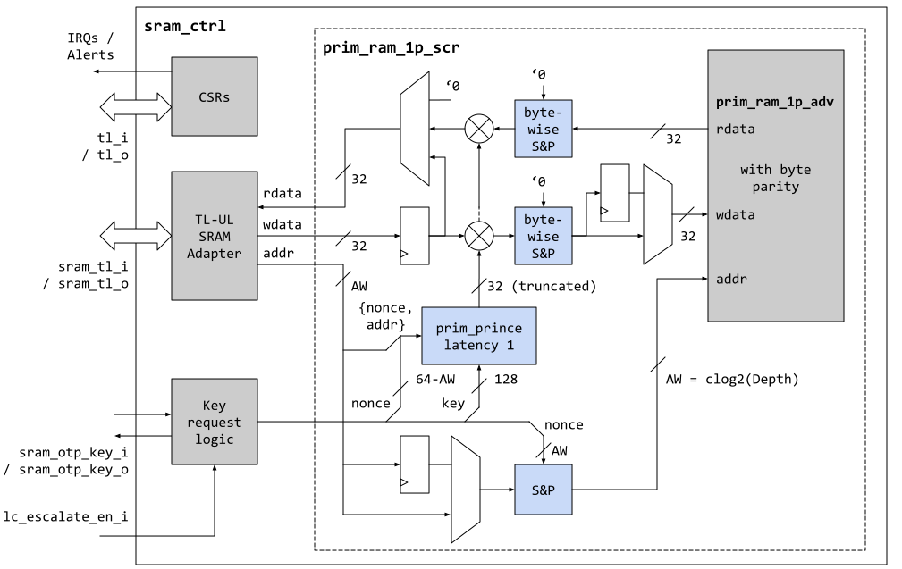
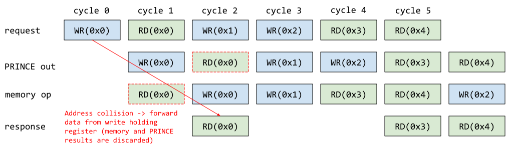

# Overview

This document specifies the functionality of the SRAM memory controller.
The SRAM controller is a module that is a peripheral on the chip interconnect bus, and thus follows the [Comportability Specification]().


The SRAM controller interfaces with the SRAM data and address scrambling device and provides CSRs for requesting the scrambling keys and reporting any parity errors that have occurred in the macro.

## Features

- Key request logic for the lightweight memory and address scrambling device.
- Reporting CSRs and alert trigger for SRAM integrity errors.
- Security hardening when integrity error has been detected.

# Theory of Operations

## Block Diagram



As shown in the blockdiagram above (for `Width = 32`), the SRAM controller is a relatively simple module that only contains a CSR node and a key request interface.
The actual scrambling mechanism is implemented in the `prim_ram_1p_scr` primitive and has to be instantiated alongside the `sram_ctrl`, together with the appropriately parameterized TL-UL SRAM adapter.
The reason for this arrangement is that memory blocks (like SRAM and flash) are declared separately from the comportable IPs in the OpenTitan top-level generator tool.
Also, moving the scrambling mechanism into a primitive makes it possible to conveniently reuse the same scrambling mechanism in other IPs such as [OTBN]().

The scrambling mechanism is always enabled, but the `sram_ctrl` provides the scrambling device with a predefined scrambling key and nonce when it comes out of reset.
It is the task of SW to request a new scrambling key and nonce via the CSRs as described in the [Programmer's Guide]() below.

Note that TL-UL accesses to the memory that occur while a key request is pending will be blocked until the key request has completed.

## Hardware Interfaces

### Parameters

The following table lists the instantiation parameters of the SRAM controller.

Parameter                   | Default (Max)         | Top Earlgrey | Description
----------------------------|-----------------------|--------------|---------------
`AlertAsyncOn`              | 1'b1                  | 2'b1         |
`RndCnstSramKey`            | (see RTL)             | (see RTL)    | Compile-time random default constant for scrambling key.
`RndCnstSramNonce`          | (see RTL)             | (see RTL)    | Compile-time random default constant for scrambling nonce.

### Signals



The table below lists other SRAM controller signals.

Signal                     | Direction        | Type                               | Description
---------------------------|------------------|------------------------------------|---------------
`lc_escalate_en_i`         | `input`          | `lc_ctrl_pkg::lc_tx_t`             | Multibit life cycle escalation enable signal coming from life cycle controller.
`sram_otp_key_o`           | `output`         | `otp_ctrl_pkg::sram_otp_key_req_t` | Key derivation request going to the key derivation interface of the OTP controller.
`sram_otp_key_i`           | `input`          | `otp_ctrl_pkg::sram_otp_key_rsp_t` | Ephemeral scrambling key coming back from the key derivation inferface of the OTP controller.
`sram_scr_o`               | `output`         | `sram_ctrl_pkg::sram_scr_req_t`    | Struct holding the current key and nonce for the scrambling mechanism.
`sram_scr_i`               | `input`          | `sram_ctrl_pkg::sram_scr_rsp_t`    | Response struct indicating any parity errors and the address of the faulty read operation.

#### Interfaces to OTP and the SRAM Scrambling Primitive

The interface to the key derivation interface inside the OTP controller follows a simple req / ack protocol, where the SRAM controller first requests a new ephemeral key by asserting the `sram_otp_key_i.req`.
The OTP controller then fetches entropy from CSRNG and derives an ephemeral key using the SRAM_DATA_KEY_SEED and the PRESENT scrambling data path as described in the [OTP controller spec]().
Finally, the OTP controller returns a fresh ephemeral key via the response channels (`sram_otp_key_o[*]`, `otbn_otp_key_o`), which complete the req / ack handshake.
The key and nonce are made available to the scrambling primitive via `sram_scr_o` in the subsequent cycles.
The wave diagram below illustrates this process.


{signal: [
  {name: 'clk_otp_i',                 wave: 'p...........'},
  {name: 'sram_otp_key_o.req',        wave: '0.|1.|..0|..'},
  {name: 'sram_otp_key_i.ack',        wave: '0.|..|.10|..'},
  {name: 'sram_otp_key_i.nonce',      wave: '0.|..|.30|..'},
  {name: 'sram_otp_key_i.key',        wave: '0.|..|.30|..'},
  {name: 'sram_otp_key_i.seed_valid', wave: '0.|..|.10|..'},
  {},
  {name: 'clk_i',                     wave: 'p...........'},
  {name: 'sram_scr_o.valid',          wave: '10|..|...|1.'},
  {name: 'sram_scr_o.key',            wave: '4.|..|...|3.'},
  {name: 'sram_scr_o.nonce',          wave: '4.|..|...|3.'},
]}


If the key seeds have not yet been provisioned in OTP, the keys are derived from all-zero constants, and the `*.seed_valid` signal will be set to 0 in the response.
It should be noted that this mechanism requires the CSRNG and entropy distribution network to be operational, and a key derivation request will block if they are not.

Note that the req/ack protocol runs on `clk_otp_i`.
The SRAM controller synchronizes the data over via a req/ack handshake primitive `prim_sync_reqack.sv` primitive as shown below.


Note that the key and nonce output signals on the OTP controller side are guaranteed to remain stable for at least 62 OTP clock cycles after the `ack` signal is pulsed high, because the derivation of a 64bit half-key takes at least two passes through the 31-cycle PRESENT primitive.
Hence, if the SRAM controller clock `clk_i` is faster or in the same order of magnitude as `clk_otp_i`, the data can be directly sampled upon assertion of `src_ack_o`.
If the SRAM controller runs on a significantly slower clock than OTP, an additional register (as indicated with dashed grey lines in the figure) has to be added.

#### Lifecycle Escalation

If `lc_escalate_en_i` is set to any different value than `lc_ctrl_pkg::Off`, the current scrambling keys are discarded and reset to `RndCnstSramKey` and `RndCnstSramNonce` in the subsequent cycle.
Any subsequent memory request to `prim_ram_1p_scr` will then be blocked as well.
This mechanism is part of the [life cycle]() state scrapping and secret wiping countermeasure triggered by the alert handler.

## Scrambling Primitive

The scrambling primitive `prim_ram_1p_scr` employs a reduced-round (5 instead of 11) PRINCE block cipher in CTR mode to scramble the data.
The PRINCE lightweight block cipher has been selected due to its low latency and low area characteristics, see also [prim_prince]() for more information on PRINCE.
The number of rounds is reduced to 5 in order to ease timing pressure and ensure single cycle operation (the number of rounds can always be increased if it turns out that there is enough timing slack).

In [CTR mode](https://en.wikipedia.org/wiki/Block_cipher_mode_of_operation#Counter_(CTR)), the block cipher is used to encrypt a 64bit IV with the scrambling key in order to create a 64bit keystream block that is bitwise XOR'ed with the data in order to transform plaintext into ciphertext and vice versa.
The IV is assembled by concatenating a nonce with the word address.

If the word width of the scrambled memory is smaller than 64bit, the keystream block is truncated to fit the data width.
If the word width is wider than 64bit, the scrambling primitive by default instantiates multiple PRINCE primitives in order to create a unique keystream for the full datawidth.
For area constrained settings, the parameter `ReplicateKeyStream` in `prim_ram_1p_scr` can be set to 1 in order to replicate the keystream block generated by one single primitive instead of using multiple parallel PRINCE instances (but it should be understood that this lowers the level of security).

Since plain CTR mode does not diffuse the data bits due to the bitwise XOR, the scheme is augmented by passing each individual byte through a two-layer substitution-permutation (S&P) network implemented with the `prim_subst_perm` primitive.
This is applied byte-wise in order to maintain byte-write-ability without having to perform a read-modify-write operation.
The S&P network employed is similar to the one employed in PRESENT and will be explained in more detail [further below]().

Another CTR mode augmentation that is aimed at breaking the linear address space is SRAM address scrambling.
The same two-layer S&P network that is used for byte diffusion is leveraged to non-linearly remap the SRAM address as shown in the block diagram above.
As opposed to the byte diffusion S&P networks, this particular address scrambling network additionally XOR's in a nonce that has the same width as the address.

### Integrity Error Handling

The `prim_ram_1p_scr` primitive contains an input to indicate whether upstream logic has detected an integrity error (The generation of the integrity error is determined by system integration).
When an integrity error is encountered, the prim memory module does the following:
*  Latch the error condition until reset.
*  Reverse the nonce used during the address and CTR scrambling.
*  Disallow any transaction (read or write) on the actual memory macro.

This behavior, combined with other top level defenses, form a multi-layered defense when integrity errors are seen in the system.

### Read and Write Sequencing

For timing reasons, the scrambling primitive instantiates a register halfway in the PRINCE block cipher.
This means that the keystream block becomes available in the second request cycle, which naturally aligns with read operations since the SRAM memory latency is 1 clock cycle.

However, write operations have to be deferred by 1 cycle in order to be able to reuse the same PRINCE primitive.
This can lead to read/write conflicts when a write operation is immediately followed by a read operation, and we solve that issue by introducing two write data holding registers (highlighted with green and orange in the block diagram above).
The register highlighted with green is the unscrambled data holding register, which is used for forwarding unwritten write data in case the conflicting read operation goes to the same address as the pending write operation.
The register highlighted with orange is the scrambled data holding register, which holds the scrambled data until the conflicting read operation(s) have completed.

Note that this arrangement still allows full read/write throughput as illustrated in the alternating R/W sequence below.



### Custom Substitution Permutation Network

In addition to the PRINCE primitive, `prim_ram_1p_scr` employs a custom S&P network for byte diffusion and address scrambling.
The structure of that S&P network is similar to the one used in PRESENT, but it uses a modified permutation function that makes it possible to parameterize the network to arbitrary data widths as shown in the pseudo code below.

```c++

NUM_ROUNDS = 2;
DATA_WIDTH = 8; // bitwidth of the data

// Apply PRESENT Sbox4 on all nibbles, leave uppermost bits unchanged
// if the width is not divisible by 4.
state_t sbox4_layer(state) {
    for (int i = 0; i < DATA_WIDTH/4; i ++) {
        nibble_t nibble = get_nibble(state, i);
        nibble = present_sbox4(nibble)
        set_nibble(state, i, nibble);
    }
    return state;
}

// Reverses the bit order.
state_t flip_vector(state) {
    state_t state_flipped;
    for (int i = 0; i < DATA_WIDTH; i ++) {
        state_flipped[i] = state[width-1-i];
    }
    return state_flipped;
}

// Gather all even bits and put them into the lower half.
// Gather all odd bits and put them into the upper half.
state_t perm_layer(state) {
    // Initialize with input state.
    // If the number of bits is odd, the uppermost bit
    // will stay in position, as intended.
    state_t state_perm = state;
    for (int i = 0; i < DATA_WIDTH/2; i++) {
      state_perm[i]                = state[i * 2];
      state_perm[i + DATA_WIDTH/2] = state[i * 2 + 1];
    }
    return state_perm;
}

state_t prim_subst_perm(data_i, key_i) {

    state_t state = data_i;
    for (int i = 0; i < NUM_ROUNDS; i++) {
        state ^= key_i;
        state = sbox4_layer(state);
        // The vector flip and permutation operations have the
        // combined effect that all bits will be passed through an
        // Sbox4 eventually, even if the number of bits in data_i
        // is not aligned with 4.
        state = flip_vector(state);
        state = perm_layer(state);
    }

    return state ^ key_i;
}

```

### Scrambling Primitive Parameters

The following table lists the instantiation parameters of the `prim_ram_1p_scr` primitive.
These are not exposed in the `sram_ctrl` IP, but have to be set directly when instantiating `prim_ram_1p_scr` in the top.

Parameter                   | Default (Max)         | Top Earlgrey | Description
----------------------------|-----------------------|--------------|---------------
`Depth`                     | 512                   | multiple     | SRAM depth, needs to be a power of 2 if `NumAddrScrRounds` > 0.
`Width`                     | 32                    | 32           | Effective SRAM width without redundancy.
`DataBitsPerMask`           | 8                     | 8            | Number of data bits per write mask.
`EnableParity`              | 1                     | 1            | This parameter enables byte parity.
`CfgWidth`                  | 8                     | 8            | Width of SRAM attributes field.
`NumPrinceRoundsHalf`       | 2 (5)                 | 2            | Number of PRINCE half-rounds.
`NumDiffRounds`             | 2                     | 2            | Number of additional diffusion rounds, set to 0 to disable.
`DiffWidth`                 | 8                     | 8            | Width of additional diffusion rounds, set to 8 for intra-byte diffusion.
`NumAddrScrRounds`          | 2                     | 2            | Number of address scrambling rounds, set to 0 to disable.
`ReplicateKeyStream`        | 0 (1)                 | 0            | If set to 1, the same 64bit key stream is replicated if the data port is wider than 64bit. Otherwise, multiple PRINCE primitives are employed to generate a unique keystream for the full data width.

### Scrambling Primitive Signals

Signal                     | Direction        | Type                               | Description
---------------------------|------------------|------------------------------------|---------------
`key_valid_i`              | `input`          | `logic`                            | Indicates whether the key and nonce are considered valid. New memory requests are blocked if this is set to 0.
`key_i`                    | `input`          | `logic [127:0]`                    | Scrambling key.
`nonce_i`                  | `input`          | `logic [NonceWidth-1:0]`           | Scrambling nonce.
`req_i`                    | `input`          | `logic`                            | Memory request indication signal (from TL-UL SRAM adapter).
`gnt_o`                    | `output`         | `logic`                            | Grant signal for memory request (to TL-UL SRAM adapter)
`write_i`                  | `input`          | `logic`                            | Indicates that this is a write operation (from TL-UL SRAM adapter).
`addr_i`                   | `input`          | `logic [AddrWidth-1:0]`            | Address for memory op (from TL-UL SRAM adapter).
`wdata_i`                  | `input`          | `logic [Width-1:0]`                | Write data (from TL-UL SRAM adapter).
`wmask_i`                  | `input`          | `logic [Width-1:0]`                | Write mask (from TL-UL SRAM adapter).
`intg_error_i`             | `input`          | `logic`                            | Indicates whether the incoming transaction has an integrity error
`rdata_o`                  | `output`         | `logic [Width-1:0]`                | Read data output (to TL-UL SRAM adapter).
`rvalid_o`                 | `output`         | `logic`                            | Read data valid indication (to TL-UL SRAM adapter).
`rerror_o`                 | `output`         | `logic [1:0]`                      | Error indication (to TL-UL SRAM adapter). Bit 0 indicates a correctable and bit 1 an uncorrectable error. Note that at this time, only uncorrectable errors are reported, since the scrambling device only supports byte parity.
`intg_error_o`             | `output`         | `logic`                            | Forwards latched integrity error indication to the sram controller.
`raddr_o`                  | `output`         | `logic [31:0]`                     | Address of the faulty read operation.
`cfg_i`                    | `input`          | `logic [CfgWidth-1:0]`             | Attributes for physical memory macro.

# Programmer's Guide

## Initialization

The memory inside the SRAM controller can be used right away after a system reset.
However, since the scrambling key defaults to a predefined value, it is recommended that SW performs the following initialization steps as early in the boot process as possible.

1. Request a new ephemeral scrambling key from OTP by writing 0x1 to  and wait until the SRAM controller sets  to 0x1. Note that any memory access to the SRAM will error out while a key request is pending.

2. Check the  bit:
    - In case the scrambling key seeds have been fully provisioned to OTP, this bit should be set to 0x1. A value of 0x0 indicates that the OTP could be malfunctioning or has been tampered with.
    - If the scrambling seeds have not yet been provisioned to OTP, this bit is set to 0x0. The scrambling key will in that case still be ephemeral, but the key seed mixed in as part of the key derivation process will be set to a predefined netlist constant.

3. (optional) Lock down write access to  by writing to  if future key renewals should be disallowed until the next system reset.

4. (optional) Depending on the SW requirements, the SRAM should be initialized with zero at this point.

Note that before (re-)requesting a new SRAM key it is imperative to make sure that:
- The memory contents are not needed anymore. Requesting a key implicitly wipes all data in the SRAM.
- The CSRNG and the entropy distribution network have been initialized. The key derivation mechanism in OTP needs to request a chunk of fresh entropy, and that request will block until the entropy distribution network responds.

It should also be noted that data and address scrambling is never entirely disabled - even when the default scrambling key is used.

## Error Handling

Data in the SRAM is integrity protected with byte parity.
In case an integrity failure is detected, the SRAM controller sets the  bit in the CSRs and continuously sends out a `fatal_parity_error` or `fatal_intg_error` alert.
At the same time, the affected TL-UL transaction will error out.

SRAM integrity failures are considered unrecoverable and cannot be cleared.
SW should hence treat this error as fatal and shut down.
Optionally, SW can read the  register, which exposes the address of the faulty memory operation.

## Register Table


