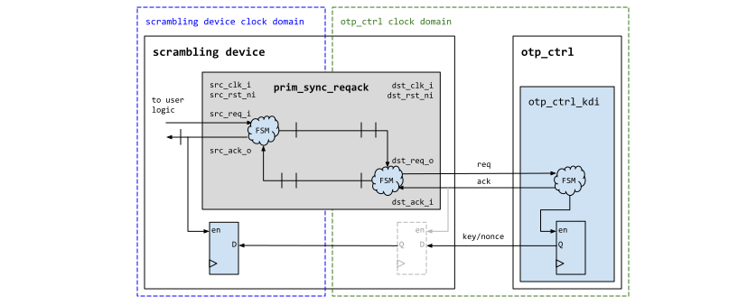
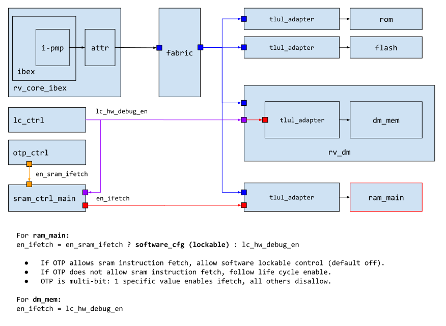

# Overview

This document specifies the functionality of the SRAM memory controller.
The SRAM controller is a module that is a peripheral on the chip interconnect bus, and thus follows the [Comportability Specification]().

The SRAM controller contains the SRAM data and address scrambling device and provides CSRs for requesting the scrambling keys and triggering the hardware initialization feature.

## Features

- [Lightweight scrambling mechanism]() based on the PRINCE prince cipher.
- Key request logic for the lightweight memory and address scrambling device.
- Alert sender and checking logic for detecting bus integrity failures.
- LFSR-based memory initialization feature.
- Access controls to allow / disallow code execution from SRAM.
- Security hardening when integrity error has been detected.

# Theory of Operations

## Block Diagram

As shown in the block diagram above, the SRAM controller contains a TL-UL adapter, an initialization LFSR, the CSR node, key request logic and an instance of `prim_ram_1p_scr` that implements the actual scrambling mechanism.

The SRAM controller supports the system-wide end-to-end bus integrity scheme and thus stores the data integrity bits alongside each data word in the memory.
I.e., this means that both the 32 data bits and 7 integrity bits are passed through the scrambling device.

Sub-word write operations therefore perform a read-modify-write operation in order to ensure consistency of the integrity bits.
Hence, the throughput of sub-word write operations is three times lower than for full-word write operations.
Note however that the throughput of read operations is the same for full- and sub-word read operations.

The scrambling mechanism is always enabled and the `sram_ctrl` provides the scrambling device with a predefined scrambling key and nonce when it comes out of reset.
It is the task of SW to request an updated scrambling key and nonce via the CSRs as described in the [Programmer's Guide]() below.

For SW convenience, the SRAM controller also provides an LFSR-based memory initialization feature that can overwrite the entire memory with pseudorandom data.
Similarly to the scrambling key, it is the task of of SW to request memory initialization via the CSRs as described in the [Programmer's Guide]() below.

Note that TL-UL accesses to the memory that occur while a key request or hardware initialization is pending will be blocked until the request has completed.

The individual mechanisms are explained in more detail in the subsections below.

## Hardware Interfaces

### Parameters

The following table lists the instantiation parameters of the SRAM controller.

Parameter                   | Default               | Top Earlgrey      | Description
----------------------------|-----------------------|-------------------|---------------
`AlertAsyncOn`              | 1'b1                  | 1'b1              |
`InstrExec`                 | 1                     | 1                 | Enables the execute from SRAM feature.
`MemSizeRam`                | 4096                  | (multiple values) | Number of 32bit words in the SRAM (can be overridden by `topgen`).
`RndCnstSramKey`            | (see RTL)             | (see RTL)         | Compile-time random default constant for scrambling key.
`RndCnstSramNonce`          | (see RTL)             | (see RTL)         | Compile-time random default constant for scrambling nonce.
`RndCnstLfsrSeed`           | (see RTL)             | (see RTL)         | Compile-time random default constant for LFSR seed.
`RndCnstLfsrPerm`           | (see RTL)             | (see RTL)         | Compile-time random default constant for LFSR permutation.

### Signals



The table below lists other SRAM controller signals.

Signal                     | Direction        | Type                               | Description
---------------------------|------------------|------------------------------------|---------------
`lc_hw_debug_en_i`         | `input`          | `lc_ctrl_pkg::lc_tx_t`             | Multibit life cycle hardware debug enable signal coming from life cycle controller, asserted when the hardware debug mechanisms are enabled in the system.
`lc_escalate_en_i`         | `input`          | `lc_ctrl_pkg::lc_tx_t`             | Multibit life cycle escalation enable signal coming from life cycle controller, asserted if an escalation has occurred.
`sram_otp_key_o`           | `output`         | `otp_ctrl_pkg::sram_otp_key_req_t` | Key derivation request going to the key derivation interface of the OTP controller.
`sram_otp_key_i`           | `input`          | `otp_ctrl_pkg::sram_otp_key_rsp_t` | Ephemeral scrambling key coming back from the key derivation interface of the OTP controller.
`otp_en_sram_ifetch_i`     | `input`          | `otp_ctrl_pkg::mubi8_t`            | Multibit value coming from the OTP HW_CFG partition ([EN_SRAM_IFETCH]()), set to kMuBi8True in order to enable the  CSR.
`cfg_i`                    | `input`          | `logic [CfgWidth-1:0]`             | Attributes for physical memory macro.

#### Interfaces to OTP and the SRAM Scrambling Primitive

The interface to the key derivation interface inside the OTP controller follows a simple req / ack protocol, where the SRAM controller first requests an updated ephemeral key by asserting the `sram_otp_key_i.req`.
The OTP controller then fetches entropy from CSRNG and derives an ephemeral key using the SRAM_DATA_KEY_SEED and the PRESENT scrambling data path as described in the [OTP controller spec]().
Finally, the OTP controller returns a fresh ephemeral key via the response channels (`sram_otp_key_o[*]`, `otbn_otp_key_o`), which complete the req / ack handshake.
The key and nonce are made available to the scrambling primitive in the subsequent cycle.
The wave diagram below illustrates this process.


{signal: [
  {name: 'clk_otp_i',                 wave: 'p...........'},
  {name: 'sram_otp_key_o.req',        wave: '0.|1.|..0|..'},
  {name: 'sram_otp_key_i.ack',        wave: '0.|..|.10|..'},
  {name: 'sram_otp_key_i.nonce',      wave: '0.|..|.30|..'},
  {name: 'sram_otp_key_i.key',        wave: '0.|..|.30|..'},
  {name: 'sram_otp_key_i.seed_valid', wave: '0.|..|.10|..'},
  {},
  {name: 'clk_i',                     wave: 'p...........'},
  {name: 'key_valid_q',               wave: '10|..|...|1.'},
  {name: 'key_q',                     wave: '4.|..|...|3.'},
  {name: 'nonce_q',                   wave: '4.|..|...|3.'},
  {name: 'key_seed_valid_q',          wave: '4.|..|...|3.'},
]}


If the key seeds have not yet been provisioned in OTP, the keys are derived from all-zero constants, and the `*.seed_valid` signal will be set to 0 in the response.
It should be noted that this mechanism requires the CSRNG and entropy distribution network to be operational, and a key derivation request will block if they are not.

Note that the req/ack protocol runs on `clk_otp_i`.
The SRAM controller synchronizes the data over via a req/ack handshake primitive `prim_sync_reqack.sv` primitive as shown below.

Note that the key and nonce output signals on the OTP controller side are guaranteed to remain stable for at least 62 OTP clock cycles after the `ack` signal is pulsed high, because the derivation of a 64bit half-key takes at least two passes through the 31-cycle PRESENT primitive.
Hence, if the SRAM controller clock `clk_i` is faster or in the same order of magnitude as `clk_otp_i`, the data can be directly sampled upon assertion of `src_ack_o`.
If the SRAM controller runs on a significantly slower clock than OTP, an additional register (as indicated with dashed grey lines in the figure) has to be added.

#### Global and Local Escalation

If `lc_escalate_en_i` is set to any different value than `lc_ctrl_pkg::Off`, the current scrambling keys are discarded and reset to `RndCnstSramKey` and `RndCnstSramNonce` in the subsequent cycle.
Any subsequent memory request to `prim_ram_1p_scr` will then be blocked as well.
This mechanism is part of the [life cycle]() state scrapping and secret wiping countermeasure triggered by the alert handler (global escalation).

Note that if any local bus integrity or counter errors are detected, the SRAM controller will locally escalate without assertion of `lc_escalate_en_i`.
The behavior of local escalation is identical to global escalation via `lc_escalate_en_i`.

## Scrambling Primitive

As explained in [`prim_ram_1p_scr`]() the scrambling mechanism employs a reduced-round PRINCE block cipher in CTR mode to scramble the data.
Since plain CTR mode does not diffuse the data bits due to the bitwise XOR, the scheme is augmented by passing each word through a shallow substitution-permutation (S&P) network implemented with the `prim_subst_perm` primitive.
The S&P network employed is similar to the one employed in PRESENT and is explained in more detail [here]().

Another CTR mode augmentation that is aimed at breaking the linear address space is SRAM address scrambling.
The same S&P network construction that is used for intra-word diffusion is leveraged to non-linearly remap the SRAM address as shown in the block diagram above.

### Integrity Error Handling

When an integrity error is encountered, the `sram_ctrl` will latch the integrity error send out a `fatal_bus_integ_error` until the next reset (the generation of the integrity error is determined by system integration).
In addition, the latched error condition is fed into the `prim_ram_1p_scr` primitive via a dedicated input, causing the scrambling primitive to do the following:
*  Reverse the nonce used during the address and CTR scrambling.
*  Disallow any transaction (read or write) on the actual memory macro.

This behavior, combined with other top level defenses, form a multi-layered defense when integrity errors are seen in the system.

### LFSR Initialization Feature

Since the scrambling device uses a block cipher in CTR mode, it is undesirable to initialize the memory with all-zeros from a security perspective, as that would reveal the XOR keystream.
To this end, the `sram_ctrl` contains an LFSR-based initialization mechanism that overwrites the the entire memory with pseudorandom data.

Initialization can be triggered via the  CSR, and once triggered, the LFSR is first re-seeded with the nonce that has been fetched together with the scrambling key.
Then, the memory is initialized with pseudorandom data pulled from the LFSR.
For each pseudorandom 32bit word, the initialization mechanism computes the corresponding integrity bits and writes both the data and integrity bits (39bit total) through the scrambling device using the most recently obtained scrambling key.

If SW triggers the scrambling key update and LFSR initialization at the same time (i.e., with the same CSR write operation), the LFSR initialization will be stalled until an updated scrambling key has been obtained.

There is no limit on how often the initialization feature can be called, and hence it can also be used as a cheap SRAM wiping mechanism at runtime.
Note however that the PRNG sequence does not have strong security guarantees, since it is produced using an LFSR.

### Code Execution from SRAM

The SRAM controller contains an access control mechanism for filtering instruction fetches from the processor.
As illustrated below, an OTP switch EN_SRAM_IFETCH (see [OTP memory map]()) allows to either tie code execution from SRAM to the life cycle state via the HW_DEBUG_EN function (see [life cycle docs]()), or it can be enabled / disabled via the  CSR.

The different configuration options are listed in the table below:

 EN_SRAM_IFETCH (OTP)   | HW_DEBUG_EN (Life Cycle) | EXEC CSR               | Execution Enabled
------------------------|--------------------------|------------------------|--------------------
 == kMultiBitBool8True  | -                        | == kMultiBitBool4True  | Yes
 == kMultiBitBool8True  | -                        | != kMultiBitBool4True  | No
 != kMultiBitBool8True  | ON                       | -                      | Yes
 != kMultiBitBool8True  | OFF                      | -                      | No

Note that the execute from SRAM feature may only be enabled on certain SRAM controller instances in the top-level design.
If the feature is turned off via the `InstrExec` parameter, the execute from SRAM feature is permanently disabled, and the status of the OTP switch, the life cycle state and the value of the EXEC register are irrelevant.

As an example, the `top_earlgrey` design only enables this feature on the main SRAM, and permanently disables it on the retention SRAM.

### Read and Write Sequencing

For timing reasons, the scrambling primitive instantiates a register halfway in the PRINCE block cipher.
This means that the keystream block becomes available in the second request cycle, which naturally aligns with read operations since the SRAM memory latency is 1 clock cycle.

However, write operations have to be deferred by 1 cycle in order to be able to reuse the same PRINCE primitive.
This can lead to read/write conflicts when a write operation is immediately followed by a read operation, and we solve that issue by introducing two write data holding registers (highlighted with green and orange in the block diagram above).
The register highlighted with green is the unscrambled data holding register, which is used for forwarding unwritten write data in case the conflicting read operation goes to the same address as the pending write operation.
The register highlighted with orange is the scrambled data holding register, which holds the scrambled data until the conflicting read operation(s) have completed.

Note that this arrangement still allows full read/write throughput as illustrated in the alternating R/W sequence below.

However, due to the end-to-end bus integrity scheme, sub-word write accesses currently require a read-modify-write operation in order to recompute the integrity bits for the entire word, as illustrated in the diagram below.

Sub-word write accesses are therefore 3x slower than full-word write accesses.
Read accesses however always take 1 cycle, no matter whether the access is a full-word or sub-word read operation.

Note that this has been implemented in this way to not overly complicate the design, and since it is assumed that sub-word write operations happen relatively infrequently.
For full write throughput, a more elaborate write buffering scheme would be required.

# Programmer's Guide

## Initialization

The memory inside the SRAM controller can be used right away after a system reset.
However, since the scrambling key defaults to a predefined value, it is recommended that SW performs the following initialization steps as early in the boot process as possible.

1. Request an updated ephemeral scrambling key from OTP by writing 0x1 to .
   SW can spin on  to wait until the new key has been obtained.
   This is however not strictly needed, since memory accesses to the SRAM will be stalled until the updated key has been obtained.

2. (optional) Initialize the memory with pseudo random data by writing 0x1 to 
   SW can spin on  to wait until the memory has been initialized.
   This is however not strictly needed, since memory accesses to the SRAM will be stalled until the initialization is done.

3. (optional) Check the  bit:
    - In case the scrambling key seeds have been fully provisioned to OTP, this bit should be set to 0x1. A value of 0x0 indicates that the OTP could be malfunctioning or has been tampered with.
    - If the scrambling seeds have not yet been provisioned to OTP, this bit is set to 0x0. The scrambling key will in that case still be ephemeral, but the key seed mixed in as part of the key derivation process will be set to a predefined netlist constant.

4. (optional) Lock down write access to  by writing to  if future key renewals and initializations should be disallowed until the next system reset.

Note that before (re-)requesting an updated SRAM key it is imperative to make sure that:
- The memory contents are not needed anymore. Requesting a key implicitly wipes all data in the SRAM.
- The CSRNG and the entropy distribution network have been initialized. The key derivation mechanism in OTP needs to request a chunk of fresh entropy, and that request will block until the entropy distribution network responds.

It should also be noted that data and address scrambling is never entirely disabled - even when the default scrambling key is used.

## Register Table


