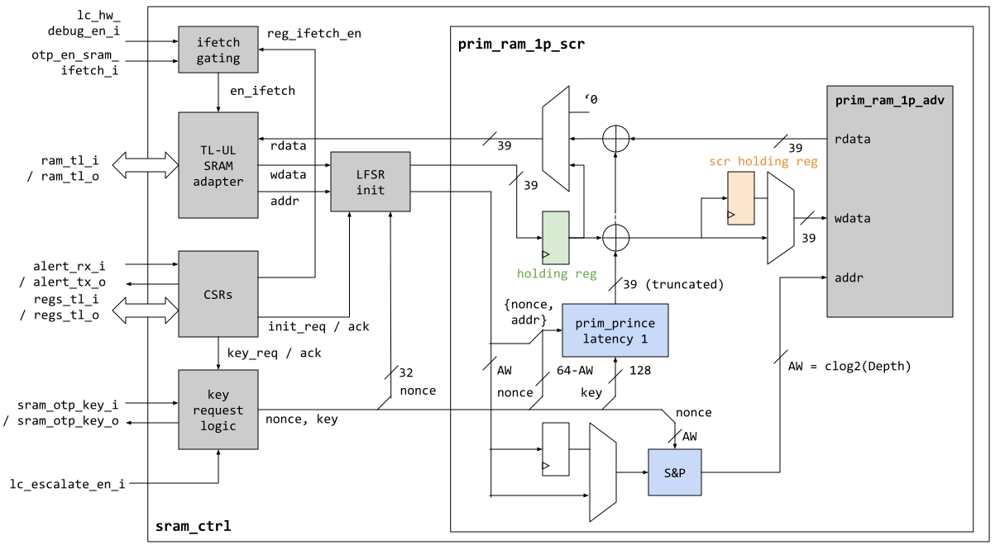

# Overview

This document specifies the functionality of the SRAM memory controller.
The SRAM controller is a module that is a peripheral on the chip interconnect bus, and thus follows the [Comportability Specification]().


The SRAM controller contains the SRAM data and address scrambling device and provides CSRs for controlling the scrambling mechanism, report ECC errors and configure SRAM macro attributes.

## Features

- Lightweight memory and address scrambling based on a reduced-round PRINCE block cipher (see also [prim_prince]()).
- Reporting for uncorrectable and correctable integrity errors.
- Exposure of SRAM macro attributes such as write/read margin bits

# Theory of Operations

## Block Diagram

As shown in the blockdiagram below (for `Width = 32`), the SRAM controller contains a CSR node, a key request interface, a TL-UL SRAM adapter and an instance of `prim_ram_1p_scr` that implements the actual scrambling algorithm.
Scrambling is always enabled, but the scrambling device uses an all-zero scrambling key and nonce when it comes out of reset.
It is the task of SW to request a new scrambling key and nonce via the CSRs as described in the [Programmer's Guide]() below.



The scrambling device employs a reduced-round (5 instead of 11) PRINCE block cipher in CTR mode to scramble the data.
The PRINCE lightweight block cipher has been selected due to its low latency and low area characteristics, see also [prim_prince]() for more information on PRINCE.
The number of rounds is reduced to 5 in order to ease timing pressure and ensure single cycle operation (the number of rounds can always be increased if it turns out that there is enough timing slack).

In [CTR mode](https://en.wikipedia.org/wiki/Block_cipher_mode_of_operation#Counter_(CTR)), the block cipher is used to encrypt a 64bit IV with the scrambling key in order to create a 64bit keystream block that is bitwise XOR'ed with the data in order to transform plaintext into ciphertext and vice versa.
The IV is assembled by concatenating a nonce with the word address.

If the input data word is smaller than 64bit, the keystream block is truncated to fit the input data width.
If the input data word is wider than 64bit, the SRAM controller by default instantiates multiple PRINCE primitives in order to create a unique keystream for the full datawidth.
For area constrained settings, the parameter `ReplicateKeyStream` can be set to 1 in order to replicate the keystream block generated by one single primitive instead of using multiple parallel PRINCE instances (but it should be understood that this lowers the level of security).

Since plain CTR mode does not diffuse the data bits due to the bitwise XOR, the scheme is augmented by passing each individual byte through a two-layer substitution-permutation (S&P) network implemented with the `prim_subst_perm` primitive.
This is applied byte-wise in order to maintain byte-write-ability without having to perform a read-modify-write operation.
The S&P network employed is similar to the one employed in PRESENT and will be explained in more detail [further below]().

Another CTR mode augmentation that is aimed at breaking the linear address space is SRAM address scrambling.
The same two-layer S&P network that is used for byte diffusion is leveraged to non-linearly remap the SRAM address as shown in the block diagram above.
As opposed to the byte diffusion S&P networks, this particular address scrambling network additionally XOR's in a nonce that has the same width as the address.

## Hardware Interfaces

### Parameters

The following table lists the instantiation parameters of the SRAM controller.

Parameter                   | Default (Max)         | Top Earlgrey | Description
----------------------------|-----------------------|--------------|---------------
`Depth`                     | 512                   | multiple     | SRAM depth, needs to be a power of 2 if `NumAddrScrRounds` > 0.
`Width`                     | 32                    | 32           | Effective SRAM width without redundancy.
`CfgWidth`                  | 8                     | 8            | Width of SRAM attributes field.
`NumPrinceRoundsHalf`       | 2 (5)                 | 2            | Number of PRINCE half-rounds.
`NumByteScrRounds`          | 2                     | 2            | Number of intra-byte diffusion rounds, set to 0 to disable.
`NumAddrScrRounds`          | 2                     | 2            | Number of address scrambling rounds, set to 0 to disable.
`ReplicateKeyStream`        | 0 (1)                 | 0            | If set to 1, the same 64bit key stream is replicated if the data port is wider than 64bit. Otherwise, multiple PRINCE primitives are employed to generate a unique keystream for the full data width.

### Signals



The table below lists other SRAM controller signals.

Signal                     | Direction        | Type                               | Description
---------------------------|------------------|------------------------------------|---------------
`sram_tl_i`                | `input`          | `tlul_pkg::tl_h2d_t`               | Second TL-UL interface for the SRAM macro (independent from the CSR TL-UL port).
`sram_tl_o`                | `input`          | `tlul_pkg::tl_d2h_t`               | Second TL-UL interface for the SRAM macro (independent from the CSR TL-UL port).
`lc_escalate_en_i`         | `input`          | `lc_ctrl_pkg::lc_tx_t`             | Multibit life cycle escalation enable signal coming from life cycle controller.
`sram_otp_key_o`           | `output`         | `otp_ctrl_pkg::sram_otp_key_req_t` | Key derivation request going to the key derivation interface of the OTP controller.
`sram_otp_key_i`           | `input`          | `otp_ctrl_pkg::sram_otp_key_rsp_t` | Ephemeral scrambling key coming back from the key derivation inferface of the OTP controller.

#### Lifecycle Escalation Input

If `lc_escalate_en_i` is set to any different value than `lc_ctrl_pkg::Off`, the current scrambling keys are discarded and reset to `'0`.
This mechanism is part of the [life cycle]() state scrapping and secret wiping countermeasure triggered by the alert handler.

#### Interface to OTP

The interface to the key derivation interface inside the OTP controller follows a simple req / ack protocol, where the SRAM controller first requests a new ephemeral key by asserting the `sram_otp_key_i.req`.
The OTP controller then fetches entropy from CSRNG and derives an ephemeral key using the SRAM_DATA_KEY_SEED and the PRESENT scrambling data path as described in the [OTP controller spec]().
Finally, the OTP controller returns a fresh ephemeral key via the response channels (`sram_otp_key_o[*]`, `otbn_otp_key_o`), which complete the req / ack handshake.
The wave diagram below illustrates this process for the OTBN scrambling device.


{signal: [
  {name: 'clk_i',                     wave: 'p.......'},
  {name: 'sram_otp_key_o.req',        wave: '01.|..0.'},
  {name: 'otbn_otp_key_i.ack',        wave: '0..|.10.'},
  {name: 'sram_otp_key_i.nonce',      wave: '0..|.30.'},
  {name: 'sram_otp_key_i.key',        wave: '0..|.30.'},
  {name: 'sram_otp_key_i.seed_valid', wave: '0..|.10.'},
]}


If the key seeds have not yet been provisioned in OTP, the keys are derived from all-zero constants, and the `*.seed_valid` signal will be set to 0 in the response.
It should be noted that this mechanism requires the CSRNG and entropy distribution network to be operational, and a key derivation request will block if they are not.

Note that the req/ack protocol runs on `clk_otp_i`.
The SRAM controller synchronizes the data over via a req/ack handshake primitive `prim_sync_reqack.sv` primitive as shown below.


Note that the key and nonce output signals on the OTP controller side are guaranteed to remain stable for at least 62 OTP clock cycles after the `ack` signal is pulsed high, because the derivation of a 64bit half-key takes at least two passes through the 31-cycle PRESENT primitive.
Hence, if the SRAM controller clock `clk_i` is faster or in the same order of magnitude as `clk_otp_i`, the data can be directly sampled upon assertion of `src_ack_o`.
If the SRAM controller runs on a significantly slower clock than OTP, an additional register (as indicated with dashed grey lines in the figure) has to be added.

## Custom Substitution Permutation Network

In addition to the PRINCE primitive, the SRAM controller employs a custom S&P network for byte diffusion and address scrambling.
The structure of that S&P network is similar to the one used in PRESENT, but it uses a modified permutation function that makes it possible to parameterize the network to arbitrary data widths as shown in the pseudo code below.

```c++

NUM_ROUNDS = 2;
DATA_WIDTH = 8; // bitwidth of the data

// Apply PRESENT Sbox4 on all nibbles, leave uppermost bits unchanged
// if the width is not divisible by 4.
state_t sbox4_layer(state) {
    for (int i = 0; i < DATA_WIDTH/4; i ++) {
        nibble_t nibble = get_nibble(state, i);
        nibble = present_sbox4(nibble)
        set_nibble(state, i, nibble);
    }
    return state;
}

// Reverses the bit order.
state_t flip_vector(state) {
    state_t state_flipped;
    for (int i = 0; i < DATA_WIDTH; i ++) {
        state_flipped[i] = state[width-1-i];
    }
    return state_flipped;
}

// Gather all even bits and put them into the lower half.
// Gather all odd bits and put them into the upper half.
state_t perm_layer(state) {
    // Initialize with input state.
    // If the number of bits is odd, the uppermost bit
    // will stay in position, as intended.
    state_t state_perm = state;
    for (int i = 0; i < DATA_WIDTH/2; i++) {
      state_perm[i]                = state[i * 2];
      state_perm[i + DATA_WIDTH/2] = state[i * 2 + 1];
    }
    return state_perm;
}

state_t prim_subst_perm(data_i, key_i) {

    state_t state = data_i;
    for (int i = 0; i < NUM_ROUNDS; i++) {
        state ^= key_i;
        state = sbox4_layer(state);
        // The vector flip and permutation operations have the
        // combined effect that all bits will be passed through an
        // Sbox4 eventually, even if the number of bits in data_i
        // is not aligned with 4.
        state = flip_vector(state);
        state = perm_layer(state);
    }

    return state ^ key_i;
}

```


# Programmer's Guide

## Initialization

The memory inside the SRAM controller can be used right away after a system reset.
However, since the scrambling key defaults to all-zero, it is recommended that SW performs the following initialization steps as early in the boot process as possible.

1. (optional) If the physical timing of the SRAM macro needs to be changed from the default, SW should program the correct SRAM attributes to . Note that this is a debug feature, and hence likely not required for normal operation.

2. Lock out write access to the SRAM attributes by clearing .

3. Request a new ephemeral scrambling key from OTP by writing 0x1 to  and wait until the SRAM controller sets  to 0x1. Note that any memory access to the SRAM will error out while a key request is pending.

4. Check the  bit:
    - In case the scrambling key seeds have been fully provisioned to OTP, this bit should be set to 0x1. A value of 0x0 indicates that the OTP could be malfunctioning or has been tampered with.
    - If the scrambling seeds have not yet been provisioned to OTP, this bit is set to 0x0. The scrambling key will in that case still be ephemeral, but the key seed mixed in as part of the key derivation process will be statically set to all-zero.

5. (optional) Lock down write access to  by writing to  if future key renewals should be disallowed until the next system reset.

6. (optional) Depending on the SW requirements, the SRAM should be initialized with zero at this point.

Note that before (re-)requesting a new SRAM key it is imperative to make sure that:
- The memory contents are not needed anymore. Requesting a key implicitly wipes all data in the SRAM.
- The CSRNG and the entropy distribution network have been initialized. The key derivation mechanism in OTP needs to request a chunk of fresh entropy, and that request will block until the entropy distribution network responds.

It should also be noted that data and address scrambling is never entirely disabled - even when the default all-zero scrambling key is used.
If the default all-zero key is used, this simply means that the key input to the scrambling device is deterministically set to all-zero.

## Error Handling

Data in the SRAM is integrity protected.
In case a correctable or uncorrectable integrity failure is detected, the SRAM controller raises an `sram_integ_error` interrupt, and sets the  bit in the CSRs.
At the same time, the TL-UL transaction will error out if the error is uncorrectable.

If the  bit is set, software should check the  register in order to determine whether a correctable or uncorrectable error has occurred.
The address of the last integrity error is exposed in the  register.
The error condition can then be cleared by writing 0x3 to the  register (this will also clear the  bit).

Note that at this time, the employed memory only implements byte parity due to the construction of the memory scrambling mechanism (ECC would be too costly at the byte level).
This means that all integrity failures are currently uncorrectable ().
The  register has been added for readiness such that ECC could be supported in the future.

## Register Table


