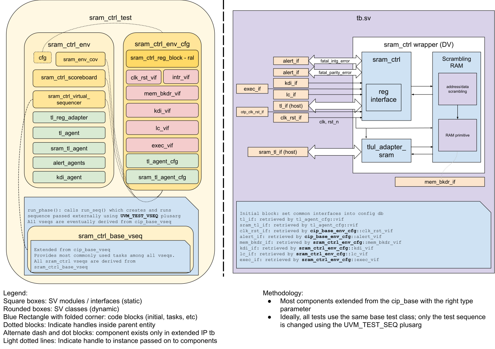

## Goals
* **DV**
  * Verify all SRAM_CTRL IP features by running dynamic simulations with a SV/UVM based testbench
  * Develop and run all tests based on the [DV plan](#dv-plan) below towards closing code and functional coverage on the IP and all of its sub-modules
* **FPV**
  * Verify TileLink device protocol compliance with an SVA based testbench

## Current status
* [Design & verification stage]()
  * [HW development stages]()
* [Simulation results](https://reports.opentitan.org/hw/ip/sram_ctrl/dv/latest/results.html)

## Design features
For detailed information on SRAM_CTRL design features, please see the [SRAM_CTRL HWIP technical specification]().

## Testbench architecture
SRAM_CTRL testbench has been constructed based on the [CIP testbench architecture]().
Note that there are 2 separate TLUL interfaces exposed to the rest of the OpenTitan system - one for CSR accesses, and one for accessing memory directly.
This is because the "full" DUT consists of the actual SRAM memory controller (which contains the CSR file) connected to a scrambling RAM primitive, with a TLUL adapter module to convert TL requests on the memory TL interface into SRAM format for the RAM primitive.

### Block diagram


### Top level testbench
Top level testbench is located at `hw/ip/sram_ctrl/dv/tb/tb.sv`. It instantiates the SRAM_CTRL DUT module `hw/ip/sram_ctrl/rtl/sram_ctrl.sv`.
In addition, it instantiates the following interfaces, connects them to the DUT and sets their handle into `uvm_config_db`:
* [Clock and reset interface]()
* [TileLink host interface]()
* SRAM_CTRL IOs
* Interrupts ([`pins_if`]())
* Alerts ([`alert_esc_if`]())
* Devmode ([`pins_if`]())

### Common DV utility components
The following utilities provide generic helper tasks and functions to perform activities that are common across the project:
* [dv_utils_pkg]()
* [csr_utils_pkg]()

### Compile-time configurations
Two compile-time configurations are tested:
* `sram_ctrl_main` - this configuration uses a 15-bit wide address space to
  emulate the main SRAM used in the full design
* `sram_ctrl_ret` - this configuration uses a 10-bit-wide address space to
  emulate the retention SRAM used in the full design

A macro-define `SRAM_ADDR_WIDTH` is defined as a build option in `hw/ip/sram_ctrl/dv/sram_ctrl_base_sim_cfg.hjson`, which is used to set the correct compile-time settings for each configuration.

### Global types & methods
All common types and methods defined at the package level can be found in
`sram_ctrl_env_pkg`. Some of them in use are:
```systemverilog
// number of bits in a full KDI transactions
parameter int KDI_DATA_SIZE = 1 + otp_ctrl_pkg::SramKeyWidth + otp_ctrl_pkg::SramNonceWidth;

// a completed KDI transaction takes 4 cycles to be fully synchronized into the
// SRAM clock domain
parameter int KDI_PROPAGATION_CYCLES = 4;

// a LC escalation request needs 3 cycles to be fully propagated through the DUT
parameter int LC_ESCALATION_PROPAGATION_CYCLES = 3;

typedef virtual mem_bkdr_if #(.MEM_PARITY(1)) mem_bkdr_vif;

typedef enum bit {
  SramCtrlRenewScrKey = 0,
  SramCtrlInit        = 1
} sram_ctrl_e;

typedef enum bit [1:0] {
  SramCtrlError           = 0,
  SramCtrlEscalated       = 1,
  SramCtrlScrKeyValid     = 2,
  SramCtrlScrKeySeedValid = 3
} sram_ctrl_status_e;
```
### TL_agent
SRAM_CTRL testbench instantiates (already handled in CIP base env) [tl_agent]()
which provides the ability to drive and independently monitor random traffic via TL host interface into SRAM_CTRL device.

### Alert agents
The SRAM_CTRL testbench instantiates 2 [alert agents]() for:
* fatal_intg_error - signals a transmission integrity error
* fatal_parity_error - signals an internal parity error in the memory primitive

The alert agents provide the ability to independently drive and monitor both alert handshakes.

### SRAM_CTRL_LC_IF
The SRAM_CTRL IP has a simple sideband interface to the LC_CTRL to receive escalation requests.
This interface initializes the escalation bus and utilizes a simple task to drive escalation requests.

### SRAM_CTRL_EXEC_IF
The SRAM_CTRL IP has an interface to enable instruction execution from SRAM - allowing the Icache to fetch instruction data from the SRAM for the CPU.
This interface contains the necessary Lifecycle and OTP structs to enable and disable this functionality.

### UVM RAL Model
The SRAM_CTRL RAL model is created with the [`ralgen`]() FuseSoC generator script automatically when the simulation is at the build stage.

It can be created manually by invoking [`regtool`]():

<!-- TODO add description of second RAL model once implemented -->

### Reference models
The SRAM_CTRL testbench uses a SystemVerilog golden model of its address and data scrambling to ensure that internal encryption and decryption are performed correctly.
This golden model, [`sram_scrambler_pkg`]() is tightly integrated with the mem_bkdr_if for ease of use such that we can choose to enable encryption on any backdoor access.

### Stimulus strategy
#### Test sequences
All test sequences reside in `hw/ip/sram_ctrl/dv/env/seq_lib`.
The `sram_ctrl_base_vseq` virtual sequence is extended from `cip_base_vseq` and serves as a starting point.
All test sequences are extended from `sram_ctrl_base_vseq`.
It provides commonly used handles, variables, functions and tasks that the test sequences can simple use / call.
Some of the most commonly used tasks / functions are as follows:
* do_rand_ops: This task sends an arbitrary number of random TL transactions to the memory primitive.
* do_stress_ops: This task sends an arbitrary number of random TL transactions to the same word in memory,
  to stress the memory's data forwarding functionalities.

#### Functional coverage
To ensure high quality constrained random stimulus, it is necessary to develop a functional coverage model.
The following covergroups have been developed to prove that the test intent has been adequately met:
* cg1:
* cg2:

### Self-checking strategy
#### Scoreboard
The `sram_ctrl_scoreboard` is primarily used for end to end checking.
It creates the following analysis ports to retrieve the data monitored by corresponding interface agents:
* tl_a_chan_fifo: TL address channel for CSR accesses
* tl_d_chan_fifo: TL data channel for CSR accesses
* alert_fifos: Alert handshakes
* sram_tl_a_chan_fifo: TL address channel for memory accesses
* sram_tl_d_chan_fifo: TL data channel for memory accesses
* kdi_fifo: For key refresh operations from OTP_CTRL

The following internal data structure is used to store information about each requested memory access:
```systemverilog
typedef struct {
  // 1 for writes, 0 for reads
  bit we;

  // TLUL address
  bit [TL_AW-1:0] addr;

  // Contains either the requested write data or the read response data
  bit [TL_DW-1:0] data;

  // used to mask read and write data to the requested granularity
  bit [TL_DBW-1:0] mask;

  // Tag the memory transaction with the appropriate key and nonce,
  // so that we can keep track even if a new key is requested.
  otp_ctrl_pkg::sram_key_t key;
  otp_ctrl_pkg::sram_nonce_t nonce;

} sram_trans_t;
```

All CSR accesses made to the SRAM_CTRL register file are tracked and predicted by the scoreboard.

Verifying memory accesses is somewhat involved, and makes heavy use of the [`mem_bkdr_if`]().

At a high level, whenever a TL access is made to memory, all relevant information is stored in an `sram_trans_t` struct.

The scrambling RAM primitive contains a data holding register, which is used to forward unwritten write data in case a read transaction immediately follows a write transaction.
Note that the pending write data is held no matter if the back-to-back read transaction accesses the same address in memory or not.
This means that every read transaction will return data in 1 cycle, but a write request may not actually modify the memory until many cycles later when any pending read request has been processed.

This data forwarding is modeled in the scoreboard such that we check all memory transactions in the exact same order that they are actually executed by the RAM primitive.

At transactions complete, we use the memory backdoor interface to read the word in memory at the transaction's address and compare it against the requested write data or the read response data, using abyte-mask corresponding to the granularity of the memory access.

We use a specific set of methods in the memory backdoor interface that utilize the memory scrambling golden model in order to provide the testbench with the correct unencrypted data for these comparisons.

For example, consider a memory access that writes `1` to address `0x0`.
Internally, the scrambling RAM primitive will map address `0x0` to some other address, say scrambled address `0x4`, and will also encrypt the data.
In the scoreboard we detect this transaction on the TLUL bus and use the memory backdoor interface and scrambling golden model to perform a backdoor read to logical address `0x0`.
This will access the correct scrambled location in memory, decrypt the data there, and return it to the scoreboard.
This makes it easier to diagnose issues relating to incorrect addresses, and to data encryption or decryption.

The testbench will also sporadically trigger the DUT to issue a request for a new key and nonce from the OTP controller.
After receiving the fresh key and nonce from the KDI agent, those new values will then be used
for all encryption/decryption accesses using the memory backdoor interface.

If a lifecycle escalation request is issued during SRAM operation, the scoreboard will detect it and then check that no further memory requests are accepted.
The testbench will then issue a system-level reset, as a lifecycle escalation is a terminal state.

To check that the SRAM's executable configurations are functioning correct is relatively more straightforward.
First, it's important to note that all incoming TL memory transactions are tagged as either `InstrType` or `DataType`, indicating whether the transaction is fetching an instruction word or a data word.
If the scoreboard detects that an incoming transaction is tagged as `InstrType`, we first check that the SRAM is properly configured in executable mode to accept `InstrType` transactions.
If the DUT is configured correctly the scoreboard will let the memory transaction finish being checked, otherwise the scoreboard will discard that transaction - this approach makes it easy to check whether the design is behaving correctly as well.

#### Assertions
* TLUL assertions: The `tb/sram_ctrl_bind.sv` binds the `tlul_assert` [assertions]() to the IP to ensure TileLink interface protocol compliance.
* Unknown checks on DUT outputs: The RTL has assertions to ensure all outputs are initialized to known values after coming out of reset.

## Building and running tests
We are using our in-house developed [regression tool]() for building and running our tests and regressions.
Please take a look at the link for detailed information on the usage, capabilities, features and known issues.
Here's how to run a smoke test:
```console
$ $REPO_TOP/util/dvsim/dvsim.py $REPO_TOP/hw/ip/sram_ctrl/dv/sram_ctrl_sim_cfg.hjson -i sram_ctrl_smoke
```

## DV plan

