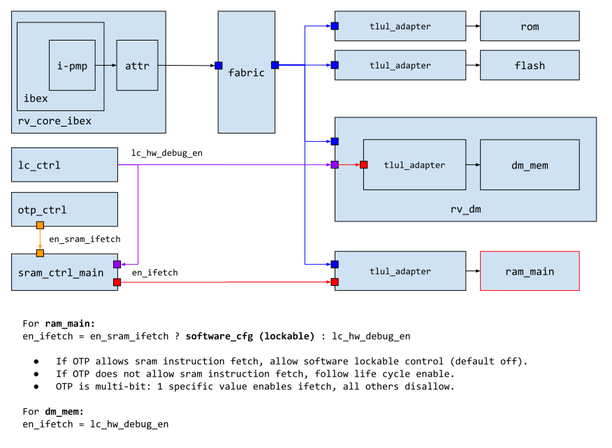

# Theory of Operation

## Block Diagram

As shown in the block diagram above, the SRAM controller contains a TL-UL adapter, an initialization LFSR, the CSR node, key request logic and an instance of `prim_ram_1p_scr` that implements the actual scrambling mechanism.

The SRAM controller supports the system-wide end-to-end bus integrity scheme and thus stores the data integrity bits alongside each data word in the memory.
This means that both the 32 data bits and the 7 integrity bits are passed through the scrambling device.

Sub-word write operations therefore perform a read-modify-write operation in order to ensure consistency of the integrity bits.
Hence, the throughput of sub-word write operations is three times lower than for full-word write operations.
Note however that the throughput of read operations is the same for full- and sub-word read operations.

The scrambling mechanism is always enabled and the `sram_ctrl` provides the scrambling device with a predefined scrambling key and nonce when it comes out of reset.
It is the task of SW to request an updated scrambling key and nonce via the CSRs as described in the [Programmer's Guide](programmers_guide.md) below.

For SW convenience, the SRAM controller also provides an LFSR-based memory initialization feature that can overwrite the entire memory with pseudorandom data.
Similarly to the scrambling key, it is the task of SW to request memory initialization via the CSRs as described in the [Programmer's Guide](programmers_guide.md) below.

Note that TL-UL accesses to the memory that occur while a key request or hardware initialization is pending will be blocked until the request has completed.

The individual mechanisms are explained in more detail in the subsections below.

## Scrambling Primitive

As explained in [`prim_ram_1p_scr`](../../prim/doc/prim_ram_1p_scr.md) the scrambling mechanism employs a reduced-round PRINCE block cipher in CTR mode to scramble the data.
Since plain CTR mode does not diffuse the data bits due to the bitwise XOR, the scheme is augmented by passing each word through a shallow substitution-permutation (S&P) network implemented with the `prim_subst_perm` primitive.
The S&P network employed is similar to the one employed in PRESENT and is explained in more detail [here](../../prim/doc/prim_ram_1p_scr.md#custom-substitution-permutation-network).

Another CTR mode augmentation that is aimed at breaking the linear address space is SRAM address scrambling.
The same S&P network construction that is used for intra-word diffusion is leveraged to non-linearly remap the SRAM address as shown in the block diagram above.

### Integrity Error Handling

When an integrity error is encountered, the `sram_ctrl` will latch the integrity error and send out a `fatal_bus_integ_error` until the next reset (the generation of the integrity error is determined by system integration).
In addition, the latched error condition is fed into the `prim_ram_1p_scr` primitive via a dedicated input, causing the scrambling primitive to do the following:
*  Reverse the nonce used during the address and CTR scrambling.
*  Disallow any transaction (read or write) on the actual memory macro.

This behavior, combined with other top level defenses, forms a multi-layered defense when integrity errors are seen in the system.

### LFSR Initialization Feature

Since the scrambling device uses a block cipher in CTR mode, it is undesirable from a security perspective to initialize the memory with all zeros.
Doing so would reveal the XOR keystream.
To avoid this, the `sram_ctrl` contains an LFSR-based initialization mechanism that overwrites the entire memory with pseudorandom data.

Initialization can be triggered via the [`CTRL.INIT`](registers.md#ctrl) CSR.
When initialization is triggered, the LFSR is first re-seeded with the nonce that has been fetched, together with the scrambling key.
Then the memory is initialized with pseudorandom data pulled from the LFSR.
For each pseudorandom 32bit word, the initialization mechanism computes the corresponding integrity bits and writes both the data and integrity bits (39bit total) through the scrambling device using the most recently obtained scrambling key.

If SW triggers the scrambling key update and LFSR initialization at the same time (i.e., with the same CSR write operation), the LFSR initialization will be stalled until an updated scrambling key has been obtained.

There is no limit on how often the initialization feature can be called, and hence it can also be used as a cheap SRAM wiping mechanism at runtime.
Note however that the PRNG sequence does not have strong security guarantees, since it is produced using an LFSR.

### Code Execution from SRAM

The SRAM controller contains an access control mechanism for filtering instruction fetches from the processor.
As illustrated below, an OTP switch EN_SRAM_IFETCH (see [OTP memory map](../../otp_ctrl/README.md#direct-access-memory-map)) allows to either tie code execution from SRAM to the life cycle state via the HW_DEBUG_EN function (see [life cycle docs](../../lc_ctrl/README.md#hw_debug_en)), or it can be enabled / disabled via the [`EXEC`](registers.md#exec) CSR.

The different configuration options are listed in the table below:

 EN_SRAM_IFETCH (OTP)   | HW_DEBUG_EN (Life Cycle) | EXEC CSR               | Execution Enabled
------------------------|--------------------------|------------------------|--------------------
 == kMultiBitBool8True  | -                        | == kMultiBitBool4True  | Yes
 == kMultiBitBool8True  | -                        | != kMultiBitBool4True  | No
 != kMultiBitBool8True  | ON                       | -                      | Yes
 != kMultiBitBool8True  | OFF                      | -                      | No

Note that the execute from SRAM feature may only be enabled on certain SRAM controller instances in the top-level design.
If the feature is turned off via the `InstrExec` parameter, the execute from SRAM feature is permanently disabled, and the status of the OTP switch, the life cycle state and the value of the EXEC register are irrelevant.

As an example, the `top_earlgrey` design only enables this feature on the main SRAM, and permanently disables it on the retention SRAM.

### Read and Write Sequencing

For timing reasons, the scrambling primitive instantiates a register halfway in the PRINCE block cipher.
This means that the keystream block becomes available in the second request cycle, which naturally aligns with read operations since the SRAM memory latency is 1 clock cycle.

However, write operations have to be deferred by 1 cycle in order to be able to reuse the same PRINCE primitive.
This can lead to read/write conflicts when a write operation is immediately followed by a read operation, and we solve that issue by introducing two write data holding registers (highlighted with green and orange in the block diagram above).
The register highlighted with green is the unscrambled data holding register, which is used for forwarding unwritten write data in case the conflicting read operation goes to the same address as the pending write operation.
The register highlighted with orange is the scrambled data holding register, which holds the scrambled data until the conflicting read operation(s) have completed.

Note that this arrangement still allows full read/write throughput as illustrated in the alternating R/W sequence below.

However, due to the end-to-end bus integrity scheme, sub-word write accesses currently require a read-modify-write operation in order to recompute the integrity bits for the entire word, as illustrated in the diagram below.

Sub-word write accesses are therefore 3x slower than full-word write accesses.
Read accesses however always take 1 cycle, no matter whether the access is a full-word or sub-word read operation.

Note that this has been implemented in this way to not overly complicate the design, and since it is assumed that sub-word write operations happen relatively infrequently.
For full write throughput, a more elaborate write buffering scheme would be required.
