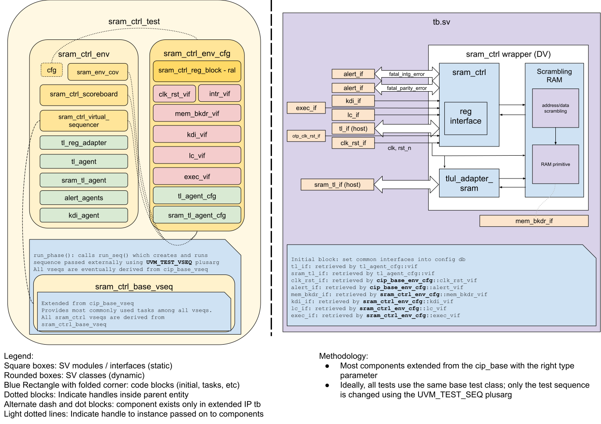

# SRAM_CTRL DV document

## Goals
* **DV**
  * Verify all SRAM_CTRL IP features by running dynamic simulations with a SV/UVM based testbench
  * Develop and run all tests based on the [testplan](#testplan) below towards closing code and functional coverage on the IP and all of its sub-modules, except [Pre-verified sub-modules](#pre-verified-sub-modules).
* **FPV**
  * Verify TileLink device protocol compliance with an SVA based testbench

## Pre-verified sub-modules
The following sub-modules are pre-verified:
* [prim_prince](https://reports.opentitan.org/hw/ip/prim/dv/prim_prince/latest/report.html)
* [prim_lfsr](https://reports.opentitan.org/hw/ip/prim/dv/prim_lfsr/latest/report.html)

Only toggle coverage on the IOs of these sub-modules is enabled for coverage collection.

## Current status
* [Design & verification stage](../../../README.md)
  * [HW development stages](../../../../doc/project_governance/development_stages.md)
* [Simulation results for SRAM](https://reports.opentitan.org/hw/ip/sram_ctrl_main/dv/latest/report.html)
* [Simulation results for retention SRAM](https://reports.opentitan.org/hw/ip/sram_ctrl_ret/dv/latest/report.html)

## Design features
For detailed information on SRAM_CTRL design features, please see the [SRAM_CTRL HWIP technical specification](../README.md).

## Testbench architecture
SRAM_CTRL testbench has been constructed based on the [CIP testbench architecture](../../../dv/sv/cip_lib/README.md).
Note that there are 2 separate TLUL interfaces exposed to the rest of the OpenTitan system - one for CSR accesses, and one for accessing memory directly.
This is because the "full" DUT consists of the actual SRAM memory controller (which contains the CSR file) connected to a scrambling RAM primitive, with a TLUL adapter module to convert TL requests on the memory TL interface into SRAM format for the RAM primitive.

### Block diagram


### Top level testbench
Top level testbench is located at `hw/ip/sram_ctrl/dv/tb/tb.sv`. It instantiates the SRAM_CTRL DUT module `hw/ip/sram_ctrl/rtl/sram_ctrl.sv`.
In addition, it instantiates the following interfaces, connects them to the DUT and sets their handle into `uvm_config_db`:
* [Clock and reset interface](../../../dv/sv/common_ifs/README.md)
* [TileLink host interface](../../../dv/sv/tl_agent/README.md)
* SRAM_CTRL IOs
* Interrupts ([`pins_if`](../../../dv/sv/common_ifs/README.md))
* Alerts ([`alert_esc_if`](../../../dv/sv/alert_esc_agent/README.md))
* Devmode ([`pins_if`](../../../dv/sv/common_ifs/README.md))

### Common DV utility components
The following utilities provide generic helper tasks and functions to perform activities that are common across the project:
* [dv_utils_pkg](../../../dv/sv/dv_utils/README.md)
* [csr_utils_pkg](../../../dv/sv/csr_utils/README.md)

### Compile-time configurations
Two compile-time configurations are tested:
* `sram_ctrl_main` - this configuration uses a 15-bit wide address space to emulate the main SRAM used in the full design and enables parameter `INSTR_EXEC` to allow TLUL instruction fetching when some runtime conditions are met.
* `sram_ctrl_ret` - this configuration uses a 10-bit-wide address space to emulate the retention SRAM used in the full design and turns off parameter `INSTR_EXEC` to disable TLUL instruction fetching altogether.


A macro-define `SRAM_ADDR_WIDTH` is defined as a build option in `hw/ip/sram_ctrl/dv/sram_ctrl_base_sim_cfg.hjson`, which is used to set the correct compile-time settings for each configuration.

### Global types & methods
All common types and methods defined at the package level can be found in
`sram_ctrl_env_pkg`. Some of them in use are:
```systemverilog
// number of bits in a full KDI transactions
parameter int KDI_DATA_SIZE = 1 + otp_ctrl_pkg::SramKeyWidth + otp_ctrl_pkg::SramNonceWidth;

// a completed KDI transaction takes 3 cycles to be fully synchronized into the
// SRAM clock domain
parameter int KDI_PROPAGATION_CYCLES = 3;

// a LC escalation request needs 3 cycles to be fully propagated through the DUT
parameter int LC_ESCALATION_PROPAGATION_CYCLES = 3;

typedef enum bit {
  SramCtrlRenewScrKey = 0,
  SramCtrlInit        = 1
} sram_ctrl_e;

typedef enum bit [2:0] {
  SramCtrlError           = 0,
  SramCtrlEscalated       = 1,
  SramCtrlScrKeyValid     = 2,
  SramCtrlScrKeySeedValid = 3,
  SramCtrlInitDone        = 4
} sram_ctrl_status_e;
```
### TL_agent
SRAM_CTRL testbench instantiates (already handled in CIP base env) [tl_agent](../../../dv/sv/tl_agent/README.md)
which provides the ability to drive and independently monitor random traffic via TL host interface into SRAM_CTRL device.

### Alert agents
The SRAM_CTRL testbench instantiates 2 [alert agents](../../../dv/sv/alert_esc_agent/README.md) for:
* fatal_intg_error - signals a transmission integrity error
* fatal_parity_error - signals an internal parity error in the memory primitive

The alert agents provide the ability to independently drive and monitor both alert handshakes.

### SRAM_CTRL_LC_IF
The SRAM_CTRL IP has a simple sideband interface to the LC_CTRL to receive escalation requests.
This interface initializes the escalation bus and utilizes a simple task to drive escalation requests.

### SRAM_CTRL_EXEC_IF
The SRAM_CTRL IP has an interface to enable instruction execution from SRAM - allowing the Icache to fetch instruction data from the SRAM for the CPU.
This interface contains the necessary Lifecycle and OTP structs to enable and disable this functionality.

### UVM RAL Model
The SRAM_CTRL RAL model is created with the [`ralgen`](../../../dv/tools/ralgen/README.md) FuseSoC generator script automatically when the simulation is at the build stage.

It can be created manually by invoking [`regtool`](../../../../util/reggen/doc/setup_and_use.md):

Besides default RAL that provides the access to CSRs, there is another RAL for SRAM memory.
This RAL is in `sram_ctrl_prim_ral_pkg.sv`, it is added manually and enabled with all the common CSR and memory tests, such as mem_walk, tl_errors, tl_intg_err, etc.

### Reference models
There are 3 DV reference models used in this testbench.
- The SRAM_CTRL testbench uses a SystemVerilog golden model for its address and data scrambling to ensure that internal encryption and decryption perform correctly.
This golden model, [`sram_scrambler_pkg`](../../../dv/sv/mem_bkdr_util/README.md) is tightly integrated with the mem_bkdr_util for ease of use such that we can choose to enable encryption on any backdoor access.
- The frontdoor check [`mem_model`](../../../dv/sv/mem_model/README.md) is also enabled in cip_base_scoreboard.
The model is invoked at the end of the transaction as follows:
  - If it’s write, store the data on the address in the memory array.
  - If it’s read and the address has been written, compare read value with stored value.
  - If it’s read and the address has NOT been written, skip checking.

There are some limitations in the frontdoor check as follows:
  1. Can’t check ECC if encoding and decoding match.
  2. Can’t check the read value if the address hasn't been written after init or after key request.
  3. Can’t check the write value if the address isn’t read after the write.
  4. Not aware of any B2B hazard (such as RAW).

- The backdoor check [`mem_bkdr_scb`](../../../dv/sv/mem_bkdr_scb/README.md) is used to ensure frontdoor access matches with the backdoor expected value.
The [`sram_scrambler_pkg`](../../../dv/sv/mem_bkdr_util/README.md) is invoked in [`mem_bkdr_scb`](../../../dv/sv/mem_bkdr_scb/README.md)
This backdoor check covers all the limitations of frontdoor check.
There is a limitation as follows, which can be covered by frontdoor check.
  - Can’t check when memory is modified unintentionally after the access is completed.

### Stimulus strategy
#### Test sequences
All test sequences reside in `hw/ip/sram_ctrl/dv/env/seq_lib`.
The `sram_ctrl_base_vseq` virtual sequence is extended from `cip_base_vseq` and serves as a starting point.
All test sequences are extended from `sram_ctrl_base_vseq`.
It provides commonly used handles, variables, functions and tasks that the test sequences can simple use / call.
Some of the most commonly used tasks / functions are as follows:
* do_rand_ops: This task sends an arbitrary number of random TL transactions to the memory primitive.
* do_stress_ops: This task sends an arbitrary number of random TL transactions to the same word in memory,
  to stress the memory's data forwarding functionalities.

#### Functional coverage
To ensure high quality constrained random stimulus, it is necessary to develop a functional coverage model.
The following covergroups have been developed to prove that the test intent has been adequately met:
* b2b_access_types_cg (imported from mem_bkdr_scb): Cover that all combinations of b2b read/write scenario (R/R, R/W, W/R, W/W) with or without using the same address.
* subword_access_cg: Cover all kinds of partial accesses.

### Self-checking strategy
#### Scoreboard
The `sram_ctrl_scoreboard` is primarily used for end to end checking.
It creates the following analysis ports to retrieve the data monitored by corresponding interface agents:
* tl_a_chan_fifo: TL address channel for CSR accesses
* tl_d_chan_fifo: TL data channel for CSR accesses
* alert_fifos: Alert handshakes
* sram_tl_a_chan_fifo: TL address channel for memory accesses
* sram_tl_d_chan_fifo: TL data channel for memory accesses
* kdi_fifo: For key refresh operations from OTP_CTRL

All CSR accesses made to the SRAM_CTRL register file are tracked and predicted by the scoreboard.

Verifying memory accesses is somewhat involved, and makes heavy use of the [`mem_bkdr_util`](../../../dv/sv/mem_bkdr_util/README.md).

At a high level, whenever a TL access is made to memory, all relevant information is stored in an `sram_trans_t` struct.

Refer to section "Reference models" for the SRAM memory checking.

The testbench will also sporadically trigger the DUT to issue a request for a new key and nonce from the OTP controller.
After receiving the fresh key and nonce from the KDI agent, those new values will then be used
for all encryption/decryption accesses using the memory backdoor interface.

If a lifecycle escalation request is issued during SRAM operation, the scoreboard will detect it and then check that no further memory requests are accepted.
The testbench will then issue a system-level reset, as a lifecycle escalation is a terminal state.

To check that the SRAM's executable configurations are functioning correct is relatively more straightforward.
First, it's important to note that all incoming TL memory transactions are tagged as either `InstrType` or `DataType`, indicating whether the transaction is fetching an instruction word or a data word.
If the scoreboard detects that an incoming transaction is tagged as `InstrType`, we first check that the SRAM is properly configured in executable mode to accept `InstrType` transactions.
If the DUT is configured correctly the scoreboard will let the memory transaction finish being checked, otherwise the scoreboard will discard that transaction - this approach makes it easy to check whether the design is behaving correctly as well.

#### Assertions
* TLUL assertions: The `tb/sram_ctrl_bind.sv` binds the `tlul_assert` [assertions](../../tlul/doc/TlulProtocolChecker.md) to the IP to ensure TileLink interface protocol compliance.
* Unknown checks on DUT outputs: The RTL has assertions to ensure all outputs are initialized to known values after coming out of reset.

## Building and running tests
We are using our in-house developed [regression tool](../../../../util/dvsim/README.md) for building and running our tests and regressions.
Please take a look at the link for detailed information on the usage, capabilities, features and known issues.
Here's how to run a smoke test:
```console
$ $REPO_TOP/util/dvsim/dvsim.py $REPO_TOP/hw/ip/sram_ctrl/dv/sram_ctrl_${VARIANT}_sim_cfg.hjson -i sram_ctrl_smoke
```
In this run command, $VARIANT can be `main` or `ret`.

## Testplan
[Testplan](../data/sram_ctrl_testplan.hjson)
