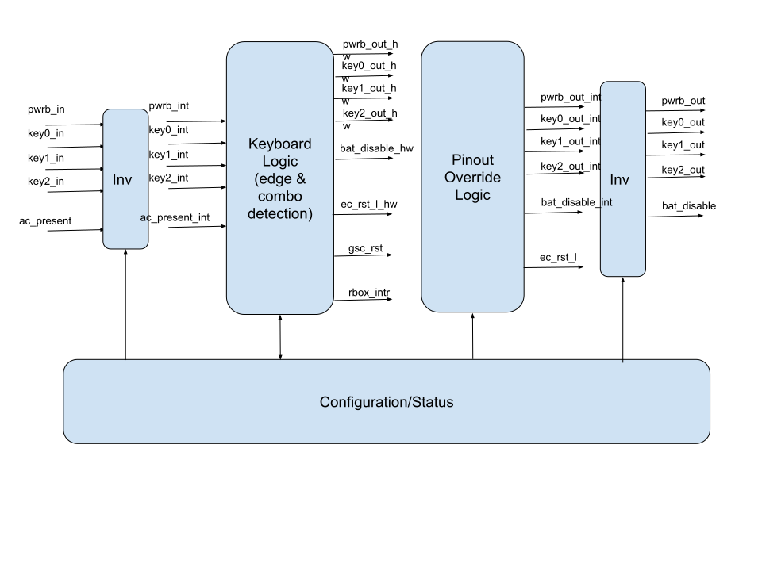

# Overview

This document specifies the Chrome OS reset and system related functionality.
This IP block implements keyboard and button combo triggered action and EC+GSC reset logic.
This module conforms to the [Comportable guideline for peripheral functionality.]().
See that document for integration overview within the broader top level system.

## Features

The IP block implements the following features:

- Always on: uses the always-on power and clock domain
- EC reset pulse duration control and stretching
- Keyboard and button combo triggered action
- AC_present can trigger interrupt 
- Configuration registers can be set and locked until the next chip reset
- Pin output override

## Description

The sysrst_ctrl logic is very simple. 
It looks up the configuration registers to decide how long the EC reset pulse duration and how long the keyboard debounce timer should be. 
Also what actions to take (e.g. Interrupt, EC reset, GSC reset, disconnect the battery from the power tree).

## Compatibility

The configuration programming interface is not based on any existing interface.

# Theory of Operations

The block diagram shows a conceptual view of the sysrst_ctrl building blocks. 
There are 3 main modules. 
The first is the configuration and status registers. 
The second is the keyboard combo debounce and detection logic. 
The third is the pinout override logic.

The sysrst_ctrl has four input pins (pwrb_in, key0,1,2_in) with corresponding output pins (pwrb_out, key0,1,2_out). 
During normal operation the sysrst_ctrl will pass the pin information directly from the input pins to the output pins with optional inversion. 
Combinations of the inputs being active for a specified time can be detected and used to trigger actions. 
The override logic allows the output to be overridden (i.e. not follow the corresponding input) based either on trigger or software settings. 
This allows the security chip to take over the inputs for its own use without disturbing the main user.

The sysrst_ctrl also controls an active low open drain reset I/O ec_rst_l (typically used for the embedded controller reset). 
This output is always asserted when the IP block is reset (allowing its use as a power-on reset) and remains asserted until released by software. 
A pulse width is configured for the reset signal. 
Trigger actions may cause the sysrst_ctrl to assert ec_rst_l for the specified width. 
If the ec_rst_l is asserted by some other agent in the system then the sysrst_ctrl will extend the assertion to ensure the minimum pulse width is generated.

## Block Diagram

## Combo detection

Let's use the Power button+Esc+Refresh combo as an example.
The SW defines three keys (e.g. pwrb==0 && key0_in==0 && key1_in==0) as trigger in the configuration (com0_sel_ctl).
The SW defines the duration (e.g. 10 seconds) that the above combo should be pressed in the configuration (com0_det_ctl).
The SW defines the actions such as asserting ec_rst_l and raising interrupt in the configuration (com0_out_ctl).
The SW defines the ec_rst_l pulse width in the configuration (ec_rst_ctl).
The SW locks the configuration (no write is allowed) with cfg_wen_ctl.
sysrst_ctrl will detect the high (logic 1) to low (logic 0) transition on the combo and start the timer. 
If the timing condition is met (10 second), sysrst_ctrl will assert ec_rst_l,  sysrst_ctrl_intr and set the interrupt status register (intr_status) with the source.
The interrupt handler will read intr_status and write "logic 1" to clear the interrupt.

## Auto-block key outputs

Let's use the Power button+Esc+Refresh combo as an example. 
When pwrb is pressed, key1_out (row) should be overridden so that sysrst_ctrl can detect if key0_in (column) is Refresh.
The SW enables the auto_block feature and defines the timer value in auto_block_debounce_ctl. 
The SW defines the key outputs to auto-override and their value in auto_block_out_ctl.
When sysrst_ctrl detects a high (logic 1) to low (logic 0) transition in pwrb_in and the key (pwrb_in == 0) stay low for the duration defined in auto_block_debounce_ctl, sysrst_ctrl will drive key1_out based on the value set in auto_block_out_ctl.

## Keyboard and input triggered interrupt

Pwrb, key0, key1, key2, ac_present and ec_rst_l can trigger interrupt on rising or falling edges.
The SW defines the buttons, keys or inputs and their edges (H->L or L->H) that can trigger the interrupt in key_intr_ctl. 
For example, when the power button is pressed, pwrb goes from logic 1 to logic 0 and it is a H->L transition. 
When the power button is released, pwrb goes from logic 0 to logic 1 and it is a L->H transition.
The SW defines the debounce timer in key_intr_debounce_ctl
When sysrst_ctrl detects a transition (H->L or L->H) as specified in key_intr_ctl and it meets the debounce requirement in key_intr_debounce_ctl, sysrst_ctrl sets the intr_status to indicate the source.
It is possible for SW to program both H->L and L->H transition detection so that it can monitor that a button is pressed first and then released.
sysrst_ctrl will drive the consolidated interrupt to PLIC.
The interrupt handler will read intr_status and write "logic 1" to clear the interrupt.

## Pin input value accessibility

sysrst_ctrl allows the SW to read the raw input pin value (before the invert logic). 
The hardware writes into pin_in_value for pwrb_in, key0/1/2_in, ac_present, ec_rst_l. The software can read them like GPIO.

## Pin output and keyboard inversion control

sysrst_ctrl allows the SW to change the keyboard's polarity on the inputs and outputs. 
It also provides the output pin override feature. 
In other words, SW can override the hardware state machine. 
The assertion has higher priority. 
Which output pins to override and the value to drive are configurable and lockable.
The SW defines the allowed output pin override value in pin_allowed_ctl. 
For example, ec_rst_l_0=1'b1 and ec_rst_l_1=1'b0 means SW allows ec_rst_l to be overridden with logic 0, not logic 1.
If the SW locks the configuration with cfg_wen_ctl, pin_allowed_ctl cannot be modified until GSC is reset
When the system is up and running, the SW can modify pin_out_ctl and pin_out_value to enable or disable the feature. 
For example, to release ec_rst_l after GSC completes the reset, SW will program pin_out_ctl[1]=1'b0. 
The hardware will stop driving ec_rst_l=1'b0.
The SW defines the keyboard polarity in key_invert_ctl. 
For inputs, it will be inverted before the combo logic. 
For outputs, it will be inverted after the pinout override logic.

## EC and Power-on-reset

GSC and EC will be reset together during power-on. 
When GSC is in reset, ec_rst_l will be asserted (active low).
When GSC exits from reset, ec_rst_l should still be asserted. 
The power-on-reset value of pin_allowed_ctl[1] and pin_out_ctl[1] will guarantee ec_rst_l=1’b0 after GSC reset.
The SW will release ec_rst_l explicitly by writing pin_out_ctl[1]=1’b0 after we enter the GSC-RW boot stage.
Now both GSC and EC complete the power-on-reset.

## Registers



