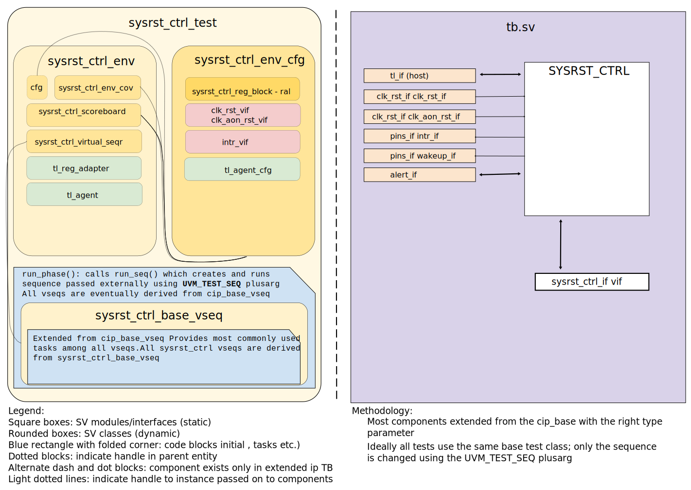

<!-- Copy this file to hw/ip/sysrst_ctrl/doc/dv/index.md and make changes as needed.
For convenience 'sysrst_ctrl' in the document can be searched and replaced easily with the
desired IP (with case sensitivity!). Also, use the testbench block diagram
located at OpenTitan team drive / 'design verification'
as a starting point and modify it to reflect your sysrst_ctrl testbench and save it
to hw/ip/sysrst_ctrl/doc/dv/tb.svg. It should get linked and rendered under the block
diagram section below. Please update / modify / remove sections below as
applicable. Once done, remove this comment before making a PR. -->

## Goals
* **DV**
  * Verify all SYSRST_CTRL IP features by running dynamic simulations with a SV/UVM based testbench
  * Develop and run all tests based on the [testplan](#testplan) below towards closing code and functional coverage on the IP and all of its sub-modules
* **FPV**
  * Verify TileLink device protocol compliance with an SVA based testbench

## Current status
* [Design & verification stage]()
  * [HW development stages]()
* [Simulation results](https://reports.opentitan.org/hw/ip/sysrst_ctrl/dv/latest/results.html)

## Design features
For detailed information on SYSRST_CTRL design features, please see the [SYSRST_CTRL HWIP technical specification]().

## Testbench architecture
SYSRST_CTRL testbench has been constructed based on the [CIP testbench architecture]().

### Block diagram


### Top level testbench
The top level testbench is located at `hw/ip/sysrst_ctrl/dv/tb.sv`.
It instantiates the SYSRST_CTRL DUT module `hw/ip/sysrst_ctrl/rtl/sysrst_ctrl.sv`.
In addition, it instantiates the following interfaces, connects them to the DUT and sets their handle into `uvm_config_db`:
* [Clock and reset interface]()
* [TileLink host interface]()
* SYSRST_CTRL IOs
* Interrupts ([`pins_if`]())
* Alerts ([`alert_esc_if`]())
* Devmode ([`pins_if`]())

### Common DV utility components
The following utilities provide generic helper tasks and functions to perform activities that are common across the project:
* [dv_utils_pkg]()
* [csr_utils_pkg]()

### Compile-time configurations
[list compile time configurations, if any and what are they used for]

### Global types & methods
All common types and methods defined at the package level can be found in
`sysrst_ctrl_env_pkg`.

### TL_agent
The SYSRST_CTRL testbench instantiates (already handled in CIP base env) [tl_agent]().
This provides the ability to drive and independently monitor random traffic via the TL host interface into the SYSRST_CTRL device.

### Alert_agents
SYSRST_CTRL testbench instantiates (already handled in CIP base env) [alert_agents]():
[list alert names].
The alert_agents provide the ability to drive and independently monitor alert handshakes via alert interfaces in SYSRST_CTRL device.

### UVM RAL Model
The SYSRST_CTRL RAL model is created with the [`ralgen`]() FuseSoC generator script automatically when the simulation is at the build stage.

It can be created manually by invoking [`regtool`]():

### Stimulus strategy
#### Test sequences
The test sequences reside in `hw/ip/sysrst_ctrl/dv/env/seq_lib`.
All test sequences are extended from `sysrst_ctrl_base_vseq`, which is extended from `cip_base_vseq` and serves as a starting point.
It provides commonly used handles, variables, functions and tasks that the test sequences can simple use / call.

#### Functional coverage
To ensure high quality constrained random stimulus, it is necessary to develop a functional coverage model.
The following covergroups have been developed to prove that the test intent has been adequately met:
* sysrst_ctrl_combo_detect_action_cg: This covergroup will cover all the combo detect actions for combo detect register set 0-3.
* sysrst_ctrl_combo_detect_sel_cg: This covergroup will sample the input selected for combo detect.
* sysrst_ctrl_combo_detect_det_cg: This covergroup will cover the combo detect debounce timer value.
* sysrst_ctrl_auto_block_debounce_ctl_cg: This will cover the auto block enable/disable feature, debounce timer value.
* sysrst_ctrl_combo_intr_status_cg: This covergroup will capture the combo detect interrupt status.
* sysrst_ctrl_key_intr_status_cg: This covergroup will capture the edge detect status for all the inputs.
* sysrst_ctrl_ulp_status_cg: This covergroup will cover the ultra low power status.
* sysrst_ctrl_wkup_status_cg: This will capture the wakeup status event after the low power event is triggered.
* sysrst_ctrl_pin_in_value_cg: This covergroup will cover the raw input values of all the input pins.
* sysrst_ctrl_auto_blk_out_ctl_cg: This covergroup will cover the input selected for auto block and the output value status for the selected input pin.
* pin_cfg_cg: This is the generic covergroup to cover the override and allowed values for the selected input and output values. An array of this covergroup is
created for all the input pins.
* debounce_timer_cg: This is the generic covergroup to cover the debounce timer values for the below register.
key_intr_debounce_ctl
ulp_ac_debounce_ctl
ulp_pwrb_debounce_ctl
ulp_lid_debounce_ctl
ec_rst_ctl
* sysrst_ctrl_key_invert_ctl_cg: This covergroup will cover which input/output pins are allowed to invert their values.The invert values are crossed with the input/output values.

### Self-checking strategy
#### Scoreboard
The `sysrst_ctrl_scoreboard` is primarily used for end to end checking.

#### Assertions
* TLUL assertions: The `sva/sysrst_ctrl_bind.sv` file binds the `tlul_assert` [assertions]() to the IP to ensure TileLink interface protocol compliance.
* Unknown checks on DUT outputs: The RTL has assertions to ensure all outputs are initialized to known values after coming out of reset.
* Assertions in `tb.sv`
* CheckFlashWrProtRst: Checks flash_wp_l output pin is asserted active low which it is in reset.
* CheckEcPwrOnRst: Checks ec_rst_l_o is asserted active low when it is in reset.

## Building and running tests
We are using our in-house developed [regression tool]() for building and running our tests and regressions.
Please take a look at the link for detailed information on the usage, capabilities, features and known issues.
Here's how to run a smoke test:
```console
$ $REPO_TOP/util/dvsim/dvsim.py $REPO_TOP/hw/ip/sysrst_ctrl/dv/sysrst_ctrl_sim_cfg.hjson -i sysrst_ctrl_smoke
```

## Testplan

