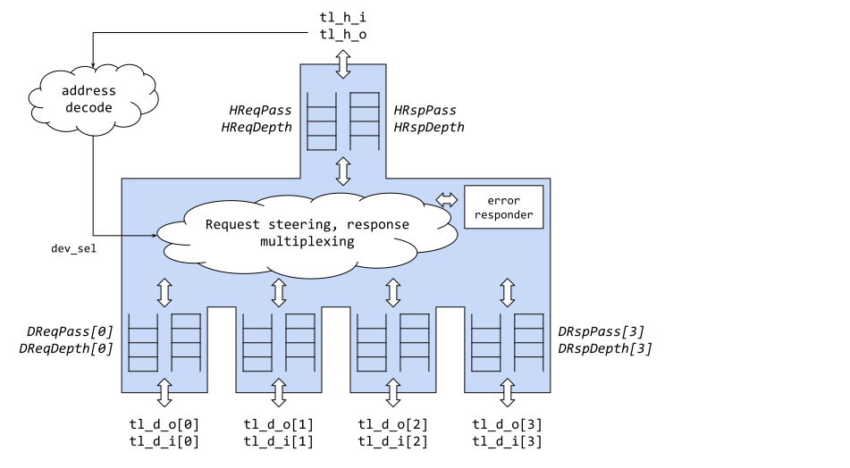
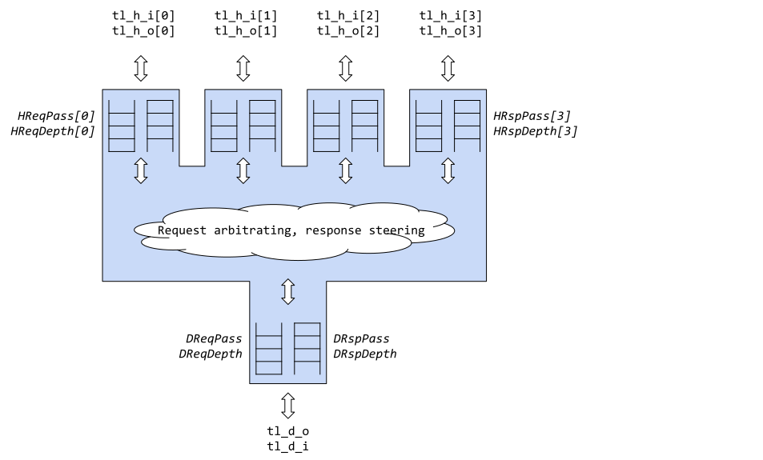

# Overview

This document specifies the bus functionality within a Comportable top level
system. This includes the bus protocol and all hardware IP that supports
creating the network on chip within that framework.

## Features

- Support for multiple bus hosts and bus devices<sup>1</sup>
- Support for multiple clock domains
- Support for multiple outstanding requests
- Extendability for 32b or 64b data widths
- Extendability for flexible address widths
- Extendability for security features
- Low pin-count / area overhead
- Support for transaction sizes up to bus width (byte, 2B, 4B); no
  support for bursts
- Suite of bus primitives to aid in fast fabric generation

<sup>1</sup>lowRISC is avoiding the fraught terms master/slave and defaulting
to host/device where applicable.

## Description

For chip-level interconnect, Comportable devices will be using
[TileLink](https://static.dev.sifive.com/docs/tilelink/tilelink-spec-1.7-draft.pdf)
as its bus fabric protocol. For the purposes of our performance
requirement needs, the Uncached Lightweight (TL-UL) variant will
suffice. There is one minor modification to add the user extensions. This
is highlighted below, but otherwise all functionality follows the official
specification. The main signal names are kept the same as TL-UL and the
user extension signal groups follow the same timing and naming conventions
used in the TL-UL specification. Existing TL-UL IP blocks may be used
directly in devices that do not need the additional sideband signals,
or can be straightforwardly adapted to use the added features.

TL-UL is a lightweight bus that combines the point-to-point
split-transaction features of the powerful TileLink (or AMBA AXI)
5-channel bus without the high pin-count overhead. It is intended to be
about on par of pincount with APB but with the transaction performance of
AXI-4, modulo the following assumptions.

- Only one request (read or write) per cycle
- One one response (read or write) per cycle
- No burst transactions

Bus primitives are provided in the lowRISC IP library. These are
described later in this document. These primitives can be combined to form
a flexible crossbar of any M hosts to any N devices. As of this writing,
theses crossbars are generated programmatically through usage of configuration files.
See the [tlgen reference manual]( for more details.

## Compatibility

With the exception of the user extensions, the bus is
compliant with TileLink-UL. The bus primitives, hosts and peripherals
developed using the extended specification can be used with
blocks using the base specification. As a receiver baseline blocks
ignore the user signals and as a
source will generate a project-specific default value. Alternatively,
the blocks can be easily modified to make use of the user extensions.

# Theory of Operations

## Signals

The table below lists all of the TL-UL signals. "Direction" is
w.r.t. a bus host, signals marked as output will be in the verilog
`typedef struct` tagged as host-to-device (`tl_h2d_t`) and those marked
as input will be in the device-to-host struct (`tl_d2h_t`). The literal
`typedef structs` follow. Size qualifiers are described below. The table
and structs include the additional (non-TL-UL standard) user extension
signals per direction to carry chip specific user bits.

| Signal Name | Direction | Description |
| --- | --- | --- |
| `a_valid`           | output | Request from host is valid |
| `a_ready`           | input  | Request from host is accepted by device |
| `a_opcode[2:0]`     | output | Request opcode (read, write, or partial write) |
| `a_param[2:0]`      | output | unused |
| `a_address[AW-1:0]` | output | Request address of configurable width |
| `a_data[DW-1:0]`    | output | Write request data of configurable width |
| `a_source[AIW-1:0]` | output | Request identifier of configurable width |
| `a_size[SZW-1:0]`   | output | Request size (requested size is 2^`a_size`, thus 0 = byte, 1 = 16b, 2 = 32b, 3 = 64b, etc) |
| `a_mask[DBW-1:0]`   | output | Write strobe, one bit per byte indicating which lanes of data are valid for this write request |
| `a_user`            | output | Request attributes of configurable width, use TBD. **This is an augmentation to the TL-UL specification.** |
| `d_valid`           | input  | Response from device is valid |
| `d_ready`           | output | Response from device is accepted by host |
| `d_opcode[2:0]`     | input  | Response opcode (Ack or Data) |
| `d_error`           | input  | Response is in error |
| `d_param[2:0]`      | input  | Response parameter (unused) |
| `d_size[SZW-1:0]`   | input  | Response data size |
| `d_data[DW-1:0]`    | input  | Response data of configurable width |
| `d_source[AIW-1:0]` | input  | Bouncing of request ID of configurable width |
| `d_sink[DIW-1:0]`   | input  | Response ID of configurable width (possibly unused) |
| `d_user[DUW-1:0]`   | input  | Response attributes of configurable width; includes error responses plus other attributes TBD. **This is an augmentation to the TL-UL specification.** |

There are eight bus width parameters, defined here. Some are generated
widths based upon the other parameter sizes.

- `AW`: width of address bus, default 32
- `DW`: width of data bus, default 32
- `DBW`: number of data bytes, generated == `DW/8`
- `SZW`: size width, covers 2^(x) <= `DBW`; (2 bit for 4B)
- `AIW`: width of address source (ID) bus, default 8
- `DUW`: width of device user bits, default 4
- `DIW`: width of sink bits, default 1

All widths are expected to be fixed for an entire project and referred
to in (what is currently called) `top_pkg`. The contents of `top_pkg`
(to define the widths) and `tlul_pkg` (to define the bus structs) are
given below.

### Reset Timing

Section 3.2.2 of the
[TileLink specification (1.7.1)](https://sifive.cdn.prismic.io/sifive%2F57f93ecf-2c42-46f7-9818-bcdd7d39400a_tilelink-spec-1.7.1.pdf)
has a requirement on TL-UL hosts ("masters" in TileLink terminology) that "`valid` signals must be driven LOW for at least 100 cycles while reset is asserted."
The TL-UL collateral within this library does **not** have this requirement on its TL-UL host drivers.
TL-UL devices within the library can tolerate shorter reset windows.
(See the reset section of the [Comportability Specification]()
for details on reset requirements.)

### Signal and Struct Definitions

The following shows Verilog structs to define the above parameters
and signals.

```systemverilog
package top_pkg;
  localparam TL_AW=32;
  localparam TL_DW=32;
  localparam TL_AIW=8;
  localparam TL_DIW=1;
  localparam TL_DUW=4;
  localparam TL_DBW=(TL_DW>>3);
  localparam TL_SZW=$clog2($clog2(TL_DBW)+1);
endpackage
```

```systemverilog
package tlul_pkg;
  typedef enum logic [2:0] {
    PutFullData    = 3'h 0,
    PutPartialData = 3'h 1,
    Get            = 3'h 4
  } tl_a_op_e;
  typedef enum logic [2:0] {
    AccessAck     = 3'h 0,
    AccessAckData = 3'h 1
  } tl_d_op_e;

  typedef struct packed {
    logic [6:0] rsvd1; // Reserved for future use
    logic       parity_en;
    logic [7:0] parity; // Use only lower TL_DBW bit
  } tl_a_user_t;

  typedef struct packed {
    logic                         a_valid;
    tl_a_op_e                     a_opcode;
    logic                  [2:0]  a_param;
    logic  [top_pkg::TL_SZW-1:0]  a_size;
    logic  [top_pkg::TL_AIW-1:0]  a_source;
    logic   [top_pkg::TL_AW-1:0]  a_address;
    logic  [top_pkg::TL_DBW-1:0]  a_mask;
    logic   [top_pkg::TL_DW-1:0]  a_data;
    tl_a_user_t                   a_user;

    logic                         d_ready;
  } tl_h2d_t;

  typedef struct packed {
    logic                         d_valid;
    tl_d_op_e                     d_opcode;
    logic                  [2:0]  d_param;
    logic  [top_pkg::TL_SZW-1:0]  d_size;
    logic  [top_pkg::TL_AIW-1:0]  d_source;
    logic  [top_pkg::TL_DIW-1:0]  d_sink;
    logic   [top_pkg::TL_DW-1:0]  d_data;
    logic  [top_pkg::TL_DUW-1:0]  d_user;
    logic                         d_error;

    logic                         a_ready;
  } tl_d2h_t;

endpackage
```

### Usage of Signals

#### Usage of Address

All signaling for host-request routing is encapsulated in the `a_addr`
signal. (See section 5.3 of the TileLink specification). Ie. for a bus
host to designate which device it is talking to, it only needs to indicate
the correct device register/memory address. The other host signals (namely
`a_source` and `a_user`) do not enter into the address calculation. All
request steering must thus be made as a function of the address.

#### Usage of Source and Sink ID Bits

The `a_source` and `d_source` signals are used to steer the response from
a device back to a host through bus primitives. (See primitives section
that follows). It can also be used to ascribe request identifiers by a
host when response reordering is required (since TL-UL does not guarantee
in-order responses). For permission detection, static host identifiers
will be transmitted in the user field (see below).

Some bus primitives, such as `M:1` sockets, need to add source bits
during request routing in order to be able to correctly route the
response. For instance, if one destination is addressed by N potential
hosts, log<sub>2</sub>N more source ID bits need to be added to the
outgoing request. The fabric architect needs to ensure that the attribute
`AIW` is big enough to cover the number of outstanding requests hosts
can make and the maximum source ID growth that could be added by bus
primitives. At this time, `AIW` is assumed to be 8 bits of ID growth, but
this is likely overkill. The fabric also needs to allow for how many host
ID bits are needed, for instance if converting from an AXI host that uses
`RID` or `WID`, enough bits must be provided to maintain those ID values.

##### Source ID growth

When a bus primitive needs to add source ID bits, it shifts left the
incoming `a_source` and post-pends its necessary sub-source bits. For
instance, if a 5:1 socket is needed, 3 sub-source bits are generated to
distinguish between hosts 0 through 4. So an 8-bit outgoing `a_source`
would be `{a_source_inbound[4:0],subsource[2:0]}`. When the response
returns, those 3 sub-source bits are shifted off, with `'0'` bits
shifted into the top, and returned to the originator's `d_source`. It
is recommended to have assertions in place to ensure no significant bits
of `a_source` are lost in `M:1` sockets. See the `M:1` socket primitive
for more details.

##### Source ID requirements for host elements

The potential for source ID growth (and contraction in the response)
implies that hosts may only use the low bits of the identifier and cannot
assume the entire `AIW` bits will be returned intact. If there are any hosts
that need more source bits returned than the host's maximum number of
outstanding transactions (for example the host uses some source bits as
internal sub-unit identifiers and some bits as transaction IDs from that
subunit) then the `AIW` value needs to be set accordingly.

##### Source ID requirements for device elements

All bus devices must simply return the associated `a_source` on the
response `d_source` bus.

##### Source ID requirements for bus primitives

Most bus primitives simply pass source ID bits opaquely from host end to
device end. The exception is for `M:1` sockets (see ID growth above). Other
elements (`1:N` sockets, domain crossing FIFOs, etc) should not modify
the `a_source` and `d_source` values, but pass them along.

##### Sink ID Usage

At this time there is no defined use for `d_sink`, but the TileLink-UL
protocol allows configurable bits to be passed back to the host to
indicate who responded. In theory this could be used as a security
guarantee, to ensure that the appropriate responder was targeted. At
this time the configurable width for sink is turned down to one bit.

#### Usage of User Bits

User bits are added to the TileLink-UL specification in order to prepare
for command and response modification in future IP. These are effectively
modifiers to the transactions that can qualify the request and the
response. The user bits follow the same timing as the source ID bits:
`a_user` matches `a_source` and `d_user` matches `d_source`. Usage of
user bits within a project must be assigned project-wide, but the bus
fabric does not rely on them for transport, and should pass the user
bits on blindly. Bus hosts and devices must understand their usage and
apply them appropriately.

The following list gives examples of future usage for `a_user` and
`d_user` bits.

- `a_user` modifications
  - Bus host identifier, for security checking within devices
    - We will need redundancy here to avoid single bit failure, so up to
      8 hosts could be distinguished with 4 user bits
  - Permission level, for security checking within devices
    - We will need redundancy here to avoid single bit failure, so 5
      (up to 8) permission levels could be distinguished with 4 user bits
  - Parity
    - We would need one bit for parity enable (to allow parity to be
      disabled if necessary during debugging), `DBW` bits for parity
- `d_user` modifications
  - Parity
    - We would need one bit for parity enable, `DBW` bits for parity

#### Usage of Opcode, Size and Mask

The request opcode (`a_opcode`) can designate between a write (`'Put'`)
and a read (`'Get'`) transaction. Writes can be designated as full
(`'PutFullData'`) or partial (`'PutPartialData'`) within the opcode
space. The request size (`a_size`) and mask (`a_mask`) is defined for
all read and write operations. Opcode (`a_opcode`) definitions are
shown below. Responses also have opcodes (`d_opcode`) to indicate read
response (`'AccessAckData'`) and write response (`'AccessAck'`). Error
indications are available on either with the `d_error` bit. Each bus
device has an option to support or not support the full variety of
bus transaction sizes. Their support will be documented in the device
specification.

It should be noted that, even though non-contiguous `a_mask` values like
`0b1001` are permitted by the TL-UL spec, the TL-UL hosts within this project
**do not leverage non-contiguous masks**. I.e., the TL-UL hosts will only assert
`a_mask` values from the following restricted set for 32bit transfers:
```
{'b0000, 'b0001, 'b0010, 'b0100, 'b1000, 'b0011, 'b0110, 'b1100, 'b0111, 'b1110, 'b1111}.
```
The TL-UL devices within the project may or may not support certain subword
masks (both non-contiguous or contiguous ones), and they have the right to
assert `d_error` if they don't.

| `a_opcode[2:0]` value | Name | Definition |
| :---: | :---: | --- |
| `3'b000` | `PutFullData` | Write of full bus width. `a_size` should be `'h2` to indicate 32b write (or `'h3` if/when 64b bus width is supported), though the bus specification allows these to be defined otherwise (see `PutPartialData` below) |
| `3'b001` | `PutPartialData` | Write of partial bus width. `a_size[SZW-1:0]` indicates how many bytes are transmitted. The encoding is `2^a_size` so `'h0` indicates 1 byte, `'h1` indicates 2 bytes, `'h2` indicates 4 bytes, etc. The lower bits of `a_address` are valid to indicate sub-word addressing, and the bits of `a_mask[DBW-1:0]` should indicate valid byte lanes. |
| `3'b100` | `Get` | Read of full bus width. The bus specification allows these to be defined otherwise (see PutPartialData above) for reads of sub-bus-width. |
| `3'b01x, 3'b101, 3'b11x` | `undefined` | All other opcodes are undefined. Bus devices should return an error. |

| `d_opcode[2:0]` value | Name | Definition |
| :---: | :---: | --- |
| `3'b000` | `AccessAck` | Write command acknowledgement, no data |
| `3'b001` | `AccessAckData` | Read command acknowledgement, data valid on `d_data` |
| `3'b01x, 3'b1xx` | `undefined` | All other opcodes are undefined and should return an error. |

#### Explicit Error Cases

The TL-UL devices in this project contain a set of HW protocol checkers that raise a runtime error (`d_error`) if the request is in violation.
In particular, the following properties are checked:

1. Wrong opcode,
2. Wrong combination of `a_addr[1:0]`, `a_size`, `a_mask`, for example:
  - `a_size` must not be greater than `2`,
  - Inactive lanes must be marked with `'b0` in `a_mask`,
  - `PutFullData` must mark all active lanes with a `'b1` in `a_mask`,
3. Non-contiguous mask may lead to an error, depending on the device support (see previous section),
4. Register files always assume aligned 32bit accesses, see also [register tool manual](),
5. Accesses to non-existent addresses.

On the host side, orphaned responses (i.e. responses that do not have a valid request counterpart) and responses with the wrong opcode will be discarded.
It is planned to raise a critical hardware error that can be detected and reacted upon via other subsystems in those cases, but that feature has not been implemented yet.

Note that the above checks also cover cases which are in principle allowed by the TL-UL spec, but are not supported by the hosts and devices within this project.
Further, devices and hosts may implement additional more restrictive checks, if needed.

The remaining, basic properties as specified in the TL-UL spec are enforced at design time using assertions, and hence no additional hardware checkers are implemented to check for those properties (see also [TL-UL Protocol Checker Specification]()).

The interconnect does not possess additional hardware mechanisms to detect and handle interconnect deadlocks due to malicious tampering attempts.
The reasons for this are that
1. the space of potential errors and resolutions would be very large, thus unnecessarily complicating the design,
2. any tampering attempt leading to an unresponsive system will eventually be detected by other subsystems within the top level system.


## Timing Diagrams

This section shows the timing relationship on the bus for writes with
response, and reads with response. This shows a few transactions, see
the TileLink specification for more examples.


{
  signal: [
    { name: 'clk_i',      wave: 'p...................' },
    { name: 'a_valid',    wave: '0.1....0101...0.....' },
    { name: 'a_ready',    wave: '0.1..01010...10.....' },
    { name: 'a_source',   wave: '0.3333.0303...0.....', data: ['I0','I1','I2','I3','I4','I5'] },
    { name: 'a_opcode',   wave: '0.3..3.0303...0.....', data: ['put-full','put-partial','pf', 'put-partial'] },
    { name: 'a_addr',     wave: '703333.0303...7.....', data: ['A0', 'A1','A2','A3','A4','A5'] },
    { name: 'a_data',     wave: '703333.0303...7.....', data: ['D0', 'D1','D2','D3','D4','D5'] },
    { name: 'a_size',     wave: '703..3.0303...7.....', data: ['2', '0','2','1'] },
    { name: 'a_mask',     wave: '7...03.7703...7.....', data: ['M3', 'M5'] },
    { name: 'a_user',     wave: '0.3333.0303...0.....', data: ['AU0','AU1','AU2','AU3','AU4','AU5'] },
    {},
    { name: 'd_valid',   wave: '0....1....0101....0.' },
    { name: 'd_ready',   wave: '0......1..010...1.0.' },
    { name: 'd_source',  wave: '7...03..330304...38.', data: ['I0','I1','I2','I3','I4','I5'] },
    { name: 'd_opcode',  wave: '7...03....0304...38.', data: ['ACK','ACK','ACK'] },
    { name: 'd_user',    wave: '7...03..330304...38.', data: ['DU0','DU1','DU2','DU3','DU4','DU5'] },
    { name: 'd_error',   wave: '0............1...0..' },
  ],
  head: {
    text: 'TileLink-UL write transactions',
  },
  foot: {
    text: 'six write transactions (four full, two partial) with various req/ready delays, error on I4 response',
    }
}



{
  signal: [
    { name: 'clk_i',    wave: 'p...................' },
    { name: 'a_valid',  wave: '0.1....0101...0.....' },
    { name: 'a_ready',  wave: '0.1..01010...10.....' },
    { name: 'a_source', wave: '703333.0303...7.....', data: ['I0', 'I1','I2','I3','I4','I5'] },
    { name: 'a_opcode', wave: '0.3....0303...7.....', data: ['get', 'get', 'get'] },
    { name: 'a_addr',   wave: '703333.0303...7.....', data: ['A0', 'A1','A2','A3','A4','A5'] },
    { name: 'a_user',   wave: '703333.0303...7.....', data: ['AU0', 'AU1','AU2','AU3','AU4','AU5'] },
    {},
    { name: 'd_valid',  wave: '0....1....0101....0.' },
    { name: 'd_ready',  wave: '0......1..010...1.0.' },
    { name: 'd_source', wave: '7...03..330304...38.', data: ['I0', 'I1','I2','I3','I4','I5'] },
    { name: 'd_data',   wave: '7...03..330304...38.', data: ['D0', 'D1','D2','D3','D4','D5'] },
    { name: 'd_opcode', wave: '7...03....0304...38.', data: ['DATA', 'DATA','DATA','DATA'] },
    { name: 'd_user',   wave: '7...03..330304...38.', data: ['DU0', 'DU1','DU2','DU3','DU4','DU5'] },
    { name: 'd_error',  wave: '0............1...0..', data: ['ACK', 'ACK','ACK','ACK','ERR','ACK'] },
  ],
  head: {
    text: 'TileLink-UL read transactions',
  },
  foot: {
    text: 'six read transactions with various req/ready delays, error on I4 response',
    }
}


## Bus Primitives

The bus primitives are defined in the following table and described in
detail below.

| Element | Description |
| :---: | --- |
| `tlul_fifo_sync` | FIFO connecting one TL-UL host to one TL-UL device in a synchronous manner. Used to create elasticity in the bus, or as a sub-element within other elements. TL-UL protocol is maintained on both sides of the device. Parameters control many features of the FIFO (see detailed description that follows). |
| `tlul_fifo_async` | FIFO connecting one TL-UL host to one TL-UL device in an asynchronous manner. Used to create elasticity in the bus, or to cross clock domains, or as a sub-element within other elements. TL-UL protocol is maintained on both sides of the device. Parameters control many features of the FIFO (see detailed description that follows). |
| `tlul_socket_1n` | Demultiplexing element that connects 1 TL-UL host to N TL-UL devices. TL-UL protocol is maintained on the host side and with all devices. Parameter settings control many of the features of the socket (see detailed description that follows). |
| `tlul_socket_m1` | Multiplexing element that connects M TL-UL hosts to 1 TL-UL device. TL-UL protocol is maintained with all hosts and on the device side. Parameter settings control many of the features of the socket (see detailed description that follows). |
| `tlul_xbar` | Crossbar that connects M TL-UL hosts with N TL-UL devices. The connectivity matrix may be sparse, and not all nodes are required to be the same clock or reset domain.  TL-UL protocol is maintained with all hosts and with all devices. Parameters and configuration settings control many of the features of the switch. This is not specified at this time, and will be done at a later date based upon project goals. |

#### A Note on Directions

In each of these devices, ports are named with respect to their usage,
not their direction. For instance, a `1:N` socket connects one host to
N devices. Thus the TL-UL port coming in is called the "host bus",
and the N device ports are called "device bus" 0 through N-1. Within
the Verilog module, the "host bus" is actually a device in the sense
that it receives requests and returns responses. This terminology can be
confusing within the bus element itself but should maintain consistency
in naming at the higher levels.

### `tlul_fifo_sync`

The TL-UL FIFO is a `1:1` bus element that provides elasticity (the
ability for transactions to stall on one side without affecting the other
side) on the bus. It is also used as a sub-element in other elements, like
sockets. Parameterization of the module is described in the table below.

| name | description |
| :---: | --- |
| `ReqPass` | If 1, allow requests to pass through the FIFO with no clock delay if the request FIFO is empty (this may have timing implications). If false, at least one clock cycle of latency is created. Default is 1. |
| `RspPass` | If 1, allow responses to pass through the FIFO with no clock delay if the response FIFO is empty (this may have timing implications). If false, at least one clock cycle of latency is created. Default is 1. |
| `ReqDepth[4]` | Depth of request FIFO. Depth of zero is allowed only if `ReqPass` is 1. The maximum value for `ReqDepth` is 15. Default is 2. |
| `RspDepth[4]` | Depth of response FIFO. Depth of zero is allowed only if `RspPass` is 1. The maximum value for `RspDepth` is 15. Default is 2. |
| `SpareReqW` | The FIFO has spare bits in the request direction for auxiliary use by other bus elements. This parameter defines the size, default 1, must be >= 1 to avoid compilation errors. If the bit is not needed, the spare input should be tied to zero, and the spare output ignored. |
| `SpareRspW` | The FIFO has spare bits in the response direction for auxiliary use by other bus elements. This parameter defines the size, default 1, must be >= 1 to avoid compilation error. If the bit is not needed, the spare input should be tied to zero, and the spare output ignored. |

When `Pass` is 1 and its corresponding `Depth` is 0, the FIFO feeds through the signals completely.
This allows more flexible control at compile-time on the FIFO overhead / latency trade-off without needing to re-code the design.

The IO of the module are given in this table. See the struct above for
TL-UL typedef definitions.

| direction | type / size | name | description |
| :---: | :---: | :---: | --- |
| `input`  | | `clk_i` | clock |
| `input`  | | `rst_ni` | active low reset |
| `input`  | `tl_h2d_t` | `tl_h_i` | Incoming host request struct |
| `output` | `tl_d2h_t` | `tl_h_o` | Outgoing host response struct |
| `output` | `tl_h2d_t` | `tl_d_o` | Outgoing device request struct |
| `input`  | `tl_d2h_t` | `tl_d_i` | Incoming device response struct |
| `input`  | `[SpareReqW-1:0]` | `spare_req_i` | Spare request bits in|
| `output` | `[SpareReqW-1:0]` | `spare_req_o` | Spare request bits out |
| `input`  | `[SpareRspW-1:0]` | `spare_rsp_i` | Spare response bits in |
| `output` | `[SpareRspW-1:0]` | `spare_rsp_o` | Spare response bits out |

### `tlul_fifo_async`

The TL-UL asynchronous FIFO is a `1:1` bus element that can be used to
cross clock domains. Parameterization of the module is described in the
table below.

| name | description |
| :---: | --- |
| `ReqDepth[4]` | Depth of request FIFO. Depth of request FIFO. ReqDepth must be >= 2, and the maximum value is 15. |
| `RspDepth[4]` | Depth of response FIFO. RspDepth must be >= 2, and the maximum value is 15. |

The IO of the module are given in this table. See the struct above for
TL-UL typedef definitions.

| direction | type / size | name | description |
| :---: | :---: | :---: | --- |
| `input`  | | `clk_h_i` | Host side clock |
| `input`  | | `rst_h_ni` | Host side active low reset |
| `input`  | | `clk_d_i` | Device side clock |
| `input`  | | `rst_d_ni` | Device side active low reset |
| `input`  | `tl_h2d_t` | `tl_h_i` | Incoming host request struct |
| `output` | `tl_d2h_t` | `tl_h_o` | Outgoing host response struct |
| `output` | `tl_h2d_t` | `tl_d_o` | Outgoing device request struct |
| `input`  | `tl_d2h_t` | `tl_d_i` | Incoming device response struct |

### `tlul_socket_1n`

The TL-UL socket `1:N` is a bus element that connects 1 TL-UL host
to N TL-UL devices. It is a fundamental building block of the TL-UL
switch, and uses `tlul_fifo_sync` as its building block. It has a
several parameterization settings available, summarized here. Note
`tlul_socket_1n` is always synchronous. If asynchronous behavior is
desired, an `tlul_fifo_async` should be placed on the desired bus.

| name | description |
| :---: | --- |
| `N` | Number of devices the socket communicates with, 2 <= N <= 15. |
| `HReqPass` | If 1, allow requests to pass through the host-side FIFO with no clock delay if the request FIFO is empty. If 0, at least one clock cycle of latency is created. Default is 1. |
| `HRspPass` | If 1, allow responses to pass through the host-side FIFO with no clock delay if the response FIFO is empty. If 0, at least one clock cycle of latency is created. Default is 1. |
| `HReqDepth[4]` | Depth of host-side request FIFO. Depth of zero is allowed if `ReqPass` is 1. A maximum value of 15 is allowed, default is 2. |
| `HRspDepth[4]` | Depth of host-side response FIFO. Depth of zero is allowed if `RspPass` is 1. A maximum value of 15 is allowed, default is 2. |
| `DReqPass[N]` | If 1, allow requests to pass through device i FIFO with no clock delay if the request FIFO is empty. If false, at least one clock cycle of latency is created. Default is 1. |
| `DRspPass[N]` | If 1, allow responses to pass through the device i FIFO with no clock delay if the response FIFO is empty. If 0, at least one clock cycle of latency is created. Default is 1. |
| `DReqDepth[N*4]` | Depth of device i request FIFO. Depth of zero is allowed if `ReqPass` is 1. A maximum value of 15 is allowed, default is 2. |
| `DRspDepth[N*4]` | Depth of device i response FIFO. Depth of zero is allowed if `RspPass` is 1. A maximum value of 15 is allowed, default is 2. |

The diagram below shows the dataflow of the `tlul_socket_1n` and how
the `tlul_fifo_sync` modules are allocated.



In this diagram, the full socket (`1:4` in this case) is shown, with
its single host port and four device ports. Also shown is the critical
device select input, which controls the transaction steering. To allow
flexibility the address decoding is done outside the socket. The TL-UL
specification requires that the decode only use the address bits, but no
other constraints are placed on how the external decode logic converts
the address to the output device selection signal (`dev_sel`). The
timing of `dev_sel` is such that it must be valid whenever `a_valid`
is true in order to steer the associated request.

The address decoder can trigger an error response: if the value of
`dev_sel` is not between 0 and N-1, then `tlul_socket_1n` will provide
the error response to the request. This is implemented with a separate
piece of logic inside the socket which handles all requests to `dev_sel >=
N` and replies with an error.

The IO of the socket are given in this table. See the struct above for
TL-UL `typedef` definitions.

| direction | type / size | name | description |
| :---: | :---: | :---: | --- |
| `input`  | | `clk_i` | clock |
| `input`  | | `rst_ni` | active low reest |
| `input`  | `tl_h2d_t` | `tl_h_i` | incoming host request struct |
| `output` | `tl_d2h_t` | `tl_h_o` | outgoing host response struct |
| `output` | `tl_h2d_t` | `tl_d_o[N]` | Outgoing device request struct for device port *i* (where *i* is from 0 to *N-1*) |
| `input`  | `tl_d2h_t` | `tl_d_i[N]` | Incoming device response struct for device port *i* (where *i* is from 0 to *N-1*) |
| `input`  | `[log2(N+1)-1:0]` | `dev_sel` | Device select for the current transaction provided in `tl_h_i` bus. Legal values from 0 to N-1 steer to the corresponding device port. Any other value returns an automatic error response.  |

In the current implementation, outstanding requests are tracked so that
no new requests can go to a device port if there already are outstanding
requests to a different device. This ensures that all transactions are
returned in order. This feature is still in discussion.

### `tlul_socket_m1`

The TL-UL socket `M:1` is a bus element that connects `M` TL-UL
hosts to 1 TL-UL device. Along with a `tlul_socket_1n`, this could
be used to build the TL-UL fabric, and uses `tlul_fifo` as its
building block. `tlul_socket_m1` has several parameterization settings
available. The `tlul_socket_m1` is synchronous, so a `tlul_async_fifo`
must be instantiated on any ports that run asynchronously.

| name | description |
| :---: | --- |
| `M` | Number of hosts the socket communicates with, 2 <= M <= 15. |
| `HReqPass[M]` | `M` bit array to allow requests to pass through the host i FIFO with no clock delay if the request FIFO is empty. If `1'b0`, at least one clock cycle of latency is created. Default is `1'b1`. |
| `HRspPass[M]` | `M` bit array. If `bit[i]=1`, allow responses to pass through the host *i* FIFO with no clock delay if the response FIFO is empty. If false, at least one clock cycle of latency is created. Default is 1. |
| `HReqDepth[4*M]` | `Mx4` bit array. `bit[i*4+:4]` is depth of host *i* request FIFO. Depth of zero is allowed if `ReqPass` is true. A maximum value of 15 is allowed, default is 2. |
| `HRspDepth[4*M]` | `Mx4` bit array. `bit[i*4+:4]` is depth of host *i* response FIFO. Depth of zero is allowed if RspPass is true. A maximum value of 15 is allowed, default is 2. |
| `DReqPass` | If 1, allow requests to pass through device FIFO with no clock delay if the request FIFO is empty. If false, at least one clock cycle of latency is created. Default is 1. |
| `DRspPass` | If 1, allow responses to pass through the device FIFO with no clock delay if the response FIFO is empty. If false, at least one clock cycle of latency is created. Default is 1. |
| `DReqDepth[4]` | Depth of device i request FIFO. Depth of zero is allowed if `ReqPass` is true. A maximum value of 15 is allowed, default is 2. |
| `DRspDepth[4]` | Depth of device i response FIFO. Depth of zero is allowed if `RspPass` is true. A maximum value of 15 is allowed, default is 2. |

The diagram below shows the dataflow of `tlul_socket_m1` for `4:1`
case and how the `tlul_fifo_sync` modules are allocated.



Requests coming from each host ports are arbitrated in the socket based
on round-robin scheme. `tlul_socket_m1`, unlike the `1:N` socket, doesn't
require the `dev_sel` input. As the request is forwarded, the request ID
(`a_source`) is modified as described in the ID Growth section. The ID
returned with a response (`d_source`) can thus be directly used to steer
the response to the appropriate host.

The IO of `M:1` socket are given in this table. See the struct above for
TL `typedef` definitions.

| direction | type / size | name | description |
| :---: | :---: | :---: | --- |
| `input`  |            | `clk_i`     | clock |
| `input`  |            | `rst_ni`    | active low reest |
| `input`  | `tl_h2d_t` | `tl_h_i[M]` | unpacked array of incoming host request structs |
| `output` | `tl_d2h_t` | `tl_h_o[M]` | unpacked array of outgong host response structs |
| `output` | `tl_h2d_t` | `tl_d_o`    | outgoing device request struct |
| `input`  | `tl_d2h_t` | `tl_d_i`    | incoming device response struct |

### `tlul_xbar`

For details of the `tlul_xbar`, please refer to the [tlgen reference manual]().
In general, tlgen stitches together various components described in the previous sections to create a full blown fabric switch.
Specifically, it implements the address to `dev_sel` steering logic and ensures the right connections are made from host to device.
