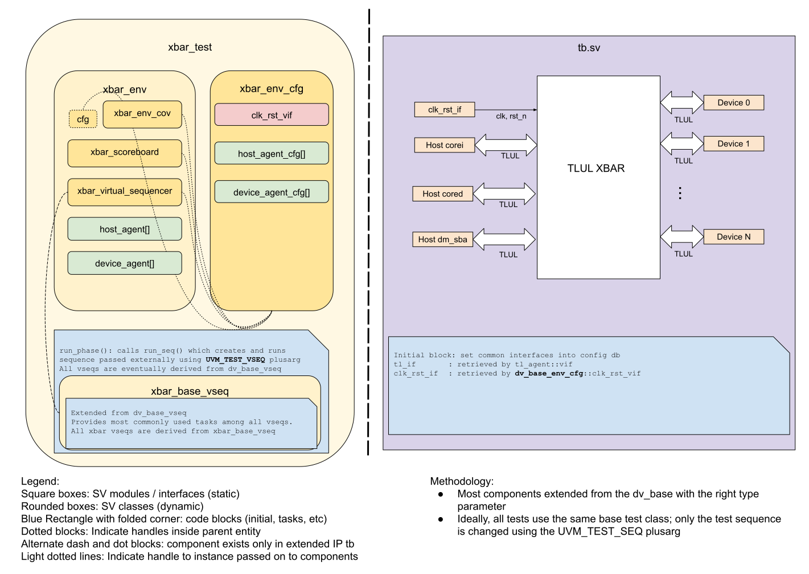

## Goals
* **DV**
  * Verify all TLUL XBAR IP features by running dynamic simulations with a SV/UVM based testbench
  * Develop and run all tests based on the [DV plan](#dv-plan) below towards closing code and functional coverage on the IP and all of its sub-modules
* **FPV**
  * Verify TileLink device protocol compliance with an SVA based testbench

## Current status
* [Design & verification stage]()
  * [HW development stages]()
* DV regression results dashboard (link TBD)

## Design features
For detailed information on TLUL design features, please see the [TLUL design specification]().

## Testbench architecture
XBAR testbench has been constructed based on the `hw/dv/sv/dv_lib`

### Block diagram


### Top level testbench
Top level testbench is located at `hw/ip/tlul/dv/tb/tb.sv`. It instantiates the XBAR DUT module `hw/top_earlgrey/ip/xbar/rtl/autogen/xbar_main.sv`.
In addition, it instantiates the following interfaces, connects them to the DUT and sets their handle into `uvm_config_db`:
* [Clock and reset interface]()
* [TileLink host interface]()

### Common DV utility components
The following utilities provide generic helper tasks and functions to perform activities that are common across the project:
* [common_ifs]()
* [dv_utils_pkg]()

### Global types & methods
All common types and methods defined at the package level can be found in
`xbar_param`. Some of them in use are:
```systemverilog
// 3 hosts can access a same device, reserve upper 2 bits. If all hosts send
// maximum outstanding request in this device, the device needs extra 2 bits
// for source ID to accommodate all the requests
parameter int VALID_HOST_ID_WIDTH = 6
```

### TL agent
XBAR env instantiates [tl_agent]() for each xbar host and device,
which provides the ability to drive and independently monitor random traffic via
TL host/device interface.
* For host, source ID MSB 2 bits are tied to 0 and maximum number of outstanding request is 64
* For device, max number of outstanding request = 64 * number of its accessible hosts. And device also supports out of order response

### Stimulus strategy
#### Test sequences
All test sequences reside in `hw/ip/tlul/dv/env/seq_lib`.
The `xbar_base_vseq` virtual sequence is extended from `dv_base_vseq` and serves as a starting point.
All test sequences are extended from `xbar_base_vseq`.
It provides commonly used handles, variables, functions and tasks that the test sequences can simple use / call.
Some of the most commonly used tasks / functions are as follows:
* seq_init: Create and configure host and device sequences, extended class can override this function to control host/device sequence
* run_all_device_seq_nonblocking: Create passive response sequence for each device
* run_all_host_seq_in_parallel:   Create host sequences to run in parallel

#### Functional coverage
To ensure high quality constrained random stimulus, it is necessary to develop a functional coverage model.
The following covergroups have been developed to prove that the test intent has been adequately met:
* common covergroup from tl_agent:  Cover each host/device reaches its maximum outsanding requests
* same_device_access_cg:            Cover each device has been accessed by all its hosts at the same time
* same_source_access_cg:            Cover all hosts use the same ID at the same time and all the IDs have been used at this sequence
* max_delay_cg:                     Cover zero delay, small delay and large delay have been used in every host and device
* outstanding_cg:                   Cover each host/device hit its maximum outstanding requests

### Self-checking strategy
#### Scoreboard
The `xbar_scoreboard` is primarily used for end to end checking.
It extends from scoreboard_pkg::scoreboard, which supports multiple queues and in-order/out-of-order comparison.
Scoreboard checks one transaction twice:
* In a_channel, host initializes a transaction and scoreboard checks if this transaction is received by a right device
* In d_channel, device initializes a response and scoreboard checks this response is returned to the right host

When device receives a transaction, we don't predict which host drives it.
XBAR DUT may not drive transaction received from host to device in order.
Due to this limitation, scoreboard is designed as following:
* For a_channel, each device has a transaction queue. Monitor transaction from host and store it in a device queue based on item address.
  When device receives a transaction, check if there is a same item in its queue and the item is allowed to be appeared out of order.
* For d_channel, use same structure to check items from device to host.
* If the transaction is unmapped, it won't be sent to any device. Host will return an error response with `d_error = 1`.
  Each host has a queue used only for unmapped items. It stores the unmapped item from a_channal, then compare it with the same source ID response received in d_channel.

Following analysis fifos are created to retrieve the data monitored by corresponding interface agents:
* a_chan_host/device_name, d_chan_host/device_name: These fifos provide transaction items at the end of address channel and data channel respectively from host/device

Following item queues are created to store items for check
* a_chan_device_name: store items from all hosts that are sent to this device
* d_chan_device_name: store items from this device that are returned to all hosts

Another limitation of scoreboard is that we don't check the conversion of source ID from host to device.
We set the source of expected item to 0 before put it into scoreboard queue and hack the source of actual item to 0 before comparison

#### Assertions
* TLUL assertions: The `tb/xbar_bind.sv` binds the `tlul_assert` [assertions]() to the IP to ensure TileLink interface protocol compliance.
* Unknown checks on DUT outputs: The RTL has assertions to ensure all outputs are initialized to known values after coming out of reset.

## Building and running tests
We are using our in-house developed [regression tool]() for building and running our tests and regressions.
Please take a look at the link for detailed information on the usage, capabilities, features and known issues.
Here's how to run a smoke test:
```console
$ $REPO_TOP/util/dvsim/dvsim.py $REPO_TOP/hw/$CHIP/ip/$XBAR_IP/dv/autogen/${XBAR_IP}_sim_cfg.hjson -i ${XBAR_IP}_main_smoke
```
In this run command, $XBAR_IP can be xbar_main, xbar_peri, etc. $CHIP can be top_earlgrey, etc.

## DV plan

