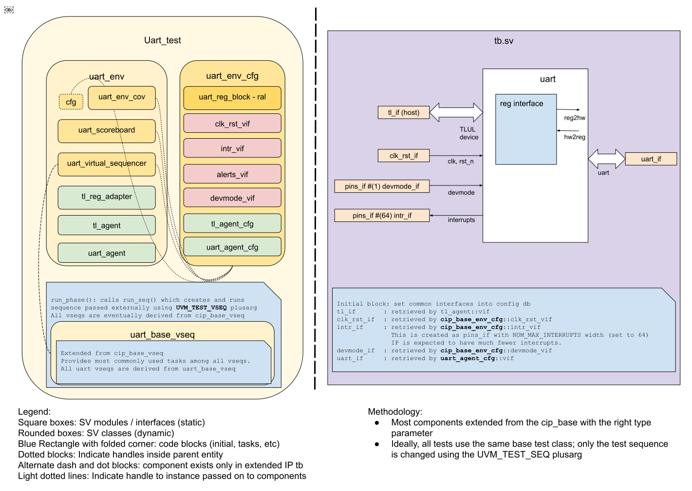

## Goals
* **DV**
  * Verify all UART IP features by running dynamic simulations with a SV/UVM based testbench
  * Develop and run all tests based on the [testplan](#testplan) below towards closing code and functional coverage on the IP and all of its sub-modules
* **FPV**
  * Verify TileLink device protocol compliance with an SVA based testbench

## Current status
* [Design & verification stage]()
  * [HW development stages]()
* DV regression results dashboard (link TBD)

## Design features
For detailed information on UART design features, please see the [UART design specification]().

## Testbench architecture
UART testbench has been constructed based on the
[CIP testbench architecture]().

### Block diagram


### Top level testbench
Top level testbench is located at `hw/ip/uart/dv/tb/tb.sv`. It instantiates the UART DUT module `hw/ip/uart/rtl/uart.sv`.
In addition, it instantiates the following interfaces, connects them to the DUT and sets their handle into `uvm_config_db`:
* [Clock and reset interface]()
* [TileLink host interface]()
* UART IOs
* Interrupts ([`pins_if`]())

### Common DV utility components
The following utilities provide generic helper tasks and functions to perform activities that are common across the project:
* [common_ifs]()
* [dv_utils_pkg]()
* [csr_utils_pkg]()

### Global types & methods
All common types and methods defined at the package level can be found in
`uart_env_pkg`. Some of them in use are:
```systemverilog
parameter uint UART_ADDR_MAP_SIZE = 64;
parameter uint UART_FIFO_DEPTH    = 32;
```

### TL_agent
UART instantiates (already handled in CIP base env) [tl_agent]()
which provides the ability to drive and independently monitor random traffic via
TL host interface into UART device.

### UART agent
[UART agent]() is used to drive and monitor UART items, which also provides basic coverage on
data, parity, baud rate etc.
These baud rates are supported: 9600, 115200, 230400, 1Mbps(1048576), 2Mbps(2097152)

### UVM RAL Model
The UART RAL model is created with the `hw/dv/tools/gen_ral_pkg.py` wrapper script at the start of the simulation automatically and is placed in the build area, along with a corresponding `fusesoc` core file.
The wrapper script invokes the [regtool.py]() script from within to generate the RAL model.

It can be created manually by running `make ral` command from the `dv` area.

### Stimulus strategy
#### Test sequences
All test sequences reside in `hw/ip/uart/dv/env/seq_lib`.
The `uart_base_vseq` virtual sequence is extended from `cip_base_vseq` and serves as a starting point.
All test sequences are extended from `uart_base_vseq`.
It provides commonly used handles, variables, functions and tasks that the test sequences can simple use / call.
Some of the most commonly used tasks / functions are as follows:
* uart_init:    Configure uart control and fifo related csr with random values
* send_tx_byte: Program one TX byte to enable DUT to send a TX byte to UART interface
* send_rx_byte: Drive a RX byte to DUT through UART interface

#### Functional coverage
To ensure high quality constrained random stimulus, it is necessary to develop a functional coverage model.
The following covergroups have been developed to prove that the test intent has been adequately met:
* common covergroup for interrupts `hw/dv/sv/cip_lib/cip_base_env_cov.sv`: Cover interrupt value, interrupt enable, intr_test, interrup pin
* uart_cg in uart_agent_cov `hw/dv/sv/uart_agent/uart_agent_cov.sv`:       Cover direction, uart data, en_parity, odd_parity and baud rate
* fifo_level_cg `hw/ip/uart/dv/env/uart_env_cov.sv`:                       Cover all fifo level with fifo reset for both TX and RX

### Self-checking strategy
#### Scoreboard
The `uart_scoreboard` is primarily used for end to end checking.
It creates the following analysis fifos to retrieve the data monitored by corresponding interface agents:
* tl_a_chan_fifo, tl_d_chan_fifo: These 2 fifos provides transaction items at the end of address channel and
  data channel respectively
* uart_tx_fifo, uart_rx_fifo:     These 2 fifos provides UART TX and RX item when its transfer completes

#### Assertions
* TLUL assertions: The `tb/uart_bind.sv` binds the `tlul_assert` [assertions]() to the IP to ensure TileLink interface protocol compliance.
* Unknown checks on DUT outputs: The RTL has assertions to ensure all outputs are initialized to known values after coming out of reset.

## Building and running tests
We are using our in-house developed [regression tool]() for building and running our tests and regressions.
Please take a look at the link for detailed information on the usage, capabilities, features and known issues.
Here's how to run a basic sanity test:
```console
$ cd hw/ip/uart/dv
$ make TEST_NAME=uart_sanity
```

## Testplan

