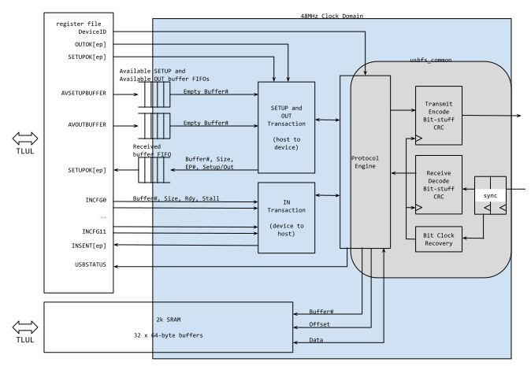
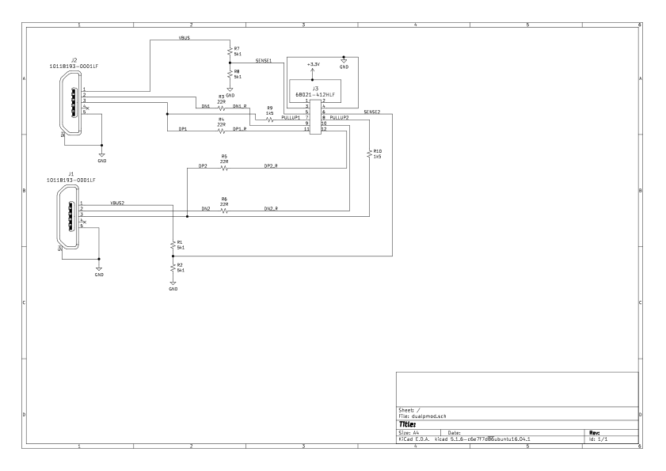

# Overview

This document specifies the USB device hardware IP functionality.
This IP block implements a Full-Speed device according to the [USB 2.0 specification.](https://www.usb.org/document-library/usb-20-specification)
It is attached to the chip interconnect bus as a peripheral module and conforms to the [Comportable guideline for peripheral functionality.]()

## Features

The IP block implements the following features:

- USB 2.0 Full-Speed (12 Mbps) Device interface
- 2 kB interface buffer
- Up to 12 endpoints (including required Endpoint 0), configurable using a compile-time Verilog parameter
- Support for USB packet sizes up to 64 bytes
- Support SETUP, IN and OUT transactions
- Support for Bulk, Control, Interrupt and Isochronous endpoints and transactions
- Streaming possible through software
- Interrupts for packet reception and transmission
- Flippable D+/D- pins, configurable via software, useful if it helps routing the PCB or if D+/D- are mapped to SBU1/SBU2 pins of USB-C

Isochronous transfers larger than 64 bytes are currently not supported.
This feature might be added in a later version of this IP.

## Description

The USB device module is a simple software-driven generic USB device interface for Full-Speed USB 2.0 operation.
The IP includes the physical layer interface, the low level USB protocol and a packet buffer interface to the software.
The physical layer interface features both differential and single-ended transmit and receive paths to allow interfacing with a variety of USB PHYs or regular 3.3V IO pads for FPGA prototyping.

## Compatibility

The USB device programming interface is not based on any existing interface.

# Theory of Operations

A useful quick reference for USB Full-Speed is [USB Made Simple, Part 3 - Data Flow.](http://www.usbmadesimple.co.uk/ums_3.htm)

The block diagram shows a high level view of the USB device including the main register access paths.

## Clocking

The USB Full-Speed interface runs at a data rate of 12 MHz.
The interface runs at four times this frequency and must be clocked from an accurate 48 MHz clock source.
The USB specification for a Full-Speed device requires the average bit rate is 12 Mbps +/- 0.25%, so the clock needs to support maximum error of 2,500 ppm.
The maximum allowable integrated jitter is +/- 1 ns over 1 to 7 bit periods.

This module features the following output signals to provide a reference for synchronizing the 48 MHz clock source:
- `usb_ref_pulse_o` indicates the reception of a start of frame (SOF) packet.
  The host is required to send a SOF packet every 1 ms.
- `usb_ref_val_o` serves as a valid signal for `usb_ref_pulse_o`.
  It is set to one after the first SOF packet is received and remains high as long as `usb_ref_pulse_o` continues to behave as expected.
  As soon as it is detected that SOF will not be received as expected (usually because the link is no longer active), `usb_ref_val_o` deasserts to zero until after the next `usb_ref_pulse_o`.

Both these signals are synchronous to the 48 MHz clock.
They can be forced to zero by setting  to `1`.

To successfully receive SOF packets without errors and thereby enabling clock synchronization, the initial accuracy of the 48 MHz clock source should be within 3.2% or 32,000 ppm.
This requirement comes from the fact that the SOF packet has a length of 24 bits (plus 8-bit sync field).
The first 8 bits are used to transfer the SOF packet ID (8'b01011010).
Internally, the USB device dynamically adjusts the sampling point based on observed line transitions.
Assuming the last bit of the SOF packet ID is sampled in the middle of the eye, the drift over the remaining 16 bits of the packet must be lower than half a bit (10^6 * (0.5/16) = 32,000 ppm).

To externally monitor the 48 MHz clock, the USB device supports an oscillator test mode which can be enabled by setting  to `1`.
In this mode, the device constantly transmits a J/K pattern but no longer receives SOF packets.
Consequently, it does not generate reference pulses for clock synchronization.
The clock might drift off.

Control transfers pass through asynchronous FIFOs or have a ready bit
synchronized across the clock domain boundary. A dual-port
asynchronous buffer SRAM is used for data transfers between the bus
clock and USB clock domains.

## USB Interface Pins

Full-Speed USB uses a bidirectional serial interface as shown in Figure 7-24 of the [USB 2.0 Full-Speed specification](https://www.usb.org/document-library/usb-20-specification).
For reasons of flexibility, this IP block features both differential and single-ended transmit and receive paths.

For better receive sensitivity, lower transmit jitter and to be standard compliant, a dedicated, differential USB transceiver such as the [USB1T11A](https://www.mouser.com/datasheet/2/149/fairchild%20semiconductor_usb1t11a-320893.pdf) or the [USB1T20](https://www.onsemi.com/pub/Collateral/USB1T20-D.pdf) must be used (see Section 7.1.4.1 of the [USB 2.0 specification](https://www.usb.org/document-library/usb-20-specification)).
Depending on the selected USB transceiver, either the differential or the single-ended transmit and receive paths or a combination of the two can be used to interface the IP block with the transceiver.

When prototyping on FPGAs (here the interface can be implemented with pseudo-differential 3.3V GPIO pins and an oversampling receiver for recovery of the bitstream and clock alignment), the single-ended signal pairs can be used.
External to the IP, these should be combined to drive the actual pins when transmit is enabled and receive otherwise.
Using standard 3.3V IO pads allows use on most FPGAs although the drive strength and series termination resistors may need to be adjusted to meet the USB signal eye.
On a Xilinx Artix-7 (and less well tested Spartan-7) part, setting the driver to the 8mA, FAST setting seems to work well with a 22R series termination (and with a 0R series termination).

The following sections describe how the various input/output signals relate to the USB interface pins for the different receive and transmit configurations.

### Data Transmit

The IP block supports both differential and single-ended transmission (TX).
The TX mode can be selected by setting the `tx_differential_mode` bit in  to either 1 (differential) or 0 (single ended).

The following table summarizes how the different output signals relate to the USB interface pins.

|  External Pins | Internal Signals | Notes |
|----------------|------------------|-------|
| D+, D-         | d_o              | Data output for interfacing with a differential USB transceiver. |
| \"             | se0_o            | Signal Single-Ended Zero (SE0) link state to a differential USB transceiver. |
| \"             | dp_o, dn_o       | Single-ended data output signals. These can be used to interface to regular IO cells for prototyping on an FPGA, but such an interface will probably not be USB compliant. |
|   [TX Mode]    | tx_mode_se_o     | Indicates the selected TX mode: single-ended (1) or differential (0) operation. |

Note that according to the [Comportable guideline for peripheral functionality](), every output signal `name_o` has a dedicated output enable `name_en_o`.
For TX data, these separate signals `d_en_o`, `dp_en_o` and `dn_en_o` all correspond to the same TX or output enable signal (`OE` in the USB spec).

### Data Receive

The IP block supports both differential and single-ended reception (RX).
The RX mode can be selected by setting the `rx_differential_mode` bit in  to either 1 (differential) or 0 (single ended).

The following table summarizes how the different input signals relate to the USB interface pins.

|  External Pins | Internal Signals | Notes |
|----------------|------------------|-------|
| D+, D-         | d_i              | Data input for interfacing with a differential USB transceiver. Used in differential RX mode only. |
| \"             | dp_i, dn_i       | Single-ended data input signals. These signals are used to detect the SE0 link state in differential RX mode. They can further be used to interface to regular IO cells for prototyping on an FPGA, but such an interface will probably not be USB compliant. |

### Non-Data Pins

The USB device features the following non-data pins.

|  External Pins | Internal Signals         | Notes |
|----------------|--------------------------|-------|
| sense (VBUS)   | sense_i                  | The sense pin indicates the presence of VBUS from the USB host. |
| [pullup]       | dp_pullup_o, dn_pullup_o | When dp_pullup_o or dn_pullup_o asserts a 1.5k pullup resistor should be connected to D+ or D-, respectively. This can be done inside the chip or with an external pin. A permanently connected resistor could be used if the pin flip feature is not needed, but this is not recommended because there is then no way to force the device to appear to unplug. Only one of the pullup signals can be asserted at any time. The selection is based on the `pinflip` bit in . Because this is a Full-Speed device the resistor must be on the D+ pin, so when `pinflip` is zero, dp_pullup_o is used. |
| [suspend]      | suspend_o                | The suspend pin indicates to the USB transceiver that a constant idle has been detected on the link and the device is in the Suspend state (see Section 7.1.7.6 of the [USB 2.0 specification](https://www.usb.org/document-library/usb-20-specification)). |

The USB host will identify itself to the device by enabling the 5V VBUS power.
It may do a hard reset of a port by removing and reasserting VBUS (the Linux driver will do this when it finds a port in an inconsistent state or a port that generates errors during enumeration).
The IP block detects VBUS through the sense pin.
This pin is always an input and should be externally connected to detect the state of the VBUS.
Note that this may require a resistor divider or (for USB-C where VBUS can be up to 20V) active level translation to an acceptable voltage for the input pin.

A Full-Speed device identifies itself by providing a 1.5k pullup resistor (to 3.3V) on the D+ line.
The IP block produces a signal `dp_pullup_o` that is asserted when this resistor should be presented.
This signal will be asserted whenever the interface is enabled.
In an FPGA implementation, this signal can drive a 3.3V output pin that is driven high when the signal is asserted and set high impedance when the signal is deasserted, and the output pin used to drive a 1.5k resistor connected on the board to the D+ line.
Alternatively, it can be used to enable an internal 1.5k pullup on the D+ pin.

This USB device supports the flipping of D+/D-.
If the `pinflip` bit in  is set, the data pins are flipped internally, meaning the 1.5k pullup resistor needs to be on the external D- line.
To control the pullup on the D- line, this USB device features `dn_pullup_o` signal.
Of the two pullup signals `dp_pullup_o` and `dn_pullup_o`, only one can be enabled at any time.
As this is a Full-Speed device, `dp_pullup_o`, i.e., the pullup on D+ is used by default (`pinflip` equals zero).

### FPGA Board Implementation With PMOD

The interface was developed using the Digilent Nexys Video board with a PMOD card attached.
A PMOD interface with direct connection to the SoC should be used (some PMOD interfaces include 100R series resistors which break the signal requirements for USB).
The PMOD card includes two USB micro-B connectors and allows two USB interfaces to be used.
The D+ and D- signals have 22R series resistors (in line with the USB spec) and there is a 1.5k pullup on D+ to the pullup enable signal.
There is a resistive divider to set the sense pin at half of the VBUS voltage which enables detection on the FPGA without overvoltage on the pin.

The PMOD PCB is [available from OSH Park](https://oshpark.com/shared_projects/xMKhTIHn).

The PMOD design files for KiCad version 5 are in the [`usbdev/pmod`](https://github.com/lowRISC/opentitan/tree/master/hw/ip/usbdev/pmod) directory. 
The BOM can be filled by parts from Digikey.

| Item | Qty | Reference(s) | Value | LibPart | Footprint | Datasheet | Category | DK_Datasheet_Link | DK_Detail_Page | Description | Digi-Key_PN | Family | MPN | Manufacturer | Status|
|------|-----|--------------|-------|---------|-----------|-----------|----------|-------------------|----------------|-------------|-------------|--------|-----|--------------|-------|
| 1 | 2 | J1, J2 | 10118193-0001LF | dualpmod-rescue:10118193-0001LF-dk_USB-DVI-HDMI-Connectors | digikey-footprints:USB_Micro_B_Female_10118193-0001LF | http://www.amphenol-icc.com/media/wysiwyg/files/drawing/10118193.pdf | Connectors, Interconnects | http://www.amphenol-icc.com/media/wysiwyg/files/drawing/10118193.pdf | /product-detail/en/amphenol-icc-fci/10118193-0001LF/609-4616-1-ND/2785380 | CONN RCPT USB2.0 MICRO B SMD R/A | 609-4616-1-ND | USB, DVI, HDMI Connectors | 10118193-0001LF | Amphenol ICC (FCI) | Active|
| 2 | 1 | J3 | 68021-412HLF | dualpmod-rescue:68021-412HLF-dk_Rectangular-Connectors-Headers-Male-Pins | digikey-footprints:PinHeader_6x2_P2.54mm_Horizontal | https://cdn.amphenol-icc.com/media/wysiwyg/files/drawing/68020.pdf | Connectors, Interconnects | https://cdn.amphenol-icc.com/media/wysiwyg/files/drawing/68020.pdf | /product-detail/en/amphenol-icc-fci/68021-412HLF/609-3355-ND/1878558 | CONN HEADER R/A 12POS 2.54MM | 609-3355-ND | Rectangular Connectors - Headers, Male Pins | 68021-412HLF | Amphenol ICC (FCI) | Active|
| 3 | 4 | R1, R2, R7, R8 | 5k1 | Device:R_Small_US | Resistor_SMD:R_0805_2012Metric_Pad1.15x1.40mm_HandSolder | ~ |  |  |  |  | A126379CT-ND |  |  |  | |
| 4 | 4 | R3, R4, R5, R6 | 22R | Device:R_Small_US | Resistor_SMD:R_0805_2012Metric_Pad1.15x1.40mm_HandSolder | ~ |  |  |  |  | A126352CT-ND |  |  |  | |
| 5 | 2 | R9, R10 | 1k5 | Device:R_Small_US | Resistor_SMD:R_0805_2012Metric_Pad1.15x1.40mm_HandSolder | ~ |  |  |  |  | A106057CT-ND |  |  |  | |

## Hardware Interfaces



## USB Link State

The USB link has a number of states.
These are detected and reported in  and state changes are reported using interrupts.
The FSM implements a subset of the USB device state diagram shown in Figure 9-1 of the [USB 2.0 specification.](https://www.usb.org/document-library/usb-20-specification)

|State| Description |
|-----|-------------|
|Disconnect | The link is disconnected. This is signaled when the VBUS is not driven by the host, which results in the sense input pin being low. An interrupt is raised on entering this state.|
|Powered| The device has been powered as VBUS is being driven by the host, but has not been reset yet. The link is reset whenever the D+ and D- are both low (an SE0 condition) for an extended period. The host will assert reset for a minimum of 10 ms, but the USB specification allows the device to detect and respond to a reset after 2.5 us. The implementation here will report the reset state and raise an interrupt when the link is in SE0 for 3 us.|
|Powered Suspend| The link is suspended when at idle (a J condition) for more than 3 ms. An interrupt is generated when the suspend is detected and a resume interrupt is generated when the link exits the suspend state. This state is entered, if the device has not been reset yet.|
|Active| The link is active when it is running normally. |
|Suspend| Similar to 'Powered Suspend', but the device was in the active state before being suspended.|

|Link Events| Description |
|-----------|-------------|
|Disconnect| VBUS has been lost. |
|Link Reset| The link has been in the SE0 state for 3 us.|
|Link Suspend| The link has been in the J state for more than 3 ms, upon which we have to enter the Suspend state.|
|Link Resume| The link has been driven to a non-J state after being in Suspend.|
|Host Lost| Signaled using an interrupt if the link is active but a start of frame (SOF) packet has not been received from the host in 4.096 ms. The host is required to send a SOF packet every 1 ms. This is not an expected condition.|

## USB Protocol Engine

The USB 2.0 Full-Speed Protocol Engine is provided by the common USB interface code and is, strictly speaking, not part of this USB device module.

At the lowest level of the USB stack the transmit bitstream is serialized, converted to non-return-to-zero inverted (NRZI) encoding with bit-stuffing and sent to the transmitter.
The received bitstream is recovered, clock aligned and decoded and has bit-stuffing removed.
The recovered clock alignment is used for transmission.

The higher level protocol engine forms the bitstream into packets, performs CRC checking and recognizes IN, OUT and SETUP transactions.
These are presented to this module without buffering.
This means the USB device module must accept or provide data when requested.
The protocol engine may cancel a transaction because of a bad cyclic redundancy check (CRC) or request a retry if an acknowledgment (ACK) was not received.

## Buffer Interface

A 2 kB SRAM is used as a packet buffer to hold data between the system and the USB interface.
This is divided up into 32 buffers each containing 64 bytes.
This is an asynchronous dual-port SRAM with software accessing from the bus clock domain and the USB interface accessing from the USB 48 MHz clock domain.

### Reception

Software provides buffers for packet reception through a 4-entry Available Buffer FIFO.
(More study needed but four seems about right: one just returned to software, one being filled, one ready to be filled, and one for luck.)
The  and  registers is used to indicate which endpoints will accept data from the host using OUT or SETUP transactions, respectively.
When a packet is transferred from the host to the device (using an OUT or SETUP transaction) and reception of that type of transaction is enabled for the requested endpoint, the next buffer ID is pulled from the Available Buffer FIFO.
The packet data is written to the corresponding buffer in the packet buffer (the 2 kB SRAM).
If the packet is correctly received, an ACK is returned to the host.
In addition, the buffer ID, the packet size, an out/setup flag and the endpoint ID are passed back to software using the Received Buffer FIFO and a pkt_received interrupt is raised.

Software should immediately provide a free buffer for future reception by writing the corresponding buffer ID to the Available Buffer FIFO.
It can then process the packet and eventually return the received buffer to the free pool.
This allows streaming on a single endpoint or across a number of endpoints.
If the packets cannot be consumed at the rate they are received, software can implement selective flow control by disabling OUT or SETUP transactions for a particular endpoint, which will result in a request to that endpoint being NACKed (negative acknowledgment).
In the unfortunate event that the Available Buffer FIFO is empty or the Received Buffer FIFO is full, all OUT and SETUP transactions are NACKed.

### Transmission

To send data to the host in response to an IN transaction, software first writes the data into a free buffer.
Then, it writes the buffer ID, data length and rdy flag to the  register of the corresponding endpoint.
When the host next does an IN transaction to that endpoint, the data will be sent from the buffer.
On receipt of the ACK from the host, the rdy bit in the  register will be cleared, and the bit corresponding to the endpoint ID will be set in the  register causing a pkt_sent interrupt to be raised.
Software can return the buffer to the free pool and write a 1 to clear the endpoint bit in the  register.
Note that streaming can be achieved if the next buffer has been prepared and is written to the  register when the interrupt is received.

A Control transfer may need an IN data transfer.
Therefore, when a SETUP transaction is received for an endpoint, any buffers that are waiting to be sent out to the host from that endpoint are canceled by clearing the rdy bit in the corresponding  register.
To keep track of such canceled buffers, the pend bit in the same register is set.
The transfer must be queued again after the Control transfer is completed.

Similarly, a Link Reset cancels any waiting IN transactions by clearing the rdy bit in the  register of all endpoints.
The pend bit in the  register is set for all endpoints with a pending IN transaction.

### Buffer Count and Size

Under high load, the 32 buffers of the packet buffer (2 kB SRAM) are allocated as follows:
- 1 is being processed following reception,
- 4 are in the Available Buffer FIFO, and
- 12 (worst case) waiting transmissions in the  registers.
This leaves 15 buffers for preparation of future transmissions (which would need 12 in the worst case of one per endpoint) and the free pool.

The size of 64 bytes per buffer satisfies the maximum USB packet size for a Full-Speed interface for Control transfers (max may be 8, 16, 32 or 64 bytes), Bulk Transfers (max is 64 bytes) and Interrupt transfers (max is 64 bytes).
It is small for Isochronous transfers (which have a max size of 1023 bytes).
The interface will need extending for high rate isochronous use (a possible option would be to allow up to 8 or 16 64-byte buffers to be aggregated as the isochronous buffer).

# Design Details

# Programmers Guide

## Initialization

The basic hardware initialization is to (in any order) fill the Available Buffer FIFO, enable reception of SETUP and OUT packets on Endpoint 0 (this is the control endpoint that the host will use to configure the interface), enable reception of SETUP and OUT packets on any endpoints that accept them and enable any required interrupts.
Finally, the interface is enabled by setting the enable bit in the  register.
Setting this bit causes the USB device to assert the pullup on the D+ line, which is used by the host to detect the device.
There is no need to configure the device ID in () at this point -- the line remains in reset and the hardware forces the device ID to zero.

The second stage of initialization is done under control of the host, which will use control transfers (always beginning with SETUP transactions) to Endpoint 0.
Initially these will be sent to device ID 0.
When a Set Address request is received, the device ID received must be stored in the  register.
Note that device 0 is used for the entire control transaction setting the new device ID, so writing the new ID to the register should not be done until the ACK for the Status stage has been received (see [USB 2.0 specification](https://www.usb.org/document-library/usb-20-specification)).

## Buffers

Software needs to manage the buffers in the packet buffer (2 kB SRAM).
Each buffer can hold the maximum length packet for a Full-Speed interface (64 bytes).
Other than for data movement, the management is most likely done based on their buffer ID which is a small integer between zero and (SRAM size in bytes)/(max packet size in bytes).

In order to avoid unintentional stalling the interface, there must be buffers available when the host sends data to the device (an OUT or STATUS transaction).
Software needs to ensure (1) there are always buffer IDs in the Available Buffer FIFO, and (2) the Received Buffer FIFO is not full.
If the Available Buffer FIFO is empty or the Received Buffer FIFO is full when data is received, a NACK will be returned to the host, requesting the packet be retried later.
Generating NACK with this mechanism is generally to be avoided (for example the host expects a device will always accept STATUS packets to Endpoint 0).

Keeping the Available Buffer FIFO full can be done with a simple loop, adding buffer IDs from the software-managed free pool until the FIFO is full.
A simpler policy of just adding a buffer ID to the Available Buffer FIFO whenever a buffer ID is removed from the Received Buffer FIFO should work on average, but performance will be slightly worse when bursts of packets are received.

Flow control (using NACKs) may be done on a per-endpoint basis using the  and  registers.
If this does not indicate OUT/SETUP packet reception is enabled, then any packet will receive a NACK to request a retry later.
This should only be done for short durations or the host may timeout the transaction.

## Reception

The host will send OUT or SETUP transactions when it wants to transfer data to the device.
The data packets are directed to a particular endpoint, and the maximum packet size is set per-endpoint in its Endpoint Descriptor (this must be the same or smaller than the maximum packet size supported by the device).
A pkt_received interrupt is raised whenever there is one or more packets in the Received Buffer FIFO.
Software should pop the information from the Received Buffer FIFO by reading the  register, which gives (1) the buffer ID that the data was received in, (2) the data length received in bytes, (3) the endpoint to which the packet was sent, and (4) an indication if the packet was sent with an OUT or STATUS transaction.
Note that the data length could be between zero and the maximum packet size -- in some situations a zero length packet is used as an acknowledgment or end of transmission.

The data length does not include the packet CRC.
(The CRC bytes are written to the buffer if they fit within the maximum buffer size.)
Packets with a bad CRC will **not** be transferred to the Received Buffer FIFO, the hardware will request a retry.

## Transmission

Data is transferred to the host based on the host requesting a transfer with an IN transaction.
The host will only generate IN requests if the endpoint is declared as an IN endpoint in its Endpoint Descriptor (note that two descriptors are needed if the same endpoint is used for both IN and OUT transfers).
The Endpoint Descriptor also includes a description of the frequency the endpoint should be polled.

Data is queued for transmission by writing the corresponding  register with the buffer ID containing the data, the length in bytes of data (0 to maximum packet length) and setting the rdy bit.
This data (with the packet CRC) will be sent as a response to the next IN transaction on the corresponding endpoint.
When the host ACKs the data, the rdy bit is cleared, the corresponding endpoint bit is set in the  register, and a pkt_sent interrupt is raised. If the host does not ACK the data, the packet will be retried.
When the packet transmission has been noted by software, the corresponding endpoint bit should be cleared in the  register (by writing a 1 to this very bit).

Note that the  for an endpoint is a single register, so no new data packet should be queued until the previous packet has been ACKed.
If an enabled SETUP transaction is received on an endpoint that has a transmission pending, the hardware will **clear the rdy bit** and **set the pend bit** in the  register of that endpoint.
Software must remember the pending transmission and, after the Control transaction is complete, write it back to the  register with the rdy bit set.

## Stalling

The  registers are used for endpoint stalling.
There is one dedicated register per endpoint.
Stalling is used to signal that the host should not retry a particular transmission or to signal certain error conditions (functional stall).
Control endpoints also use a STALL to indicate unsupported requests (protocol stall).
Unused endpoints can have their  register left clear, so in many cases there is no need to use the  register.
If the  register is set for an endpoint then the STALL response will be provided to all IN/OUT requests on that endpoint.

In the case of a protocol stall, the device must send a STALL for all IN/OUT requests until the next SETUP token is received.
To support this, software sets the  register for an endpoint when the host requests an unsupported transfer.
The hardware will then send a STALL response to all IN/OUT transactions until the next SETUP is received for this endpoint.
Receiving the **SETUP token clears the  register** for that endpoint.
The hardware then sends NACKs to any IN/OUT requests until the software has decided what action to take for the new SETUP request.

## Register Table


