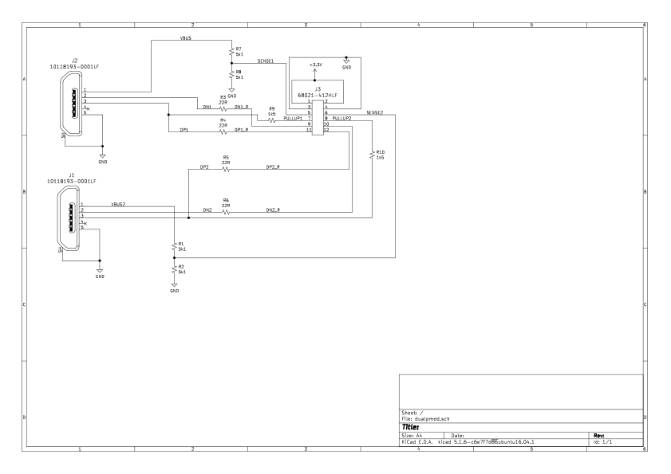

# Programmer's Guide

## Initialization

The basic hardware initialization is to (in any order) configure the physical interface for the implementation via the [`phy_config`](registers.md#phy_config) register, fill the Available Buffer FIFO, enable IN and OUT endpoints with ID 0 (this is the control endpoint that the host will use to configure the interface), enable reception of SETUP and OUT packets on OUT Endpoint 0, and enable any required interrupts.
Finally, the interface is enabled by setting the enable bit in the [`usbctrl`](registers.md#usbctrl) register.
Setting this bit causes the USB device to assert the pullup on the D+ line, which is used by the host to detect the device.
There is no need to configure the device ID in ([`usbctrl.device_address`](registers.md#usbctrl)) at this point -- the line remains in reset and the hardware forces the device ID to zero.

The second stage of initialization is done under control of the host, which will use control transfers (always beginning with SETUP transactions) to Endpoint 0.
Initially these will be sent to device ID 0.
When a Set Address request is received, the device ID received must be stored in the [`usbctrl.device_address`](registers.md#usbctrl) register.
Note that device 0 is used for the entire control transaction setting the new device ID, so writing the new ID to the register should not be done until the ACK for the Status stage has been received (see [USB 2.0 specification](https://www.usb.org/document-library/usb-20-specification)).

The host will then issue additional control transfers to Endpoint 0 to configure the device, now to the device's configured address.
In response to the Set Configuration request, software should set up the rest of the endpoints for that configuration, including configuring the flow control behavior for OUT endpoints via the [`set_nak_out`](registers.md#set_nak_out) register, configuring the endpoint type via the [`rxenable_setup`](registers.md#rxenable_setup) register (for a control endpoint) and the [`out_iso`](registers.md#out_iso) and [`in_iso`](registers.md#in_iso) registers (for isochronous OUT and IN endpoints, respectively).
Finally, software should enable the configured endpoints via the [`ep_out_enable`](registers.md#ep_out_enable) and [`ep_in_enable`](registers.md#ep_in_enable) registers.
The status stage of the Set Configuration request should not be allowed to complete until all endpoints are set up.

## Buffers

Software needs to manage the buffers in the packet buffer (2 kB SRAM).
Each buffer can hold the maximum length packet for a Full-Speed interface (64 bytes).
Other than for data movement, the management is most likely done based on their buffer ID which is a small integer between zero and (SRAM size in bytes)/(max packet size in bytes).

In order to avoid unintentionally deferring transactions, there must be buffers available when the host sends data to the device (an OUT or SETUP transaction).
Software needs to ensure (1) there are always buffer IDs in the Available Buffer FIFO, and (2) the Received Buffer FIFO is not full.
For OUT transactions, if the Available Buffer FIFO is empty or the Received Buffer FIFO is full when data is received, a NAK will be returned to the host, requesting the packet be retried later.
For SETUP transactions under the same conditions, the request will be dropped and a handshake will not be sent, indicating an error to the host and provoking a retry.
These conditions cause the bus to be busy and perform no work, lowering performance for this device and potentially others on the same bus.
Timely management of buffers may have a significant impact on throughput.

Keeping the Available Buffer FIFO full can be done with a simple loop, adding buffer IDs from the software-managed free pool until the FIFO is full.
A simpler policy of just adding a buffer ID to the Available Buffer FIFO whenever a buffer ID is removed from the Received Buffer FIFO should work on average, but performance will be slightly worse when bursts of packets are received.

Flow control (using NAKs) may be done on a per-endpoint basis using the [`rxenable_out`](registers.md#rxenable_out) register.
If this does not indicate OUT packet reception is enabled, then any OUT packet will receive a NAK to request a retry later.
This should only be done for short durations or the host may timeout the transaction.

## Reception

The host will send OUT or SETUP transactions when it wants to transfer data to the device.
The data packets are directed to a particular endpoint, and the maximum packet size is set per-endpoint in its Endpoint Descriptor (this must be the same or smaller than the maximum packet size supported by the device).
A pkt_received interrupt is raised whenever there are one or more packets in the Received Buffer FIFO.
Software should pop the information from the Received Buffer FIFO by reading the [`rxfifo`](registers.md#rxfifo) register, which gives (1) the buffer ID that the data was received in, (2) the data length received in bytes, (3) the endpoint to which the packet was sent, and (4) an indication if the packet was sent with an OUT or SETUP transaction.
Note that the data length could be between zero and the maximum packet size -- in some situations a zero length packet is used as an acknowledgment or end of transfer.

The data length does not include the packet CRC.
(The CRC bytes are written to the buffer if they fit within the maximum buffer size.)
Packets with a bad CRC will **not** be transferred to the Received Buffer FIFO; the hardware will drop the transaction without a handshake, indicating an error to the host.
For non-isochronous endpoints, this typically results in the host retrying the transaction.

It is important for software to collect received packets promptly so that there is always space available for the receipt of subsequent SETUP packets.
The USB protocol specification does not provide a mechanism for signaling that the device is busy, so when a SETUP packet cannot be received it must be dropped.
This can lead to the host faulting a Control Transfer in as little as 30us by retrying it twice in rapid succession.

## Transmission

Data is transferred to the host based on the host requesting a transfer with an IN transaction.
The host will only generate IN requests if the endpoint is declared as an IN endpoint in its Endpoint Descriptor (note that two descriptors are needed if the same endpoint is used for both IN and OUT transfers).
The Endpoint Descriptor also includes a description of the frequency the endpoint should be polled (for isochronous and interrupt endpoints).

Data is queued for transmission by writing the corresponding [`configin`](registers.md#configin) register with the buffer ID containing the data, the length in bytes of data (0 to maximum packet length) and setting the rdy bit.
This data (with the packet CRC) will be sent as a response to the next IN transaction on the corresponding endpoint.
When the host ACKs the data, the rdy bit is cleared, the corresponding endpoint bit is set in the [`in_sent`](registers.md#in_sent) register, and a pkt_sent interrupt is raised.
If the host does not ACK the data, the packet will be retried.
When the packet transmission has been noted by software, the corresponding endpoint bit should be cleared in the [`in_sent`](registers.md#in_sent) register (by writing a 1 to this very bit).

Note that the [`configin`](registers.md#configin) for an endpoint is a single register, so no new data packet should be queued until the previous packet has been ACKed.
If a SETUP transaction is received on a control endpoint that has a transmission pending, the hardware will **clear the rdy bit** and **set the pend bit** in the [`configin`](registers.md#configin) register of that endpoint.
Software must remember the pending transmission and, after the Control transaction is complete, write it back to the [`configin`](registers.md#configin) register with the rdy bit set.

## Stalling

The [`out_stall`](registers.md#out_stall) and [`in_stall`](registers.md#in_stall) registers are used for endpoint stalling.
There is one dedicated register per endpoint.
Stalling is used to signal that the host should not retry a particular transmission or to signal certain error conditions (functional stall).
Control endpoints also use a STALL to indicate unsupported requests (protocol stall).
Unused endpoints can have their [`in_stall`](registers.md#in_stall) or [`out_stall`](registers.md#out_stall) register left clear, so in many cases there is no need to use the register.
If the stall register is set for an enabled endpoint then the STALL response will be provided to all IN or OUT requests on that endpoint.

In the case of a protocol stall, the device must send a STALL for all IN/OUT requests until the next SETUP token is received.
To support this, software sets the [`in_stall`](registers.md#in_stall) and [`out_stall`](registers.md#out_stall) register for an endpoint when the host requests an unsupported transfer.
The hardware will then send a STALL response to all IN/OUT transactions until the next SETUP is received for this endpoint.
Receiving the **SETUP token clears the [`in_stall`](registers.md#in_stall) and [`out_stall`](registers.md#out_stall) registers** for that endpoint.
If either a control endpoint's [`set_nak_out`](registers.md#set_nak_out) bit is set or software has cleared the [`rxenable_out`](registers.md#rxenable_out) bit before this transfer began, the hardware will send NAKs to any IN/OUT requests until the software has decided what action to take for the new SETUP request.

## Notification Interrupts

The following usbdev interrupts should be regarded as notifications of events occurring on the USB and not as indications of failures.
In accordance with the USB 2.0 protocol specification, usbdev performs error reporting, retrying and recovery automatically in the event of data corruptions and signal integrity issues.

- rx_bitstuff_err
  - In early versions of the usbdev IP these may be expected to occur in the presence of traffic to a Low Speed device connected to the same as usbdev.
    Downstream Low Speed traffic is transmitted to the usbdev and although the traffic is rejected by usbdev, bit stuffing errors may be reported.
- rx_pid_err and rx_crc_err
  - Interrupts reporting invalid PIDs or CRC errors in received packets would usually indicate a signal integrity issue, but they have also been observed with a USB 2.0 hub that propagates partial packets at the point of connecting the usbdev to the USB.
    Accordingly, the usbdev  discards these invalid packets.

Additionally, the following usbdev interrupts may be expected to occur under conditions of heavy traffic, particularly if the software is slow in collecting received packets and providing new buffers to the Available Buffer FIFO.
They should be understood to be an indication of possible performance or latency issues in the software rather than problems on the USB.

- av_empty
- rx_full
- link_out_err

Each of these interrupts may be useful during development but consideration should be given to whether the raising and handling of these interrupts is beneficial in production software, given that the usbdev hardware handles these events automatically.

## Device Interface Functions (DIFs)

- [Device Interface Functions](../../../../sw/device/lib/dif/dif_usbdev.h)

## Register Table

* [Register Table](registers.md#registers)

## Application to FPGAs

### Differential Receivers

For better receive sensitivity, lower transmit jitter and to be standard compliant, a dedicated, differential USB transceiver such as the [USB1T11A](https://www.mouser.com/datasheet/2/149/fairchild%20semiconductor_usb1t11a-320893.pdf) or the [USB1T20](https://www.onsemi.com/pub/Collateral/USB1T20-D.pdf) must be used (see Section 7.1.4.1 of the [USB 2.0 specification](https://www.usb.org/document-library/usb-20-specification)).
Depending on the selected USB transceiver, either the dp/dn or d/se0 transmit paths or can be used to interface the IP block with the transceiver.
If the selected USB transceiver contains a differential receiver, its output may also be enabled and passed to the D input of the IP block.

When prototyping on FPGAs the interface can be implemented with pseudo-differential 3.3V GPIO pins for D+ and D-.
The receiver will oversample to recover the bitstream and clock alignment even if there is considerable timing skew between the signal paths.
The full speed transmit always uses LVCMOS output drivers (see USB 2.0 spec Figure 7-1 and Figure 7-3) but there are two possible encodings: Either the D+ and D- values are directly driven from tx_dp and tx_dn, or there is a data value from tx_d and an indicator to force SE0 from tx_se0.
External to the IP, these should be combined to drive the actual pins when transmit is enabled and receive otherwise.
Using standard 3.3V IO pads allows use on most FPGAs although the drive strength and series termination resistors may need to be adjusted to meet the USB signal eye.
On a Xilinx Artix-7 (and less well tested Spartan-7) part, setting the driver to the 8mA, FAST setting seems to work well with a 22R series termination (and with a 0R series termination).

### FPGA Board Implementation With PMOD

The interface was developed using the Digilent Nexys Video board with a PMOD card attached.
A PMOD interface with direct connection to the SoC should be used (some PMOD interfaces include 100R series resistors which break the signal requirements for USB).
The PMOD card includes two USB micro-B connectors and allows two USB interfaces to be used.
The D+ and D- signals have 22R series resistors (in line with the USB spec) and there is a 1.5k pullup on D+ to the pullup enable signal.
There is a resistive divider to set the sense pin at half of the VBUS voltage which enables detection on the FPGA without overvoltage on the pin.

The PMOD PCB is [available from OSH Park](https://oshpark.com/shared_projects/xMKhTIHn).

The PMOD design files for KiCad version 5 are in the [`usbdev/pmod`](https://github.com/lowRISC/opentitan/tree/master/hw/ip/usbdev/pmod) directory.
The BOM can be filled by parts from Digikey.

| Item | Qty | Reference(s) | Value | LibPart | Footprint | Datasheet | Category | DK_Datasheet_Link | DK_Detail_Page | Description | Digi-Key_PN | Family | MPN | Manufacturer | Status|
|------|-----|--------------|-------|---------|-----------|-----------|----------|-------------------|----------------|-------------|-------------|--------|-----|--------------|-------|
| 1 | 2 | J1, J2 | 10118193-0001LF | dualpmod-rescue:10118193-0001LF-dk_USB-DVI-HDMI-Connectors | digikey-footprints:USB_Micro_B_Female_10118193-0001LF | http://www.amphenol-icc.com/media/wysiwyg/files/drawing/10118193.pdf | Connectors, Interconnects | http://www.amphenol-icc.com/media/wysiwyg/files/drawing/10118193.pdf | /product-detail/en/amphenol-icc-fci/10118193-0001LF/609-4616-1-ND/2785380 | CONN RCPT USB2.0 MICRO B SMD R/A | 609-4616-1-ND | USB, DVI, HDMI Connectors | 10118193-0001LF | Amphenol ICC (FCI) | Active|
| 2 | 1 | J3 | 68021-412HLF | dualpmod-rescue:68021-412HLF-dk_Rectangular-Connectors-Headers-Male-Pins | digikey-footprints:PinHeader_6x2_P2.54mm_Horizontal | https://cdn.amphenol-icc.com/media/wysiwyg/files/drawing/68020.pdf | Connectors, Interconnects | https://cdn.amphenol-icc.com/media/wysiwyg/files/drawing/68020.pdf | /product-detail/en/amphenol-icc-fci/68021-412HLF/609-3355-ND/1878558 | CONN HEADER R/A 12POS 2.54MM | 609-3355-ND | Rectangular Connectors - Headers, Male Pins | 68021-412HLF | Amphenol ICC (FCI) | Active|
| 3 | 4 | R1, R2, R7, R8 | 5k1 | Device:R_Small_US | Resistor_SMD:R_0805_2012Metric_Pad1.15x1.40mm_HandSolder | ~ |  |  |  |  | A126379CT-ND |  |  |  | |
| 4 | 4 | R3, R4, R5, R6 | 22R | Device:R_Small_US | Resistor_SMD:R_0805_2012Metric_Pad1.15x1.40mm_HandSolder | ~ |  |  |  |  | A126352CT-ND |  |  |  | |
| 5 | 2 | R9, R10 | 1k5 | Device:R_Small_US | Resistor_SMD:R_0805_2012Metric_Pad1.15x1.40mm_HandSolder | ~ |  |  |  |  | A106057CT-ND |  |  |  | |

### USRUSB socket on the CW310 and CW340 boards from NewAE Technology

For CW310 and CW340 FPGA builds that connect usbdev through the USRUSB socket it is important to make sure that the socket is cabled to a Type-A USB port at the host and not via a USB-C only cable to a USB-C port.
This is because the Power Delivery protocol over USB-C requires each unit to negotiate its power requirements and delivery capacity.

Since these boards are intended to support both USB host and USB device designs via the USRUSB socket, the pull up and pull down resistors are not fitted as standard.
The device must thus be cabled to a Type-A socket to ensure that VBUS/SENSE is raised by the host, or a USB-C to USB-A adapter may be used in the USB-C socket of the host in conjunction with a suitable cable.
Alternatively, the appropriate 5k1 pull-down resistors may be fitted to the two CC wires on the board to indicate the presence of a 'consuming USB device' that requires a 5V VBUS.
