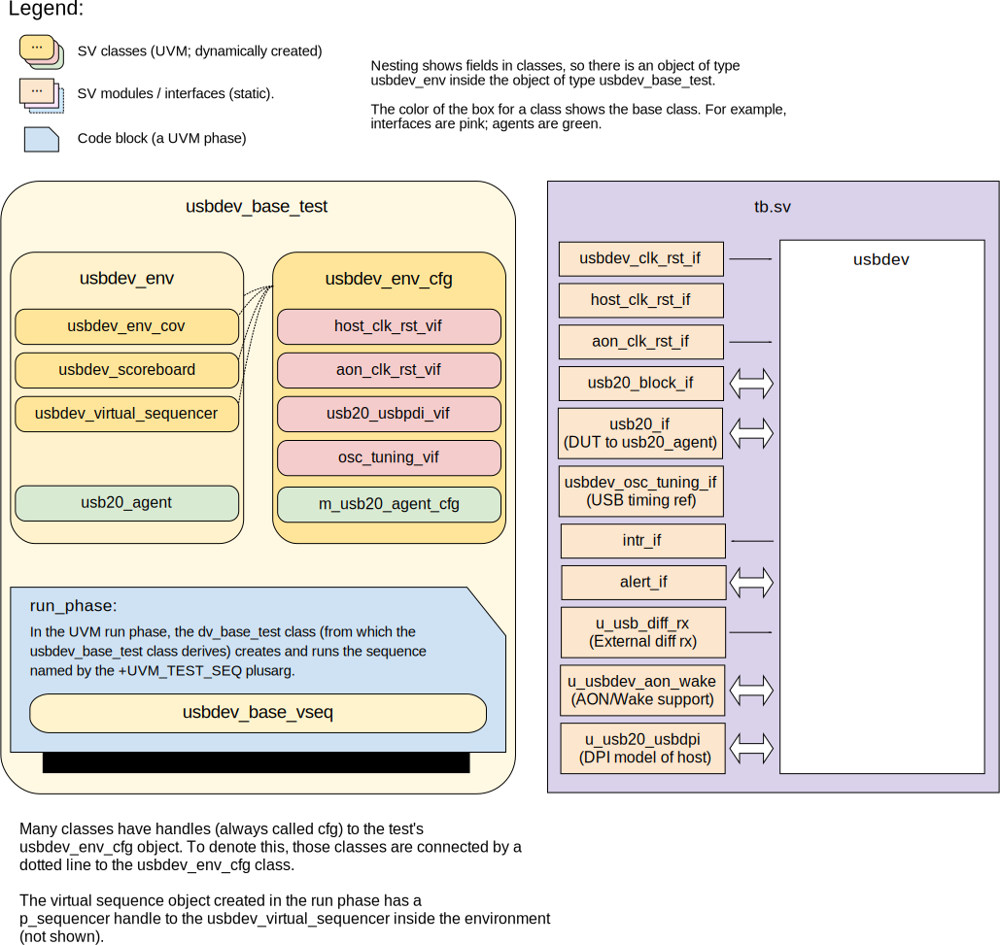

# USBDEV DV document

## Goals
* **DV**
  * Verify all USBDEV IP features by running dynamic simulations with a SV/UVM based testbench.
  * Develop and run all tests based on the [testplan](#testplan) below towards closing code and functional coverage on the IP and all of its sub-modules.
    * Note that code and functional coverage goals are TBD due to pending evaluation of where / how to source a USB20 UVM VIP.
* **FPV**
  * Verify TileLink device protocol compliance with an SVA based testbench.

## Current status
* [Design & verification stage](../../../README.md)
  * [HW development stages](../../../../doc/project_governance/development_stages.md)
* [Simulation results](https://reports.opentitan.org/hw/ip/usbdev/dv/latest/report.html)

## Design features
For detailed information on USBDEV design features, please see the [USBDEV HWIP technical specification](../README.md).

## Testbench architecture
The USBDEV testbench is based on the [CIP testbench architecture](../../../dv/sv/cip_lib/README.md).

## Block diagram


### Top level testbench
The top-level testbench is located at `hw/ip/usbdev/dv/tb/tb.sv`.
It instantiates the USBDEV DUT module `hw/ip/usbdev/rtl/usbdev.dv` along with the following support modules:

- `hw/ip/usbdev/rtl/usbdev_aon_wake` which provides monitoring of the USB in low power modes, and produces wake events.
- `hw/ip/prim_generic/rtl/prim_generic_usb_diff_rx` which models an external differential receiver, required for proper compliance with the USB 2.0 Protocol Specification.

The following interfaces are also used, which the testbench instantiates, connects and registers with `uvm_config_db`:
- [Clock and reset interfaces](../../../dv/sv/common_ifs/README.md) for the USB and AON clock domains.
- A [TileLink interface](../../../dv/sv/tl_agent/README.md).
  USBDEV is a TL-UL device, which expects to communicate with a TL-UL host.
  In the OpenTitan SoC, this will be the Ibex core.
- An interface `usb20_if` that provides the ASIC-level interface to the USB DPI model, using true USB signaling with tri-stating, pull ups and no externally-visible driver enable signals.
- An interface `usb20_block_if` representing the USB interface between the `usb20_agent` and the DUT.
This interface carries additional signals that are not part of the USB.
This additionally both permits the testing of all bus configurations and presently aids the operation of the usb20_monitor which requires knowledge of whether the USB is being driven by the agent or the DUT.
- An [alert interface](../../../dv/sv/alert_esc_agent/README.md)
- Interrupts, modeled with the basic [`pins_if`](../../../dv/sv/common_ifs/README.md) interface.
- An interface `usbdev_osc_tuning_if` which provides access to the timing reference information of the DUT, allowing the USBDEV clock to be adjusted to track the signaling frequency of the USB host controller.
- A final interface 'host_clk_rst_if' is also situated within the testbench, which allows the clock frequency of the `usb20_agent` or USB DPI model to be varied to simulate a frequency mismatch between the host controller and the DUT.
Since the USB is self-timed, commencing each packet transmission with a special bit pattern to support synchronization, this host clock interface is not connected to the DUT itself.

### Agents
USBDEV has dedicated agents for two interfaces.

- The dedicated [usb20_agent](../../../dv/sv/usb20_agent/README.md), which has its own documentation.
  This handles the USB interface itself.

- The generic [tl_agent](../../../dv/sv/tl_agent/README.md) inherited from CIP base environment.
  This handles TileLink traffic (accessing both CSRs and packet buffers)

### Reference models
The DV environment for the USBDEV provides two reference models:

- A functional model of the DUT which is implemented as a single class derived from `uvm_component`.
This class contains a number of member variables that model the intenal state of the DUT, including FIFO contents, packet buffer memory and the state of the CSRs.
It also includes a number of functions that implement the more complex CSR-side operations and any stimulus that may occur on the USB, including packet transfers, bus-level events and invalid traffic.
The class functions return predictions of the expected response of the DUT to these stimuli, as well as updating the internal state of the model.

- A RAL model for CSR reads and writes.
For this, there is a dedicated RAL model, which is created by [`ralgen`](../../../dv/tools/ralgen/README.md) as part of the build flow.

### Stimulus strategy
#### Test sequences
All test sequences reside in `hw/ip/usbdev/dv/env/seq_lib`.
The `usbdev_base_vseq` virtual sequence is extended from `cip_base_vseq` and serves as a starting point.
All test sequences are extended from `usbdev_base_vseq`.
It provides commonly used handles, variables, functions and tasks that the test sequences can simply use / call.

USBDEV virtual sequences normally also run a `usbdev_init` task at the start of the simulation.
This does basic USB device initialization and is only disabled for `usbdev_common_vseq` (which tests CSR behaviour and doesn't need to enable USB itself).

#### Functional coverage

Covergroups for functional coverage (as collected by `usbdev_env_cov`) are listed in the testplan at `hw/ip/usbdev/data/usbdev_testplan.hjson`.

The following covergroups are implemented to give confidence that the DUT has been adequately stimulated during simulation:

- common covergroups for interrupts hw/dv/sv/cip_lib/cip_base_env_cov.sv: Cover interrupt value, interrupt enable, intr_test, interrupt pin
- `pids_to_dut_cg` to ensure that the DUT has encountered all of the Packet Identifiers that it is expected to handle as a Full Speed USB device.
- `pids_from_dut_cg` to ensure the DUT has transmitted all of the types of response that it is expected to produce.
- `framenum_rx_cg` to check that all signficant bus frame numbers have been seen by the DUT.
- `crc16_cg` to ensure that the device operates correctly with CRC16 values that require the introduction of bit stuffing.
- `crc5_cg` to ensure that all CRC5 values have been observed, including those cases where bit stuffing must be performed because the combination of endpoint number and CRC5 within a token packet yields a run of six or more consecutive '1' bits.
- `address_cg` to ensure that the DUT can operate with any device address that it may be assigned by the USB host controller, including awkward cases that require the introduction of bit stuffing within the device address field of token packets.
- `ep_out_cfg_cg` to ensure that all of the valid OUT endpoint configurations and transfer types have been exercised.
- `ep_in_cfg_cg` to exercise all supported IN endpoint configurations and transfer types.
- `fifo_lvl_cg` to ensure that awkward FIFO levels have been encountered and, in particular, that the reservation of the final RX FIFO slot for exclusive use by SETUP data packets has been honored.
- `data_pkt_cg` to test that all significant and potentially problematic lengths have been observed, including those where the two CRC16 bytes at the end of the DATA packet fit exactly, partially or not all within the packet buffer.
- `data_tog_endp_cg` to check that all types of transaction have been observed on each of the endpoints available within the DUT, and equally that transactions to unimplemented endpoints are ignored as per the specification.

### Self-checking strategy
#### Scoreboard
The `usbdev_scoreboard` contains a functional model of the DUT which models the expected behavior of the DUT in response to any stimulus occurring on the USB.
The scoreboard checks responses from the DUT against those of the functional model.
To this end, to check the USB packets against the expectations from the model, it creates the following analysis FIFOs:

- req_usb20_fifo which carries the USB requests packets sent by the `usb20_driver` within the host agent, as decoded by the `usb20_monitor`.
These are supplied to the functional model by the scoreboard to capture the expected responses.
- rsp_usb20_fifo which carries the actual responses of the DUT from the `usb20_monitor` to the scoreboard, for checking against expectations.

#### Assertions
* TLUL assertions: The `tb/usbdev_bind.sv` binds the `tlul_assert` [assertions](../../tlul/doc/TlulProtocolChecker.md) to the IP to ensure TileLink interface protocol compliance.
* Unknown checks on DUT outputs: The RTL has assertions to ensure all outputs are initialized to known values after coming out of reset.

## Building and running tests
We are using our in-house developed [regression tool](../../../../util/dvsim/README.md) for building and running our tests and regressions.
Please take a look at the link for detailed information on the usage, capabilities, features and known issues.
Here's how to run a smoke test:
```console
$ $REPO_TOP/util/dvsim/dvsim.py $REPO_TOP/hw/ip/usbdev/dv/usbdev_sim_cfg.hjson -i usbdev_smoke
```

## Testplan
[Testplan](../data/usbdev_testplan.hjson)
