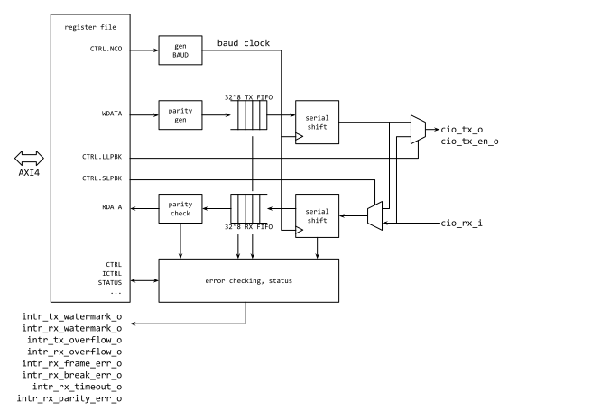

# Overview

This document specifies the USB UART hardware IP functionality. This module
conforms to the
[Comportable guideline for peripheral functionality.]()
See that document for integration overview within the broader
top level system.


## Features

- External full speed USB device interface with UART interface to CPU
- Software developed for the Comportable UART should work without changes
- Enumerates as Google Simple Serial interface (has host USB stack support)
- 8-bit data word
- Serial line settings (baud rate, parity, stop bits) are ignored,
  the interface directly forms or consumes USB pakets
- 32 x 8b RX buffer
- 32 x 8b TX buffer
- Interrupt for overflow, break error, receive timeout. Frame and
  parity errors will not happen but may be configured.

## Description

The USBUART module is a USB Full Speed device interface that presents
the standard Comportable UART interface to the system. The serial line
settings (baud rate, parity, stop bits) are ignored and the 8-bit
characters flow directly over the Google USB Simple Serial Class
interface.

## Compatibility

The UART is compatible with the interface provided by the Comportable UART.

# Theory of Operations

The register inteface to the USBUART matches the standard UART. There
are two additional registers  and  that provide
information about the USB interface that may be useful for software
that knows this is more than the simple uart. In particular when the
interface is used to bridge from USB to a real uart interface (for
example for [Case closed
debugging](https://chromium.googlesource.com/chromiumos/platform/ec/+/master/board/servo_micro/ccd.md))
the requested Baud rate and parity may be read.


## Block Diagram



## Hardware Interfaces



## Design Details

### USB interface

The USB device interface supports only Full Speed (12Mb) operation and
complies with the USB2.0 standard using the Google Simple Stream
class. The USB physical interface is implemented using two general
3.3V I/O pins for the USB D+/D- wires. These should be connected
through 22-48 Ohm series resistors to the USB connector (exact value
and SI depends on the implementation and the resistor could be
incorporated in the output driver if the implementation allows).

The USB FS interface needs a 1.5kOhm pullup to 3.3V on the D+ wire to
indicate the presenece of the peripheral. This resistor is connected
between the D+ line and the 3.3V usb_pullup output pin, so the device
is disconnected until the pin is driven high. This is done when either
the UART transmit or receive interface is enabled.

The Host of the USB connection may remove VBUS to signal a
disconnection (either because an actual disconnection of the cable
happened, or because the host is attempting to hard reset the
device). This is detected on the usb_sense input which should signal
the presence of VBUS. Depending on the implementation the chip pin may
connect directly to VBUS (5V logic) or be connected using a resisor
divider.

The implementation provides the USB end-point zero descriptors
required (with no strings provided), OUT endpoint 1 that carries data
from the host as though received by the UART and IN endpoint 1 that is
used to transmit data from the UART transmit fifo to the
host. Endpoint 1 will respond to SETUP packets to allow the host to
read or write the baud rate and parity passed in the 
register. (Note the current software implementation only implements
the host writing these, so for portability it is best to avoid reads
at this time.)

### Transmission

Just as in the standard UART, a write to  enqueues a data byte
into the 32 depth write FIFO. Characters will be moved from the fifo
to be available to send when an IN request is received from the host
on endpoint 1. The interface attempts to gather characters. An IN
transaction will be initiated either when a full USB packet (32 bytes)
is ready or if there are characters pending and no additional
characters have been queued by software for 3-4us.


### Reception

Characters received from the OUT endpoint are inserted in to the
32-byte receive FIFO. Backpressure is applied to the host if the
receive FIFO does not have room for a full USB packet.
The received data can be read from the  register.

### Interrupts

UART module has a few interrupts including general data flow interrupts and
unexpected event interrupts.

If TX or RX FIFO hits designated depth of entries, `txint` or `rxint`
signal is raised to inform FW.  FW can configure the watermark value
 or  .

In any case, if any FIFO receives write request when FIFO is full,
`tx_overflow` or `rx_overflow` interrupts is asserted.

`intr_rx_frame_err` signal is not used.

A break condition is signalled if either the VBUS is removed or the
host has not sent a Start-of-Frame for 2.048ms (an SOF should happen
every 1ms).

# Programmers Guide

## Initialization

The UART does not need initialization (default is for usb_pullup to be
applied).  However, since the settings will be ignored it is possible
to run the initialization sequence for the standard UART.


## Common Examples

Do the following to transmit a string of characters.

```cpp
int uart_tx_rdy() {
  return ((*UART_FIFO_STATUS_REG & UART_FIFO_STATUS_TXLVL_MASK) == 32) ? 0 : 1;
}

void uart_send_char(char val) {
  while(!uart_tx_rdy()) {}
  *UART_WDATA_REG = val;
}

void uart_send_str(char *str) {
  while(*str != \0) {
    uart_send_char(*str++);
}
```

Do the following to receive a character, with -1 returned if RX is empty.

```cpp
int uart_rx_empty() {
  return ((*UART_FIFO_STATUS_REG & UART_FIFO_STATUS_RXLVL_MASK) == (0 << 6)) ? 1 : 0;
}

char uart_rcv_char() {
  if(uart_rx_empty())
    return 0xff;
  return *UART_RDATA_REG;
}
```

## Interrupt Handling

```cpp
void uart_interrupt_routine() {
  volatile uint32 is = *UART_INTR_REG;
  uint32 is_mask = 0;
  char uart_ch;
  uint32 ien_reg;

  // Turn off Interrupt Enable
  ien_reg = *UART_IEN_REG;
  *UART_IEN_REG = ien_reg & 0xFFFFFF00; // Clr bit 7:0

  if (is & UART_INTR_RXPE_MASK) {
    // Do something ...

    // Store Int mask
    is_mask |= UART_INTR_RXPE_MASK;
  }

  if (is & UART_INTR_RXB_MASK) {
    // Do something ...

    // Store Int mask
    is_mask |= UART_INTR_RXB_MASK;
  }

  // .. Frame Error

  // TX/RX Overflow Error

  // RX Int
  if (is & UART_INTR_RX_MASK) {
    while(1) {
      uart_ch = uart_rcv_char();
      if (uart_ch == 0xff) break;
      uart_buf.append(uart_ch);
    }
    // Store Int mask
    is_mask |= UART_INTR_RX_MASK;
  }

  // Clear ISTATE
  *UART_INTR_REG = is_mask;

  // Restore ICTRL
  *UART_IEN_REG = ictrl_reg ;
}
```

## Register Table


