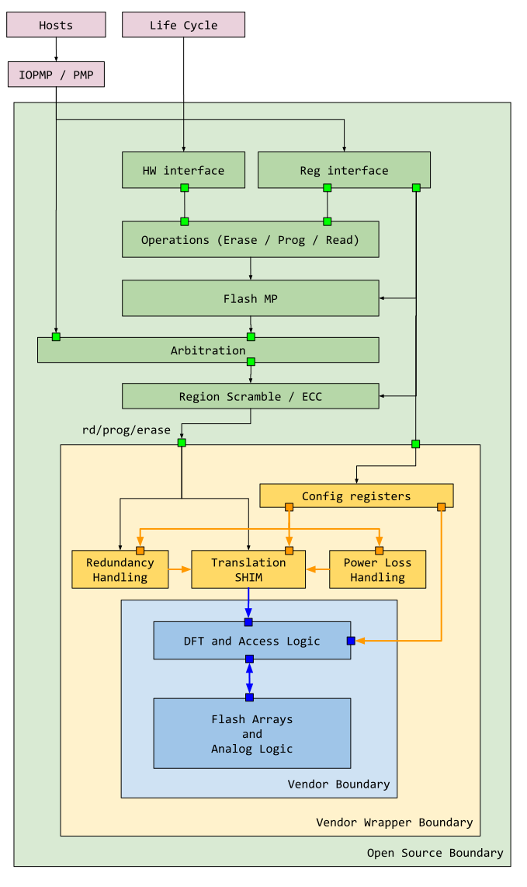
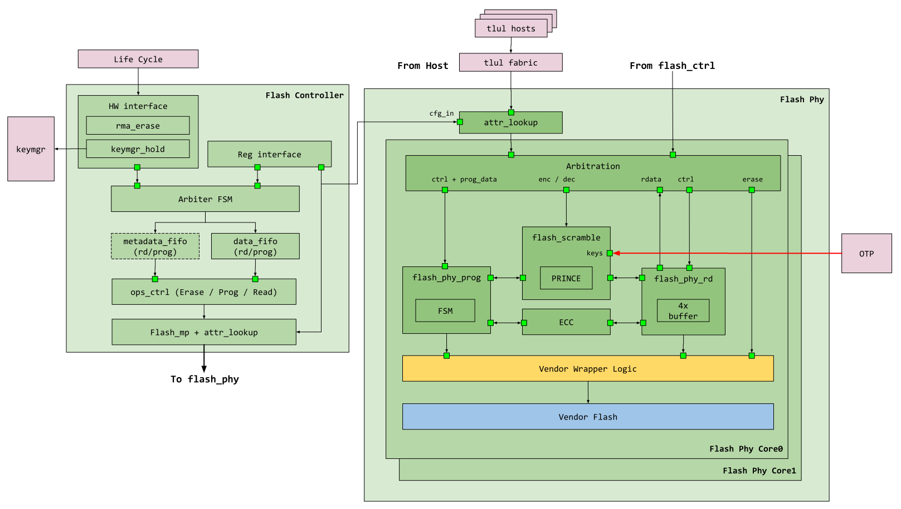
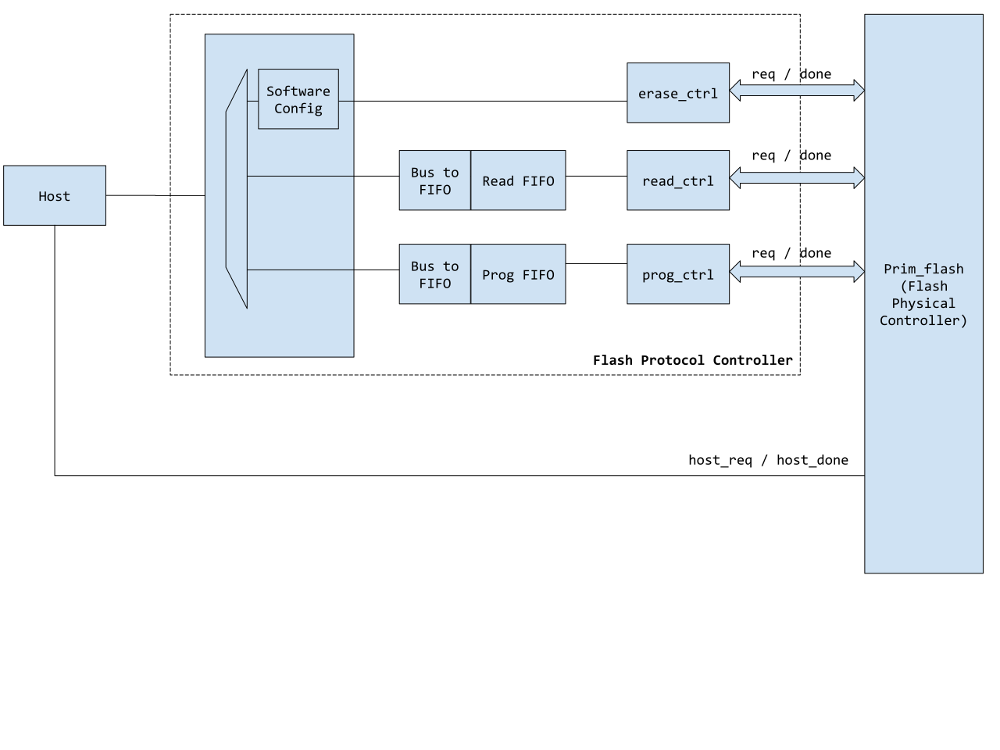

# Overview

This document describes the flash controller functionality.
The flash controller is broken down into 3 major components
* Open source flash controller
* Closed source vendor flash wrapper
* Closed source vendor flash module

A breakdown of the 3 can be seen below

This open source flash controller is divided into two partitions.

* Flash protocol controller
* Flash physical controller

The remaining document focuses primarily on the function of these blocks.

This module conforms to the [Comportable guideline for peripheral functionality.]()
See that document for integration overview within the broader top level system.

## Features

### Flash Protocol Controller Features
The flash protocol controller interfaces with software and other hardware components in the system (such as life cycle, key manager and OTP).
Regardless of the flash size underneath, the flash controller maintains the same data resolution as the bus and processor (default 4B).
The flash physical controller (see section below) is then responsible for bridging that size gap between the default data resolution and the actual flash memory.

The protocol controller currently supports the following features:

*  Controller initiated read, program and erase of flash.
   *  Erase can be either of a page, or an entire bank.
*  Support for differentiation between informational and data flash partitions.
*  Support for accessing multiple types of information partition.
   *  Some flash storage support multiple types of information storage for each information partition.
*  Parameterized support for burst program / read, up to 64B.
   *  Longer programs / reads are supported, however the protocol controller will directly back-pressure the bus if software supplies more data than can be consumed, or if software reads more than there is data available.
   *  Software can also choose to operate by polling the current state of the FIFO or through FIFO interrupts (empty / full / level).
*  Flash memory protection at page boundaries.
*  Life cycle RMA entry.
*  Key manager secret seeds that are inaccessible to software.
*  Features to be added if required
   *  Program verification
      *  may not be required if flash memory supports alternative mechanisms of verification.
   *  Erase verification
      *  may not be required if flash memory supports alternative mechanisms of verification.
   *  Flash redundant pages
      *  Flash may contain additional pages used to remap broken pages for yield recovery.
      *  The storage, loading and security of redundant pages may also be implemented in the physical controller or flash memory.

Features under consideration
*  Ability to access flash metadata bits (see flash ECC)
   * This feature is pending software discussions and actual usecase need.

### Flash Physical Controller Features

The flash physical controller wraps the actual flash memory and translates both host and controller initiated requests into low level flash transactions.

The physical controller supports the following features
*  Multiple banks of flash memory
*  For each flash bank, parameterized support for number of flash pages (default to 256)
*  For each flash page, parameterized support for number of words and word size (default to 128 words of 8-bytes each)
*  Data and informational partitions within each bank of flash memory
*  Arbitration between host requests and controller requests at the bank level
   *  Host requests are always favored, however the controller priority can escalate if it repeatedly loses arbitration
   *  Since banks are arbitrated independently and transactions may take different amounts of times to complete, the physical controller is also responsible for ensuring in-order response to both the controller and host.
*  Flash read stage
   *  Each bank maintains a parameterizable number of read buffers in front of the flash memory (default to 4).
   *  The read buffers behave as miniature read-only-caches to store flash data when flash words are greater than bus words.
   *  When a program or erase collides with an entry already stored in the read buffer, the buffer contents are invalidated.
      * This situation may arise if a read is followed by a program or erase.
*  Flash program stage
   *  Flash data word packing when flash word size is an integer multiple of bus word size.
*  Flash scrambling
   * Flash supports XEX scrambling using the prince cipher

Features to be implemented

*  Flash scrambling
   * Scrambling is optional based on page boundaries and is configurable by software
*  Flash ECC
   * Flash supports SECDED on the flash word boundary, the ECC bits are stored in the metadata bits and are not normally visible to software.
   * A feature is under consideration to expose the metadata bits to the flash protocol controller.
   * ECC is optional based on page boudaries and is configurable by software

### Flash Memory Overview

Unlike sram, flash memory is not typically organized as a contiguous block of generic storage.
Instead it is organized into data partitions and information partitions.

The data partition holds generic data like a generic memory would.
The information partition holds metadata about the data partition as well as design specific secret data.
This includes but is not limited to:
*  Redundancy information.
*  Manufacturer specific information.
*  Manufacturer flash timing information.
*  Design specific unique seeds.
*  The redundancy pages themselves, which are not accessible directly as data partitions.

Note, there **can** be more than one information partition, and none of them are required to be the same size as the data partition.
See the diagram below for an illustrative example.

Which type of partition is accessed is controlled through the  field.
The current flash controller implements one type of information partition and thus is controlled by 1 bit only.
This may change in the future.

Lastly, while the different partitions may be identical in some attributes, they are different in others.
*  All types of partitions must have the same page size and word size; however they are not required to have the same number of pages, thus some partitions may be larger and others smaller.
*  All types of partitions obey the same program and erase rules :
   * A bit cannot be programmed back to 1 once it has been programmed to 0.
   * Only erase can restore a bit to 1 under normal circumstances.
*  Data partitions can be directly read by software and other hardware hosts, while information partitions can only be read by the flash controller

By default, this design assumes 1 type of information partition and 4 pages per type of information partition.

#### Secret Information Partitions

Two information partition pages in the design hold secret seeds for the key manager.
These pages, when enabled by life cycle and otp, are read upon flash controller initialization (no software configuration is required).
The read values are then fed to the key manager for later processing.
There is a page for creator and a page for the owner.

The seed pages are read under the following initialization conditions:
*  life cycle sets provision enable

# Theory of Operation

## Block Diagram

### Flash Protocol Controller

The Flash Protocol Controller sits between the host software interface, other hardware components and the flash physical controller.
Its primary functions are two fold
*  Translate software program, erase and read requests into a high level protocol for the actual flash physical controller
*  Act as communication interface between flash and other components in the system, such as life cycle and key manager.

The flash protocol controller is not responsible for the detailed timing and waveform control of the flash, nor is it responsible for data scrambling and reliability metadata such as parity and ECC.
Instead, it maintains FIFOs / interrupts for the software to process data, as well as high level abstraction of region protection controls and error handling.

The flash controller selects requests between the software and hardware interfaces.
By default, the hardware interfaces have precendence and are used to read out seed materials from flash.
The seed material is read twice to confirm the values are consistent.
They are then forwarded to the key manager for processing.
During this seed phase, software initiated activities are back-pressured until the seed reading is complete.
It is recommended that instead of blindly issuing transactions to the flash controller, the software polls  until it is 0.

Once the seed phase is complete, the flash controller switches to the software interface.
Software can then read / program / erase the flash as needed.

When an RMA entry request is received from the life cycle manager, the flash controller waits for any pending flash transaction to complete, then switches priority to the hardware interface.
The flash controller then initiates RMA entry process and notifies the life cycle controller when it is complete.
Unlike the seed phase, after the RMA phase, the flash controller does not grant control back to software as the system is expected to reboot after an RMA attempt.

#### Memory Protection

Flash memory protection is handled differently depending on what type of partition is accessed.

For data partitions, software can configure a number of memory protection regions such as .
For each region, software specifies both the beginning page and the number of pages that belong to that region.
Software then configures the access privileges for that region.
Subsequent accesses are then allowed or denied based on the defined rule set.
Similar to RISCV pmp, if two region overlaps, the lower region index has higher priority.

For information partitions, the protection is done per indvidual page.
Each page can be configured with access privileges.
As a result, software does not need to define a start and end page for information partitions.
See  as an example.

#### Memory Protection for Key Manager and Life Cycle

While memory protection is largely under software control, certain behavior is hardwired to support key manager secret partitions and life cycle functions.

Software can only control the accessibility of the creator secret seed page under the following condition(s):
*  life cycle sets provision enable.
*  otp indicates the seeds are not locked.

Software can only control the accessibility of the owner secret seed page under the following condition(s):
*  life cycle sets provision enable.

During life cycle RMA transition, the software configured memory protection for both data and information partitions is ignored.
Instead, the flash controller assumes a default accessibility setting that allows it to secure the chip and transition to RMA.

#### Program Resolution

Certain flash memories place restrictions on the program window.
This means the flash accepts program beats only if all beats belong to the same address window.
Typically, this boundary is nicely aligned (for example, 16 words, 32 words) and is related to how the flash memory amortizes the program operation over nearby words.

To support this function, the flash controller errors back anytime the start of the program beat is in a different window from the end of the program beat.
The valid program range is thus the valid program resolution for a particular memory.

This information is not configurable but instead decided at design time and is exposed as a readable status.

### Flash Physical Controller

The Flash Physical Controller is the wrapper module that contains the actual flash memory instantiation.
It is responsible for arbitrating high level protocol commands (such as read, program, erase) as well as any additional security (scrambling) and reliability (ECC) features.
The contained vendor wrapper module is then responsible for converting high level commands into low level signaling and timing specific to a particular flash vendor.
The vendor wrapper module is also responsible for any BIST, redundancy handling, remapping features or custom configurations required for the flash.

The scramble keys are provided by an external static block such as the OTP.

### Flash Scrambling

Flash scrambling is built using the [XEX tweakable block cipher](https://en.wikipedia.org/wiki/Disk_encryption_theory#Xor%E2%80%93encrypt%E2%80%93xor_(XEX)).

When a read transaction is sent to flash, the following steps are taken:
*  The tweak is calculated using the transaction address and a secret address key through a galois multiplier.
*  The data content is read out of flash.
*  If the data content is scrambled, the tweak is XOR'd with the scrambled text and then decrypted through the prince block cipher using a secret data key.
*  The output of the prince cipher is XOR'd again with the tweak and the final results are presented
*  If the data content is not scrambled, the prince and XOR steps are skipped and data provided directly back to the requestor.

When a program transaction is sent to flash, the same steps are taken if the address in question has scrambling enabled.
During a program, the text is scrambled through the prince block cipher.

Scramble enablement is done differently depending on the type of partitions.
*  For data partitions, the scramble enablement is done on contiugous page boundaries.
   *  Software has the ability to configure these regions and whether scramble is enabled.
*  For information partitions,the scramble enablement is done on a per page basis.
   *  Software can configure for each page whether scramble is enabled.

### Flash ECC

Similar to scrambling, flash ECC is enabled based on an address decode.
The ECC for flash is chosen such that a fully erased flash word has valid ECC.
Likewise a flash word that is completely 0 is also valid ECC.

ECC enablement is done differently depending on the type of partitions.
*  For data partitions, the ECC enablement is done on contiugous page boundaries.
   *  Software has the ability to configure these regions and whether ECC is enabled.
*  For information partitions,the ECC enablement is done on a per page basis.
   *  Software can configure for each page whether ECC is enabled.

#### Scrambling Consistency

The flash physical controller does not keep a history of when a particular memory location has scrambling enabled or disabled.
This means if a memory locaiton was programmed while scrambled, disabling scrambling and then reading it back will result in garbage.
Similarly, if a location was programmed while non-scrambled, enabling scrambling and then reading it back will also result in gargabe.

It it thus the programmer's responsibility to maintain a consistent definition of whether a location is scrambled.
It is also highly recommended in a normal use case to setup up scramble and non-scramble regions and not change it further.

### Flash Read Pipeline

Since the system host reads directly from the flash for instructions, it is critical to not add significant latency during read, especially if de-scrambling is required.
As such, the flash read is actually a two stage pipeline, where each stage can take multiple cycles.

Additionally, since the flash word size is typically larger than the bus word, recently read flash entries are locally cached.
The cache behaves as a highly simplified read-only-cache and holds by default 4 flash words per flash bank.

When a read transaction is sent to flash, the following steps are taken:
*  A check is performed against the local cache
   * If there is a hit (either the entry is already in cache, or the entry is currently being processed), the transacton is immediately forwarded to the response queue.
   * If there is not a hit, an entry in the local cache is selected for allocation (round robin arbitration) and a flash read is issued.
*  When the flash read completes, its descrambling attributes are checked:
   * If descrambling is required, the read data begins the descrambling phase - at this time, a new flash read can be issued for the following transaction.
   * if descrambling is not required, the descrambling phase is skipped and the transaction is pushed to the response queue.
*  When the descrambling is complete, the descrambled text is pushed to the response queue.

The following diagram shows how the flash read pipeline timing works.

In this example, the first two host requests trigger a full sequence.
The third host requests immediately hits in the local cache and responds in order after the first two.

### Accessing Information Partition

The information partition uses the same address scheme as the data partition - which is directly accessible by software.
This means the address of page{N}.word{M} is the same no matter which type of partition is accessed.

Which partition a specific transaction accesses is denoted through a separate field  in the  register.
If  is set, then the information partition is accessed.
If  is not set, then the corresponding word in the data partition is accessed.

Flash scrambling, if enabled, also applies to information partitions.
However, one TBD feature is related to flash support of life cycle and manufacturing.
It may be required for manufacturers to directly inject data into specific pages flash information partitions via die contacts.
For these pages, scramble shall be permanently disabled as the manufacturer should not be aware of scrambling functions.

## Hardware Interfaces



### Signals

In addition to the interrupts and bus signals, the tables below lists the flash protocol controller I/Os.

Signal                  | Direction | Description
------------------------|-----------|---------------
`flash_i`               | `input`   | Inputs from physical controller, connects to `flash_ctrl_o` of physical controller.
`flash_o`               | `output`  | Outputs to physical controller, connects to `flash_ctrl_i` of physical controller.
`otp_i`                 | `input`   | Inputs from OTP, indicates the locked state of the creator seed page.
`lc_i`                  | `input`   | Inputs from life cycle, indicates RMA intent and provisioning enable.
`pwrmgr_i`              | `input`   | Inputs from power manager, flash controller initialization request.

Each of `flash_i` and `flash_o` is a struct that packs together additional signals, as shown below

| Signal          | Source               | Destination         | Description
| --------------  | ---------------------| ------------------- | -------------------------------------------------------
| `req`           | protocol controller  | physical controller | Protocol controller initiated transaction
| `addr`          | protocol controller  | physical controller | Protocol controller initiated transaction address
| `part`          | protocol controller  | physical controller | Protocol controller initiated transaction partition type - data or informational
| `info_sel`      | protocol controller  | physical controller | Protocol controller initiated transaction information partition select - 0 ~ N
| `scramble_en`   | protocol controller  | physical controller | Protocol controller initiated transaction address is scramble enabled
| `ecc_en`        | protocol controller  | physical controller | Protocol controller initiated transaction address is ecc enabled
| `he_en`         | protocol controller  | physical controller | Protocol controller initiated transaction address is high endurance enabled
| `rd`            | protocol controller  | physical controller | Protocol controller initiated read
| `prog`          | protocol controller  | physical controller | Protocol controller initiated program
| `pg_erase`      | protocol controller  | physical controller | Protocol controller initiated page erase
| `prog_data`     | protocol controller  | physical controller | Protocol controller initiated program data, 1 flash word wide
| `prog_type`     | protocol controller  | physical controller | Protocol controller initiated program type, normal program or repair program
| `prog_last`     | protocol controller  | physical controller | Protocol controller last program beat
| `bk_erase`      | protocol controller  | physical controller | Protocol controller initiated bank erase
| `addr_key`      | protocol controller  | physical controller | Physical controller address scramble key
| `data_key`      | protocol controller  | physical controller | Physical controller data scramble key
| `rd_done`       | physical controller  | protocol controller | Physical controller read done
| `prog_done`     | physical controller  | protocol controller | Physical controller program done
| `erase_done`    | physical controller  | protocol controller | Physical controller erase done
| `init_busy`     | physical controller  | protocol controller | Physical controller reset release initialization in progress
| `rd_data`       | physical controller  | protocol controller | Physical Controller read data, 1 flash word wide

The physical controller IOs are listed and described below.

| Signal            | Direction | Description
| ----------------- | ----------| -------
| `host_req_i`      | input     | Host initiated direct read, should always be highest priority.  Host is only able to perform direct reads
| `host_addr_i`     | input     | Address of host initiated direct read
| `host_req_rdy_o`  | output    | Host request ready, '1' implies transaction has been accepted, but not necessarily finished
| `host_req_done_o` | output    | Host request completed
| `host_rdata_o`    | output    | Host read data, 1 flash word wide
| `flash_ctrl_i`    | input     | Inputs from protocol controller, connects to `flash_o` of protocol controller
| `flash_ctrl_o`    | output    | Outputs to protocol controller, connects to `flash_i` of protcol controller

## Design Detials

### Flash Protocol Controller Description

The flash protocol controller uses a simple FIFO interface to communicate between the software and flash physical controller.
There is a read fifo for read operations, and a program fifo for program operations.
Note, this means flash can be read both through the controller and the main bus interface.
This may prove useful if the controller wishes to allocate specific regions to HW FSMs only, but is not a necessary feature.

When software initiates a read transaction of a programmable number of flash words, the flash controller will fill up the read FIFO for software to consume.
Likewise, when software initiates a program transaction, software will fill up the program FIFO for the controller to consume.

The controller is designed such that the overall number of words in a transaction can significantly exceed the FIFO depth.
In the case of read, once the FIFO is full, the controller will cease writing more entries and wait for software to consume the contents (an interrupt will be triggered to the software to alert it to such an event).
In the case of program, the controller will stop writing to flash once all existing data is consumed - it will likewise trigger an interrupt to software to prepare more data.
See detailed steps in theory of operation.
The following is a diagram of the controller construction as well as its over connectivity with the flash module.

### Host Read

Unlike controller initiated reads, host reads have separate rdy / done signals to ensure transactions can be properly pipelined.
As host reads are usually tied to host execution upstream, additional latency can severely harm performance and is not desired.
The expected waveform from the perspective of the physical controller is shown below.


{signal: [
  {name: 'clk_i',           wave: 'p..............'},
  {name: 'rst_ni',          wave: '0.1............'},
  {name: 'host_req_i',      wave: '0..10.1...0....'},
  {name: 'host_addr_i',     wave: 'x..3x.3.33x....', data: ['Adr0', 'Adr1', 'Adr2', 'Adr3']},
  {name: 'host_req_rdy_o',  wave: '1...0..1.......'},
  {name: 'host_req_done_o', wave: '0...10..1110...'},
  {name: 'host_rdata_o',    wave: 'x...4x..444x...',data: ['Dat0', 'Dat1', 'Dat2', 'Dat3']},
]}


The `host_req_done_o` is always single cycle pulsed and upstream logic is expected to always accept and correctly handle the return.
The same cycle the return data is posted a new command / address can be accepted.
While the example shows flash reads completing in back to back cycles, this is typically not the case.

### Controller Read

Unlike host reads, controller reads are not as performance critical and do not have command / data pipeline requirements.
Instead, the protocol controller will hold the read request and address lines until the done is seen.
Once the done is seen, the controller then transitions to the next read operation.
The expected waveform from the perspective of the physical controller is shown below.


{signal: [
  {name: 'clk_i',                 wave: 'p..............'},
  {name: 'rst_ni',                wave: '0.1............'},
  {name: 'flash_ctrl_i.req',      wave: '0..1.....0.....'},
  {name: 'flash_ctrl_i.addr',     wave: 'x..3..3..x.3..x', data: ['Adr0', 'Adr1', 'Adr2']},
  {name: 'flash_ctrl_i.rd',       wave: '0..1.....0.1..0'},
  {name: 'flash_ctrl_o.rd_done',  wave: '0....10.10...10'},
  {name: 'flash_ctrl_o.rdata',    wave: 'x....4x.4x...4x', data: ['Dat0', 'Dat1', 'Dat2']},
]}


### Controller Program

Program behavior is similar to reads.
The protocol controller will hold the request, address and data lines until the programming is complete.
The expected waveform from the perspective of the physical controller is shown below.


{signal: [
  {name: 'clk_i',                  wave: 'p..............'},
  {name: 'rst_ni',                 wave: '0.1............'},
  {name: 'flash_ctrl_i.req',       wave: '0..1.....0.....'},
  {name: 'flash_ctrl_i.addr',      wave: 'x..3..3..x.3..x', data: ['Adr0', 'Adr1', 'Adr2']},
  {name: 'flash_ctrl_i.prog',      wave: '0..1.....0.1..0'},
  {name: 'flash_ctrl_o.prog_data', wave: 'x..4..4..x.4..x', data: ['Dat0', 'Dat1', 'Dat2']},
  {name: 'flash_ctrl_o.prog_done', wave: '0....10.10...10'},
]}


# Programmers Guide

## Issuing a Controller Read

To issue a flash read, the programmer must
*  Specify the address of the first flash word to read
*  Specify the number of total flash words to read, beginning at the supplied address
*  Specify the operation to be 'READ' type
*  Set the 'START' bit for the operation to begin

The above fields can be set in the  and  registers.
See [library code](https://github.com/lowRISC/opentitan/blob/master/sw/device/lib/flash_ctrl.c) for implementation.

It is acceptable for total number of flash words to be significantly greater than the depth of the read FIFO.
In this situation, the read FIFO will fill up (or hit programmable fill value), pause the flash read and trigger an interrupt to software.
Once there is space inside the FIFO, the controller will resume reading until the appropriate number of words have been read.
Once the total count has been reached, the flash controller will post OP_DONE in the  register.

## Issuing a Controller Program

To program flash, the same procedure as read is followed.
However, instead of setting the  register for read operation, a program operation is selected instead.
Software will then fill the program FIFO and wait for the controller to consume this data.
Similar to the read case, the controller will automatically stall when there is insufficient data in the FIFO.
When all desired words have been programmed, the controller will post OP_DONE in the  register.

## Register Table

The flash protocol controller maintains two separate access windows for the FIFO.
It is implemented this way because the access window supports transaction back-pressure should the FIFO become full (in case of write) or empty (in case of read).


