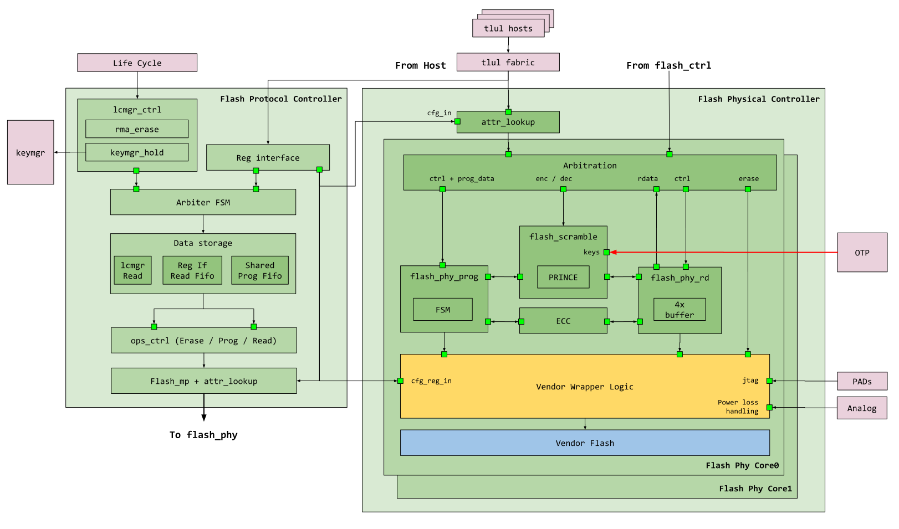
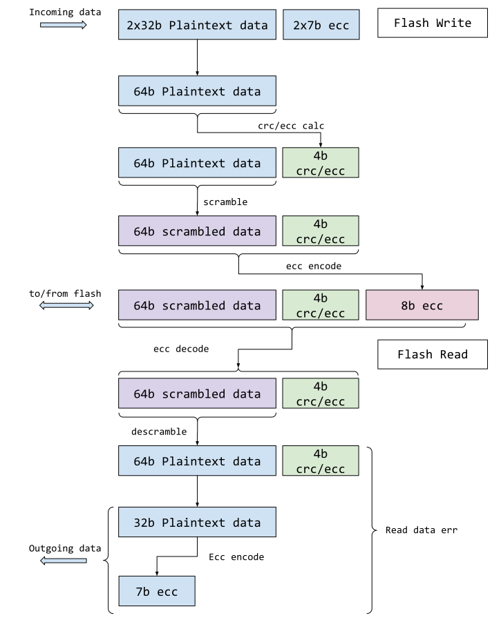
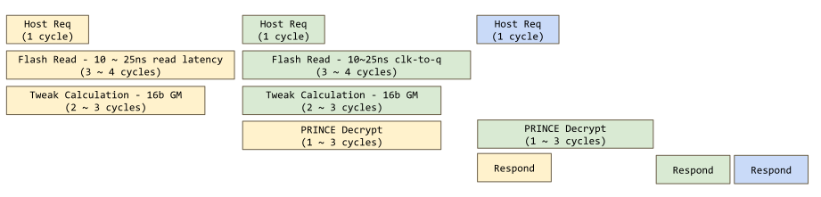
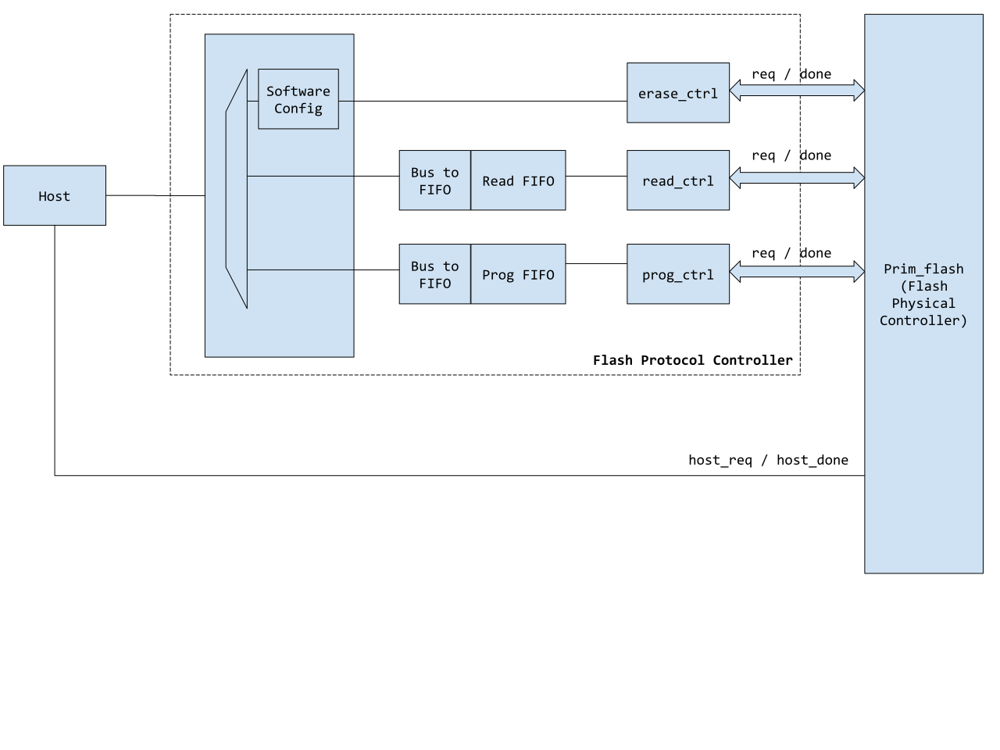

# Theory of Operation

## Block Diagram



### Flash Protocol Controller

The Flash Protocol Controller sits between the host software interface, other hardware components and the flash physical controller.
Its primary functions are two fold
*  Translate software program, erase and read requests into a high level protocol for the actual flash physical controller
*  Act as communication interface between flash and other components in the system, such as life cycle and key manager.

The flash protocol controller is not responsible for the detailed timing and waveform control of the flash, nor is it responsible for data scrambling and reliability metadata such as ICV and ECC.
Instead, it maintains FIFOs / interrupts for the software to process data, as well as high level abstraction of region protection controls and error handling.

The flash controller selects requests between the software and hardware interfaces.
By default, the hardware interfaces have precedence and are used to read out seed materials from flash.
The seed material is read twice to confirm the values are consistent.
They are then forwarded to the key manager for processing.
During this seed phase, software initiated activities are back-pressured until the seed reading is complete.
It is recommended that instead of blindly issuing transactions to the flash controller, the software polls [`STATUS.INIT_WIP`](registers.md#status) until it is 0.

Once the seed phase is complete, the flash controller switches to the software interface.
Software can then read / program / erase the flash as needed.

#### RMA Entry Handling

When an RMA entry request is received from the life cycle manager, the flash controller waits for any pending flash transaction to complete, then switches priority to the hardware interface.
The flash controller then initiates RMA entry process and notifies the life cycle controller when it is complete.
The RMA entry process wipes out all data, creator, owner and isolated partitions.

After RMA completes, the flash controller is [disabled](#flash-access-disable).
When disabled the flash protocol controller registers can still be accessed.
However, flash memory access are not allowed, either directly by the host or indirectly through flash protocol controller initiated transactions.
It is expected that after an RMA transition, the entire system will be rebooted.


#### Initialization

The flash protocol controller is initialized through [`INIT`](registers.md#init).
When initialization is invoked, the flash controller requests the address and data scrambling keys from an external entity, [otp_ctrl](../../otp_ctrl/README.md#interface-to-flash-scrambler) in this case.

After the scrambling keys are requested, the flash protocol controller reads the root seeds out of the [secret partitions](#secret-information-partitions) and sends them to the key manager.
Once the above steps are completed, the read buffers in the flash physical controller are enabled for operation.

#### RMA Entry
During RMA entry, the flash controller "wipes" the contents of the following:
- Creator partition
- Owner partition
- Isolated partition
- All data partitions

This process ensures that after RMA there is no sensitive information left that can be made use on the tester.
As stated previously, once RMA entry completes, the flash memory can no longer be accessed, either directly or indirectly.
The flash controller registers however, remain accessible for status reads and so forth, although new operations cannot be issued.

#### Memory Protection

Flash memory protection is handled differently depending on what type of partition is accessed.

For data partitions, software can configure a number of memory protection regions such as [`MP_REGION_CFG_0`](registers.md#mp_region_cfg).
For each region, software specifies both the beginning page and the number of pages that belong to that region.
Software then configures the access privileges for that region.
Finally, each region can be activated or de-activated from matching through [`MP_REGION_CFG_0.EN`](registers.md#mp_region_cfg).

Subsequent accesses are then allowed or denied based on the defined rule set.
Similar to RISCV pmp, if two region overlaps, the lower region index has higher priority.

For information partitions, the protection is done per individual page.
Each page can be configured with access privileges.
As a result, software does not need to define a start and end page for information partitions.
See [`BANK0_INFO0_PAGE_CFG_0`](registers.md#bank0_info0_page_cfg) as an example.

#### Bank Erase Protection

Unlike read, program and page erase operations, the bank erase command is the only one that can be issued at a bank level.
Because of this, bank erase commands are not guarded by the typical [memory protection mechanisms](#memory-protection).

Instead, whether bank erase is allowed is controlled by [`MP_BANK_CFG_SHADOWED`](registers.md#mp_bank_cfg_shadowed), where there is a separate configuration bit per bank.
When the corresponding bit is set, that particular bank is permitted to have bank level operations.

The specific behavior of what is erased when bank erase is issued is flash memory dependent and thus can vary by vendor and technology.
[This section](#flash-bank-erase-behavior) describes the general behavior and how open source modeling is done.

#### Memory Protection for Key Manager and Life Cycle

While memory protection is largely under software control, certain behavior is hardwired to support key manager secret partitions and life cycle functions.

Software can only control the accessibility of the creator secret seed page under the following condition(s):
*  life cycle sets provision enable.
*  OTP indicates the seeds are not locked.

Software can only control the accessibility of the owner secret seed page under the following condition(s):
*  life cycle sets provision enable.

During life cycle RMA transition, the software configured memory protection for both data and information partitions is ignored.
Instead, the flash controller assumes a default accessibility setting that allows it to secure the chip and transition to RMA.

#### Program Resolution

Certain flash memories place restrictions on the program window.
This means the flash accepts program beats only if all beats belong to the same address window.
Typically, this boundary is nicely aligned (for example, 16 words, 32 words) and is related to how the flash memory amortizes the program operation over nearby words.

To support this function, the flash controller errors back anytime the start of the program beat is in a different window from the end of the program beat.
The valid program range is thus the valid program resolution for a particular memory.

This information is not configurable but instead decided at design time and is exposed as a readable status.

#### Erase Suspend

The flash controller supports erase suspend through [`ERASE_SUSPEND`](registers.md#erase_suspend).
This allows the software to interrupt an ongoing erase operation.

The behavior of what happens to flash contents when erase is suspended is vendor defined; however, generally it can be assumed that the erase would be incomplete.
It is then up to the controlling software to take appropriate steps to erase again at a later time.

#### Additional Flash Attributes

There are certain attributes provisioned in [`MP_REGION_CFG_0`](registers.md#mp_region_cfg) that are not directly used by the open source protocol or physical controllers.

Instead, these attributes are fed to the vendor flash module on a per-page or defined boundary basis.
Currently there is only one such attribute [`MP_REGION_CFG_0.HE`](registers.md#mp_region_cfg).

#### Idle Indication to External Power Manager

The flash controller provides an idle indication to an external power manager.
This idle indication does not mean the controller is doing "nothing", but rather the controller is not doing anything "stateful", e.g. program or erase.

This is because an external power manager event (such as shutting off power) while a flash stateful transaction is ongoing may be damaging to the vendor flash module.

#### Flash Code Execution Handling

Flash can be used to store both data and code.
To support separate access privileges between data and code, the flash protocol controller provides [`EXEC`](registers.md#exec) for software control.

If software programs [`EXEC`](registers.md#exec) to `0xa26a38f7`, code fetch from flash is allowed.
If software programs [`EXEC`](registers.md#exec) to any other value, code fetch from flash results in an error.

The flash protocol controller distinguishes code / data transactions through the [instruction type attribute](../../lc_ctrl/README.md#usage-of-user-bits) of the TL-UL interface.

#### Flash Errors and Faults

The flash protocol controller maintains 3 different categories of observed errors and faults.
In general, errors are considered recoverable and primarily geared towards problems that could have been caused by software or that occurred during a software initiated operation.
Errors can be found in [`ERR_CODE`](registers.md#err_code).

Faults, on the other hand, represent error events that are unlikely to have been caused by software and represent a major malfunction of the system.

Faults are further divided into two categories:
- Standard faults
- Custom faults

Standard faults represent errors that occur in the standard structures of the design, for example sparsely encoded FSMs, duplicated counters and the bus transmission integrity scheme.

Custom faults represent custom errors, primarily errors generated by the life cycle management interface, the flash storage integrity interface and the flash macro itself.

See (#flash-escalation) for further differentiation between standard and custom faults.

#### Transmission Integrity Faults

Since the flash controller has multiple interfaces for access, transmission integrity failures can manifest in different ways.

There are 4 interfaces:
- host direct access to flash controller [register files](#host-direct-access-to-flash-controller-register-files).
- host direct access to [flash macro](#host-direct-access-to-flash-macro)
- host / software initiated flash controller access to [flash macro (read / program / erase)](#host--software-initiated-access-to-flash-macro)
- life cycle management interface / hardware initiated flash controller access to [flash macro (read / program / erase)](#life-cycle-management-interface-hardware-initiated-access-to-flash-macro)

The impact of transmission integrity of each interface is described below.

##### Host Direct Access to Flash Controller Register Files
This category of transmission integrity behaves identically to other modules.
A bus transaction, when received, is checked for command and data payload integrity.
If an integrity error is seen, the issuing bus host receives an in-band error response and a fault is registered in [`STD_FAULT_STATUS.REG_INTG_ERR`](registers.md#std_fault_status).

##### Host Direct Access to Flash Macro
Flash can only be read by the host.
The transmission integrity scheme used is end-to-end, so integrity generated inside the flash is fed directly to the host.
It is the host's responsibility to check for integrity correctness and react accordingly.

##### Host / Software Initiated Access to Flash Macro
Since controller operations are initiated through writes to the register file, the command check is identical to host direct access to [regfiles](#host-direct-access-to-flash-controller-register-files).
Controller reads behave similarly to [host direct access to macro](#host-direct-access-to-flash-macro), the read data and its associated integrity are returned through the controller read FIFO for the initiating host to handle.

For program operations, the write data and its associated integrity are stored and propagated through the flash protocol and physical controllers.
Prior to packing the data for final flash program, the data is then checked for integrity correctness.
If the data integrity is incorrect, an in-band error response is returned to the initiating host and an error is registered in [`ERR_CODE.PROG_INTG_ERR`](registers.md#err_code).
An error is also registered in [`STD_FAULT_STATUS.PROG_INTG_ERR`](registers.md#std_fault_status) to indicate that a fatal fault has occurred.

The reasons a program error is registered in two locations are two-fold:
- It is registered in [`ERR_CODE`](registers.md#err_code) so software can discover during operation status that a program has failed.
- It is registered in [`STD_FAULT_STATUS`](registers.md#std_fault_status) because transmission integrity failures represent a fatal failure in the standard structure of the design, something that should never happen.

##### Life Cycle Management Interface / Hardware Initiated Access to Flash Macro
The life cycle management interface issues transactions directly to the flash controller and does not perform a command payload integrity check.

For read operations, the read data and its associated integrity are directly checked by the life cycle management interface.
If an integrity error is seen, it is registered in [`FAULT_STATUS.LCMGR_INTG_ERR`](registers.md#fault_status).

For program operations, the program data and its associated integrity are propagated into the flash controller.
If an integrity error is seen, an error is registered in [`FAULT_STATUS.PROG_INTG_ERR`](registers.md#fault_status).

#### ECC and ICV Related Read Errors

In addition to transmission integrity errors described above, the flash can also emit read errors based on [ECC and ICV checks](#flash-ecc-and-icv).

Flash reliability ECC errors (multi-bit errors) and integrity check errors (integrity check errors) are both reflected as in-band errors to the entity that issued the transaction.
That means if a host direct read, controller initiated read or hardware initiated read encounters one of these errors, the error is directly reflected in the operation status.

Further, reliability ECC / integrity check errors are also captured in [`FAULT_STATUS`](registers.md#fault_status) and can be used to generate fatal alerts.
The reason these are not captured in [`STD_FAULT_STATUS`](registers.md#std_fault_status) is because 1 or 2 bit errors can occur in real usage due to environmental conditions, thus they do not belong to the standard group of structural errors.
If we assume 2-bit errors can occur, then software must have a mechanism to recover from the error instead of [escalation](#flash-escalation).

#### Flash Escalation

Flash has two sources of escalation - global and local.

Global escalation is triggered by the life cycle controller through `lc_escalate_en`.
Local escalation is triggered by a standard faults of flash, seen in [`STD_FAULT_STATUS`](registers.md#std_fault_status).
Local escalation is not configurable and automatically triggers when this subset of faults are seen.

For the escalation behavior, see [flash access disable](#flash-access-disable) .

#### Flash Access Disable

Flash access can be disabled through global escalation trigger, local escalation trigger, rma process completion or software command.
The escalation triggers are described [here](#flash-escalation).
The software command to disable flash can be found in [`DIS`](registers.md#dis).
The description for rma entry can be found [here](#rma-entry-handling).

When disabled, the flash has a two layered response:
- The flash protocol controller [memory protection](#memory-protection) errors back all controller initiated operations.
- The host-facing tlul adapter errors back all host initiated operations.
- The flash physical controller completes any existing stateful operations (program or erase) and drops all future flash transactions.
- The flash protocol controller arbiter completes any existing software issued commands and enters a disabled state where no new transactions can be issued.


### Flash Physical Controller

The Flash Physical Controller is the wrapper module that contains the actual flash memory instantiation.
It is responsible for arbitrating high level protocol commands (such as read, program, erase) as well as any additional security (scrambling) and reliability (ECC) features.
The contained vendor wrapper module is then responsible for converting high level commands into low level signaling and timing specific to a particular flash vendor.
The vendor wrapper module is also responsible for any BIST, redundancy handling, remapping features or custom configurations required for the flash.

The scramble keys are provided by an external static block such as the OTP.

#### Host and Protocol Controller Handling

Both the protocol controller and the system host converge on the physical controller.
The protocol controller has read access to all partitions as well as program and erase privileges.
The host on the other hand, can only read the data partitions.

Even though the host has less access to flash, it is prioritized when competing against the protocol controller for access.
When a host request and a protocol controller request arrive at the same time, the host is favored and granted.
Every time the protocol controller loses such an arbitration, it increases an arbitration lost count.
Once this lost count reaches 5, the protocol controller is favored.
This ensures a stream of host activity cannot deny protocol controller access (for example a tight polling loop).

#### Flash Bank Erase Behavior

This section describes the open source modeling of flash memory.
The actual flash memory behavior may differ, and should consult the specific vendor or technology specification.

When a bank erase command is issued and allowed, see [bank erase protection](#bank-erase-protection), the erase behavior is dependent on [`CONTROL.PARTITION_SEL`](registers.md#control).
- If data partition is selected, all data in the data partition is erased.
- If info partition is selected, all data in the data partition is erased AND all data in the info partitions (including all info types) is also erased.

#### Flash Scrambling

Flash scrambling is built using the [XEX tweakable block cipher](https://en.wikipedia.org/wiki/Disk_encryption_theory#Xor%E2%80%93encrypt%E2%80%93xor_(XEX)).

When a read transaction is sent to flash, the following steps are taken:
*  The tweak is calculated using the transaction address and a secret address key through a Galois multiplier.
*  The data content is read out of flash.
*  If the data content is scrambled, the tweak is XOR'd with the scrambled text and then decrypted through the PRINCE block cipher using a secret data key.
*  The output of the PRINCE cipher is XOR'd again with the tweak and the final results are presented.
*  If the data content is not scrambled, the PRINCE cipher and XOR steps are skipped and data provided directly back to the requestor.

When a program transaction is sent to flash, the same steps are taken if the address in question has scrambling enabled.
During a program, the text is scrambled through the PRINCE block cipher.

Scramble enablement is done differently depending on the type of partitions.
*  For data partitions, the scramble enablement is done on contiguous page boundaries.
   *  Software has the ability to configure these regions and whether scramble is enabled.
*  For information partitions, the scramble enablement is done on a per page basis.
   *  Software can configure for each page whether scramble is enabled.

#### Flash ECC and ICV

Flash supports both ECC (error correction) and ICV (integrity check value).
While the two are used for different functions, they are implemented as two separate ECCs, thus flash supports two types of ECC.

ICV is an integrity check, implemented as an ECC, used to detect whether the de-scrambled data has been modified.
The other is a reliability ECC used for error detection and correction on the whole flash word.

The key differentiation here is that ICV is used only for detection, while the real error correction can correct single bit errors.
Both ICV and ECC are configurable based on the various page and memory property configurations.

##### Overall ICV and ECC Application

The following diagram shows how the various ICV / ECC tags are applied and used through the life of a transactions.
.

Note that the ICV (integrity ECC) is calculated over the descrambled data and is only 4-bits, while the reliability ECC is calculated over both the scrambled data and the ICV.

##### ICV

The purpose of the ICV (integrity check value, implemented as an ECC) is to emulate end-to-end integrity like the other memories.
This is why the data is calculated over the descrambled data as it can be stored alongside for continuous checks.
When descrambled data is returned to the host, the ICV is used to validate the data is correct.

The flash may not always have the capacity to store both the ICV and reliability ECC, the ICV is thus truncated since it is not used for error correction.

##### Reliability ECC

Similar to scrambling, the reliability ECC is enabled based on an address decode.
The ECC for flash is chosen such that a fully erased flash word has valid ECC.
Likewise a flash word that is completely 0 is also valid ECC.

Unlike the integrity ECC, the reliability ECC is actually used for error correction if an accidental bit-flip is seen, it is thus fully stored and not truncated.

ECC enablement is done differently depending on the type of partitions.
*  For data partitions, the ECC enablement is done on contiguous page boundaries.
   *  Software has the ability to configure these regions and whether ECC is enabled.
*  For information partitions,the ECC enablement is done on a per page basis.
   *  Software can configure for each page whether ECC is enabled.

##### Scrambling Consistency

The flash physical controller does not keep a history of when a particular memory location has scrambling enabled or disabled.
This means if a memory location was programmed while scrambled, disabling scrambling and then reading it back will result in garbage.
Similarly, if a location was programmed while non-scrambled, enabling scrambling and then reading it back will also result in garbage.

It it thus the programmer's responsibility to maintain a consistent definition of whether a location is scrambled.
It is also highly recommended in a normal use case to setup up scramble and non-scramble regions and not change it further.

#### Flash Read Pipeline

Since the system host reads directly from the flash for instructions, it is critical to not add significant latency during read, especially if de-scrambling is required.
As such, the flash read is actually a two stage pipeline, where each stage can take multiple cycles.

Additionally, since the flash word size is typically larger than the bus word, recently read flash entries are locally cached.
The cache behaves as a highly simplified read-only-cache and holds by default 4 flash words per flash bank.

When a read transaction is sent to flash, the following steps are taken:
*  A check is performed against the local cache
   * If there is a hit (either the entry is already in cache, or the entry is currently being processed), the transaction is immediately forwarded to the response queue.
   * If there is not a hit, an entry in the local cache is selected for allocation (round robin arbitration) and a flash read is issued.
*  When the flash read completes, its descrambling attributes are checked:
   * If descrambling is required, the read data begins the descrambling phase - at this time, a new flash read can be issued for the following transaction.
   * if descrambling is not required, the descrambling phase is skipped and the transaction is pushed to the response queue.
*  When the descrambling is complete, the descrambled text is pushed to the response queue.

The following diagram shows how the flash read pipeline timing works.



In this example, the first two host requests trigger a full sequence.
The third host requests immediately hits in the local cache and responds in order after the first two.

#### Flash Buffer

The flash buffer is a small read-only memory that holds multiple entries of recently read flash words.
This is needed when the flash word is wider than a bus word.
The flash access time is amortized across the entire flash word if software accesses in a mostly
linear sequence.

The flash buffer has a round robin replacement policy when more flash words are read.
When an erase / program is issued to the flash, the entries are evicted to ensure new words are fetched.

When a page erase / program is issued to a flash bank, only entries that fall into that address range are evicted.
When a bank erase is issued, then all entries are evicted.

The flash buffer is only enabled after [`INIT`](registers.md#init) is invoked.
When an RMA entry sequence is received, the flash buffers are disabled.

As an example, assume a flash word is made up of 2 bus words.
Assume also the following address to word mapping:
- Address 0 - flash word 0, bus word 0 / bus word 1
- Address 2 - flash word 1, bus word 2 / bus word 3

When software reads bus word 1, the entire flash word 0 is captured into the flash buffer.
When software comes back to read bus word 0, instead of accessing the flash again, the data is retrieved directly from the buffer.

The recently read entries store both the de-scrambled data and the [integrity ECC](#integrity-ecc).
The [reliability ECC](#reliability-ecc) is not stored because the small buffer is purely flip-flop based and does not have storage reliability concerns like the main flash macro.

When a read hits in the flash buffer, the integrity ECC is checked against the de-scrambled data and an error is returned to the initiating entity, whether it is a the controller itself or a host.


#### Accessing Information Partition

The information partition uses the same address scheme as the data partition - which is directly accessible by software.
This means the address of page{N}.word{M} is the same no matter which type of partition is accessed.

Which partition a specific transaction accesses is denoted through a separate field [`CONTROL.PARTITION_SEL`](registers.md#control) in the [`CONTROL`](registers.md#control) register.
If [`CONTROL.PARTITION_SEL`](registers.md#control) is set, then the information partition is accessed.
If [`CONTROL.PARTITION_SEL`](registers.md#control) is not set, then the corresponding word in the data partition is accessed.

Flash scrambling, if enabled, also applies to information partitions.
It may be required for manufacturers to directly inject data into specific pages flash information partitions via die contacts.
For these pages, scramble shall be permanently disabled as the manufacturer should not be aware of scrambling functions.

##### JTAG Connection

The flash physical controller provides a JTAG connection to the vendor flash module.
The vendor flash module can use this interface to build a testing setup or to provide backdoor access for debug.

Due to the ability of this connection to bypass access controls, this connection is modulated by life cycle and only enabled when non-volatile debug, or `lc_nvm_debug_en` is allowed in the system.

## Flash Default Configuration
Since the flash controller is highly dependent on the specific flavor of flash memory chosen underneath, its configuration can vary widely between different integrations.

This sections details the default settings used by the flash controller:
* Number of banks: 2
* Number of data partition pages per bank: 256
* [Program resolution](#program-resolution): 8 flash words
* Flash word data bits: 64
* Flash word metadata bits: 8
* ECC choice: Hamming code SECDED
* Information partition types: 3
* Number of information partition type 0 pages per bank: 10
* Number of information partition type 1 pages per bank: 1
* Number of information partition type 2 pages per bank: 2
* Secret partition 0 (used for creator): Bank 0, information partition 0, page 1
* Secret partition 1 (used for owner): Bank 0, information partition 0, page 2
* Isolated partition: Bank 0, information partition 0, page 3

## Design Details

### Flash Protocol Controller Description

The flash protocol controller uses a simple FIFO interface to communicate between the software and flash physical controller.
There is a read FIFO for read operations, and a program FIFO for program operations.
Note, this means flash can be read both through the controller and the main bus interface.
This may prove useful if the controller wishes to allocate specific regions to HW FSMs only, but is not a necessary feature.

When software initiates a read transaction of a programmable number of flash words, the flash controller will fill up the read FIFO for software to consume.
Likewise, when software initiates a program transaction, software will fill up the program FIFO for the controller to consume.

The controller is designed such that the overall number of words in a transaction can significantly exceed the FIFO depth.
In the case of read, once the FIFO is full, the controller will cease writing more entries and wait for software to consume the contents (an interrupt will be triggered to the software to alert it to such an event).
In the case of program, the controller will stop writing to flash once all existing data is consumed - it will likewise trigger an interrupt to software to prepare more data.
See detailed steps in theory of operation.
The following is a diagram of the controller construction as well as its over connectivity with the flash module.




### Host Read

Unlike controller initiated reads, host reads have separate rdy / done signals to ensure transactions can be properly pipelined.
As host reads are usually tied to host execution upstream, additional latency can severely harm performance and is not desired.
The expected waveform from the perspective of the physical controller is shown below.

```wavejson
{signal: [
  {name: 'clk_i',           wave: 'p..............'},
  {name: 'rst_ni',          wave: '0.1............'},
  {name: 'host_req_i',      wave: '0..10.1...0....'},
  {name: 'host_addr_i',     wave: 'x..3x.3.33x....', data: ['Adr0', 'Adr1', 'Adr2', 'Adr3']},
  {name: 'host_req_rdy_o',  wave: '1...0..1.......'},
  {name: 'host_req_done_o', wave: '0...10..1110...'},
  {name: 'host_rdata_o',    wave: 'x...4x..444x...',data: ['Dat0', 'Dat1', 'Dat2', 'Dat3']},
]}
```

The `host_req_done_o` is always single cycle pulsed and upstream logic is expected to always accept and correctly handle the return.
The same cycle the return data is posted a new command / address can be accepted.
While the example shows flash reads completing in back to back cycles, this is typically not the case.

### Controller Read

Unlike host reads, controller reads are not as performance critical and do not have command / data pipeline requirements.
Instead, the protocol controller will hold the read request and address lines until the done is seen.
Once the done is seen, the controller then transitions to the next read operation.
The expected waveform from the perspective of the physical controller is shown below.

```wavejson
{signal: [
  {name: 'clk_i',                 wave: 'p..............'},
  {name: 'rst_ni',                wave: '0.1............'},
  {name: 'flash_ctrl_i.req',      wave: '0..1.....0.....'},
  {name: 'flash_ctrl_i.addr',     wave: 'x..3..3..x.3..x', data: ['Adr0', 'Adr1', 'Adr2']},
  {name: 'flash_ctrl_i.rd',       wave: '0..1.....0.1..0'},
  {name: 'flash_ctrl_o.rd_done',  wave: '0....10.10...10'},
  {name: 'flash_ctrl_o.rdata',    wave: 'x....4x.4x...4x', data: ['Dat0', 'Dat1', 'Dat2']},
]}
```

### Controller Program

Program behavior is similar to reads.
The protocol controller will hold the request, address and data lines until the programming is complete.
The expected waveform from the perspective of the physical controller is shown below.

```wavejson
{signal: [
  {name: 'clk_i',                  wave: 'p..............'},
  {name: 'rst_ni',                 wave: '0.1............'},
  {name: 'flash_ctrl_i.req',       wave: '0..1.....0.....'},
  {name: 'flash_ctrl_i.addr',      wave: 'x..3..3..x.3..x', data: ['Adr0', 'Adr1', 'Adr2']},
  {name: 'flash_ctrl_i.prog',      wave: '0..1.....0.1..0'},
  {name: 'flash_ctrl_o.prog_data', wave: 'x..4..4..x.4..x', data: ['Dat0', 'Dat1', 'Dat2']},
  {name: 'flash_ctrl_o.prog_done', wave: '0....10.10...10'},
]}
```
